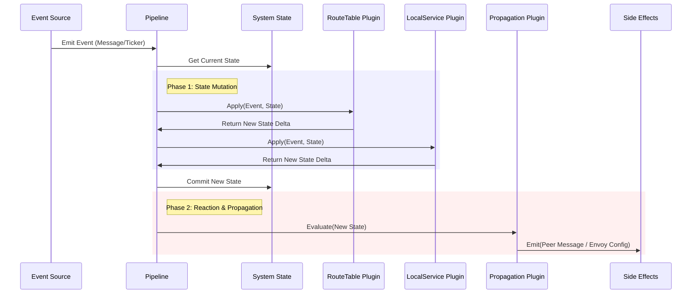

# Architecture

## System Overview: The Core Pod

Catalyst Node runs as a cohesive set of containers ("The Core Pod") orchestrated by the main **Catalyst Node** process.

```mermaid
graph TD
    subgraph DataPlane [Data Plane]
        Envoy[Envoy Proxy <br/>(Container)]
    end

    subgraph ControlPlane [Control Plane Pod]
        Orchestrator[Catalyst Node <br/>(Orchestrator)]
        GQL[GraphQL Gateway <br/>(Sidecar)]
        Auth[Auth Service <br/>(Sidecar)]
        OTEL[OTEL Collector <br/>(Sidecar)]
    end

    %% xDS Configuration
    Orchestrator --"xDS (REST)"--> Envoy

    %% RPC Coordination
    Orchestrator <--"Capnweb RPC"--> GQL
    Orchestrator <--"Capnweb RPC"--> Auth

    %% Metrics
    GQL --"Push"--> OTEL
    Auth --"Push"--> OTEL
    Envoy --"Push"--> OTEL

    %% Public Traffic
    Client[Client] --> Envoy
    Envoy --> GQL
    Envoy -.-> Auth
```

### Components

#### 1. Catalyst Node (The Orchestrator)
- **Role**: Central Brain.
- **Responsibilities**:
    - **BGP/Peering**: Handles inter-node discovery and route exchange.
    - **xDS Server**: Generates dynamic configuration for Envoy.
    - **Sidecar Management**: Configures GraphQL and Auth services via RPC.

#### 2. Envoy Proxy (Data Plane)
- **Role**: High-performance Edge Router & Local Service Transport.
- **Config**: Fully dynamic via xDS (LDS/CDS/RDS/EDS) served by the Orchestrator.
- **Traffic**: 
    - **Peer-to-Peer**: Handles all ingress/egress, terminating TLS.
    - **Local-to-Gateway**: Acts as the local transport for services to reach the GraphQL Gateway (e.g., `http://localhost:10000/graphql` -> Envoy -> Gateway).

#### 3. GraphQL Gateway (Sidecar)
- **Role**: TypeScript-based Federation Engine (Apollo/Yoga).
- **Control**: Receives federation config (supergraph) from Orchestrator via RPC.
- **Data**: Executes queries, delegating to local services or remote peers.

#### 4. Auth Service (Sidecar)
- **Role**: Identity & Crypto Engine.
- **Responsibilities**:
    - **Key Generation**: Creates/Rotates AS keys.
    - **JWKS Hosting**: Serves public keys.
    - **Signing**: Signs JWTs upon request (via RPC from Orchestrator/CLI).

#### 5. OTEL Collector (Sidecar)
- **Role**: Universal Metrics Sink.
- **Input**: Receives OTLP/StatsD from all other containers.
- **Output**: Exporters configured by the user (DataDog, Prometheus, etc.).

## Control Plane Internals

The Control Plane is designed as a functional event loop. It maintains an internal **State** (Route Table, Peer List, Local Services) and evolves it via a strict pipeline of plugins.

### 1. The Core Loop

All inputs (Incoming RPC messages, Time-based Tickers, Local Service Events) enter a unified event channel. These events flow through a pipeline of functional interfaces.



### 2. Plugin Interfaces

The system is extensible via three primary interfaces.

#### A. Route Table Updater (`IRouteTablePlugin`)
*   **Responsibility**: Decides how the routing table changes given an input.
*   **Inputs**: Incoming Peer Message, Ticker (for expiration).
*   **Outputs**: Updated Route Entries (Add/Remove routes).
*   **Example**: "Received 'Add Service X' from Peer A -> Add Entry X via Peer A to Table."

#### B. Service Registry & Configurator (`IServicePlugin`)
*   **Responsibility**: Manages the registry of known services.
*   **Inputs**:
    *   **Local Registration**: Services registering via Config (`catalyst.json`) or Admin API.
    *   **Health Checks**: Periodic liveness probes.
*   **Actions**:
    *   **Federation Update**: Triggers an RPC call to the **GraphQL Gateway** to federate the new service endpoint.
    *   **Envoy Config**: Updates xDS (CDS/RDS) to allow traffic to/from the service.
*   **Example**: "API registers 'Inventory Service' on port 5001 -> Orchestrator updates GraphQL Gateway to stitch `http://localhost:5001/graphql`."

#### C. Propagation Configurator (`IPropagationPlugin`)
*   **Responsibility**: Decides what to tell neighbors.
*   **Inputs**: State Changes, Periodic Tickers.
*   **Outputs**: Outbound RPC Messages.
*   **Example**: "Route Table changed -> Send standard Route Update to all Peers."

## Data Plane Integration (xDS)

We utilize Envoy's **xDS Protocol** (Discovery Service) for zero-downtime reconfiguration.

1.  **Transport**: REST-based State of the World (SotW) or Delta (future).
2.  **Resources**:
    *   **LDS (Listeners)**: API Ports, Peering Ports.
    *   **RDS (Routes)**: Routing logic for "/graphql", "/.well-known/jwks.json", and Peer prefixes.
    *   **CDS (Clusters)**: Upstream definitions (Local Sidecars, Remote Peers).
    *   **EDS (Endpoints)**: Specific IP:Port assignments.

The Orchestrator implements a lightweight xDS Control Plane that pushes JSON updates to Envoy whenever the internal Route Table changes.

## Identity & API Management

Catalyst Node supports three strategies for API Key management and service authentication.

### Option 1: Completely External Service
*   **Description**: Identity is handled entirely outside the Catalyst mesh.
*   **Flow**:
    1.  Client gets token from External Auth Provider (Auth0, Okta, etc.).
    2.  Client sends token to Catalyst Node.
    3.  Envoy/Auth Service validates the token signature against absolute external JWKS.
*   **Use Case**: Enterprise integration where Identity is already solved.

### Option 2: Centralized API Service (Single Node)
*   **Description**: One specific Catalyst Node acts as the "Identity Authority" for the cluster.
*   **Flow**:
    1.  Admin generates API Keys/Tokens on the Leader Node.
    2.  Other Nodes are configured to delegate auth decisions or sync JWKS from the Leader.
    3.  **Core Pod B** trusts **Core Pod A** (Leader) as the issuer.
*   **Use Case**: Small-to-medium clusters (Stage 1B) where simplicity is preferred over HA.

### Option 3: Decentralized PKI (Hierarchical)
*   **Description**: Each Node manages its own Service Accounts, rooted in a shared PKI.
*   **Flow**:
    1.  **Root CA** issues intermediate certs to each Node.
    2.  Each Node mints its own API Keys for its local services.
    3.  Validation works via trust chain; no central online authority required for steady state.
*   **Use Case**: Large scale, high-availability, multi-region deployments.
