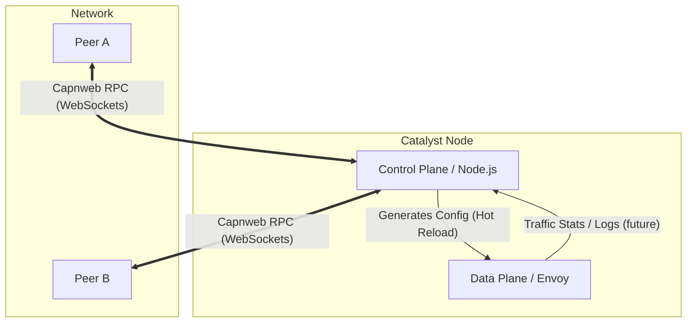
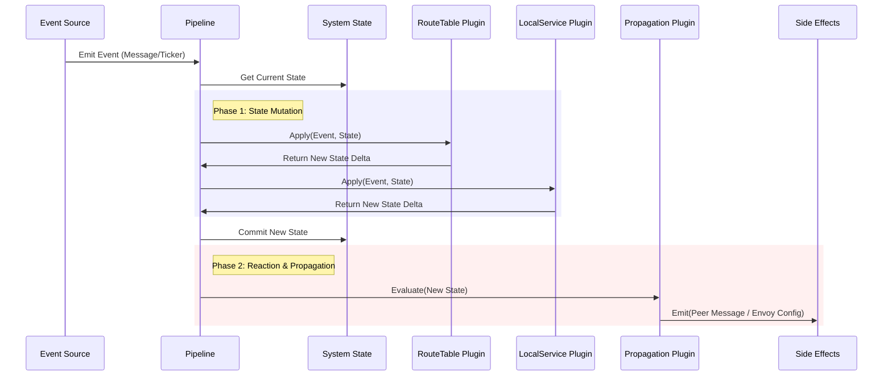
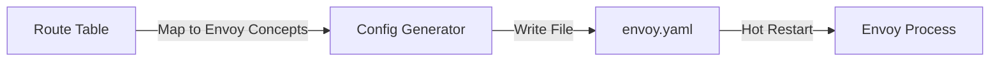

# Architecture

## System Overview

Catalyst Node operates as a two-part system:
1.  **Control Plane (Node.js)**: Manages state, handles peering RPC, runs the plugin pipeline, and generates configuration.
2.  **Data Plane (Envoy)**: Handles the raw TCP/HTTP traffic based on configuration provided by the control plane.

## Control Plane Internals

The Control Plane is designed as a functional event loop. It maintains an internal **State** (Route Table, Peer List, Local Services) and evolves it via a strict pipeline of plugins.

### 1. The Core Loop

All inputs (Incoming RPC messages, Time-based Tickers, Local Service Events) enter a unified event channel. These events flow through a pipeline of functional interfaces.

### 2. Plugin Interfaces

The system is extensible via three primary interfaces.

#### A. Route Table Updater (`IRouteTablePlugin`)
*   **Responsibility**: Decides how the routing table changes given an input.
*   **Inputs**: Incoming Peer Message, Ticker (for expiration).
*   **Outputs**: Updated Route Entries (Add/Remove routes).
*   **Example**: "Received 'Add Service X' from Peer A -> Add Entry X via Peer A to Table."

#### B. Local Service Configurator (`ILocalServicePlugin`)
*   **Responsibility**: Manages local resources that *are* the services.
*   **Inputs**: Configuration triggers, Health check ticks.
*   **Outputs**: Process management (Spawn/Kill), Local Service Registration.
*   **Example**: "Config says 'Start VPN' -> Spawn Wireguard Process -> Register 'VPN Service' in Local Table."

#### C. Propagation Configurator (`IPropagationPlugin`)
*   **Responsibility**: Decides what to tell neighbors.
*   **Inputs**: State Changes, Periodic Tickers.
*   **Outputs**: Outbound RPC Messages.
*   **Example**: "Route Table changed -> Send standard Route Update to all Peers."

## Data Plane Integration

Currently, the Data Plane integration follows a simple Hot Reload model.

1.  **State Change**: The Control Plane detects a change in the Route Table (e.g., a new peer service is available).
2.  **Config Generation**: A Renderer function maps the internal Route Table to an Envoy v3 configuration JSON/YAML.
    *   *Peers* become **Clusters**.
    *   *Services* become **Listeners/Routes**.
3.  **Persist**: The config is written to disk (e.g., `envoy.yaml`).
4.  **Reload**: The Control Plane signals Envoy (via admin endpoint or SIGHUP) to hot-reload the configuration.

