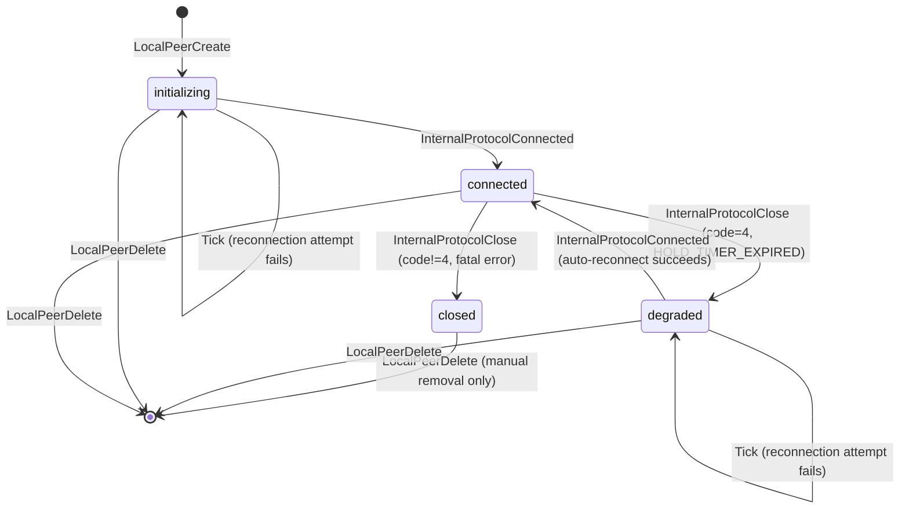
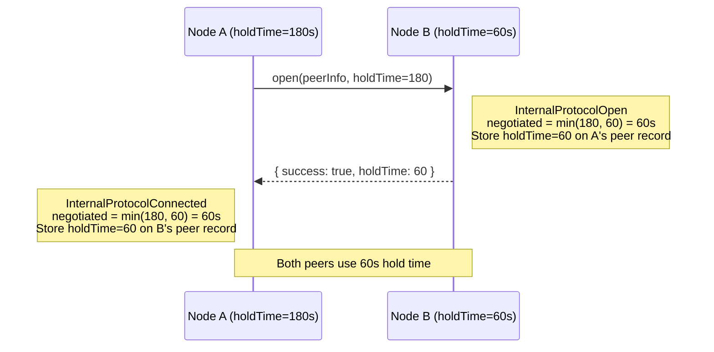
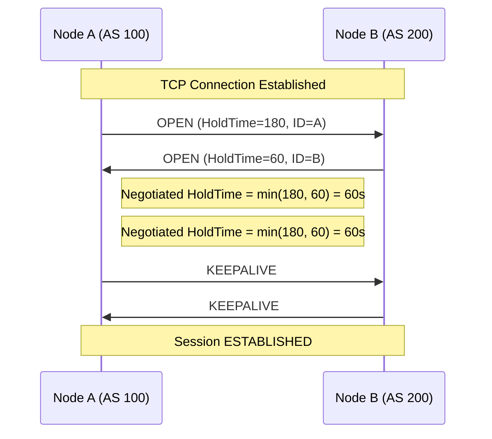
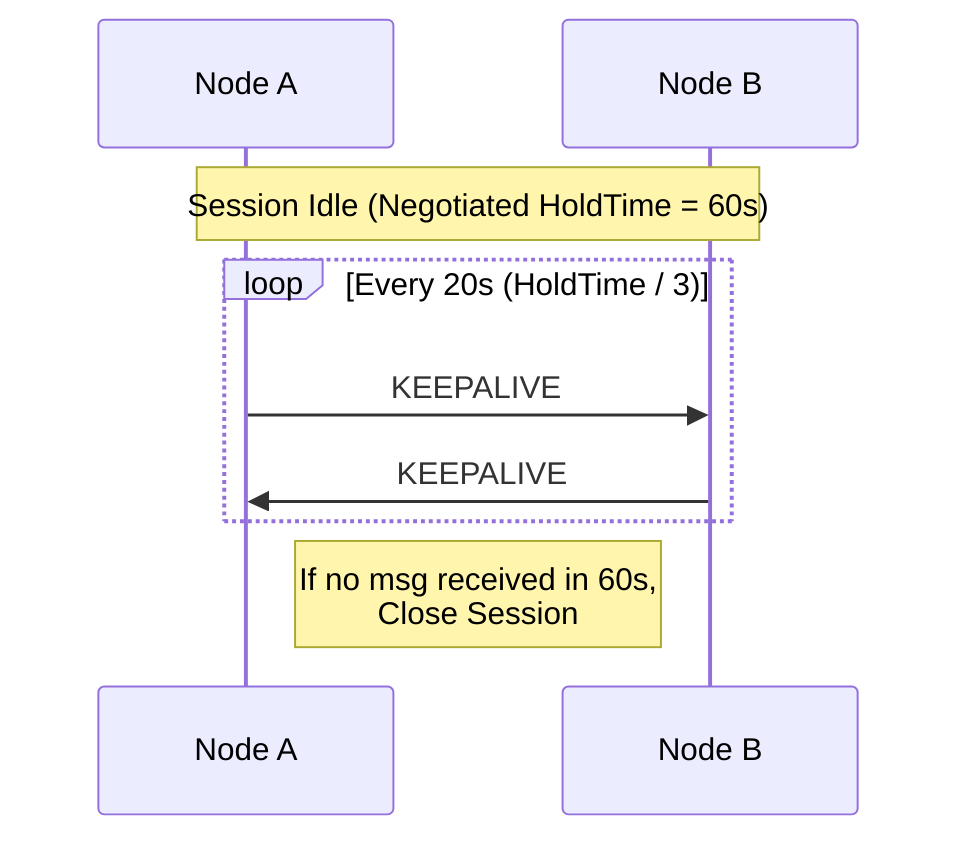
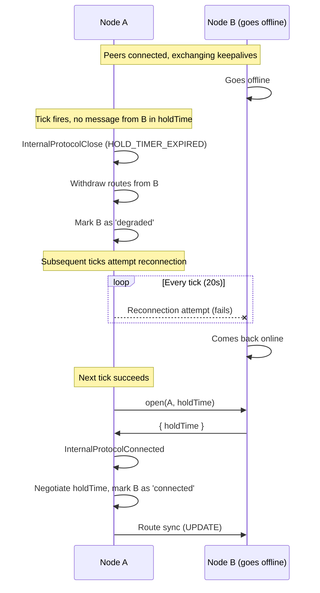
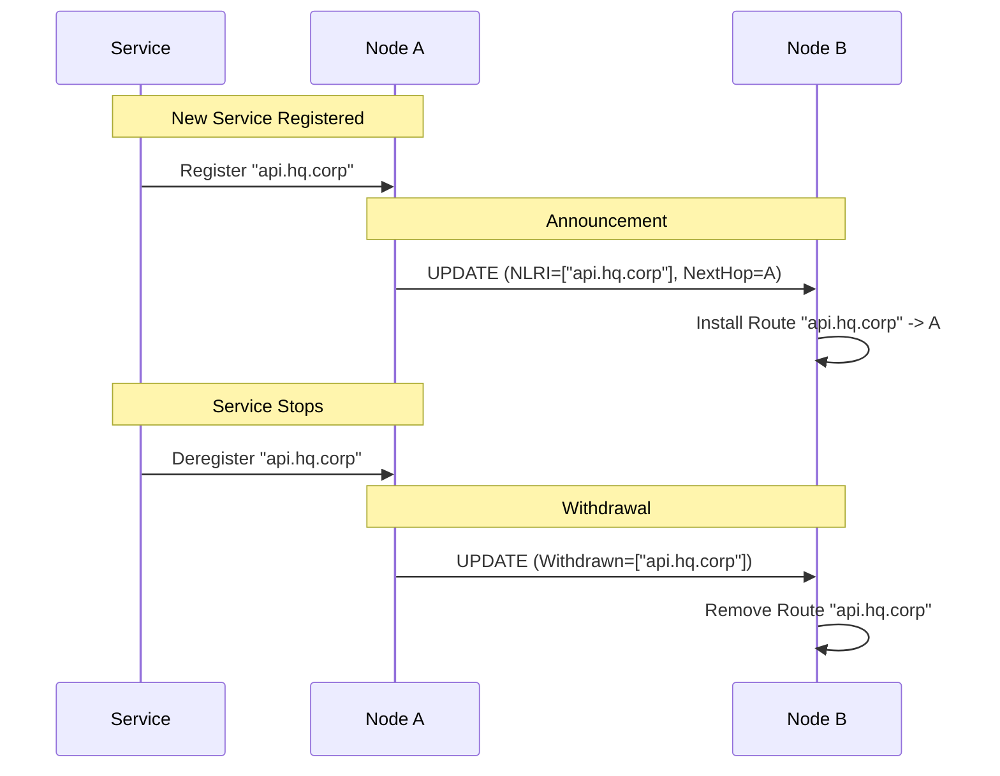
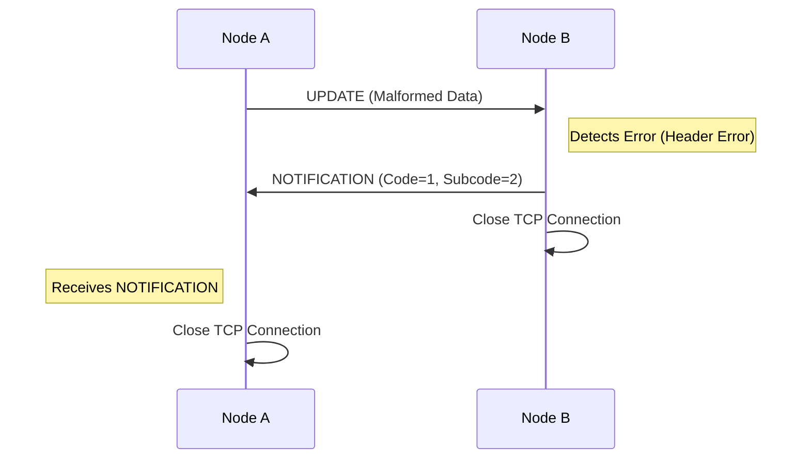

# BGP Service Discovery Protocol

This document outlines the adaptation of the Border Gateway Protocol (BGP) for service discovery within the Catalyst Router ecosystem. Instead of routing IP packets between Autonomous Systems (AS) based on CIDR blocks, we propagate service availability and routing information for logical domains.

## Overview

In this system, an **Autonomous System (AS)** represents a logical domain of services (e.g., a company, a datacenter, or a specific cloud environment). We use BGP-style messaging to exchange "routes" which are actually pointers to service endpoints.

- **Standard BGP**: Routes `10.0.0.0/24` -> Next Hop IP.
- **Catalyst BGP**: Routes `*.mydatacenter.mycompany` -> Envoy Node ID / Service Endpoint.

Traffic is routed via Envoy proxies, not at the IP layer. The "Next Hop" is a catalyst router that can forward the request or terminate it at a local service.

## Architecture

### Internal vs. External Peering

1.  **Internal BGP (iBGP)**: Used within an AS to synchronize service state between nodes. This acts like a route reflector setup where all nodes inside the AS need a consistent view of available services.
2.  **External BGP (eBGP)**: Used to project available services from one AS to another. This allows `Company A` to publish a specific set of services to `Company B`.

### Route Tables

Nodes maintain two primary routing tables:

- **Internal Table**: Contains all services known within the local AS.
- **External Table**: Contains services learned from external peers.

## Protocol Messages

We use a simplified set of BGP messages encoded as JSON (or Protobuf in the future) over a secure channel (e.g., mTLS). The TypeScript implementation uses discriminated unions for these messages.

### 1. OPEN

Sent immediately upon connection establishment to negotiate parameters and capabilities.

- **Version**: Protocol version.
- **AS Number**: The logical AS ID of the sender.
- **Hold Time**: Max time (in seconds) between KEEPALIVEs/UPDATEs.
  - The session Hold Time is negotiated to the lower of the two peers' values.
  - Default is **180 seconds** (configurable via `CATALYST_HOLD_TIME`).
  - Minimum is **3 seconds** per BGP spec.
  - If negotiated to 0, Keepalives are disabled.
- **BGP Identifier**: Unique ID of the sending node.
- **Capabilities**: Supported features (e.g., specific service types).
- **JWKS** (Optional): JSON Web Key Set (`{ keys: [...] }`) used for verifying signatures if mTLS is not sufficient or for application-layer integrity.
- **PSK** (Optional): Pre-Shared Key identifier if using PSK-based auth.

### 2. KEEPALIVE

Sent periodically to maintain the session.

- Must be sent at a frequency of **Hold Time / 3**.
- Example: If Hold Time is 180s, Keepalive is sent every 60s.
- If no message (Keepalive, Update, or Notification) is received within the Hold Time, the peer is considered dead.

### 3. UPDATE

The core message for advertising and withdrawing routes.

- **Withdrawn Routes**: List of service prefixes that are no longer reachable.
- **Path Attributes**:
  - `AS_PATH`: List of ASes the route has traversed (loop detection).
  - `NEXT_HOP`: The Node ID to forward traffic to.
  - `LOCAL_PREF`: (iBGP only) Preferred exit point.
  - `COMMUNITIES`: Tags for policy control (e.g., "production", "latency-sensitive").
  - `ORIGIN_SIGNATURE`: Cryptographic signature of the route payload using the Origin Node's private key.
- **Network Layer Reachability Information (NLRI)**: The service prefixes being advertised (e.g., `users.dc01.orbis`).

### 4. NOTIFICATION

Sent when an error is detected. The connection is closed immediately after.

- **Error Code**: Category of error (e.g., Message Header Error, OPEN Message Error).
- **Error Subcode**: Specific error detail.
- **Data**: Optional debugging data.

## Peer Connection State Machine

Peers transition through the following connection states. The state machine distinguishes between auto-recoverable failures (`degraded`) and fatal errors (`closed`).



### State Descriptions

| State          | Description                                                                              | Auto-Reconnect? |
| -------------- | ---------------------------------------------------------------------------------------- | --------------- |
| `initializing` | Peer added, connection not yet established                                               | Yes             |
| `connected`    | Active session, exchanging keepalives and routes                                         | N/A             |
| `degraded`     | Hold timer expired, routes withdrawn, awaiting reconnection                              | Yes             |
| `closed`       | Fatal error (protocol error, auth failure, manual close), requires operator intervention | No              |

### Key Distinctions

- **`degraded` vs `closed`**: The `degraded` state represents transient failures (network partition, temporary node restart). The tick handler will automatically attempt reconnection. The `closed` state represents permanent or human-initiated failures that require manual intervention via `LocalPeerDelete` + `LocalPeerCreate`.
- **`LocalPeerDelete` is the only way to fully remove a peer** from the peer list. `InternalProtocolClose` transitions the peer to `degraded` or `closed` but keeps the peer record for reconnection or inspection.

## Hold Time Negotiation

During the OPEN exchange, each peer sends its configured hold time. The session hold time is negotiated to `min(local, remote)` per BGP spec. This negotiated value is stored per-peer on the `PeerRecord.holdTime` field and used for all subsequent keepalive and expiry calculations.



The negotiated hold time determines:

- **Expiry threshold**: `holdTime` seconds without any message triggers `InternalProtocolClose` with code 4
- **Keepalive threshold**: `holdTime / 3` seconds triggers proactive keepalive sending

## Message Flow Diagrams

### 1. Session Negotiation (OPEN)

Triggered immediately after TCP connection establishment.



### 2. Session Maintenance (KEEPALIVE)

Sent periodically to prevent session expiry.



## Keep-Alive Implementation

The orchestrator uses a tick-based architecture for all keep-alive and peer lifecycle management. A periodic timer dispatches an `InternalProtocolTick` action through the event bus every 20 seconds. All keep-alive logic -- hold timer checks, keepalive sending, and reconnection -- runs through the standard action/notify pipeline on each tick.

### Hold Timer Expiry

On each tick, connected peers are scanned. If a peer's `lastMessageReceived` exceeds the negotiated per-peer hold time (default 180 seconds), the peer is considered dead:

1. An `InternalProtocolClose` is dispatched with error code 4 (`HOLD_TIMER_EXPIRED`).
2. All routes learned from the expired peer are withdrawn and propagated to remaining peers.
3. The peer is marked as `degraded` (not `closed` -- see Peer Connection State Machine above).

### Keepalive Sending

If a connected peer's `lastMessageReceived` exceeds `holdTime / 3` but has not yet expired, a keepalive message is sent via `IBGPClient.keepalive()`. This resets the peer's `lastMessageReceived` on the remote side, preventing hold timer expiry.

### Automatic Reconnection

Peers with status `degraded` or `initializing` are retried on each tick. When a reconnection attempt succeeds, an `InternalProtocolConnected` action is dispatched, which:

1. Transitions the peer back to `connected`
2. Negotiates a new hold time with the remote peer
3. Re-syncs all local and internal routes to the recovered peer

Peers with status `closed` are **not** auto-reconnected. They require manual intervention.

### Peer Lifecycle

`InternalProtocolClose` marks a peer as `degraded` (hold timer expired) or `closed` (fatal error) instead of removing it from the peer list. Only `LocalPeerDelete` fully removes a peer. This distinction enables automatic reconnection -- a peer that goes offline temporarily will be retried until it comes back or is explicitly deleted by an operator.

### Configuration

| Parameter     | Default    | Env Var              | Description                                          |
| ------------- | ---------- | -------------------- | ---------------------------------------------------- |
| `holdTime`    | 180s       | `CATALYST_HOLD_TIME` | Max seconds without a message before expiry (min 3s) |
| Tick interval | 20s        | --                   | Frequency of the internal keep-alive tick            |
| Keepalive     | holdTime/3 | --                   | Threshold for sending proactive keepalives           |

The hold time is configurable at three levels (highest precedence first):

1. **Per-peer negotiated**: `min(local, remote)` during OPEN exchange
2. **Constructor override**: `holdTime` option passed to `CatalystNodeBus`
3. **Config file**: `orchestrator.holdTime` in `CatalystConfig`
4. **Default**: 180 seconds

### Hold Timer Expiry and Reconnection Flow



### 3. Service Advertisement and Withdrawal (UPDATE)

Used to announce new services or remove existing ones.



### 4. Error Handling (NOTIFICATION)

Fatal errors causing session termination.



## Dispatch Concurrency

The `CatalystNodeBus.dispatch()` method uses a Compare-And-Swap (CAS) pattern with exponential backoff to handle concurrent state mutations. This is necessary because the fire-and-forget notify phase can dispatch new actions while another dispatch is in progress.

### Problem

When dispatch A completes its `handleAction` phase and enters `handleNotify`, it may fire-and-forget a new dispatch B (e.g., propagating route updates). If dispatch B reads state, mutates it, and commits before dispatch A commits, dispatch A would overwrite B's changes with stale state.

### Solution

After `handleAction` returns, dispatch checks if `this.state` has changed since it was read (`prevState`). If it has, the dispatch retries with fresh state using exponential backoff:

- Retry 1: 10ms delay
- Retry 2: 20ms delay
- Retry 3: 40ms delay

After 3 retries, the dispatch proceeds regardless to avoid infinite loops. The exponential backoff gives concurrent dispatches time to settle before retrying.

## Action-to-State Mapping

| Action                            | State Mutation                                  | Hold Timer Effect                |
| --------------------------------- | ----------------------------------------------- | -------------------------------- |
| `InternalProtocolOpen`            | Peer -> `connected`, negotiate holdTime         | Starts (lastMessageReceived set) |
| `InternalProtocolConnected`       | Peer -> `connected`, negotiate holdTime         | Starts (lastMessageReceived set) |
| `InternalProtocolKeepalive`       | Update `lastMessageReceived`                    | Resets                           |
| `InternalProtocolUpdate`          | Add/remove routes, update `lastMessageReceived` | Resets                           |
| `InternalProtocolClose` (code=4)  | Peer -> `degraded`, withdraw routes             | Stops                            |
| `InternalProtocolClose` (code!=4) | Peer -> `closed`, withdraw routes               | Stops                            |
| `InternalProtocolTick`            | No-op (logic in notify phase)                   | Checks expiry, sends keepalives  |
| `LocalPeerCreate`                 | Add peer as `initializing`                      | --                               |
| `LocalPeerDelete`                 | Remove peer entirely                            | Stops                            |

## Data Structures

### Service Route

```typescript
interface ServiceRoute {
  prefix: string // e.g., "users.dc01.orbis"
  path: number[] // AS_PATH: [100, 200]
  nextHop: string // Node ID of the peer
  attributes: Record<string, any>
  signature: string // Cryptographic signature by the origin
  timestamp: number // Unix timestamp of route creation (Replay Protection)
}
```

### PeerRecord

```typescript
interface PeerRecord {
  name: string // Peer FQDN
  domains: string[]
  endpoint: string
  peerToken?: string
  connectionStatus: 'initializing' | 'connected' | 'degraded' | 'closed'
  lastConnected?: Date
  lastMessageReceived?: Date // Timestamp of last received message (any type)
  holdTime?: number // Negotiated hold time in seconds
}
```
