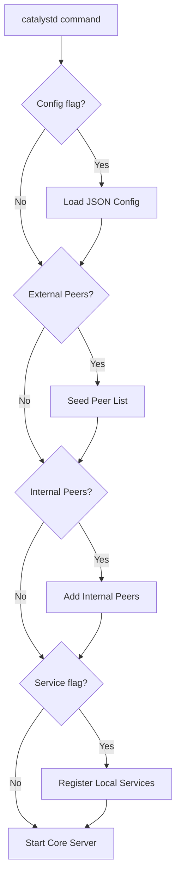

# Catalyst Node CLI

The `catalyst-node` project uses `commander.js` to provide a robust command-line interface. The primary entry point is the `catalystd` command, which starts the server.

## Installation

As this is a library/server, the CLI is typically accessed via the package scripts or by running the built binary.

## Logic Flow



## Usage

### Starting the Server

The basic command to start the server is:

```bash
catalystd [options]

# Or via Docker Compose (Recommended)
docker-compose up
```

### Options

#### Configuration File

Start the server using a JSON configuration file.

```bash
catalystd -c ./path/to/config.json
catalystd --config ./path/to/config.json
```

#### External Peers

Start the server with a seeded list of external peers for initial discovery.

```bash
catalystd --external-peers 10.1.1.1,externalpeer.internet.com,someotheraddress.localdns.io
```

#### Internal Peers

Start the server with a list of known internal peers.

```bash
catalystd --internal-peers 10.0.0.2,10.0.0.3
```

#### Service Registration

Start the server and register local services immediately. The format is `servicename.svc#protocol@address`.

```bash
catalystd --service localgraphlq.svc#graphql@http://localserver.com --service localtcp.svc#tcp@10.0.1.1
```

## Examples

### Complete Example

```bash
catalystd \
  --config ./config/production.json \
  --external-peers 10.1.1.1,10.2.2.2 \
  --service myservice.svc#http@localhost:8080
```
