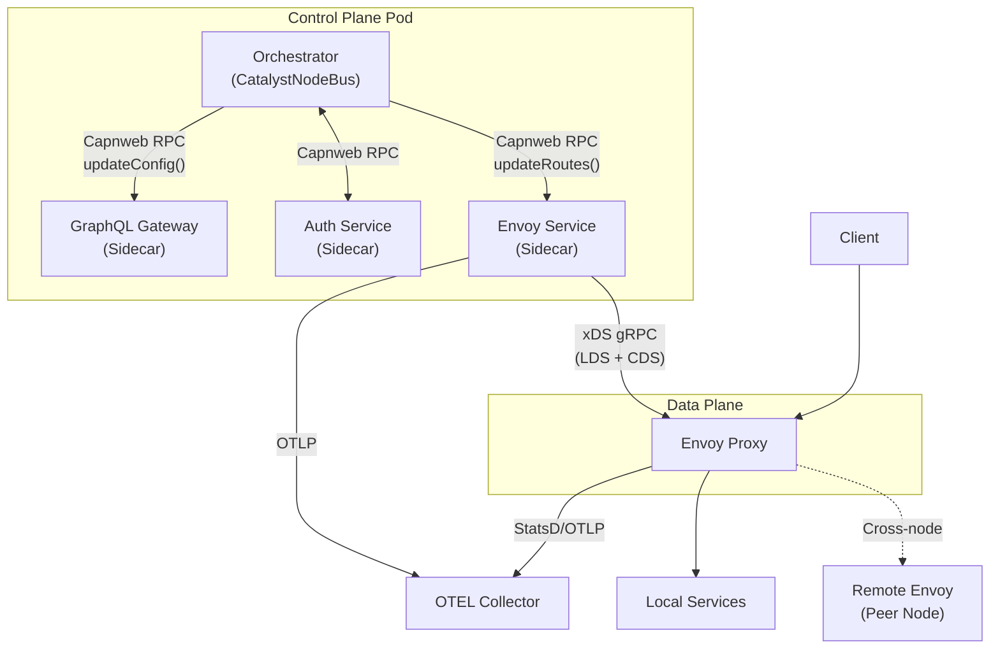
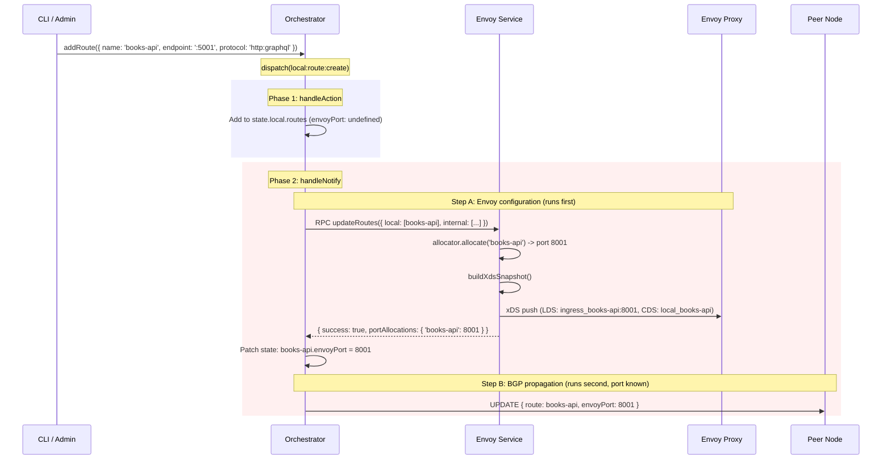
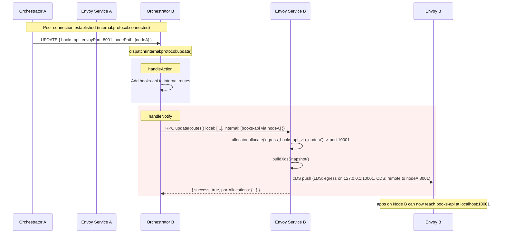
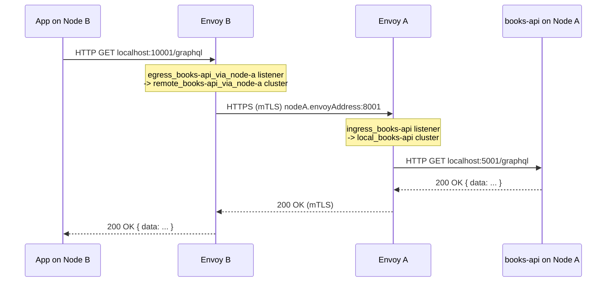
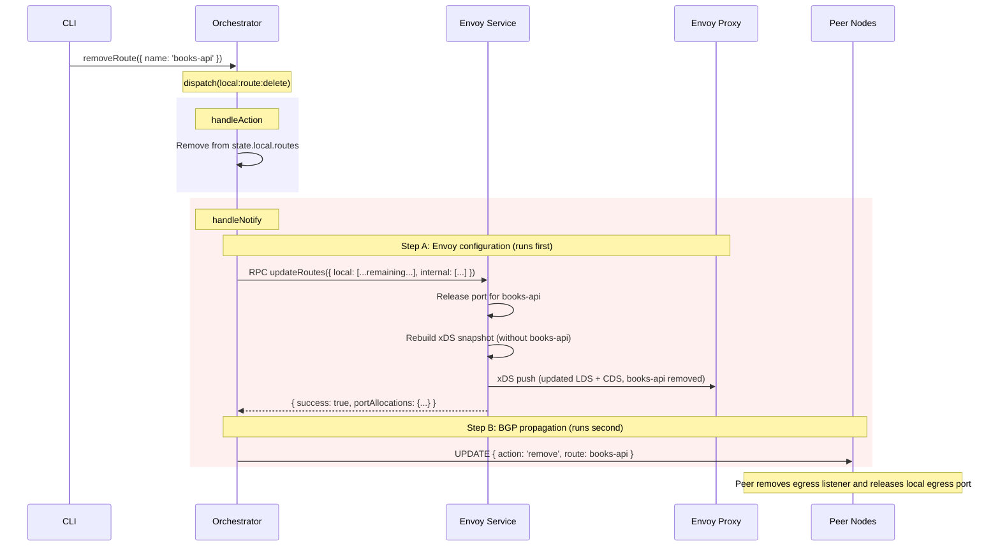

# Envoy Integration Architecture

**Status**: In Progress (Phase 6 complete) | **Author**: Architecture Team | **Date**: 2026-02-10

> This document specifies the architecture for integrating Envoy as the data plane proxy
> for the Catalyst Node system. It covers the new `@catalyst/envoy-service` package,
> xDS control plane design, port allocation strategy, route table changes, cross-node
> routing topology, and implementation plan.
>
> **Prerequisites**: [ARCHITECTURE.md](./ARCHITECTURE.md), [BGP_PROTOCOL.md](./BGP_PROTOCOL.md),
> [INTERNAL_PEERING.md](./INTERNAL_PEERING.md), [constitution.md](./constitution.md)

---

## Table of Contents

1. [Overview](#1-overview)
2. [Component Diagram](#2-component-diagram)
3. [Port Allocation](#3-port-allocation)
4. [Route Table Changes](#4-route-table-changes)
5. [xDS Protocol](#5-xds-protocol)
6. [Cross-Node Routing](#6-cross-node-routing)
7. [Action Flow](#7-action-flow)
8. [Service Structure](#8-service-structure)
9. [Sequence Diagrams](#9-sequence-diagrams)
10. [Implementation Phases](#10-implementation-phases)

---

## 1. Overview

Envoy serves as the **data plane** for all service-to-service traffic in the Catalyst mesh.
The Orchestrator remains the **control plane brain** -- it computes routing decisions and
pushes configuration to Envoy via a new sidecar service (`@catalyst/envoy-service`) that
translates route table state into xDS resources.

### Design Principles

- **Orchestrator decides, Envoy executes**: The Orchestrator owns all routing logic.
  Envoy is a dumb pipe that receives configuration and forwards traffic.
- **xDS via sidecar**: The Envoy service acts as a translation layer between
  Capnweb RPC (from Orchestrator) and xDS gRPC (to Envoy). This keeps gRPC
  dependencies out of the Orchestrator.
- **One listener per data channel**: Each registered data channel gets a dedicated
  Envoy listener port, providing isolation and independent lifecycle.
- **Automatic propagation**: Envoy port assignments propagate through existing BGP
  UPDATE messages. No new protocol messages are needed.

### What This Is NOT

- Not a service mesh sidecar injector (no automatic proxy injection).
- Not a full xDS implementation (LDS + CDS only; no RDS/EDS initially).
- Not a replacement for the Orchestrator's routing logic.

---

## 2. Component Diagram

The Envoy service sits between the Orchestrator (control plane) and Envoy (data plane),
bridging the Capnweb RPC world with xDS gRPC.



### Communication Topology

| From          | To             | Protocol                | Purpose                                |
| :------------ | :------------- | :---------------------- | :------------------------------------- |
| Orchestrator  | Envoy Service  | Capnweb RPC (WebSocket) | Push route config updates              |
| Envoy Service | Envoy          | xDS gRPC (SotW)         | Push LDS + CDS resources               |
| Envoy         | Local services | HTTP/gRPC               | Forward traffic to local data channels |
| Envoy         | Remote Envoy   | HTTP/gRPC (mTLS)        | Cross-node traffic forwarding          |

---

## 3. Port Allocation

Each data channel requires a dedicated Envoy listener port. Ports are drawn from a
configurable range and tracked in the route table.

### 3.1 Configuration Schema

```typescript
// packages/config/src/index.ts (additions)

const PortEntrySchema = z.union([
  z.number().int().min(1).max(65535), // single port
  z
    .tuple([z.number(), z.number()]) // [start, end] range
    .refine(([s, e]) => s <= e, 'Start must be <= end'),
])

const EnvoyConfigSchema = z.object({
  portRange: z.array(PortEntrySchema).min(1),
  adminPort: z.number().int().min(1).max(65535).default(9901),
  xdsPort: z.number().int().min(1).max(65535).default(18000),
  bindAddress: z.string().default('0.0.0.0'),
})

// Added to CatalystConfigSchema
export const CatalystConfigSchema = z.object({
  node: NodeConfigSchema,
  orchestrator: OrchestratorConfigSchema.optional(),
  auth: AuthConfigSchema.optional(),
  envoy: EnvoyConfigSchema.optional(), // NEW
  port: z.number().default(3000),
})
```

### 3.2 Environment Variables

| Variable                      | Format     | Example                       | Description                                |
| :---------------------------- | :--------- | :---------------------------- | :----------------------------------------- |
| `CATALYST_ENVOY_PORT_RANGE`   | JSON array | `[8000, [9000, 9010], 10000]` | Port entries to expand into available pool |
| `CATALYST_ENVOY_ADMIN_PORT`   | number     | `9901`                        | Envoy admin interface port                 |
| `CATALYST_ENVOY_XDS_PORT`     | number     | `18000`                       | xDS gRPC server port                       |
| `CATALYST_ENVOY_BIND_ADDRESS` | string     | `0.0.0.0`                     | Default bind address for listeners         |

The example `[8000, [9000, 9010], 10000]` expands to the flat pool:
`[8000, 9000, 9001, 9002, ..., 9010, 10000]` -- 13 available ports.

### 3.3 Orchestrator Config Extension

```typescript
// Added to OrchestratorConfigSchema
export const OrchestratorConfigSchema = z.object({
  ibgp: z.object({ secret: z.string().optional() }).optional(),
  gqlGatewayConfig: z.object({ endpoint: z.string() }).optional(),
  auth: z.object({ endpoint: z.string(), systemToken: z.string() }).optional(),
  envoyConfig: z.object({ endpoint: z.string() }).optional(), // NEW
})
```

### 3.4 Port Allocator

The port allocator is a pure, synchronous utility that manages port assignment.

```typescript
// apps/envoy/src/port-allocator.ts

interface PortAllocator {
  /** Allocate a port for a data channel. Idempotent -- returns existing allocation. */
  allocate(channelName: string): { success: true; port: number } | { success: false; error: string }

  /** Release a previously allocated port. */
  release(channelName: string): void

  /** Get the port for a channel, if allocated. */
  getPort(channelName: string): number | undefined

  /** Get all current allocations. */
  getAllocations(): ReadonlyMap<string, number>

  /** Number of ports remaining in the pool. */
  availableCount(): number
}
```

**Key behaviors:**

- **Idempotent allocation**: Calling `allocate('books-api')` twice returns the same port.
- **Next-available strategy**: Ports are assigned sequentially from the expanded flat pool.
- **Restart recovery**: On startup, the allocator re-hydrates from the persisted route
  table (local routes with `envoyPort` set), reserving those ports before accepting new
  allocations.
- **Port exhaustion**: Returns `{ success: false, error: 'No ports available' }` when
  the pool is depleted.

---

## 4. Route Table Changes

The route table schema gains new fields to track Envoy port assignments and peer
Envoy addresses.

### 4.1 DataChannelDefinition Changes

```typescript
// packages/routing/src/datachannel.ts

export const DataChannelDefinitionSchema = z.object({
  name: z.string(),
  endpoint: z.string().url().optional(),
  protocol: DataChannelProtocolEnum,
  region: z.string().optional(),
  tags: z.array(z.string()).optional(),
  envoyPort: z.number().int().optional(), // NEW: allocated Envoy listener port
})
```

The `envoyPort` field is:

- **Set by the Orchestrator** when a local route is created and Envoy is configured.
- **Propagated in BGP UPDATEs** automatically (the field is part of
  `DataChannelDefinitionSchema`, which is already used in `UpdateMessageSchema`).
- **Read by peer nodes** to know which port to target on the remote Envoy.

### 4.2 NodeConfigSchema Changes

```typescript
// packages/config/src/index.ts

export const NodeConfigSchema = z.object({
  name: z.string(),
  domains: z.array(z.string()),
  endpoint: z.string().optional(),
  labels: z.record(z.string(), z.string()).optional(),
  peerToken: z.string().optional(),
  envoyAddress: z.string().optional(), // NEW: Envoy reachable address for peers
})
```

The `envoyAddress` field tells peer nodes where this node's Envoy is reachable for
cross-node traffic (e.g., `https://10.0.0.5:443`). It is exchanged during the BGP
OPEN handshake as part of `PeerInfo`.

### 4.3 Propagation Through BGP

No new BGP message types are needed. The existing `InternalProtocolUpdate` action
already carries `DataChannelDefinition` objects, which now include `envoyPort`:

```typescript
// Existing UPDATE message (no changes needed)
{
  action: 'internal:protocol:update',
  data: {
    peerInfo: { name: 'node-a.example.local.io', endpoint: '...', envoyAddress: '...' },
    update: {
      updates: [
        {
          action: 'add',
          route: {
            name: 'books-api',
            endpoint: 'http://localhost:5001/graphql',
            protocol: 'http:graphql',
            envoyPort: 8001,            // <-- peers read this
          },
          nodePath: ['node-a.example.local.io'],
        }
      ]
    }
  }
}
```

When a peer receives this update, it knows:

- The service `books-api` is available on `node-a`.
- Node A's Envoy is listening on port `8001` for traffic destined to `books-api`.
- Node A's Envoy address is in `peerInfo.envoyAddress`.

---

## 5. xDS Protocol

The Envoy service implements an xDS control plane that translates route table state
into Envoy-native Listener and Cluster resources, delivered over a gRPC stream.

### 5.1 Transport: ADS with SotW

We use **ADS (Aggregated Discovery Service)** over a single bidirectional gRPC stream
with the **SotW (State of the World)** delivery model:

- **Single stream**: One gRPC stream multiplexes all resource types via the `type_url`
  field in each `DiscoveryRequest`/`DiscoveryResponse`.
- **Full snapshot**: Each response contains the **complete set** of resources for that
  type. Envoy replaces its entire config for that type on each response.
- **Ordered updates**: CDS responses are sent **before** LDS responses. This prevents
  traffic blackholing -- listeners never reference clusters that don't exist yet.
- **ACK/NACK**: Envoy confirms each response via `version_info` and `response_nonce`
  matching. A NACK includes `error_detail` describing why the config was rejected.

**Type URLs:**

| Resource       | Type URL                                                |
| :------------- | :------------------------------------------------------ |
| Listener (LDS) | `type.googleapis.com/envoy.config.listener.v3.Listener` |
| Cluster (CDS)  | `type.googleapis.com/envoy.config.cluster.v3.Cluster`   |

### 5.2 LDS Resources

Each data channel maps to one Envoy listener. There are two listener types:

**Ingress listener** (for local data channels): Binds `0.0.0.0:<envoyPort>`, routes
to the local service cluster. Accepts traffic from remote peers (mTLS).

```
Listener {
  name: "ingress_books-api"
  address: {
    socket_address: {
      address: "0.0.0.0"
      port_value: 8001
    }
  }
  filter_chains: [{
    filters: [{
      name: "envoy.filters.network.http_connection_manager"
      typed_config: {
        "@type": "type.googleapis.com/envoy.extensions.filters.network.http_connection_manager.v3.HttpConnectionManager"
        stat_prefix: "ingress_books-api"
        route_config: {
          virtual_hosts: [{
            name: "local"
            domains: ["*"]
            routes: [{
              match: { prefix: "/" }
              route: { cluster: "local_books-api" }
            }]
          }]
        }
      }
    }]
  }]
}
```

**Egress listener** (for remote data channels): Binds `127.0.0.1:<localEgressPort>`,
routes to the remote peer's Envoy. Used by local apps to reach remote services.

```
Listener {
  name: "egress_books-api_via_node-a"
  address: {
    socket_address: {
      address: "127.0.0.1"
      port_value: 10001
    }
  }
  filter_chains: [{
    filters: [{
      name: "envoy.filters.network.http_connection_manager"
      typed_config: {
        "@type": "type.googleapis.com/envoy.extensions.filters.network.http_connection_manager.v3.HttpConnectionManager"
        stat_prefix: "egress_books-api_via_node-a"
        route_config: {
          virtual_hosts: [{
            name: "remote"
            domains: ["*"]
            routes: [{
              match: { prefix: "/" }
              route: { cluster: "remote_books-api_via_node-a" }
            }]
          }]
        }
      }
    }]
  }]
}
```

### 5.3 CDS Resources

Each listener has a corresponding upstream cluster definition:

**Local cluster** (`local_<name>`): Points to the actual data channel endpoint on localhost.
Uses `STATIC` type since the endpoint IP is known.

```
Cluster {
  name: "local_books-api"
  type: STATIC
  connect_timeout: "5s"
  lb_policy: ROUND_ROBIN
  load_assignment: {
    cluster_name: "local_books-api"
    endpoints: [{
      lb_endpoints: [{
        endpoint: {
          address: {
            socket_address: {
              address: "127.0.0.1"
              port_value: 5001
            }
          }
        }
      }]
    }]
  }
}
```

**Remote cluster** (`remote_<name>_via_<peer>`): Points to the peer's Envoy ingress
port. Uses `STATIC` for IP addresses or `STRICT_DNS` for hostnames (Docker/K8s).

```
Cluster {
  name: "remote_books-api_via_node-a"
  type: STRICT_DNS
  connect_timeout: "5s"
  lb_policy: ROUND_ROBIN
  load_assignment: {
    cluster_name: "remote_books-api_via_node-a"
    endpoints: [{
      lb_endpoints: [{
        endpoint: {
          address: {
            socket_address: {
              address: "node-a.example.local.io"  // from peerInfo.envoyAddress
              port_value: 8001                     // from route.envoyPort
            }
          }
        }
      }]
    }]
  }
}
```

### 5.4 Library Stack

| Library                   | Role                  | Why                                                                     |
| :------------------------ | :-------------------- | :---------------------------------------------------------------------- |
| `nice-grpc`               | gRPC server framework | TypeScript-first, async iterables for streaming, middleware support     |
| `ts-proto`                | Proto code generation | Generates idiomatic TypeScript (not Java-style protobufjs)              |
| `@grpc/grpc-js`           | gRPC transport        | Pure JS implementation, Bun compatible (95.25% gRPC test suite passing) |
| `nice-grpc-opentelemetry` | Observability         | OTEL middleware for gRPC -- integrates with `@catalyst/telemetry`       |
| `buf`                     | Proto toolchain       | Manages envoy proto transitive dependencies via Buf Schema Registry     |

**Proto generation:**

```bash
buf generate --template buf.gen.yaml proto/
```

With `ts-proto` options:

```
--ts_proto_opt=outputServices=nice-grpc,outputServices=generic-definitions,useExactTypes=false
```

**Minimum proto files required** (from Buf Schema Registry):

- `envoy/service/discovery/v3/ads.proto`
- `envoy/service/discovery/v3/discovery.proto`
- `envoy/config/listener/v3/listener.proto`
- `envoy/config/listener/v3/listener_components.proto`
- `envoy/config/cluster/v3/cluster.proto`
- `envoy/config/endpoint/v3/endpoint.proto`
- `envoy/config/core/v3/address.proto`
- `envoy/config/core/v3/base.proto`
- `google/protobuf/any.proto`, `struct.proto`, `duration.proto`

### 5.5 Snapshot Cache

The xDS control plane uses a shared in-memory snapshot cache that connects the
Capnweb RPC input (from the Orchestrator) to the gRPC output (to Envoy):

```typescript
// apps/envoy/src/xds/snapshot-cache.ts

interface XdsSnapshot {
  version: string // monotonic version string
  listeners: Listener[] // all LDS resources
  clusters: Cluster[] // all CDS resources
}

interface SnapshotCache {
  /** Set a new snapshot. Notifies all connected Envoy streams. */
  setSnapshot(snapshot: XdsSnapshot): void

  /** Get the current snapshot. */
  getSnapshot(): XdsSnapshot | undefined

  /** Subscribe to snapshot changes (used by ADS stream handler). */
  watch(callback: (snapshot: XdsSnapshot) => void): () => void
}
```

**Flow:**

1. Orchestrator pushes route config via Capnweb RPC (`updateRoutes()`).
2. `EnvoyRpcServer` allocates ports, calls `buildXdsSnapshot()` to translate
   routes into LDS + CDS resources.
3. The snapshot is written to the `SnapshotCache`.
4. The cache notifies all connected ADS streams.
5. Each stream handler yields a `DiscoveryResponse` (CDS first, then LDS).

### 5.6 ADS Stream Implementation

The ADS server uses the `nice-grpc` async generator pattern:

```typescript
// apps/envoy/src/xds/control-plane.ts

import type { CallContext } from 'nice-grpc'
import type { DiscoveryRequest, DiscoveryResponse } from './generated/discovery.js'

async *streamAggregatedResources(
  requests: AsyncIterable<DiscoveryRequest>,
  context: CallContext,
): AsyncIterable<DiscoveryResponse> {
  // Send initial snapshot on connect
  const current = this.cache.getSnapshot()
  if (current) {
    yield this.buildCdsResponse(current)
    yield this.buildLdsResponse(current)
  }

  // Watch for snapshot changes and yield updates
  const unwatch = this.cache.watch((snapshot) => {
    // Enqueue CDS then LDS responses (ordered)
    this.enqueueResponse(this.buildCdsResponse(snapshot))
    this.enqueueResponse(this.buildLdsResponse(snapshot))
  })

  try {
    // Process incoming ACK/NACK from Envoy
    for await (const request of requests) {
      this.handleAckNack(request)
      // Yield any queued responses
      while (this.hasQueuedResponses()) {
        yield this.dequeueResponse()
      }
    }
  } finally {
    unwatch()
  }
}
```

### 5.7 Envoy Bootstrap Configuration

Envoy connects to our xDS control plane via a static bootstrap config:

```yaml
# envoy-bootstrap.yaml (generated or mounted by Envoy service)

node:
  id: 'catalyst-envoy'
  cluster: 'catalyst'

dynamic_resources:
  ads_config:
    api_type: GRPC
    transport_api_version: V3
    grpc_services:
      - envoy_grpc:
          cluster_name: catalyst_xds
  lds_config:
    ads: {}
  cds_config:
    ads: {}

static_resources:
  clusters:
    - name: catalyst_xds
      type: STATIC
      typed_extension_protocol_options:
        envoy.extensions.upstreams.http.v3.HttpProtocolOptions:
          '@type': type.googleapis.com/envoy.extensions.upstreams.http.v3.HttpProtocolOptions
          explicit_http_config:
            http2_protocol_options: {}
      load_assignment:
        cluster_name: catalyst_xds
        endpoints:
          - lb_endpoints:
              - endpoint:
                  address:
                    socket_address:
                      address: 127.0.0.1
                      port_value: 18000
```

The `catalyst_xds` cluster points to the Envoy service's xDS gRPC port (default 18000,
configurable via `CATALYST_ENVOY_XDS_PORT`). The bootstrap is either generated by the
Envoy service at startup or mounted as a volume in Docker.

### 5.8 Resource Naming Convention

| Resource Type    | Name Pattern                          | Example                       |
| :--------------- | :------------------------------------ | :---------------------------- |
| Ingress Listener | `ingress_<channelName>`               | `ingress_books-api`           |
| Egress Listener  | `egress_<channelName>_via_<peerName>` | `egress_books-api_via_node-b` |
| Local Cluster    | `local_<channelName>`                 | `local_books-api`             |
| Remote Cluster   | `remote_<channelName>_via_<peerName>` | `remote_books-api_via_node-a` |

---

## 6. Cross-Node Routing

This section describes how a service on Node A becomes accessible to applications on
Node B through the Envoy data plane.

### 6.1 Single-Hop Topology

```
Node A                                          Node B
+---------+    +----------+        +----------+    +---------+
| books-  |    | Envoy A  |        | Envoy B  |    | app-b   |
| api     |    |          |        |          |    | (client)|
| :5001   |<---| :8001    |<--mTLS--| :10001  |<---| (calls  |
|         |    | ingress  |        | egress   |    | :10001) |
+---------+    +----------+        +----------+    +---------+
                    ^                    ^
                    |                    |
               Envoy Service A      Envoy Service B
                    ^                    ^
                    |                    |
              Orchestrator A        Orchestrator B
```

**Data flow**: `app-b:client -> eB:10001 (egress) -> eA:8001 (ingress) -> books-api:5001`

**Setup sequence:**

1. `books-api` registers on Node A as a local data channel.
2. Orchestrator A allocates port `8001` from the Envoy port range.
3. Orchestrator A pushes xDS config to Envoy A: ingress listener on `0.0.0.0:8001`
   routing to `local_books-api` cluster at `127.0.0.1:5001`.
4. Orchestrator A sends BGP UPDATE to Node B with
   `{ name: 'books-api', envoyPort: 8001, ... }`.
5. Orchestrator B receives the update, allocates a local egress port `10001`.
6. Orchestrator B pushes xDS config to Envoy B: egress listener on
   `127.0.0.1:10001` routing to `remote_books-api_via_node-a` cluster at
   `<nodeA.envoyAddress>:8001`.
7. Applications on Node B reach `books-api` via `http://localhost:10001`.

### 6.2 Multi-Hop Topology

When nodes form a chain (nC peers with nB, nB peers with nA, but nC does not peer
directly with nA), multi-hop routing is required.

```
Node A                Node B                Node C
+-------+  +----+    +----+  +----+    +----+  +-------+
|books  |  | eA |    | eB |  | eB |    | eC |  | app-c |
|:5001  |<-|:8001|<--|:8002|  |:10001|<-|:10002|<-|client |
+-------+  +----+    +----+  +----+    +----+  +-------+
           ingress   ingress  egress   egress
```

**Data flow**: `app-c -> eC:10002 -> eB:8002 -> eA:8001 -> books-api:5001`

**Key insight**: Each node in the path allocates its own **ingress** port for the
data channel and re-advertises with that port in the BGP UPDATE. The `envoyPort` in
an UPDATE message is always the **advertising node's** ingress port, not the origin's.

1. Node A advertises `books-api` with `envoyPort: 8001` to Node B.
2. Node B installs the route, allocates ingress port `8002`, and re-advertises to
   Node C with `envoyPort: 8002` and `nodePath: ['node-b', 'node-a']`.
3. Node C creates an egress listener pointing to `nodeB.envoyAddress:8002`.
4. Node B's Envoy forwards traffic from `:8002` to `nodeA.envoyAddress:8001`.

### 6.3 Security Model

| Listener Type           | Bind Address            | Security                                    |
| :---------------------- | :---------------------- | :------------------------------------------ |
| Ingress (local service) | `0.0.0.0:<port>`        | mTLS required (peer certificate validation) |
| Egress (remote service) | `127.0.0.1:<port>`      | Localhost only (no external access)         |
| xDS management          | `127.0.0.1:<xdsPort>`   | Localhost only (pod-internal)               |
| Admin                   | `127.0.0.1:<adminPort>` | Localhost only (diagnostics)                |

- **Ingress listeners** bind on all interfaces to accept cross-node traffic. They
  terminate mTLS using the node's certificate and validate the peer's certificate
  against the trust chain (Constitution XV).
- **Egress listeners** bind only on localhost. Applications on the same node connect
  to `127.0.0.1:<port>` without TLS -- the Envoy proxy handles mTLS upstream.
- **xDS and admin** ports are localhost-only and never exposed externally.

---

## 7. Action Flow

The Envoy integration hooks into the existing V2 dispatch pattern (Constitution III).
No new action types are required for the initial implementation -- Envoy configuration
is a **side effect** triggered by existing route table mutations.

### 7.1 Side Effect in handleNotify

A new `handleEnvoyConfiguration()` method is added to `CatalystNodeBus.handleNotify()`.
Critically, it runs **before** `handleBGPNotify()` so that Envoy port allocations are
available in state before route updates are broadcast to peers:

```typescript
// apps/orchestrator/src/orchestrator.ts (conceptual diff)

async handleNotify(action: Action, state: RouteTable, prevState: RouteTable): Promise<void> {
  // Envoy config FIRST: allocates ports and updates state.local.routes with envoyPort
  await this.handleEnvoyConfiguration(action, state, prevState)  // NEW

  // BGP SECOND: broadcasts to peers with envoyPort already populated
  await this.handleBGPNotify(action, state, prevState)
  await this.handleGraphqlConfiguration()
}
```

### 7.2 handleEnvoyConfiguration Logic

```typescript
private async handleEnvoyConfiguration(
  action: Action,
  state: RouteTable,
  prevState: RouteTable
): Promise<void> {
  const envoyEndpoint = this.config.envoyConfig?.endpoint
  if (!envoyEndpoint) return

  // Only react to actions that affect the route table
  const routeActions = [
    Actions.LocalRouteCreate,
    Actions.LocalRouteDelete,
    Actions.InternalProtocolUpdate,
    Actions.InternalProtocolClose,
    Actions.InternalProtocolOpen,
    Actions.InternalProtocolConnected,
  ]
  if (!routeActions.includes(action.action)) return

  // Build complete route snapshot
  const routeConfig = {
    local: state.local.routes,
    internal: state.internal.routes,
    peers: state.internal.peers.filter(p => p.connectionStatus === 'connected'),
  }

  try {
    const stub = this.connectionPool.get(envoyEndpoint)
    if (stub) {
      // @ts-expect-error - Envoy RPC stub typed separately
      const result = await stub.updateRoutes(routeConfig)
      if (result.success) {
        // Patch local routes with allocated envoyPorts before BGP broadcast
        for (const route of this.state.local.routes) {
          const allocatedPort = result.portAllocations[route.name]
          if (allocatedPort && route.envoyPort !== allocatedPort) {
            route.envoyPort = allocatedPort
          }
        }
      } else {
        this.logger.error`Envoy config sync failed: ${result.error}`
      }
    }
  } catch (e) {
    this.logger.error`Error syncing to Envoy service: ${e}`
  }
}
```

### 7.3 Port Allocation Timing

Port allocation happens inside the Envoy service (not the Orchestrator) when it
receives a route update via RPC. The ordering within `handleNotify()` ensures that
peers always receive routes with `envoyPort` populated:

1. Orchestrator dispatches `local:route:create` for `books-api`.
2. `handleAction` adds the route to `state.local.routes` (no `envoyPort` yet).
3. `handleNotify` calls `handleEnvoyConfiguration()` **first** -- pushes the route
   to the Envoy service via RPC.
4. The Envoy service allocates a port, configures xDS, and **returns the port** in
   the RPC response.
5. The Orchestrator patches `state.local.routes` with the allocated `envoyPort`.
6. `handleNotify` then calls `handleBGPNotify()` -- broadcasts to peers with
   `envoyPort` already populated.

This ordering guarantees peers never receive routes with `envoyPort: undefined`.
It also keeps port allocation logic inside the Envoy service where it belongs,
and keeps the Orchestrator free of Envoy-specific concerns.

### 7.4 Future: Dedicated Envoy Actions

If the Envoy integration requires more granular control (e.g., force-refresh, listener
drain, certificate rotation), new action types can be added:

```typescript
// Future additions to action-types.ts
const Actions = {
  // ... existing actions ...
  EnvoyConfigRefresh: 'envoy:config:refresh',
  EnvoyListenerDrain: 'envoy:listener:drain',
  EnvoyCertRotate: 'envoy:cert:rotate',
} as const
```

These would follow the standard pattern: Zod schema in `packages/routing`, handler in
`CatalystNodeBus.handleAction()`, side effects in `handleNotify()`.

---

## 8. Service Structure

The Envoy service follows the `CatalystService` pattern (Constitution XVIII), modeled
after the existing Gateway service.

### 8.1 Package Layout

```
apps/envoy/
  package.json            # @catalyst/envoy-service
  tsconfig.json           # extends ../../tsconfig.json
  Dockerfile
  buf.yaml                # Buf config (deps on envoy protos via BSR)
  buf.gen.yaml            # ts-proto generation config
  proto/                  # local proto overrides (if any)
  src/
    index.ts              # entrypoint (loadDefaultConfig + start)
    service.ts            # EnvoyService extends CatalystService
    rpc/
      server.ts           # EnvoyRpcServer extends RpcTarget (Capnweb)
    xds/
      control-plane.ts    # nice-grpc ADS server (LDS + CDS)
      resources.ts        # route-to-xDS translation functions
      snapshot-cache.ts   # shared in-memory snapshot cache
      generated/          # ts-proto generated types (gitignored, built from buf)
    port-allocator.ts     # port allocation logic
```

**Dual-port architecture**: The Envoy service runs two listeners in the same process:

| Port                             | Protocol                | Purpose                                      |
| :------------------------------- | :---------------------- | :------------------------------------------- |
| Config port (CatalystHonoServer) | Capnweb RPC (WebSocket) | Receives route updates from the Orchestrator |
| xDS port (nice-grpc server)      | gRPC (HTTP/2)           | Serves ADS stream to the Envoy proxy         |

Both share the in-memory `SnapshotCache`. When the Orchestrator pushes config via
Capnweb RPC, the snapshot is updated, and all connected Envoy ADS streams are notified.

### 8.2 EnvoyService

```typescript
// apps/envoy/src/service.ts

import { CatalystService } from '@catalyst/service'
import type { CatalystServiceOptions } from '@catalyst/service'
import { Hono } from 'hono'
import { EnvoyRpcServer, createRpcHandler } from './rpc/server.js'
import { XdsControlPlane } from './xds/control-plane.js'
import { SnapshotCache } from './xds/snapshot-cache.js'
import { createPortAllocator } from './port-allocator.js'

export class EnvoyService extends CatalystService {
  readonly info = { name: 'envoy', version: '0.0.0' }
  readonly handler = new Hono()

  private xds!: XdsControlPlane
  private rpcServer!: EnvoyRpcServer
  private snapshotCache!: SnapshotCache

  constructor(options: CatalystServiceOptions) {
    super(options)
  }

  protected async onInitialize(): Promise<void> {
    const envoyConfig = this.config.envoy
    if (!envoyConfig) {
      throw new Error('Envoy configuration is required for EnvoyService')
    }

    const allocator = createPortAllocator(envoyConfig.portRange)

    // Shared snapshot cache connects the Capnweb RPC input to the gRPC xDS output
    this.snapshotCache = new SnapshotCache()

    // xDS gRPC server (ADS) -- runs on a separate port for Envoy to connect to
    this.xds = new XdsControlPlane({
      port: envoyConfig.xdsPort,
      cache: this.snapshotCache,
      telemetry: this.telemetry,
    })

    // Capnweb RPC server -- receives route updates from the Orchestrator
    this.rpcServer = new EnvoyRpcServer(allocator, this.snapshotCache, this.telemetry)

    const instrumentedRpc = this.telemetry.instrumentRpc(this.rpcServer)
    const rpcApp = createRpcHandler(instrumentedRpc)

    this.handler.get('/', (c) => c.text('Catalyst Envoy Service is running.'))
    this.handler.route('/api', rpcApp)

    // Start the xDS gRPC server on its own port (separate from CatalystHonoServer)
    await this.xds.start()
    this.telemetry.logger.info`xDS gRPC server started on port ${envoyConfig.xdsPort}`
  }

  protected async onShutdown(): Promise<void> {
    await this.xds.stop()
  }
}
```

### 8.3 EnvoyRpcServer

```typescript
// apps/envoy/src/rpc/server.ts

import { z } from 'zod'
import { RpcTarget } from 'capnweb'
import type { ServiceTelemetry } from '@catalyst/telemetry'
import { TelemetryBuilder } from '@catalyst/telemetry'
import type { PortAllocator } from '../port-allocator.js'
import type { SnapshotCache } from '../xds/snapshot-cache.js'
import { buildXdsSnapshot } from '../xds/resources.js'
import { DataChannelDefinitionSchema } from '@catalyst/routing'

const RouteConfigSchema = z.object({
  local: z.array(DataChannelDefinitionSchema),
  internal: z.array(
    DataChannelDefinitionSchema.extend({
      peer: z.object({ name: z.string(), envoyAddress: z.string().optional() }),
      peerName: z.string(),
      nodePath: z.array(z.string()),
    })
  ),
  peers: z.array(
    z.object({
      name: z.string(),
      endpoint: z.string(),
      envoyAddress: z.string().optional(),
      connectionStatus: z.literal('connected'),
    })
  ),
})

const UpdateResultSchema = z.discriminatedUnion('success', [
  z.object({
    success: z.literal(true),
    portAllocations: z.record(z.string(), z.number()),
  }),
  z.object({ success: z.literal(false), error: z.string() }),
])

export type UpdateResult = z.infer<typeof UpdateResultSchema>

export class EnvoyRpcServer extends RpcTarget {
  private readonly logger: ServiceTelemetry['logger']

  constructor(
    private readonly allocator: PortAllocator,
    private readonly cache: SnapshotCache,
    telemetry: ServiceTelemetry = TelemetryBuilder.noop('envoy')
  ) {
    super()
    this.logger = telemetry.logger.getChild('rpc')
  }

  async updateRoutes(config: unknown): Promise<UpdateResult> {
    this.logger.info`Route update received via RPC`
    const parsed = RouteConfigSchema.safeParse(config)
    if (!parsed.success) {
      return { success: false, error: 'Malformed route configuration' }
    }

    // Allocate ingress ports for local routes
    const portAllocations: Record<string, number> = {}
    for (const route of parsed.data.local) {
      const result = this.allocator.allocate(route.name)
      if (!result.success) {
        return {
          success: false,
          error: `Port allocation failed for ${route.name}: ${result.error}`,
        }
      }
      portAllocations[route.name] = result.port
    }

    // Allocate egress ports for internal (remote) routes
    for (const route of parsed.data.internal) {
      const egressName = `egress_${route.name}_via_${route.peerName}`
      const result = this.allocator.allocate(egressName)
      if (!result.success) {
        return {
          success: false,
          error: `Egress port allocation failed for ${route.name}: ${result.error}`,
        }
      }
      portAllocations[egressName] = result.port
    }

    // Build xDS snapshot (LDS + CDS resources) and push to shared cache
    // The cache notifies all connected Envoy ADS streams automatically
    const snapshot = buildXdsSnapshot({
      local: parsed.data.local,
      internal: parsed.data.internal,
      portAllocations,
    })
    this.cache.setSnapshot(snapshot)

    return { success: true, portAllocations }
  }
}
```

### 8.4 Entrypoint

```typescript
// apps/envoy/src/index.ts

import { loadDefaultConfig } from '@catalyst/config'
import { catalystHonoServer } from '@catalyst/service'
import { websocket } from 'hono/bun'
import { EnvoyService } from './service.js'

const config = loadDefaultConfig({ serviceType: 'envoy' })
const envoy = await EnvoyService.create({ config })

catalystHonoServer(envoy.handler, {
  services: [envoy],
  port: config.port,
  websocket,
}).start()
```

### 8.5 Dependencies

```json
{
  "name": "@catalyst/envoy-service",
  "dependencies": {
    "@catalyst/config": "catalog:",
    "@catalyst/routing": "catalog:",
    "@catalyst/service": "catalog:",
    "@catalyst/telemetry": "catalog:",
    "capnweb": "...",
    "@hono/capnweb": "...",
    "hono": "...",
    "zod": "...",
    "nice-grpc": "...",
    "@grpc/grpc-js": "...",
    "nice-grpc-opentelemetry": "..."
  },
  "devDependencies": {
    "ts-proto": "...",
    "@bufbuild/buf": "..."
  }
}
```

**Dependency scoping**: The gRPC stack (`nice-grpc`, `@grpc/grpc-js`, generated protos)
is scoped entirely to `apps/envoy`. No gRPC dependency leaks into the Orchestrator,
Gateway, or any shared package. The Orchestrator communicates with the Envoy service
exclusively via Capnweb RPC.

---

## 9. Sequence Diagrams

### 9.1 Local Data Channel Registration



### 9.2 Peer Connection and Route Sync



### 9.3 Cross-Node Traffic Flow



### 9.4 Data Channel Removal



---

## 10. Implementation Phases

Each phase is a separate Graphite PR, targeting under 600 lines (Constitution XIII).

### Phase 1: Schema and Config Changes

**PR**: `feat(config): add envoy configuration schema`

- Add `PortEntrySchema`, `EnvoyConfigSchema` to `packages/config/src/index.ts`
- Add `envoyPort` to `DataChannelDefinitionSchema` in `packages/routing/src/datachannel.ts`
- Add `envoyAddress` to `NodeConfigSchema`
- Add `envoyConfig` to `OrchestratorConfigSchema`
- Add `'envoy'` to `ServiceType` union
- Env var parsing in `loadDefaultConfig()`
- Unit tests for schema validation and port range parsing

### Phase 2: Port Allocator

**PR**: `feat(envoy): implement port allocator`

- `apps/envoy/src/port-allocator.ts` -- allocator implementation
- Port range expansion, allocation, release, idempotency
- Restart recovery from persisted allocations
- Unit tests (including edge cases: exhaustion, idempotency, recovery)

### Phase 3: Envoy Service Scaffold

**PR**: `feat(envoy): scaffold envoy service with rpc server`

- `apps/envoy/` package setup (package.json, tsconfig.json)
- `EnvoyService` extending `CatalystService`
- `EnvoyRpcServer` extending `RpcTarget` with `updateRoutes()`
- RPC handler with WebSocket upgrade
- Entrypoint (`index.ts`)
- Unit tests with noop telemetry and mock xDS

### Phase 4: xDS Control Plane

**PR**: `feat(envoy): implement xds control plane for lds and cds`

- `apps/envoy/src/xds/control-plane.ts` -- gRPC xDS server
- `apps/envoy/src/xds/resources.ts` -- route-to-xDS translation
- LDS resource generation (ingress + egress listeners)
- CDS resource generation (local + remote clusters)
- Snapshot-based delivery
- Unit tests for resource generation
- Integration test with Envoy container (testcontainers)

### Phase 5: Orchestrator Integration

**PR**: `feat(orchestrator): add envoy configuration side effect`

- Add `handleEnvoyConfiguration()` to `CatalystNodeBus`
- Wire into `handleNotify()` pipeline
- Port allocation response handling (update route `envoyPort` in state)
- Unit tests with `MockConnectionPool`
- Topology tests (multi-node with Envoy service mock)

### Phase 6: Docker and Compose -- COMPLETE

**PR**: `chore(envoy): add dockerfile and compose configuration`

- `apps/envoy/Dockerfile` -- multi-stage Bun build (see [Dockerfile Structure](#dockerfile-structure))
- Updated all three compose files in `docker-compose/` with `envoy-service` + `envoy-proxy` containers
- Added `docker-compose/envoy-bootstrap.yaml` for Docker Compose Envoy proxy configuration
- Container test: `apps/envoy/tests/envoy-proxy.container.test.ts` -- end-to-end traffic routing through a real Envoy proxy
- Container test: `apps/envoy/tests/traffic-routing.container.test.ts` -- cross-node routing via Envoy

#### Dockerfile Structure

The Envoy service Dockerfile (`apps/envoy/Dockerfile`) follows the same two-stage pattern as all
other Catalyst services:

```
Stage 1: deps (oven/bun:1.3.6-alpine)
  - Copies all workspace package.json files for complete Bun resolution
  - Runs `bun install --omit=dev --ignore-scripts` to cache external dependencies

Stage 2: runtime (oven/bun:1.3.6-alpine)
  - Copies cached node_modules from deps stage
  - Copies app source + workspace dependencies:
    apps/envoy, packages/config, packages/routing, packages/service, packages/telemetry
  - Runs `bun install --omit=dev --ignore-scripts` to recreate workspace symlinks
  - Non-root user (appuser:appgroup) for security
  - Exposes ports 3000 (Hono/RPC) and 18000 (xDS gRPC)
  - Entrypoint: bun run src/index.ts
```

Build from the repo root:

```bash
docker build -f apps/envoy/Dockerfile -t catalyst-envoy .
```

#### Compose Configuration

All three compose files (`docker.compose.yaml`, `two-node.compose.yaml`,
`example.m0p2.compose.yaml`) add two new services:

**`envoy-service`** -- the Catalyst xDS control plane:

| Setting      | Value                      | Purpose                           |
| :----------- | :------------------------- | :-------------------------------- |
| Build        | `apps/envoy/Dockerfile`    | Bun-based Envoy service           |
| Ports        | `3010:3000`, `18000:18000` | Hono/RPC (WebSocket) + xDS gRPC   |
| Health check | `GET /health` on port 3000 | Standard Catalyst health endpoint |
| Depends on   | `otel-collector` (healthy) | Telemetry must be available       |

**`envoy-proxy`** -- the Envoy data plane proxy:

| Setting      | Value                           | Purpose                                             |
| :----------- | :------------------------------ | :-------------------------------------------------- |
| Image        | `envoyproxy/envoy:v1.32-latest` | Official Envoy proxy image                          |
| Ports        | `10000:10000`, `9901:9901`      | Dynamic listener port + admin API                   |
| Volume       | `envoy-bootstrap.yaml` (ro)     | Bootstrap config mounted to `/etc/envoy/envoy.yaml` |
| Health check | `GET /server_info` on port 9901 | Envoy admin readiness                               |
| Depends on   | `envoy-service` (healthy)       | xDS server must be up before Envoy connects         |

The compose bootstrap file (`docker-compose/envoy-bootstrap.yaml`) differs from the
in-repo `apps/envoy/envoy-bootstrap.yaml` in one key way: it uses `STRICT_DNS` with
`dns_lookup_family: V4_ONLY` to resolve the `envoy-service` hostname via Docker DNS,
rather than `STATIC` with `127.0.0.1`.

The orchestrator containers gain two new environment variables to connect to the Envoy service:

- `CATALYST_ENVOY_ENDPOINT` -- WebSocket URL to the Envoy service RPC endpoint
- `CATALYST_ENVOY_PORT_RANGE` -- JSON array defining the Envoy listener port pool

In the two-node compose, each node gets a separate port range to avoid collisions:
Node A uses `[10000, [10001, 10050]]`, Node B uses `[[10051, 10100]]`.

#### Environment Variables (Envoy Service)

| Variable                      | Default   | Description                              |
| :---------------------------- | :-------- | :--------------------------------------- |
| `PORT`                        | `3000`    | Hono HTTP server port (RPC/WebSocket)    |
| `CATALYST_NODE_ID`            | --        | Node identifier for telemetry            |
| `CATALYST_ENVOY_XDS_PORT`     | `18000`   | gRPC port for the ADS xDS server         |
| `CATALYST_ENVOY_BIND_ADDRESS` | `0.0.0.0` | Default bind address for Envoy listeners |
| `OTEL_SERVICE_NAME`           | --        | OpenTelemetry service name               |
| `OTEL_EXPORTER_OTLP_ENDPOINT` | --        | OTLP collector endpoint                  |

#### Environment Variables (Orchestrator -- Envoy additions)

| Variable                    | Default | Description                               |
| :-------------------------- | :------ | :---------------------------------------- |
| `CATALYST_ENVOY_ENDPOINT`   | --      | WebSocket URL to the Envoy service RPC    |
| `CATALYST_ENVOY_PORT_RANGE` | --      | JSON array of port entries for Envoy pool |

#### Running the Full Stack Locally

Single-node stack with Envoy:

```bash
cd docker-compose
docker compose -f docker.compose.yaml up --build
```

Two-node topology with Envoy:

```bash
cd docker-compose
docker compose -f two-node.compose.yaml up --build
```

Once running, you can verify the Envoy data plane:

- Envoy admin dashboard: `http://localhost:9901`
- Envoy service health: `http://localhost:3010/health`
- Dynamic listeners (after creating a route): `http://localhost:9901/listeners?format=json`
- Upstream clusters: `http://localhost:9901/clusters?format=json`

### Phase 7: Cross-Node E2E

**PR**: `test(envoy): add cross-node routing e2e tests`

- Two-node topology test with real Envoy proxies
- Verify: register on A -> appears on B -> traffic flows A <- B
- Verify: remove on A -> egress removed on B
- Verify: peer disconnect -> egress cleanup

---

## Appendix A: Glossary

| Term                 | Definition                                                                             |
| :------------------- | :------------------------------------------------------------------------------------- |
| **Data channel**     | A registered service endpoint (e.g., `books-api` at `localhost:5001`)                  |
| **Ingress listener** | Envoy listener accepting traffic from remote peers for a local data channel            |
| **Egress listener**  | Envoy listener providing local access to a remote data channel                         |
| **Port range**       | Configured pool of ports available for Envoy listener allocation                       |
| **xDS**              | Envoy's discovery service protocol (Listener, Cluster, Route, Endpoint)                |
| **ADS**              | Aggregated Discovery Service -- single gRPC stream multiplexing all xDS resource types |
| **SotW**             | State of the World -- xDS delivery mode where full config is pushed each time          |
| **LDS**              | Listener Discovery Service -- xDS API for listener configuration                       |
| **CDS**              | Cluster Discovery Service -- xDS API for upstream cluster configuration                |
| **Snapshot cache**   | In-memory store of the current xDS resource set, shared between Capnweb and gRPC       |
| **nice-grpc**        | TypeScript-first gRPC framework used for the xDS control plane server                  |
| **ts-proto**         | Proto-to-TypeScript code generator producing idiomatic types                           |
| **buf**              | Proto toolchain managing Envoy proto dependencies via Buf Schema Registry              |

## Appendix B: Constitution Compliance

| Principle                      | How This Design Complies                                                    |
| :----------------------------- | :-------------------------------------------------------------------------- |
| **I. Decentralized Routing**   | Envoy ports propagate via BGP UPDATEs; no central Envoy controller          |
| **II. Core Pod Architecture**  | Envoy service is a sidecar; communicates via Capnweb RPC                    |
| **III. V2 Dispatch**           | Envoy config is a side effect in `handleNotify()`; no new plugin interfaces |
| **IV. Dependency Inversion**   | Port allocator and xDS control plane accept interfaces, injectable in tests |
| **V. Package Boundaries**      | xDS/gRPC deps scoped to `apps/envoy`; orchestrator only uses RPC            |
| **VII. Schema-First**          | All configs, RPC payloads, and resource definitions use Zod schemas         |
| **VIII. Discriminated Unions** | `updateRoutes()` returns `{ success, data/error }`                          |
| **IX. Strict Typing**          | No `any`; explicit return types on public APIs                              |
| **XV. Security-First**         | mTLS on ingress; localhost-only egress and management ports                 |
| **XVI. OTEL**                  | Uses `this.telemetry` from CatalystService; no `console.log`                |
| **XVIII. Service Lifecycle**   | `EnvoyService extends CatalystService`; uses `catalystHonoServer()`         |
