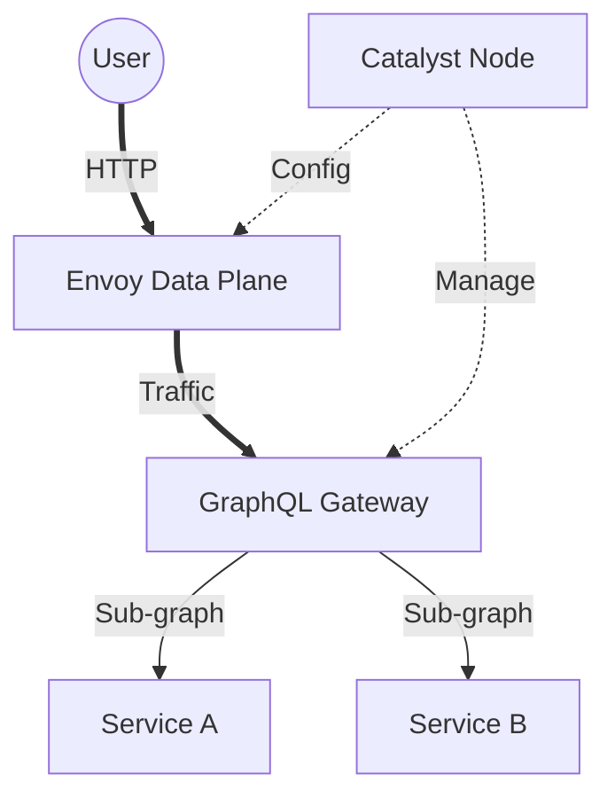
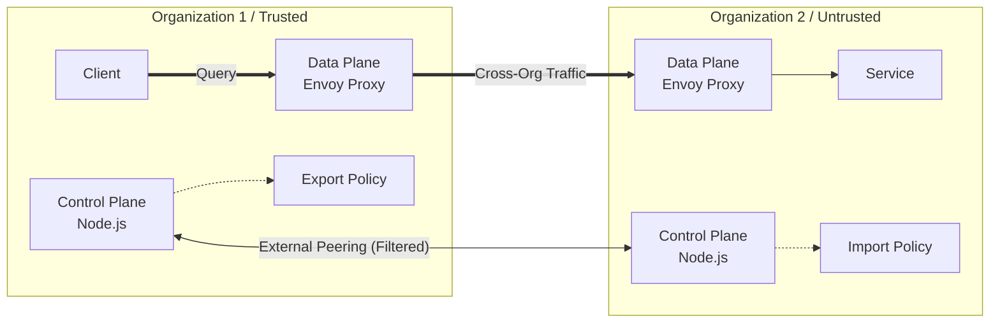
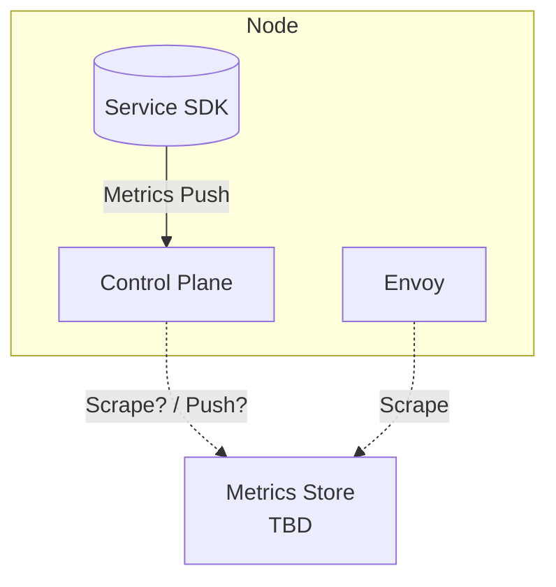
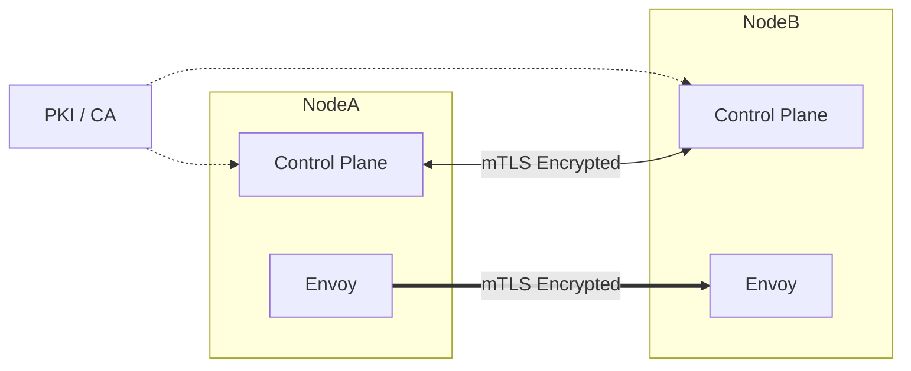

# Implementation Phases & Milestone Deviation Analysis

This document outlines the step-by-step implementation strategy for **Catalyst Node**, derived from the `MILESTONE.md` architecture but adapted for our specific rollout strategy.

## Milestone Deviation Summary

We are aligning with the `MILESTONE.md` vision but have made specific deviations to support our iterative engineering approach:

1.  **Tech Stack Flexibility**:
    *   *Milestone*: Specifies Hono + GraphQL Yoga.
    *   *Implementation*: We treat the GraphQL engine as a "Protocol Handler". We will use Hono/Yoga where appropriate but remain loosely coupled to allow other engines (Apollo, Mercurius) if needed.
2.  **Authentication Timing**:
    *   *Milestone*: Enforces Authentication (Shared JWKS) immediately in the "Internal Trust" stage.
    *   *Implementation*: We add a **precursor phase** (Phase 2) for "Internal Peering (No Auth)" to validate connectivity *before* enforcing security (Phase 3).
3.  **Token Flow (Cross-Org)**:
    *   *Milestone*: Suggests a "Token Exchange" (Minting a new token signed by the Gateway).
    *   *Implementation*: We prioritize **Federated Verification**. We will fetch and cache the *Peer's JWKS* to validate the original token directly, rather than masquerading/minting a new one. This preserves the original identity chain.
4.  **Granularity**:
    *   We have broken down "Policy" into distinct **Online** vs **Offline** implementation phases.

---

> **Note on Configuration**: For all phases below, configuration is considered **a priori** (static at startup). We must verify that the node can be fully configured via both **JSON config file** and **CLI arguments/flags**. Dynamic configuration is out of scope for these initial phases.

## Phase 1: Basic Node & GraphQL Federation
**Goal**: A standalone node running a local GraphQL federation with testable configuration.

*   **Capabilities**:
    *   **Configuration**: Load settings (ports, service lists) via JSON file OR CLI flags.
    *   Spin up a GraphQL federation server (using **Hono + Yoga** or Apollo).
    *   Integrate two local example services (from `packages/sdk` examples).
    *   Run a basic Envoy proxy instance (static config).
*   **Testing**:
    *   **Unit**: Vitest tests in the `node` directory using different config methods.
    *   **Manual**: Documented "Demo Run" where a user can query the federation.

## Phase 2: Internal Peering (Connectivity Check)
**Goal**: Two nodes exchanging routes for local services to verify the BGP-style plumbing.

> **Deviation**: `MILESTONE.md` skips this and goes straight to Auth. We perform this first to isolate networking issues from security issues.

*   **Capabilities**:
    *   **Configuration**: Define peers and protocol settings via JSON/CLI.
    *   **Peering**: Establish a connection between Node A and Node B.
    *   **Route Exchange**: Share routes with `protocol: "graphql"`.
    *   **Data Plane**: Envoy routes traffic to the peer's Envoy/Service.
*   **Constraint**: **NO AUTH**. Pure connectivity test.

## Phase 3: Internal Trust (Shared Auth)
**Goal**: Enforce authentication on the Internal Peering topology using Shared JWKS.

> **Alignment**: This matches `MILESTONE.md` Stage 1B (Internal Trust).

*   **Capabilities**:
    *   **Auth Configuration**: Define a `jwks.json` path via config.
    *   **Envoy Filter**: Configure Envoy to validate incoming JWTs against the local JWKS.
    *   **Verification**: Requests *without* a valid JWT (signed by the shared key) must be rejected by Envoy.

## Phase 4: External Peering (Cross-Org Routing)
**Goal**: Exchange routes across a logical trust boundary.

*   **Capabilities**:
    *   **Tables**: Separate **Internal** (Trusted) vs **External** (Untrusted) Route Tables.
    *   **Policies**: Export/Import policies (JSON/CLI) to control advertisement.
    *   **Scenario**: Node A queries Node B. Node B only exposes specific "public" services.

## Phase 5: Edge Routing & VPN
**Goal**: Encrypt the network transport between disjoint organizations using a Tunnel.

> **Alignment**: Matches `MILESTONE.md` "Cross-Deployment Query Flow" (WireGuard).

*   **Capabilities**:
    *   **Tunneling**: Integrate a VPN provider (e.g., WireGuard) or Tunnel interface.
    *   **Routing**: Configure Envoy/OS to route "External" traffic through the Tunnel interface.
    *   **Verification**: Traceroute shows traffic passing through the encrypted tunnel.

## Phase 6: Identity Infrastructure & Validation
**Goal**: Build the comprehensive Identity machinery required for complex auth.

> **Deviation**: We prefer **Peer JWKS Fetching** over Token Exchange/Minting.

*   **Capabilities**:
    *   **Minting Service**: Optional capability for a Node to issue tokens for its own Services.
    *   **Envoy Token Handlers**: Specialized filters for handling JWTs at the edge.
    *   **SDK Update**: Services connecting to the Node receive a "bundle" of Trusted Peer JWKS.
        *   *Benefit*: Services can independently validate tokens from peered organizations if they choose.

## Phase 7: Online Policy Management
**Goal**: Dynamic policy enforcement while connected.

*   **Capabilities**:
    *   **Policy Engine**: Basic logic to Allow/Deny requests based on attributes (Principal, Resource, Action).
    *   **Config**: Load Policy Rules from JSON/CLI.
    *   **Enforcement Point**: Envoy ExtAuthz or Internal Middleware checks policy before routing.

## Phase 8: Offline Policy Enforcement
**Goal**: Durable policy enforcement resilient to network partitions.

> **Alignment**: Matches `MILESTONE.md` "Offline Policy Enforcement".

*   **Capabilities**:
    *   **Bundles**: Signed Policy Bundles (containing rules + expiry).
    *   **Caching**: Node caches the bundle.
    *   **Offline Mode**: If Control Plane is unreachable, Node enforces using the cached bundle (respecting grace periods).
    *   **Crypto**: Validate signature of the bundle (ensure it wasn't tampered with).

## Phase 9: Observability & Metrics
**Goal**: Visibility into the control and data planes.

*   **Capabilities**:
    *   **SDK Metrics**: Instrumentation for local services.
    *   **Node/Envoy Metrics**: Scrape and expose stats.

## Phase 10: Mutual TLS (mTLS)
**Goal**: Encrypted and authenticated transport layer (Zero Trust).

*   **Capabilities**:
    *   **Configuration**: Paths to certs/keys defined via JSON/CLI.
    *   **Control Plane**: mTLS for Capnweb/RPC connections.
    *   **Data Plane**: mTLS between Envoys.
