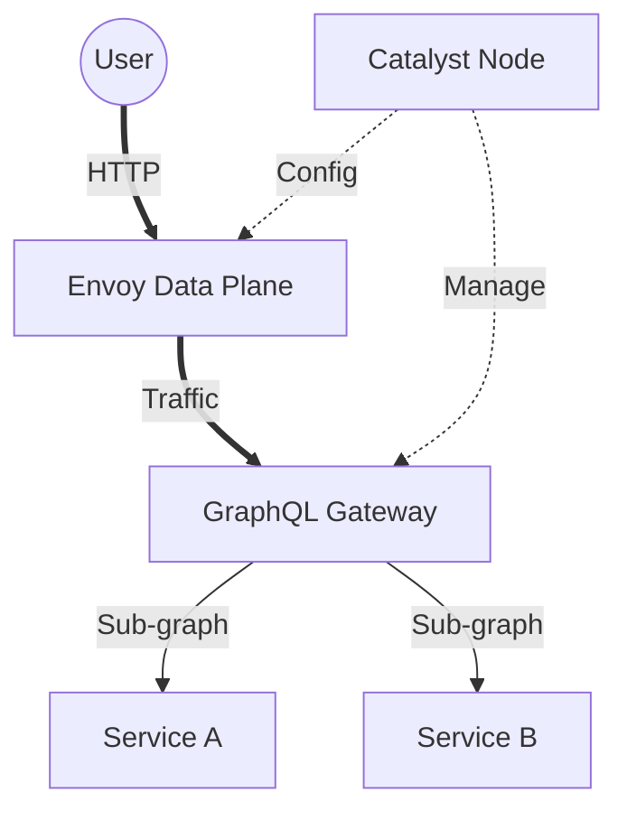
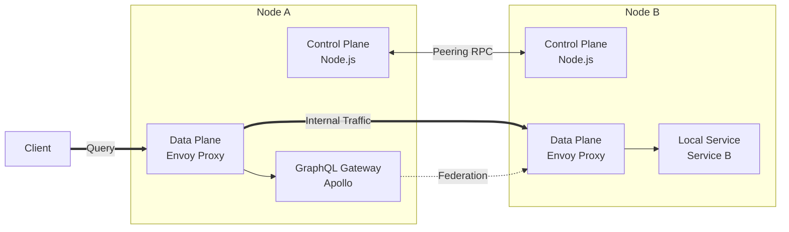
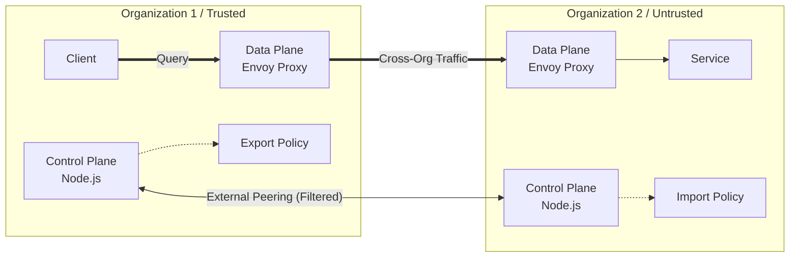
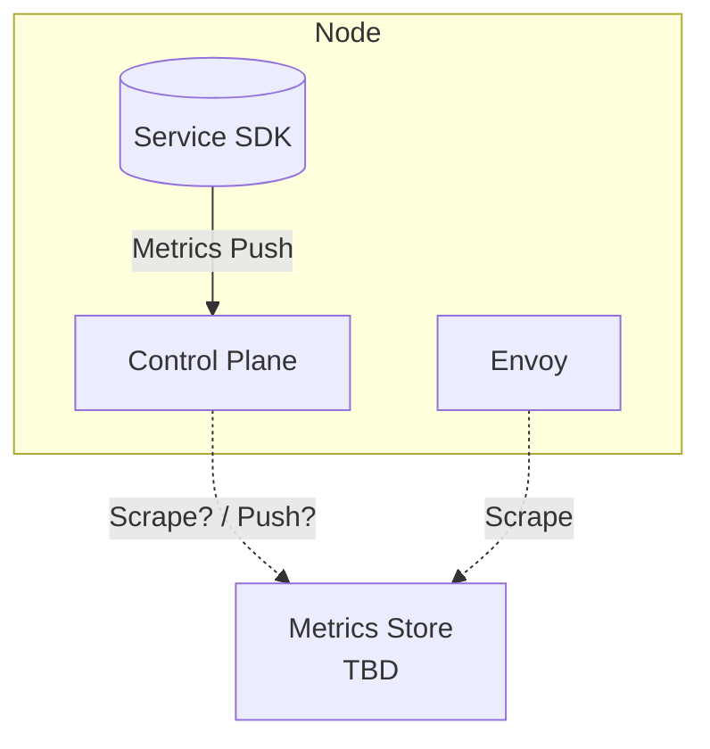
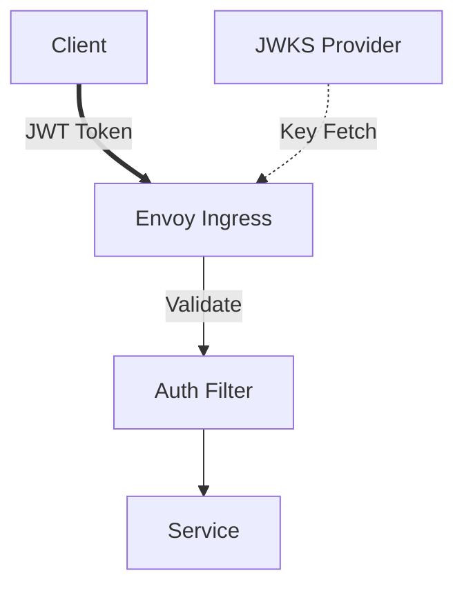
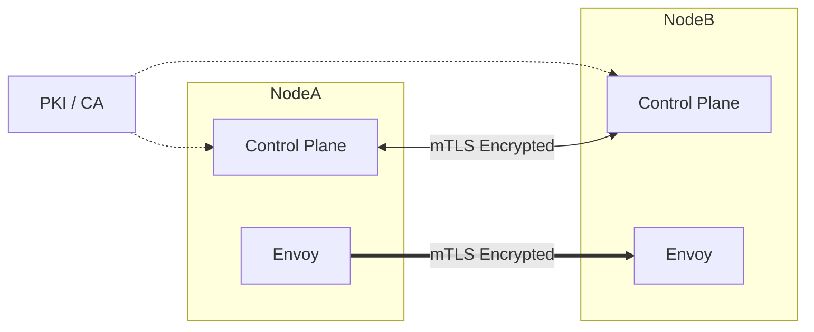

# Implementation Phases

This document outlines the step-by-step implementation strategy for **Catalyst Node**.

> **Note on Configuration**: For all phases below, configuration is considered **a priori** (static at startup). We must verify that the node can be fully configured via both **JSON config file** and **CLI arguments/flags**. Dynamic configuration is out of scope for these initial phases.

## Phase 1: Basic Node & GraphQL Federation
**Goal**: A standalone node running a local GraphQL federation with testable configuration.

*   **Capabilities**:
    *   **Configuration**: Load settings (ports, service lists) via JSON file OR CLI flags.
    *   Spin up a GraphQL federation server (using Apollo Gateway or similar).
    *   Integrate two local example services (from `packages/sdk` examples).
    *   Run a basic Envoy proxy instance (static config).
*   **Testing**:
    *   **Unit**: Vitest tests in the `node` directory using different config methods.
    *   **Manual**: Documented "Demo Run" where a user can query the federation.
*   **Artifacts**:
    *   `packages/node`: Core server logic.
    *   `packages/sdk`: Example services.
    *   `demo/phase1.md`: Instructions for running the demo.

## Phase 2: Internal Peering (No Auth)
**Goal**: Two nodes exchanging routes for local services within a trusted boundary.

*   **Capabilities**:
    *   **Configuration**: Define peers and protocol settings via JSON/CLI.
    *   **Peering**: Establish a connection between Node A and Node B.
    *   **Route Exchange**: Share routes with `protocol: "graphql"`.
    *   **Data Plane**:
        *   Each node runs a GraphQL Gateway behind Envoy.
        *   Envoy is configured to route traffic to the peer's Envoy/Service.
    *   **Client**: A GraphQL client on Node A queries the federation, resolving fields served by Node B.
*   **Constraint**: No authentication or encryption on the peering link yet.
*   **Key Concept**: "Internal" route table usage.

## Phase 3: External Peering
**Goal**: Cross-domain service discovery and routing.

*   **Capabilities**:
    *   **Configuration**: Define Export/Import policies via JSON/CLI.
    *   Separate **Internal** (Trusted) vs **External** (Untrusted) Route Tables.
    *   **Export Policies**: Define which internal routes are advertised to external peers.
    *   **Import Policies**: Define how external routes are mapped into the local mesh.
*   **Scenario**: Node A (Org 1) shares a specific service with Node B (Org 2).
*   **Differentiation**: Simulates crossing a trust boundary (internet/cloud implementation).

## Phase 4: Observability & Metrics
**Goal**: Visibility into the control and data planes.

*   **Capabilities**:
    *   **Configuration**: Configurable metrics endpoints and scraping intervals via JSON/CLI.
    *   **SDK Metrics**: Instrumentation for local services.
    *   **Node Metrics**: Control plane stats (peer count, route updates).
    *   **Envoy Metrics**: Scrape and expose Envoy stats.
*   **Integration**: Prometheus/OpenTelemetry compatible endpoint.

## Phase 5: Authentication (JWT & JWKS)
**Goal**: Secure service-to-service communication.

*   **Capabilities**:
    *   **Configuration**: Define JWKS URLs and Auth policies via JSON/CLI.
    *   **Identity**: Integrate JWT validation in Envoy.
    *   **Key Discovery**: Implement JWKS endpoint or distribution mechanism.
    *   **Topology**: Combine Phase 2 & 3 scenarios with enforced auth.
        *   Internal traffic: Validated.
        *   External traffic: Strict token validation at the ingress.

## Phase 6: Mutual TLS (mTLS)
**Goal**: Encrypted and authenticated transport layer.

*   **Capabilities**:
    *   **Configuration**: Paths to certs/keys defined via JSON/CLI.
    *   Integrate the PKI/CA solution (defined in RFI).
    *   **Control Plane**: mTLS for Capnweb/RPC connections.
    *   **Data Plane**: mTLS between Envoys.
*   **Validation**: Verify encryption and identity assertion for all hops.
