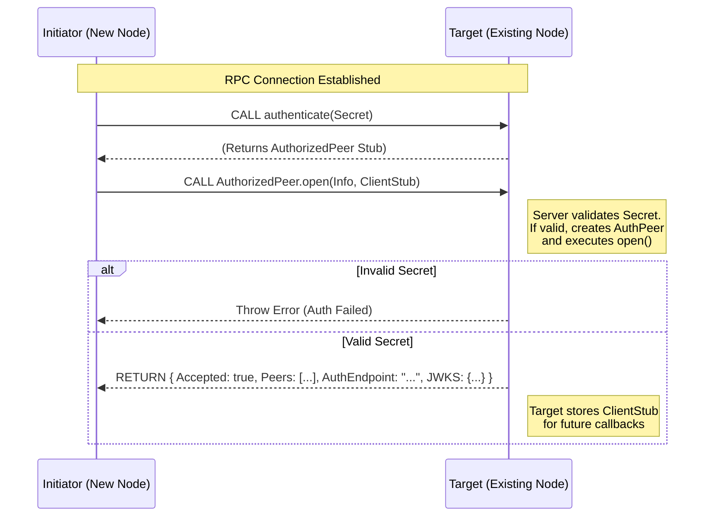
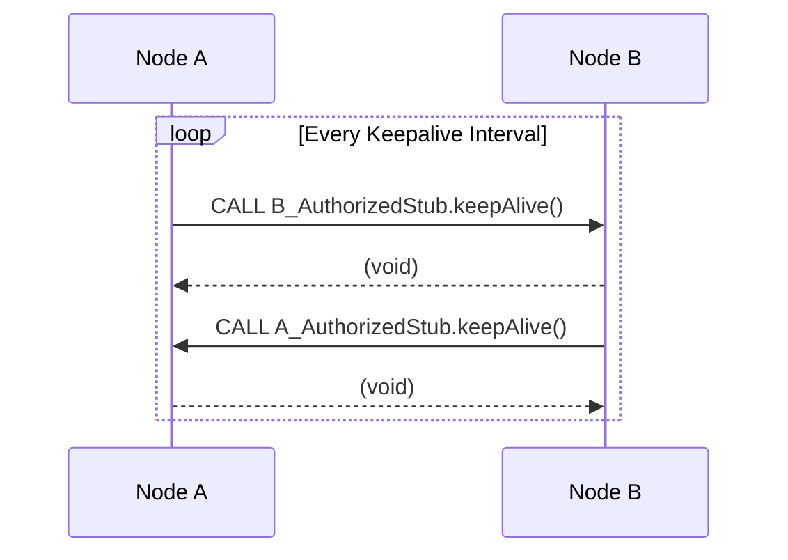
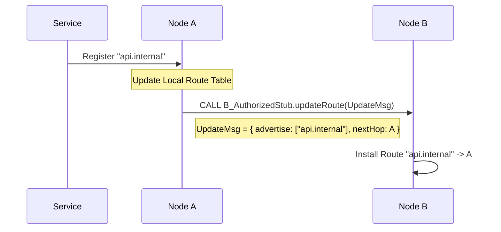

# Internal Peering Architecture

This document describes the implementation of Internal Peering (iBGP) for the Catalyst Node orchestrator, focusing on the use of Cap'n Proto RPC for bidirectional communication and route propagation between nodes within the same Autonomous System (AS).

## Overview: BGP in Catalyst

As detailed in [BGP_PROTOCOL.md](./BGP_PROTOCOL.md), we adapted the Border Gateway Protocol (BGP) for service discovery. Nodes exchange "routes" which map logical service domains (e.g., `*.services.internal`) to specific node endpoints.

**Internal Peering (iBGP)** ensures that all nodes within a cluster or network share a consistent view of available services. When a new node joins, it synchronizes with existing peers to download the current routing table and subsequently receives real-time updates about service availability.

## Protocol Messages

The protocol uses a simplified set of BGP messages exchanged over a persistent RPC connection.

| Message Type     | Purpose                                                                                                        |
| :--------------- | :------------------------------------------------------------------------------------------------------------- |
| **OPEN**         | Initiates the session, performs authentication, and exchanges initial state (existing peers, JWKS, auth info). |
| **KEEPALIVE**    | Maintains the session to prevent timeouts. Sent periodically.                                                  |
| **UPDATE**       | Advertises new routes or withdraws unreachable ones.                                                           |
| **NOTIFICATION** | Signals a fatal error and closes the session.                                                                  |

---

## Detailed Message Flow

### 1. Connection Establishment (Pipelined Auth & OPEN)

We utilize the **Pipelined RPC** pattern supported by Cap'n Proto. This creates a secure and efficient connection flow in a single round-trip (conceptually), but logically split into two steps:

1.  **Authentication**: The client sends a secret to the public `authenticate` method.
2.  **Peering**: The server returns an `AuthorizedPeer` interface (stub). The client then calls `open` on this restricted interface to start the BGP session.

**Process:**

1.  **Initiator** connects to the public RPC interface.
2.  **Initiator** calls `authenticate(secret)`. This returns a promise for an `AuthorizedPeer`.
3.  **Initiator** _immediately_ (pipelined) calls `open(localNodeInfo, clientCallbackStub)` on the `AuthorizedPeer` promise.
4.  **Target** validates the secret. If valid, it executes the `open` call on the authenticated interface.
5.  **Target** responds with the session state (Peers, JWKS, etc).



### 2. Session Maintenance (KEEPALIVE)

To ensure the connection remains active and healthy, nodes exchange KEEPALIVE messages. Since we have a bidirectional RPC stream, either side can invoke `keepAlive()` on the other's stored stub.



### 3. Route Propagation (UPDATE)

When a service is registered or deregistered on a node, it must propagate this change to its peers.

**Scenario:** A new service `api.internal` starts on **Node A**.



---

## Implementation Design

### The `Peer` Class

To handle the complexity of bidirectional RPC, we will encapsulate the logic in a `Peer` class (or `PeerClient`). This class represents a connection to a remote node.

**Responsibilities:**

1.  **Transport**: Manages the underlying Cap'n Proto RPC connection.
2.  **Pipelined Auth**: Handles the `authenticate` -> `open` flow transparently.
3.  **Bidurational Handling**:
    - Implements the "Client Stub" interface to receive calls from the remote peer.
    - Holds the "Remote Stub" (the `AuthorizedPeer`) to make calls to the remote peer.

### RPC Interfaces

```typescript
// Public Interface exposed by every node
interface PeerPublicApi {
  authenticate(secret: string): AuthorizedPeer
}

// Privileged Interface returned after authentication
interface AuthorizedPeer {
  open(info: PeerInfo, clientStub: PeerClient): PeerSessionState
  keepAlive(): void
  updateRoute(msg: UpdateMessage): void
}

// Interface implemented by the Initiator (Client) to receive callbacks
interface PeerClient {
  keepAlive(): void
  updateRoute(msg: UpdateMessage): void
}
```

### Peer Implementation

```typescript
class Peer {
  private connection: RpcConnection
  private authorizedRemote: AuthorizedPeer // The privileged stub

  constructor(info: PeerInfo) {}

  /**
   * Called when THIS node wants to connect to a remote node.
   */
  async connect(targetAddress: string, secret: string) {
    // 1. Establish TCP/RPC connection
    this.connection = new RpcConnection(targetAddress)
    const publicApi = await this.connection.getService<PeerPublicApi>()

    // 2. Create local callback handler (stub)
    const localStub = new PeerHandler(this)

    // 3. Pipeline: Authenticate -> Open
    // We get the authorized stub promise
    this.authorizedRemote = publicApi.authenticate(secret)

    // We immediately call open on it (Pipelining)
    const responsePromise = this.authorizedRemote.open(this.localInfo, localStub)

    // 4. Await the final result
    const response = await responsePromise

    // 5. Process Response
    this.syncPeers(response.peers)
    this.updateJwks(response.jwks)
  }

  /**
   * Interface exposed to the remote peer (The "Client Stub")
   */
  async onUpdate(msg: UpdateMessage) {
    // Handle incoming route updates
    GlobalRouteTable.processUpdate(msg)
  }

  async onKeepAlive() {
    this.resetHoldTimer()
  }
}
```

### Workflow: Adding a New Peer

We will use the existing Action/Plugin system to trigger the connection of new peers. This allows runtime configuration changes via the CLI.

**Step 1: Administrator Action**
The user runs a CLI command to add a peer.

```bash
catalyst peer add --address 10.0.0.5 --secret mysecret
```

**Step 2: Action Dispatch**
This generates a `CREATE_PEER` action in the orchestrator.

**Step 3: Internal Peering Plugin**
A specific plugin, `InternalPeeringPlugin`, listens for `CREATE_PEER` actions.

```typescript
class InternalPeeringPlugin extends BasePlugin {
  async apply(ctx: PluginContext) {
    if (ctx.action.type === 'PEER' && ctx.action.op === 'CREATE') {
      const { address, secret } = ctx.action.data

      // Initiate connection
      const newPeer = new Peer(address)
      await newPeer.connect(address, secret)

      // Store in global peer manager
      PeerManager.addPeer(newPeer)
    }
  }
}
```

**Step 4: Connection & Sync**
The `Peer` instance connects, exchanges OPEN messages, and synchronizes the initial state. The node is now part of the internal mesh.
