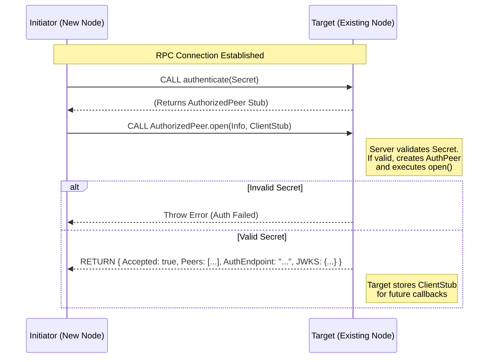
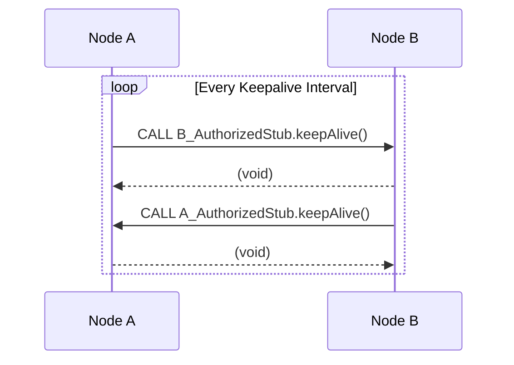
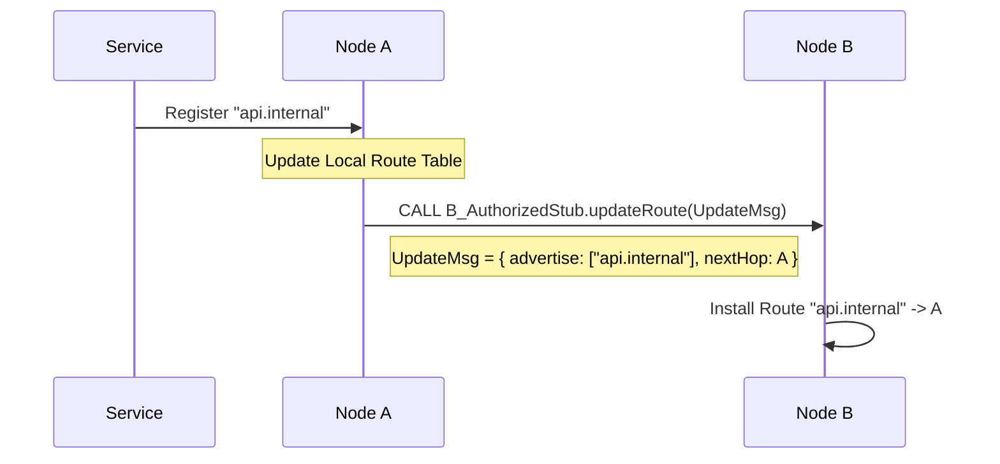

# Internal Peering Architecture

This document describes the implementation of Internal Peering (iBGP) for the Catalyst Router orchestrator, focusing on the use of Cap'n Proto RPC for bidirectional communication and route propagation between nodes within the same Autonomous System (AS).

## Overview: BGP in Catalyst

As detailed in [BGP_PROTOCOL.md](./BGP_PROTOCOL.md), we adapted the Border Gateway Protocol (BGP) for service discovery. Nodes exchange "routes" which map logical service domains (e.g., `*.services.internal`) to specific node endpoints.

**Internal Peering (iBGP)** ensures that all nodes within a cluster or network share a consistent view of available services. When a new node joins, it synchronizes with existing peers to download the current routing table and subsequently receives real-time updates about service availability.

## Protocol Messages

The protocol uses a simplified set of BGP messages exchanged over a persistent RPC connection.

| Message Type     | Purpose                                                                                                        |
| :--------------- | :------------------------------------------------------------------------------------------------------------- |
| **OPEN**         | Initiates the session, performs authentication, and exchanges initial state (existing peers, JWKS, auth info). |
| **KEEPALIVE**    | Maintains the session to prevent timeouts. Sent periodically.                                                  |
| **UPDATE**       | Advertises new routes or withdraws unreachable ones.                                                           |
| **NOTIFICATION** | Signals a fatal error and closes the session.                                                                  |

---

## Detailed Message Flow

### 1. Connection Establishment (Pipelined Auth & OPEN)

We utilize the **Pipelined RPC** pattern supported by Cap'n Proto. This creates a secure and efficient connection flow in a single round-trip (conceptually), but logically split into two steps:

1.  **Authentication**: The client sends a secret to the public `authenticate` method.
2.  **Peering**: The server returns an `AuthorizedPeer` interface (stub). The client then calls `open` on this restricted interface to start the BGP session.

**Process:**

1.  **Initiator** connects to the public RPC interface.
2.  **Initiator** calls `authenticate(secret)`. This returns a promise for an `AuthorizedPeer`.
3.  **Initiator** _immediately_ (pipelined) calls `open(localNodeInfo, clientCallbackStub)` on the `AuthorizedPeer` promise.
4.  **Target** validates the secret. If valid, it executes the `open` call on the authenticated interface.
5.  **Target** responds with the session state (Peers, JWKS, etc).


```mermaid
sequenceDiagram
    participant I as Initiator (New Node)
    participant T as Target (Existing Node)

    Note over I, T: RPC Connection Established

    I->>T: CALL authenticate(Secret)
    T-->>I: (Returns AuthorizedPeer Stub)

    I->>T: CALL AuthorizedPeer.open(Info, ClientStub)

    Note right of T: Server validates Secret.<br/>If valid, creates AuthPeer<br/>and executes open()

    alt Invalid Secret
        T-->>I: Throw Error (Auth Failed)
    else Valid Secret
        T-->>I: RETURN { Accepted: true, Peers: [...], AuthEndpoint: "...", JWKS: {...} }

        Note right of T: Target stores ClientStub<br/>for future callbacks
    end
```

### 2. Session Maintenance (KEEPALIVE)

To ensure the connection remains active and healthy, nodes exchange KEEPALIVE messages. Since we have a bidirectional RPC stream, either side can invoke `keepAlive()` on the other's stored stub.


```mermaid
sequenceDiagram
    participant A as Node A
    participant B as Node B

    loop Every Keepalive Interval
        A->>B: CALL B_AuthorizedStub.keepAlive()
        B-->>A: (void)

        B->>A: CALL A_AuthorizedStub.keepAlive()
        A-->>B: (void)
    end
```

### 3. Route Propagation (UPDATE)

When a service is registered or deregistered on a node, it must propagate this change to its peers.

**Scenario:** A new service `api.internal` starts on **Node A**.


```mermaid
sequenceDiagram
    participant Svc as Service
    participant A as Node A
    participant B as Node B

    Svc->>A: Register "api.internal"

    Note over A: Update Local Route Table

    A->>B: CALL B_AuthorizedStub.updateRoute(UpdateMsg)
    Note right of A: UpdateMsg = { advertise: ["api.internal"], nextHop: A }

    B->>B: Install Route "api.internal" -> A
```

---

## Implementation Design (v2)

### Architecture Overview

The v2 implementation replaces the `Peer` class and plugin pipeline with a layered architecture:

- **`RoutingInformationBase` (RIB)**: Pure state machine with `plan()` / `commit()` cycle.
- **`OrchestratorBus`**: Serializes actions through an `ActionQueue`, delegates to the RIB, and executes async post-commit side effects.
- **`PeerTransport`**: Abstraction over peer-to-peer WebSocket RPC (`WebSocketPeerTransport` in production, `MockPeerTransport` in tests).
- **`ReconnectManager`**: Exponential-backoff retry logic for failed transport connections.
- **`TickManager`**: Drives periodic keepalive dispatch and hold-timer expiration checks.

### RPC Interfaces

Each orchestrator node exposes three RPC entry points via capnweb WebSocket sessions, gated by JWT-based `TokenValidator`:

```typescript
// Public API exposed at /rpc
interface PublicApi {
  getNetworkClient(token: string): NetworkClient | { error: string }
  getDataChannelClient(token: string): DataChannel | { error: string }
  getIBGPClient(token: string): IBGPClient | { error: string }
}

// iBGP session management
interface IBGPClient {
  open(data: { peerInfo: PeerInfo; holdTime?: number }): Result
  close(data: { peerInfo: PeerInfo; code: number; reason?: string }): Result
  update(data: { peerInfo: PeerInfo; update: UpdateMessage }): Result
  keepalive(data: { peerInfo: PeerInfo }): Result
}
```

### Transport Layer

The `WebSocketPeerTransport` maintains a pool of capnweb RPC stubs keyed by endpoint URL. Each outbound call obtains an iBGP client from the remote peer's `PublicApi`, authenticated with the local node's JWT.

```typescript
interface PeerTransport {
  openPeer(peer: PeerRecord, token: string): Promise<void>
  sendUpdate(peer: PeerRecord, message: UpdateMessage): Promise<void>
  sendKeepalive(peer: PeerRecord): Promise<void>
  closePeer(peer: PeerRecord, code: number, reason?: string): Promise<void>
}
```

### Workflow: Adding a New Peer

**Step 1: Administrator Action**
The user runs a CLI command to add a peer.

```bash
catalyst peer add --name remote-node --endpoint ws://10.0.0.5:3001/rpc --domains example.com
```

**Step 2: Action Dispatch**
The CLI sends an `AddPeer` action via the `NetworkClient` RPC interface.

**Step 3: RIB Processing**
The `OrchestratorBus` dispatches the action through the deterministic cycle:

```
plan(AddPeer, state) → new PeerRecord in peers map
commit(plan)         → state updated, journal appended
handlePostCommit()   → transport.openPeer() called, initial route table sent
```

**Step 4: Session Establishment**
The remote node receives the `open()` call on its iBGP RPC endpoint, dispatches an `OpenPeer` action locally, and both nodes exchange their current route tables via `update()` messages.

### Identity Verification

Every iBGP RPC call validates the caller's JWT:

1. **Token validation**: The `TokenValidator` checks the token against the auth service for the `IBGP_CONNECT` action.
2. **Identity binding**: The JWT `sub` claim is extracted and compared against `peerInfo.name` on every method call.
3. **Path origin verification**: On `update()` calls, `nodePath[0]` must match the authenticated peer identity.
