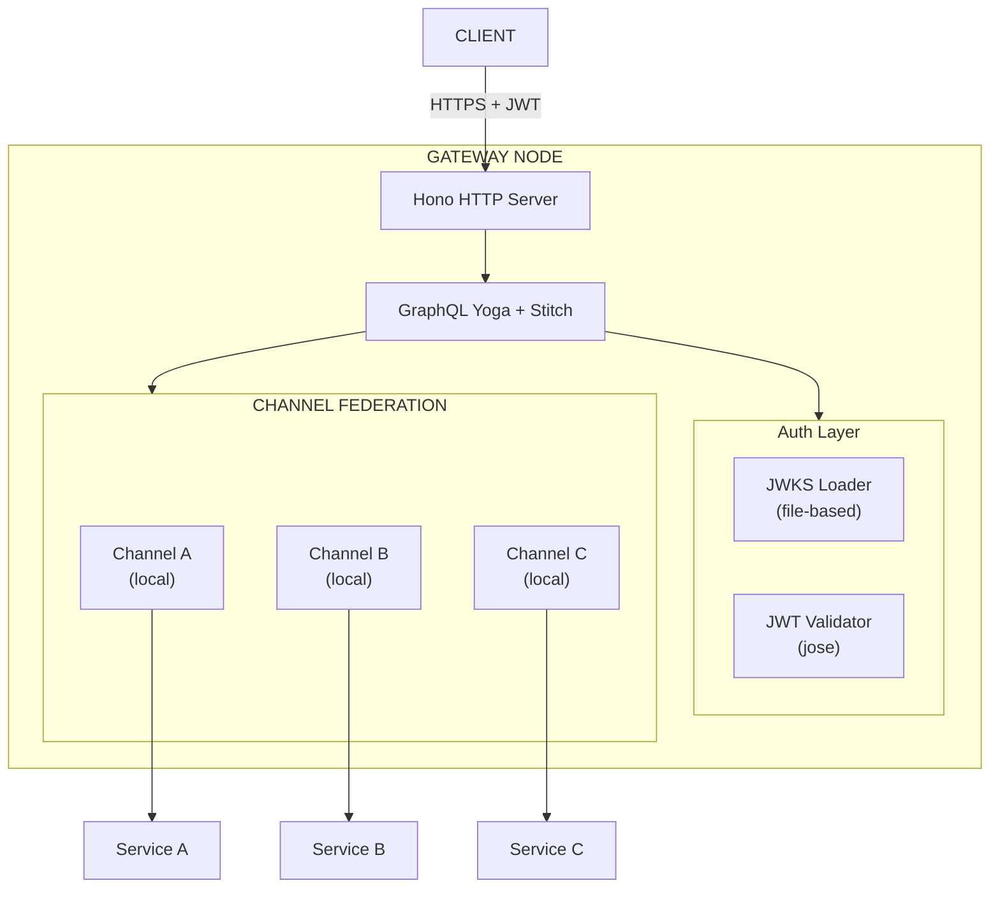
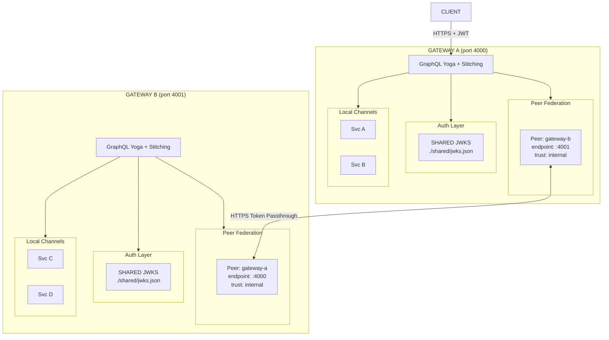
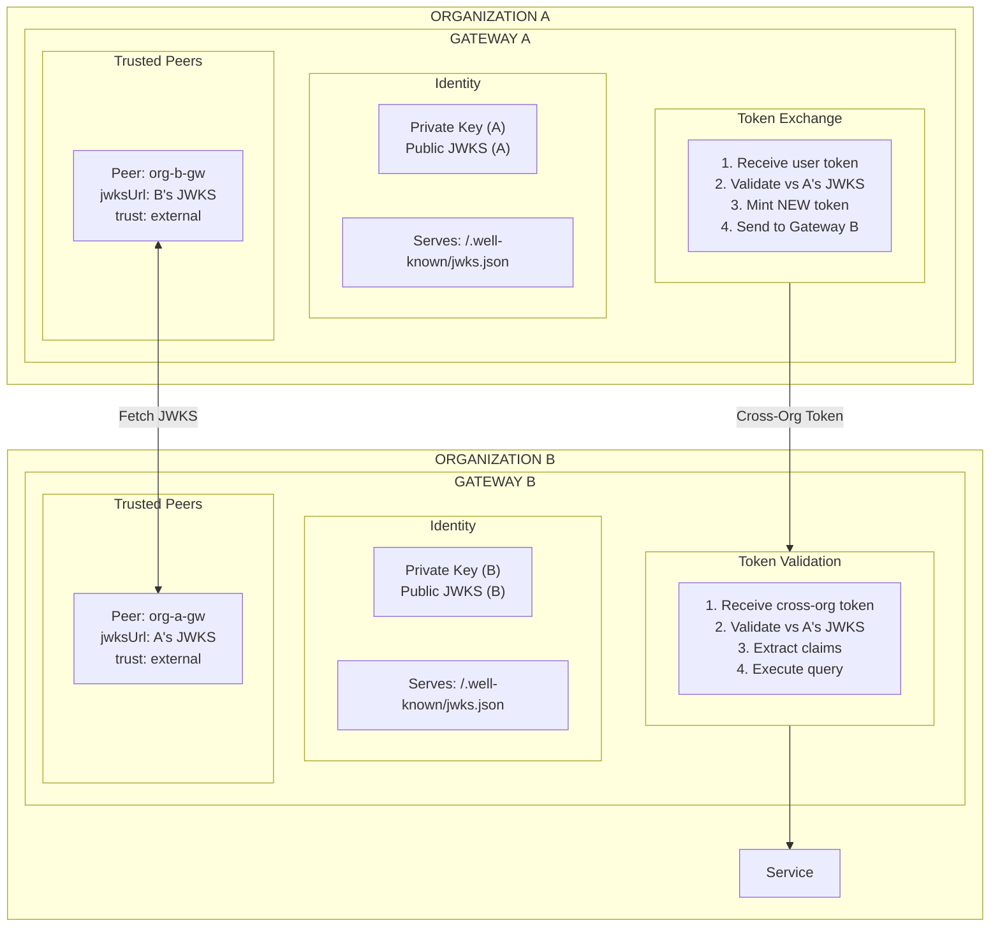
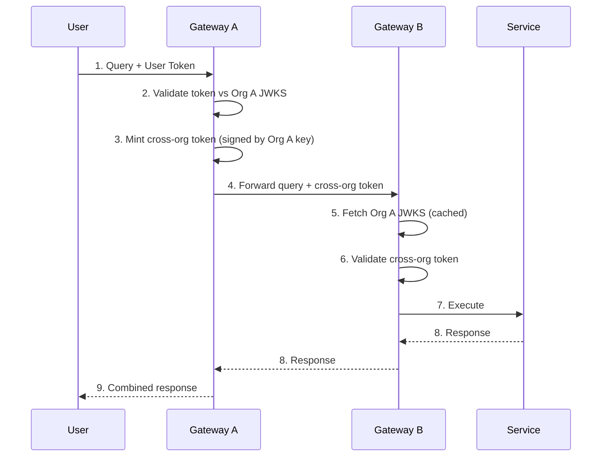
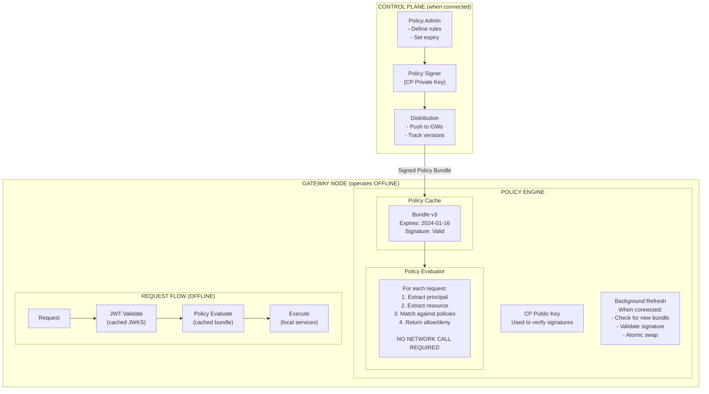
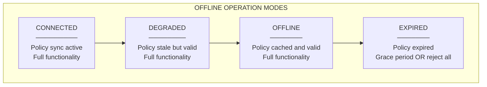
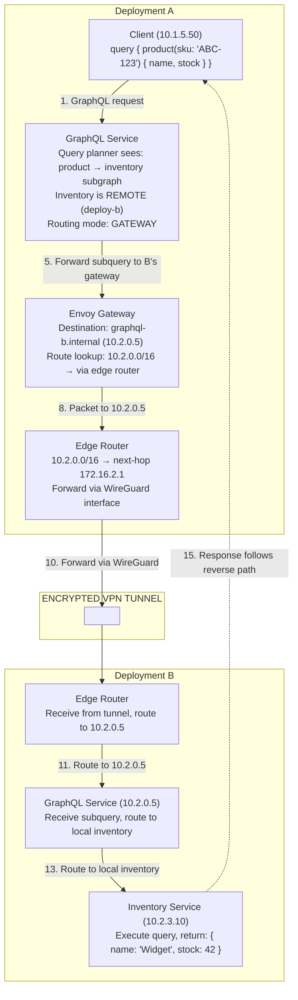

# Trust Fabric Architecture Documentation

## Table of Contents

- [Trust Fabric Architecture Documentation](#trust-fabric-architecture-documentation)
  - [Table of Contents](#table-of-contents)
  - [Stage 1: Pure Application-Layer](#stage-1-pure-application-layer)
    - [Single Gateway](#single-gateway)
    - [Two Gateways - Internal Trust (Milestone 1 (M1))](#two-gateways---internal-trust-milestone-1-m1)
    - [Two Gateways - External Trust (Milestone 2 (M2))](#two-gateways---external-trust-milestone-2-m2)
    - [Offline Policy Enforcement](#offline-policy-enforcement)
  - [Cross-Deployment Query Flow](#cross-deployment-query-flow)

---

## Stage 1: Pure Application-Layer

### Single Gateway 

```
┌──────────────────────────────────────────────────────────────────────────────┐
│                    STAGE 1A: SINGLE GATEWAY (Milestone 0 (M0))               │
│                                                                              │
│                               ┌─────────────────┐                            │
│                               │     CLIENT      │                            │
│                               └────────┬────────┘                            │
│                                        │                                     │
│                                        │ HTTPS + JWT                         │
│                                        ▼                                     │
│  ┌────────────────────────────────────────────────────────────────────────┐  │
│  │                            GATEWAY NODE                                │  │
│  │                                                                        │  │
│  │  ┌─────────────┐    ┌─────────────┐    ┌───────────────────────────┐   │  │
│  │  │ Hypertext   │    │  GraphQL    │    │       Auth Layer          │   │  │
│  │  │ Transfer    │───►│   Yoga      │───►│  ┌───────────────────┐    │   │  │
│  │  │ Protocol    │    │             │    │  │                   │    │   │  │
│  │  │   Server    │    │  + Stitch   │    │  │  JWKS Loader      │    │   │  │
│  │  └─────────────┘    └──────┬──────┘    │  │  (file-based)     │    │   │  │
│  │                            │           │  └───────────────────┘    │   │  │
│  │                            │           │  ┌───────────────────┐    │   │  │
│  │                            │           │  │  JWT Validator    │    │   │  │
│  │                            │           │  │  (jose)           │    │   │  │
│  │                            │           │  └───────────────────┘    │   │  │
│  │                            │           └───────────────────────────┘   │  │
│  │                            ▼                                           │  │
│  │  ┌──────────────────────────────────────────────────────────────────┐  │  │
│  │  │                      CHANNEL FEDERATION                          │  │  │
│  │  │  ┌──────────┐   ┌──────────┐   ┌──────────┐                      │  │  │
│  │  │  │Channel A │   │Channel B │   │Channel C │                      │  │  │
│  │  │  │ (local)  │   │ (local)  │   │ (local)  │                      │  │  │
│  │  │  └────┬─────┘   └────┬─────┘   └────┬─────┘                      │  │  │
│  │  │       │              │              │                            │  │  │
│  │  └───────┼──────────────┼──────────────┼────────────────────────────┘  │  │
│  │          │              │              │                               │  │
│  └──────────┼──────────────┼──────────────┼───────────────────────────────┘  │
│             │              │              │                                  │
│             ▼              ▼              ▼                                  │
│      ┌──────────┐   ┌──────────┐   ┌──────────┐                              │
│      │ Service  │   │ Service  │   │ Service  │                              │
│      │    A     │   │    B     │   │    C     │                              │
│      └──────────┘   └──────────┘   └──────────┘                              │
│                                                                              │
│  ┌────────────────────────────────────────────────────────────────────────┐  │
│  │  CONFIG (whatever.json)                                                |  │
│  │  {                                                                     │  │
│  │    "gateway": { "id": "gw-1", "port": 4000 },                          │  │
│  │    "jwks": { "source": "file", "path": "./keys/jwks.json" },           │  │
│  │    "channels": [                                                       │  │
│  │      { "id": "svc-a", "endpoint": "http://localhost:5001/graphql" }    │  │
│  │    ]                                                                   │  │
│  │  }                                                                     │  │
│  └────────────────────────────────────────────────────────────────────────┘  │
│                                                                              │
│  PROVIDES:                            DOES NOT PROVIDE:                      │
│  ✓ JWT validation                     ✗ Gateway-to-gateway                   │
│  ✓ GraphQL federation                 ✗ Cross-org trust                      │
│  ✓ Schema stitching                   ✗ Encrypted transport (beyond          │
│                                         Transport Layer Security (TLS))      │
│  ✓ Config-based channels              ✗ Network isolation                    │
│                                                                              │
└──────────────────────────────────────────────────────────────────────────────┘
```



### Two Gateways - Internal Trust (Milestone 1 (M1))

```
┌──────────────────────────────────────────────────────────────────────────────┐
│               STAGE 1B: TWO GATEWAYS - INTERNAL TRUST (M1)                   │
│                                                                              │
│                               ┌─────────────────┐                            │
│                               │     CLIENT      │                            │
│                               └────────┬────────┘                            │
│                                        │                                     │
│                                        │ HTTPS + JWT                         │
│                                        ▼                                     │
│                                                                              │
│  ┌───────────────────────────────┐        ┌───────────────────────────────┐  │
│  │         GATEWAY A             │        │         GATEWAY B             │  │
│  │         (port 4000)           │        │         (port 4001)           │  │
│  │                               │        │                               │  │
│  │  ┌─────────────────────────┐  │        │  ┌─────────────────────────┐  │  │
│  │  │      GraphQL Yoga       │  │        │  │      GraphQL Yoga       │  │  │
│  │  │      + Stitching        │  │        │  │      + Stitching        │  │  │
│  │  └───────────┬─────────────┘  │        │  └───────────┬─────────────┘  │  │
│  │              │                │        │              │                │  │
│  │  ┌───────────┴─────────────┐  │        │  ┌───────────┴─────────────┐  │  │
│  │  │    Peer Federation      │◄─┼────────┼─►│    Peer Federation      │  │  │
│  │  │  ┌───────────────────┐  │  │ HTTPS  │  │  ┌───────────────────┐  │  │  │
│  │  │  │ Peer: gateway-b   │  │  │ Token  │  │  │ Peer: gateway-a   │  │  │  │
│  │  │  │ endpoint: :4001   │  │  │ Pass-  │  │  │ endpoint: :4000   │  │  │  │
│  │  │  │ trust: internal   │  │  │through │  │  │ trust: internal   │  │  │  │
│  │  │  └───────────────────┘  │  │        │  │  └───────────────────┘  │  │  │
│  │  └─────────────────────────┘  │        │  └─────────────────────────┘  │  ****│
│  │              │                │        │              │                │  │
│  │  ┌───────────┴─────────────┐  │        │  ┌───────────┴─────────────┐  │  │
│  │  │      Auth Layer         │  │        │  │      Auth Layer         │  │  │
│  │  │  ┌───────────────────┐  │  │        │  │  ┌───────────────────┐  │  │  │
│  │  │  │   SHARED JWKS     │  │  │        │  │  │   SHARED JWKS     │  │  │  │
│  │  │  │./shared/jwks.json │  │  │        │  │  │./shared/jwks.json │  │  │  │
│  │  │  └───────────────────┘  │  │        │  │  └───────────────────┘  │  │  │
│  │  └─────────────────────────┘  │        │  └─────────────────────────┘  │  │
│  │              │                │        │              │                │  │
│  │              ▼                │        │              ▼                │  │
│  │  ┌─────────────────────────┐  │        │  ┌─────────────────────────┐  │  │
│  │  │     Local Channels      │  │        │  │     Local Channels      │  │  │
│  │  │  ┌───────┐ ┌───────┐    │  │        │  │  ┌───────┐ ┌───────┐    │  │  │
│  │  │  │ Svc A │ │ Svc B │    │  │        │  │  │ Svc C │ │ Svc D │    │  │  │
│  │  │  └───────┘ └───────┘    │  │        │  │  └───────┘ └───────┘    │  │  │
│  │  └─────────────────────────┘  │        │  └─────────────────────────┘  │  │
│  │                               │        │                               │  │
│  └───────────────────────────────┘        └───────────────────────────────┘  │
│                                                                              │
│  ┌────────────────────────────────────────────────────────────────────────┐  │
│  │  TRUST MODEL: SHARED JWKS                                              │  │
│  │                                                                        │  │
│  │  ┌──────────────────────────────────────────────────────────────────┐  │  │
│  │  │                     Same Organization                            │  │  │
│  │  │                                                                  │  │  │
│  │  │   Gateway A ◄────── SHARED JWKS ──────► Gateway B                │  │  │
│  │  │       │              (same keys)              │                  │  │  │
│  │  │       │                                       │                  │  │  │
│  │  │       └──── Token valid at both ──────────────┘                  │  │  │
│  │  │                                                                  │  │  │
│  │  └──────────────────────────────────────────────────────────────────┘  │  │
│  └────────────────────────────────────────────────────────────────────────┘  │
│                                                                              │
│  QUERY FLOW:                                                                 │
│  ────────────────────────────────────────────────────────────────────────-───│
│  1. Client → Gateway A: query { localData, remoteData }                      │
│  2. Gateway A validates JWT against shared JWKS                              │
│  3. Gateway A fetches localData from local services                          │
│  4. Gateway A forwards query to Gateway B (with same JWT)                    │
│  5. Gateway B validates JWT against shared JWKS (same keys!)                 │
│  6. Gateway B returns remoteData                                             │
│  7. Gateway A stitches responses, returns to client                          │
│                                                                              │
│  PROVIDES:                          DOES NOT PROVIDE:                        │
│  ✓ Cross-gateway federation         ✗ Org isolation (shared keys)            │
│  ✓ Token passthrough                ✗ Encrypted transport beyond TLS         │
│  ✓ Combined schema                  ✗ Network isolation                      │
│  ✓ Simple trust model               ✗ Fine-grained peer auth                 │
│                                                                              │
└──────────────────────────────────────────────────────────────────────────────┘
```



### Two Gateways - External Trust (Milestone 2 (M2))

```
┌──────────────────────────────────────────────────────────────────────────────┐
│               STAGE 1C: TWO GATEWAYS - EXTERNAL TRUST (M2)                   │
│                                                                              │
│    ORGANIZATION A                              ORGANIZATION B                │
│    ══════════════                              ══════════════                │
│                                                                              │
│  ┌───────────────────────────────┐        ┌───────────────────────────────┐  │
│  │         GATEWAY A             │        │         GATEWAY B             │  │
│  │         (Org A)               │        │         (Org B)               │  │
│  │                               │        │                               │  │
│  │  ┌─────────────────────────┐  │        │  ┌─────────────────────────┐  │  │
│  │  │       Identity          │  │        │  │       Identity          │  │  │
│  │  │  ┌───────────────────┐  │  │        │  │  ┌───────────────────┐  │  │  │
│  │  │  │ Private Key (A)   │  │  │        │  │  │ Private Key (B)   │  │  │  │
│  │  │  │ Public JWKS (A)   │  │  │        │  │  │ Public JWKS (B)   │  │  │  │
│  │  │  └───────────────────┘  │  │        │  │  └───────────────────┘  │  │  │
│  │  │                         │  │        │  │                         │  │  │
│  │  │  Serves:                │  │        │  │  Serves:                │  │  │
│  │  │  /.well-known/jwks.json │  │        │  │  /.well-known/jwks.json │  │  │
│  │  └─────────────────────────┘  │        │  └─────────────────────────┘  │  │
│  │              │                │        │              │                │  │
│  │  ┌───────────┴─────────────┐  │        │  ┌───────────┴─────────────┐  │  │
│  │  │     Trusted Peers       │  │        │  │     Trusted Peers       │  │  │
│  │  │  ┌───────────────────┐  │  │        │  │  ┌───────────────────┐  │  │  │
│  │  │  │ Peer: org-b-gw    │  │  │        │  │  │ Peer: org-a-gw    │  │  │  │
│  │  │  │ jwksUrl: B's JWKS │◄─┼──┼────────┼──┼─►│ jwksUrl: A's JWKS │  │  │  │
│  │  │  │ trust: external   │  │  │ Fetch  │  │  │ trust: external   │  │  │  │
│  │  │  └───────────────────┘  │  │ JWKS   │  │  └───────────────────┘  │  │  │
│  │  └─────────────────────────┘  │        │  └─────────────────────────┘  │  │
│  │              │                │        │              │                │  │
│  │  ┌───────────┴─────────────┐  │        │  ┌───────────┴─────────────┐  │  │
│  │  │     Token Exchange      │  │        │  │     Token Validation    │  │  │
│  │  │                         │  │        │  │                         │  │  │
│  │  │  1. Receive user token  │  │        │  │  1. Receive cross-org   │  │  │
│  │  │  2. Validate vs A JWKS  │  │        │  │     token from A        │  │  │
│  │  │  3. Mint NEW token:     │──┼────────┼──│  2. Validate vs A JWKS  │  │  │
│  │  │     - Signed by A       │  │ Cross  │  │     (fetched/cached)    │  │  │
│  │  │     - Audience: org-b   │  │  Org   │  │  3. Extract claims      │  │  │
│  │  │     - Delegated claims  │  │ Token  │  │  4. Execute query       │  │  │
│  │  │  4. Send to Gateway B   │  │        │  │                         │  │  │
│  │  └─────────────────────────┘  │        │  └─────────────────────────┘  │  │
│  │                               │        │                               │  │
│  └───────────────────────────────┘        └───────────────────────────────┘  │
│                                                                              │
│  ┌────────────────────────────────────────────────────────────────────────┐  │
│  │  TOKEN EXCHANGE FLOW                                                   │  │
│  │                                                                        │  │
│  │  ┌─────────┐      ┌─────────────┐      ┌─────────────┐    ┌─────────┐  │  │
│  │  │  User   │      │  Gateway A  │      │  Gateway B  │    │ Service │  │  │
│  │  └────┬────┘      └──────┬──────┘      └──────┬──────┘    └────┬────┘  │  │
│  │       │                  │                    │                │       │  │
│  │       │ 1. Query +       │                    │                │       │  │
│  │       │    User Token    │                    │                │       │  │
│  │       │─────────────────►│                    │                │       │  │
│  │       │                  │                    │                │       │  │
│  │       │                  │ 2. Validate token  │                │       │  │
│  │       │                  │    vs Org A JWKS   │                │       │  │
│  │       │                  │                    │                │       │  │
│  │       │                  │ 3. Mint cross-org  │                │       │  │
│  │       │                  │    token (signed   │                │       │  │
│  │       │                  │    by Org A key)   │                │       │  │
│  │       │                  │                    │                │       │  │
│  │       │                  │ 4. Forward query + │                │       │  │
│  │       │                  │    cross-org token │                │       │  │
│  │       │                  │───────────────────►│                │       │  │
│  │       │                  │                    │                │       │  │
│  │       │                  │                    │ 5. Fetch Org A │       │  │
│  │       │                  │                    │    JWKS        │       │  │
│  │       │                  │                    │                │       │  │
│  │       │                  │                    │ 6. Validate    │       │  │
│  │       │                  │                    │    cross-org   │       │  │
│  │       │                  │                    │    token       │       │  │
│  │       │                  │                    │                │       │  │
│  │       │                  │                    │ 7. Execute     │       │  │
│  │       │                  │                    │───────────────►│       │  │
│  │       │                  │                    │                │       │  │
│  │       │                  │                    │◄───────────────│       │  │
│  │       │                  │◄───────────────────│ 8. Response    │       │  │
│  │       │◄─────────────────│ 9. Combined        │                │       │  │
│  │       │                  │    response        │                │       │  │
│  │                                                                        │  │
│  └────────────────────────────────────────────────────────────────────────┘  │
│                                                                              │
│  CROSS-ORG TOKEN STRUCTURE:                                                  │
│  ┌────────────────────────────────────────────────────────────────────────┐  │
│  │  {                                                                     │  │
│  │    "iss": "org-a-gateway",           // Issuer: Org A                  │  │
│  │    "aud": "org-b-gateway",           // Audience: Org B                │  │
│  │    "sub": "user@org-a.com",          // Original user                  │  │
│  │    "iat": 1704067200,                // Issued at                      │  │
│  │    "exp": 1704067500,                // Short expiry (5 min)           │  │
│  │    "delegated_claims": {             // What user can access           │  │
│  │      "channels": ["partner-data"],                                     │  │
│  │      "actions": ["query"]                                              │  │
│  │    }                                                                   │  │
│  │  }                                                                     │  │
│  │  // Signed with Org A's private key                                    │  │
│  │  // Verified with Org A's public JWKS                                  │  │
│  └────────────────────────────────────────────────────────────────────────┘  │
│                                                                              │
│  PROVIDES:                          DOES NOT PROVIDE:                        │
│  ✓ Cross-org authentication         ✗ Network-layer encryption               │
│  ✓ Separate key material            ✗ Network isolation                      │
│  ✓ Delegated trust                  ✗ Layer 7 (L7) resilience (retries, etc) │
│  ✓ JWKS federation                  ✗ mutual TLS (mTLS) between all services │
│  ✓ Customer-controlled crypto                                                │
│                                                                              │
└──────────────────────────────────────────────────────────────────────────────┘
```





### Offline Policy Enforcement 

```
┌──────────────────────────────────────────────────────────────────────────────┐
│                   OFFLINE POLICY ENFORCEMENT                                 │
│                                                                              │
│  ┌────────────────────────────────────────────────────────────────────────┐  │
│  │                          CONTROL PLANE                                 │  │
│  │                        (when connected)                                │  │
│  │                                                                        │  │
│  │  ┌─────────────────┐    ┌─────────────────┐    ┌─────────────────┐     │  │
│  │  │  Policy Admin   │───►│  Policy Signer  │───►│  Distribution   │     │  │
│  │  │                 │    │  (CP Private    │    │                 │     │  │
│  │  │  - Define rules │    │   Key)          │    │  - Push to GWs  │     │  │
│  │  │  - Set expiry   │    │                 │    │  - Track vers.  │     │  │
│  │  └─────────────────┘    └─────────────────┘    └────────┬────────┘     │  │
│  │                                                         │              │  │
│  └─────────────────────────────────────────────────────────┼──────────────┘  │
│                                                            │                 │
│                            Signed Policy Bundle            │                 │
│                            (when connected)                │                 │
│                                                            ▼                 │
│  ┌────────────────────────────────────────────────────────────────────────┐  │
│  │                          GATEWAY NODE                                  │  │
│  │                       (operates 'offline')                             │  │
│  │                                                                        │  │
│  │  ┌──────────────────────────────────────────────────────────────────┐  │  │
│  │  │                       POLICY ENGINE                              │  │  │
│  │  │                                                                  │  │  │
│  │  │  ┌──────────────────┐    ┌────────────────────────────────────┐  │  │  │
│  │  │  │  Policy Cache    │    │  Policy Evaluator                  │  │  │  │
│  │  │  │                  │    │                                    │  │  │  │
│  │  │  │  ┌────────────┐  │    │  For each request:                 │  │  │  │
│  │  │  │  │ Bundle v3  │  │───►│  1. Extract principal              │  │  │  │
│  │  │  │  │ Expires:   │  │    │  2. Extract resource               │  │  │  │
│  │  │  │  │ 2024-01-16 │  │    │  3. Match against policies         │  │  │  │
│  │  │  │  │ Signature: │  │    │  4. Return allow/deny              │  │  │  │
│  │  │  │  │ ✓ Valid    │  │    │                                    │  │  │  │
│  │  │  │  └────────────┘  │    │  NO NETWORK CALL REQUIRED          │  │  │  │
│  │  │  │                  │    │                                    │  │  │  │
│  │  │  └──────────────────┘    └────────────────────────────────────┘  │  │  │
│  │  │                                                                  │  │  │
│  │  │  ┌──────────────────┐    ┌────────────────────────────────────┐  │  │  │
│  │  │  │  CP Public Key   │    │  Background Refresh                │  │  │  │
│  │  │  │                  │    │                                    │  │  │  │
│  │  │  │  Used to verify  │    │  When connected:                   │  │  │  │
│  │  │  │  policy bundle   │    │  - Check for new bundle            │  │  │  │
│  │  │  │  signatures      │    │  - Validate signature              │  │  │  │
│  │  │  │                  │    │  - Atomic swap                     │  │  │  │
│  │  │  └──────────────────┘    └────────────────────────────────────┘  │  │  │
│  │  │                                                                  │  │  │
│  │  └──────────────────────────────────────────────────────────────────┘  │  │
│  │                                                                        │  │
│  │  ┌──────────────────────────────────────────────────────────────────┐  │  │
│  │  │                     REQUEST FLOW (OFFLINE)                       │  │  │
│  │  │                                                                  │  │  │
│  │  │  Request ──► JWT Validate ──► Policy Evaluate ──► Execute        │  │  │
│  │  │     │              │                │                │           │  │  │
│  │  │     │              │                │                │           │  │  │
│  │  │     │         Uses cached      Uses cached       Local           │  │  │
│  │  │     │         JWKS             policy bundle     services        │  │  │
│  │  │     │                                                            │  │  │
│  │  │     └─────────────── NO NETWORK CALLS REQUIRED ──────────────────┘  │  │
│  │  │                                                                  │  │  │
│  │  └──────────────────────────────────────────────────────────────────┘  │  │
│  │                                                                        │  │
│  └────────────────────────────────────────────────────────────────────────┘  │
│                                                                              │
│  ┌────────────────────────────────────────────────────────────────────────┐  │
│  │  POLICY BUNDLE STRUCTURE                                               │  │
│  │                                                                        │  │
│  │  {                                                                     │  │
│  │    "version": "3",                                                     │  │
│  │    "issuedAt": 1704067200,                                             │  │
│  │    "expiresAt": 1704153600,        // 24 hours (Time to Live (TTL))    │  │
│  │    "gracePeriod": 3600,            // 1 hour grace after expiry        │  │
│  │    "issuer": "control-plane-prod",                                     │  │
│  │    "policies": [                                                       │  │
│  │      {                                                                 │  │
│  │        "id": "policy-1",                                               │  │
│  │        "effect": "allow",                                              │  │
│  │        "principals": ["org:acme/*"],                                   │  │
│  │        "resources": ["channel:sales-*", "channel:inventory-*"],        │  │
│  │        "actions": ["query"]                                            │  │
│  │      },                                                                │  │
│  │      {                                                                 │  │
│  │        "id": "policy-2",                                               │  │
│  │        "effect": "deny",                                               │  │
│  │        "principals": ["*"],                                            │  │
│  │        "resources": ["channel:admin-*"],                               │  │
│  │        "actions": ["*"]                                                │  │
│  │      }                                                                 │  │
│  │    ],                                                                  │  │
│  │    "signature": "eyJhbGciOiJFUzM4NCIsInR5cCI6IkpXVCJ9..."              │  │
│  │  }                                                                     │  │
│  │  // Signature covers entire bundle, verified with CP public key        │  │
│  └────────────────────────────────────────────────────────────────────────┘  │
│                                                                              │
│  OFFLINE OPERATION MODES:                                                    │
│  ┌────────────────────────────────────────────────────────────────────────┐  │
│  │                                                                        │  │
│  │  CONNECTED        DEGRADED           OFFLINE          EXPIRED          │  │
│  │  ─────────        ────────           ───────          ───────          │  │
│  │                                                                        │  │
│  │  Policy sync      Policy stale       Policy cached    Policy           │  │
│  │  active           but valid          and valid        expired          │  │
│  │                                                                        │  │
│  │  Full             Full               Full             Grace period     │  │
│  │  functionality    functionality      functionality    OR reject all    │  │
│  │                                                                        │  │
│  │  ──────────────────────────────────────────────────────────────────►   │  │
│  │                       Connectivity loss duration                       │  │
│  │                                                                        │  │
│  └────────────────────────────────────────────────────────────────────────┘  │
│                                                                              │
│  PROVIDES:                            DOES NOT PROVIDE:                      │
│  ✓ Disconnected operation             ✗ Real-time policy updates             │
│  ✓ Cryptographic policy proof         ✗ Fine-grained Attribute-Based Access  │
│                                         Control (ABAC)                       │
│  ✓ Deterministic enforcement          ✗ Cross-org policy sync                │
│  ✓ Grace period handling              ✗ Revocation propagation               │
│  ✓ Control plane independence                                                │
│                                                                              │
└──────────────────────────────────────────────────────────────────────────────┘
```





---

## Cross-Deployment Query Flow

```
┌──────────────────────────────────────────────────────────────────────────────┐
│            FLOW: Client in A queries service in B via GraphQL                │
│                                                                              │
│  ┌────────────────────────────────────────────────────────────────────────┐  │
│  │                                                                        │  │
│  │  Client (10.1.5.50) in Deployment A                                    │  │
│  │                                                                        │  │
│  │  query {                                                               │  │
│  │    product(sku: "ABC-123") {    ← This service is in Deployment B      │  │
│  │      name                                                              │  │
│  │      stock                                                             │  │
│  │    }                                                                   │  │
│  │  }                                                                     │  │
│  │                                                                        │  │
│  └─────────────────────────────────────┬──────────────────────────────────┘  │
│                                        │                                     │
│                                        │ 1. GraphQL request                  │
│                                        ▼                                     │
│  ┌────────────────────────────────────────────────────────────────────────┐  │
│  │                                                                        │  │
│  │  GraphQL Service (Deployment A)                                        │  │
│  │                                                                        │  │
│  │  2. Query planner sees: product → inventory subgraph                   │  │
│  │  3. Inventory is REMOTE (deploy-b)                                     │  │
│  │  4. Routing mode: GATEWAY (route via B's GraphQL gateway)              │  │
│  │                                                                        │  │
│  └─────────────────────────────────────┬──────────────────────────────────┘  │
│                                        │                                     │
│                                        │ 5. Forward subquery to B's gateway  │
│                                        ▼                                     │
│  ┌────────────────────────────────────────────────────────────────────────┐  │
│  │                                                                        │  │
│  │  Envoy Gateway (Deployment A)                                          │  │
│  │                                                                        │  │
│  │  6. Destination: graphql-b.internal (10.2.0.5)                         │  │
│  │  7. Route lookup: 10.2.0.0/16 → via edge router                        │  │
│  │                                                                        │  │
│  └─────────────────────────────────────┬──────────────────────────────────┘  │
│                                        │                                     │
│                                        │ 8. Packet to 10.2.0.5               │
│                                        ▼                                     │
│  ┌────────────────────────────────────────────────────────────────────────┐  │
│  │                                                                        │  │
│  │  Edge Router (Deployment A)                                            │  │
│  │                                                                        │  │
│  │  9. 10.2.0.0/16 → next-hop        │
│     172.16.2.1 (B's tunnel IP)                                         │  │
│  │  10. Forward via WireGuard interface                                   │  │
│  │                                                                        │  │
│  └─────────────────────────────────────┬──────────────────────────────────┘  │
│                                        │                                     │
│  ════════════════════════════════════════════════════════════════════════    │
│               ENCRYPTED Virtual Private Network (VPN) TUNNEL                 │
│  ════════════════════════════════════════════════════════════════════════    │
│                                        │                                     │
│                                        ▼                                     │
│  ┌────────────────────────────────────────────────────────────────────────┐  │
│  │                                                                        │  │
│  │  Edge Router (Deployment B)                                            │  │
│  │                                                                        │  │
│  │  11. Receive from tunnel, route to 10.2.0.5                            │  │
│  │                                                                        │  │
│  └─────────────────────────────────────┬──────────────────────────────────┘  │
│                                        │                                     │
│                                        ▼                                     │
│  ┌────────────────────────────────────────────────────────────────────────┐  │
│  │                                                                        │  │
│  │  GraphQL Service (Deployment B) - 10.2.0.5                             │  │
│  │                                                                        │  │
│  │  12. Receive subquery: { product(sku: "ABC-123") { name, stock } }     │  │
│  │  13. Route to local inventory service                                  │  │
│  │                                                                        │  │
│  └─────────────────────────────────────┬──────────────────────────────────┘  │
│                                        │                                     │
│                                        ▼                                     │
│  ┌────────────────────────────────────────────────────────────────────────┐  │
│  │                                                                        │  │
│  │  Inventory Service (Deployment B) - 10.2.3.10                          │  │
│  │                                                                        │  │
│  │  14. Execute query, return: { name: "Widget", stock: 42 }              │  │
│  │                                                                        │  │
│  └─────────────────────────────────────┬──────────────────────────────────┘  │
│                                        │                                     │
│                                        │ 15. Response follows reverse path   │
│                                        ▼                                     │
│                                                                              │
│  Total path: Client → Gateway (GW)-A → Envoy-A → Router-A → VPN →            │
│              Router-B →                                                      │
│              GW-B → Inventory → (reverse)                                    │
│                                                                              │
└──────────────────────────────────────────────────────────────────────────────┘
```


