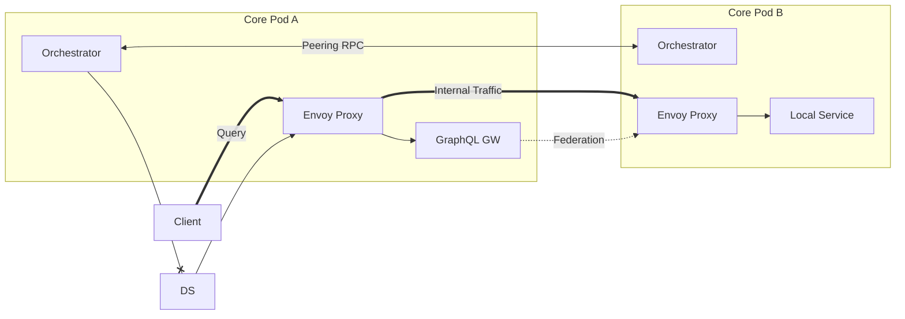
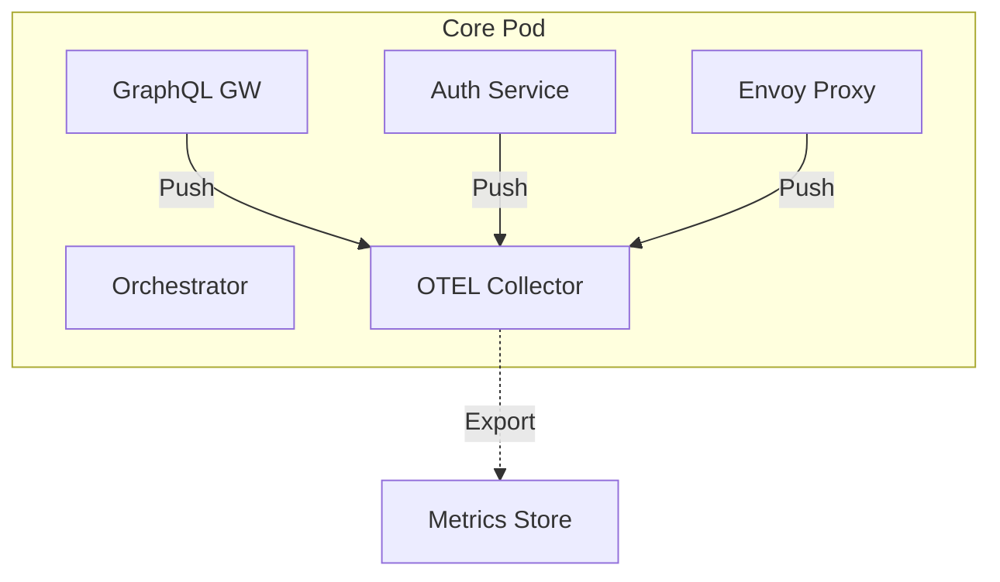
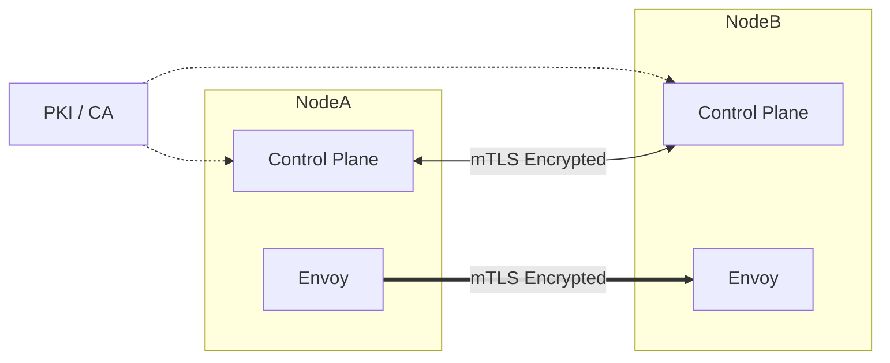

# Catalyst Node Implementation Milestones

This document outlines the step-by-step implementation strategy for **Catalyst Node**, consolidated from the architectural vision and the roll-out strategy.

> **Note on Configuration**: For all phases below, configuration is considered **a priori** (static at startup). We must verify that the node can be fully configured via both **JSON config file** and **CLI arguments/flags**. Dynamic configuration is out of scope for these initial phases.

## Feature Crosswalk (Legacy vs New)

This table maps legacy `catalyst` capabilities to the specific Milestone that delivers them in `catalyst-node`.

| Legacy Capability | New Objective | Fulfillment Milestone |
| :--- | :--- | :--- |
| **Organization** | **Organization** (Root Tenant) | **Milestone 0** (Single Gateway) |
| **Data Channel** | **Service in Mesh** | **Milestone 0** (Local) & **Milestone 1** (Internal Peering) |
| **Token Minting** | **Identity / Token Issue** | **Milestone 1** (Internal Trust) |
| **Partnership** | **Peering** | **Milestone 2** (External Trust) |
| **Access Control** | **Policy Layer** | **Milestone 3** (Advanced Policy) |

---

# Milestone 0: Single Gateway

### Feature Fulfillment (Crosswalk)
*   **Legacy: Organization**: Establishes the Organization boundary.
*   **Legacy: Data Channel**: Establishes local services as "Data Channels".

## Subphase 1: GraphQL Gateway (RPC Config)
**Goal**: A standalone GraphQL Gateway container that can be configured via RPC.
### Implementation Goals
*   **Container**: TypeScript container running GraphQL Yoga.
*   **RPC Server**: Implement RPC mechanism to receive configuration (schemas, services).
*   **Config Loop**: Gateway applies config changes without restart.

## Subphase 2: Orchestrator (RPC for GraphQL)
**Goal**: The Control Plane (Orchestrator) manages the GraphQL Gateway.
### Implementation Goals
*   **Orchestrator**: Node.js process acting as the control plane.
*   **RPC Client**: Connects to the GraphQL Gateway sidecar.
*   **Config Loading**: Load identifying config (ports, etc) and push to Gateway.
*   **CLI**: Implement command to generate API Keys for access to backed services.

## Subphase 3: Orchestrator (xDS for Envoy)
**Goal**: Orchestrator configures the Data Plane (Envoy) dynamically.
### Implementation Goals
*   **xDS Server**: Implement a minimal xDS server (ADS/LDS/CDS/RDS) in the Orchestrator.
*   **Envoy Boot**: Envoy starts with dynamic configuration pointing to Orchestrator.
*   **Route Sync**: Orchestrator pushes routes to Envoy.

## Subphase 4: Example GraphQL Services
**Goal**: Verify federation with actual services.
### Implementation Goals
*   **Service A & B**: Two simple GraphQL services (e.g., Products, Reviews).
*   **Registration**: Services register with the Orchestrator (or are statically defined in Orchestrator config for M0).

## Subphase 5: Client Connection (End-to-End)
**Goal**: Full verification of the request path.
### Implementation Goals
*   **Path**: Client -> Envoy -> GraphQL Gateway -> Service A/B.
*   **Verification**: Query succeeds.

### Architecture Reference (Stage 1A)
```
┌──────────────────────────────────────────────────────────────────────────────┐
│                 STAGE 1A: CORE POD ARCHITECTURE (Milestone 0)                │
│                                                                              │
│                                                   ┌─────────────────┐        │
│                                                   │     CLIENT      │        │
│                                                   └────────┬────────┘        │
│                                                            │ HTTPS           │
│  ┌─────────────────────────────────────────────────────────┼──────────────┐  │
│  │                           CATALYST CORE POD             ▼              │  │
│  │                                                                        │  │
│  │   ┌─────────────┐       xDS       ┌────────────────────────────────┐   │  │
│  │   │ Orchestrator│────────────────►│          Envoy Proxy           │   │  │
│  │   │ (Node.js)   │                 │          (Data Plane)          │   │  │
│  │   └──────┬──────┘                 └───────────────┬────────────────┘   │  │
│  │          │                                        │ TCP                │  │
│  │          │RPC                                     │ Proxy              │  │
│  │          ├───(Config)─────┐                       │                    │  │
│  │          ▼ (Signer)       ▼                       ▼                    │  │
│  │   ┌─────────────┐   ┌─────────────┐                                    │  │
│  │   │ Auth Service│   │ GraphQL GW  │                                    │  │
│  │   │ (Sidecar)   │   │ (Sidecar)   │                                    │  │
│  │   └─────────────┘   └──────┬─┬────┘                                    │  │
│  │                            │ │ Federation                              │  │
│  │                   ┌────────┘ └────────┐                                │  │
│  │                   ▼                   ▼                                │  │
│  │            ┌─────────────┐     ┌─────────────┐                         │  │
│  │            │ Example Svc │     │ Example Svc │                         │  │
│  │            │      A      │     │      B      │                         │  │
│  │            └─────────────┘     └─────────────┘                         │  │
│  └────────────────────────────────────────────────────────────────────────┘  │
│                                                                              │
│  PROVIDES:                            DOES NOT PROVIDE:                      │
│  ✓ Containerized Isolation            ✗ Node-to-node                         │
│  ✓ xDS Dynamic Config                 ✗ Cross-org trust                      │
│  ✓ Polyglot Sidecars                  ✗ Encrypted transport (beyond TLS)     │
│  ✓ Centralized Auth                   ✗ Network isolation                    │
│                                                                              │
└──────────────────────────────────────────────────────────────────────────────┘
```

---

# Milestone 1: Internal Trust

### Feature Fulfillment (Crosswalk)
*   **Legacy: Data Channel (Routing)**: Enables routing to other (internal) nodes.
*   **Legacy: Token Minting**: Introduces shared identity and token validation.

## Phase 2: Internal Peering (Connectivity Check)
**Goal**: Two nodes exchanging routes for local services to verify the BGP-style plumbing.

> **Note**: Roughly corresponds to checking connectivity before enforcing the trust model of Milestone 1.

### Implementation Goals
*   **Configuration**: Define peers and protocol settings via JSON/CLI.
*   **Peering**: Establish a connection between Node A and Node B.
*   **Route Exchange**: Share routes with `protocol: "graphql"`.
*   **Data Plane**: Envoy routes traffic to the peer's Envoy/Service.
*   **Constraint**: **NO AUTH**. Pure connectivity test.

### Architecture Diagram


## Phase 3: Internal Trust (Shared Auth)
**Goal**: Enforce authentication on the Internal Peering topology using Shared JWKS.

### Implementation Goals
*   **Auth Strategy**: Implement **Strategy 2 (Root Authority)**.
*   **Root Authority**: The first node initialized becomes the **Root CA** for the AS.
*   **Domain**: Root node declares the domain (e.g., `*.catalyst.internal`).
*   **Registration**: New nodes register with Root to receive:
    *   **JWKS**: The keyset for verifying tokens.
    *   **Signing Service Address**: Where to go to sign their own JWTs.
*   **Auth Configuration**: Define a `jwks.json` path via config.
*   **Envoy Filter**: Configure Envoy to validate incoming JWTs against the local JWKS.
*   **Verification**: Requests *without* a valid JWT (signed by the shared key) must be rejected by Envoy.

### Architecture Reference (Stage 1B)
**Trust Model**: Shared JWKS. All gateways sharing the same JWKS verify tokens signed by the same key.

```
┌──────────────────────────────────────────────────────────────────────────────┐
│             STAGE 1B: TWO NODES - INTERNAL TRUST (M1)                        │
│                                                                              │
│                               ┌─────────────────┐                            │
│                               │     CLIENT      │                            │
│                               └────────┬────────┘                            │
│                                        │ HTTPS + JWT                         │
│                                        ▼                                     │
│                                                                              │
│  ┌───────────────────────────────┐        ┌───────────────────────────────┐  │
│  │       CATALYST NODE A         │        │       CATALYST NODE B         │  │
│  │       (Core Pod A)            │        │       (Core Pod B)            │  │
│  │  ┌─────────┐    ┌──────────┐  │        │  ┌─────────┐    ┌──────────┐  │  │
│  │  │ Orch A  │───►│ Envoy A  │  │        │  │ Orch B  │───►│ Envoy B  │  │  │
│  │  └────┬────┘    └────┬─────┘  │        │  └────┬────┘    └────┬─────┘  │  │
│  │       │RPC           │        │        │       │RPC           │        │  │
│  │  ┌────▼────┐    ┌────▼─────┐  │  RPCSign (CP)  │              │        │  │
│  │  │ Auth A  │◄───┼─────────────┼────────────────┤              │        │  │
│  │  └─────────┘    │  GQL A   │  │                │              │        │  │
│  │                 └────┬─────┘  │                │              │        │  │
│  │                      │        │                │              │        │  │
│  │      (Auth           │        │                │     (No Auth │        │  │
│  │      Authority)      ▼        │                │      Service)▼        │  │
│  │                 ┌───────────┐  │        │                ┌───────────┐  │  │
│  │                 │ Federation│◄─┼────────┼───────────────►│ Federation│  │  │
│  │                 └───────────┘  │ HTTPS  │                └───────────┘  │  │
│  │                               │        │                               │  │
│  └───────────────────────────────┘        └───────────────────────────────┘  │
│                                                                              │
│  TRUST MODEL: CENTRALIZED (Option 2)                                         │
│  Node A acts as the Identity Authority. Node B signs tokens via RPC to A.    │
└──────────────────────────────────────────────────────────────────────────────┘
```

---

# Milestone 2: External Trust & Federation

### Feature Fulfillment (Crosswalk)
*   **Legacy: Partnership**: Enables cross-organization connection ("Peering").
*   **Legacy: Token Minting**: Advanced identity infrastructure for cross-org trust.

## Phase 4: External Peering (Cross-Org Routing)
**Goal**: Exchange routes across a logical trust boundary.

### Implementation Goals
*   **Tables**: Separate **Internal** (Trusted) vs **External** (Untrusted) Route Tables.
*   **Policies**: Export/Import policies (JSON/CLI) to control advertisement.
*   **Scenario**: Node A queries Node B. Node B only exposes specific "public" services.

## Phase 5: Edge Routing & VPN
**Goal**: Encrypt the network transport between disjoint organizations using a Tunnel.

### Implementation Goals
*   **Tunneling**: Integrate a VPN provider (e.g., WireGuard) or Tunnel interface.
*   **Routing**: Configure Envoy/OS to route "External" traffic through the Tunnel interface.
*   **Verification**: Traceroute shows traffic passing through the encrypted tunnel.

### Architecture Reference (Cross-Deployment Query Flow)
```
┌──────────────────────────────────────────────────────────────────────────────┐
│            FLOW: Client in A queries service in B via GraphQL                │
│                                                                              │
│  ┌────────────────────────────────────────────────────────────────────────┐  │
│  │                                                                        │  │
│  │  Client (10.1.5.50) in Deployment A                                    │  │
│  │                                                                        │  │
│  │  query {                                                               │  │
│  │    product(sku: "ABC-123") {    ← This service is in Deployment B      │  │
│  │      name                                                              │  │
│  │      stock                                                             │  │
│  │    }                                                                   │  │
│  │  }                                                                     │  │
│  │                                                                        │  │
│  └─────────────────────────────────────┬──────────────────────────────────┘  │
│                                        │                                     │
│                                        │ 1. GraphQL request                  │
│                                        ▼                                     │
│  ┌────────────────────────────────────────────────────────────────────────┐  │
│  │                                                                        │  │
│  │  Control Plane / GraphQL (Deployment A)                                │  │
│  │                                                                        │  │
│  │  2. Query planner sees: product → inventory subgraph                   │  │
│  │  3. Inventory is REMOTE (deploy-b)                                     │  │
│  │  4. Routing mode: PEER (route via B's Catalyst Node)                   │  │
│  │                                                                        │  │
│  └─────────────────────────────────────┬──────────────────────────────────┘  │
│                                        │                                     │
│                                        │ 5. Forward subquery to B's node     │
│                                        ▼                                     │
│  ┌────────────────────────────────────────────────────────────────────────┐  │
│  │                                                                        │  │
│  │  Catalyst Data Plane (Envoy) (Deployment A)                            │  │
│  │                                                                        │  │
│  │  6. Destination: node-b.internal (10.2.0.5)                            │  │
│  │  7. Route lookup: 10.2.0.0/16 → via edge router                        │  │
│  │                                                                        │  │
│  └─────────────────────────────────────┬──────────────────────────────────┘  │
│                                        │                                     │
│                                        │ 8. Packet to 10.2.0.5               │
│                                        ▼                                     │
│  ┌────────────────────────────────────────────────────────────────────────┐  │
│  │                                                                        │  │
│  │  Edge Router (Deployment A)                                            │  │
│  │                                                                        │  │
│  │  9. 10.2.0.0/16 → next-hop        │
│     172.16.2.1 (B's tunnel IP)                                         │  │
│  │  10. Forward via WireGuard interface                                   │  │
│  │                                                                        │  │
│  └─────────────────────────────────────┬──────────────────────────────────┘  │
│                                        │                                     │
│  ════════════════════════════════════════════════════════════════════════    │
│               ENCRYPTED Virtual Private Network (VPN) TUNNEL                 │
│  ════════════════════════════════════════════════════════════════════════    │
│                                        │                                     │
│                                        ▼                                     │
│  ┌────────────────────────────────────────────────────────────────────────┐  │
│  │                                                                        │  │
│  │  Edge Router (Deployment B)                                            │  │
│  │                                                                        │  │
│  │  11. Receive from tunnel, route to 10.2.0.5                            │  │
│  │                                                                        │  │
│  └─────────────────────────────────────┬──────────────────────────────────┘  │
│                                        │                                     │
│                                        ▼                                     │
│  ┌────────────────────────────────────────────────────────────────────────┐  │
│  │                                                                        │  │
│  │  Control Plane / GraphQL (Deployment B) - 10.2.0.5                     │  │
│  │                                                                        │  │
│  │  12. Receive subquery: { product(sku: "ABC-123") { name, stock } }     │  │
│  │  13. Route to local inventory service                                  │  │
│  │                                                                        │  │
│  └─────────────────────────────────────┬──────────────────────────────────┘  │
│                                        │                                     │
│                                        ▼                                     │
│  ┌────────────────────────────────────────────────────────────────────────┐  │
│  │                                                                        │  │
│  │  Inventory Service (Deployment B) - 10.2.3.10                          │  │
│  │                                                                        │  │
│  │  14. Execute query, return: { name: "Widget", stock: 42 }              │  │
│  │                                                                        │  │
│  └─────────────────────────────────────┬──────────────────────────────────┘  │
│                                        │                                     │
│                                        │ 15. Response follows reverse path   │
│                                        ▼                                     │
│                                                                              │
│  Total path: Client → Node (CN)-A → Envoy-A → Router-A → VPN →               │
│              Router-B →                                                      │
│              CN-B → Inventory → (reverse)                                    │
│                                                                              │
└──────────────────────────────────────────────────────────────────────────────┘
```

## Phase 6: Identity Infrastructure & Validation
**Goal**: Build the comprehensive Identity machinery required for complex auth.

> Implementation Deviation: We prefer **Peer JWKS Fetching** over Token Exchange/Minting to allow direct verification.

### Implementation Goals
*   **Minting Service**: Optional capability for a Node to issue tokens for its own Services.
*   **Envoy Token Handlers**: Specialized filters for handling JWTs at the edge.
*   **SDK Update**: Services connecting to the Node receive a "bundle" of Trusted Peer JWKS.

### Architecture Reference (External Trust)
```
┌──────────────────────────────────────────────────────────────────────────────┐
│               STAGE 1C: TWO NODES - EXTERNAL TRUST (M2)                      │
│                                                                              │
│    ORGANIZATION A                              ORGANIZATION B                │
│    ══════════════                              ══════════════                │
│                                                                              │
│  ┌───────────────────────────────┐        ┌───────────────────────────────┐  │
│  │       CATALYST NODE A         │        │       CATALYST NODE B         │  │
│  │         (Org A)               │        │         (Org B)               │  │
│  │                               │        │                               │  │
│  │  ┌─────────────────────────┐  │        │  ┌─────────────────────────┐  │  │
│  │  │       Identity          │  │        │  │       Identity          │  │  │
│  │  │  ┌───────────────────┐  │  │        │  │  ┌───────────────────┐  │  │  │
│  │  │  │ Private Key (A)   │  │  │        │  │  │ Private Key (B)   │  │  │  │
│  │  │  │ Public JWKS (A)   │  │  │        │  │  │ Public JWKS (B)   │  │  │  │
│  │  │  └───────────────────┘  │  │        │  │  └───────────────────┘  │  │  │
│  │  │                         │  │        │  │                         │  │  │
│  │  │  Serves:                │  │        │  │  Serves:                │  │  │
│  │  │  /.well-known/jwks.json │  │        │  │  /.well-known/jwks.json │  │  │
│  │  └─────────────────────────┘  │        │  └─────────────────────────┘  │  │
│  │              │                │        │              │                │  │
│  │  ┌───────────┴─────────────┐  │        │  ┌───────────┴─────────────┐  │  │
│  │  │     Trusted Peers       │  │        │  │     Trusted Peers       │  │  │
│  │  │  ┌───────────────────┐  │  │        │  │  ┌───────────────────┐  │  │  │
│  │  │  │ Peer: org-b-node  │  │  │        │  │  │ Peer: org-a-node  │  │  │  │
│  │  │  │ jwksUrl: B's JWKS │◄─┼──┼────────┼──┼─►│ jwksUrl: A's JWKS │  │  │  │
│  │  │  │ trust: external   │  │  │ Fetch  │  │  │ trust: external   │  │  │  │
│  │  │  └───────────────────┘  │  │ JWKS   │  │  └───────────────────┘  │  │  │
│  │  └─────────────────────────┘  │        │  └─────────────────────────┘  │  │
│  │              │                │        │              │                │  │
│  │  ┌───────────┴─────────────┐  │        │  ┌───────────┴─────────────┐  │  │
│  │  │     Token Exchange      │  │        │  │     Token Validation    │  │  │
│  │  │                         │  │        │  │                         │  │  │
│  │  │  1. Receive user token  │  │        │  │  1. Receive cross-org   │  │  │
│  │  │  2. Validate vs A JWKS  │  │        │  │     token from A        │  │  │
│  │  │  3. Mint NEW token:     │──┼────────┼──│  2. Validate vs A JWKS  │  │  │
│  │  │     - Signed by A       │  │ Cross  │  │     (fetched/cached)    │  │  │
│  │  │     - Audience: org-b   │  │  Org   │  │  3. Extract claims      │  │  │
│  │  │     - Delegated claims  │  │ Token  │  │  4. Execute query       │  │  │
│  │  │  4. Send to Node B      │  │        │  │                         │  │  │
│  │  └─────────────────────────┘  │        │  └─────────────────────────┘  │  │
│  │                               │        │                               │  │
│  └───────────────────────────────┘        └───────────────────────────────┘  │
│                                                                              │
│  ┌────────────────────────────────────────────────────────────────────────┐  │
│  │  TOKEN EXCHANGE FLOW                                                   │  │
│  │                                                                        │  │
│  │  ┌─────────┐      ┌─────────────┐      ┌─────────────┐    ┌─────────┐  │  │
│  │  │  User   │      │Catalyst Node│      │Catalyst Node│    │ Service │  │  │
│  │  │         │      │     A       │      │     B       │    │         │  │  │
│  │  └────┬────┘      └──────┬──────┘      └──────┬──────┘    └────┬────┘  │  │
│  │       │                  │                    │                │       │  │
│  │       │ 1. Query +       │                    │                │       │  │
│  │       │    User Token    │                    │                │       │  │
│  │       │─────────────────►│                    │                │       │  │
│  │       │                  │                    │                │       │  │
│  │       │                  │ 2. Validate token  │                │       │  │
│  │       │                  │    vs Org A JWKS   │                │       │  │
│  │       │                  │                    │                │       │  │
│  │       │                  │ 3. Mint cross-org  │                │       │  │
│  │       │                  │    token (signed   │                │       │  │
│  │       │                  │    by Org A key)   │                │       │  │
│  │       │                  │                    │                │       │  │
│  │       │                  │ 4. Forward query + │                │       │  │
│  │       │                  │    cross-org token │                │       │  │
│  │       │                  │───────────────────►│                │       │  │
│  │       │                  │                    │                │       │  │
│  │       │                  │                    │ 5. Fetch Org A │       │  │
│  │       │                  │                    │    JWKS        │       │  │
│  │       │                  │                    │                │       │  │
│  │       │                  │                    │ 6. Validate    │       │  │
│  │       │                  │                    │    cross-org   │       │  │
│  │       │                  │                    │    token       │       │  │
│  │       │                  │                    │                │       │  │
│  │       │                  │                    │ 7. Execute     │       │  │
│  │       │                  │                    │───────────────►│       │  │
│  │       │                  │                    │                │       │  │
│  │       │                  │                    │◄───────────────│       │  │
│  │       │                  │◄───────────────────│ 8. Response    │       │  │
│  │       │◄─────────────────│ 9. Combined        │                │       │  │
│  │       │                  │    response        │                │       │  │
│  │                                                                        │  │
│  └────────────────────────────────────────────────────────────────────────┘  │
│                                                                              │
│  CROSS-ORG TOKEN STRUCTURE:                                                  │
│  ┌────────────────────────────────────────────────────────────────────────┐  │
│  │  {                                                                     │  │
│  │    "iss": "org-a-node",               // Issuer: Org A                  │  │
│  │    "aud": "org-b-node",               // Audience: Org B                │  │
│  │    "sub": "user@org-a.com",          // Original user                  │  │
│  │    "iat": 1704067200,                // Issued at                      │  │
│  │    "exp": 1704067500,                // Short expiry (5 min)           │  │
│  │    "delegated_claims": {             // What user can access           │  │
│  │      "channels": ["partner-data"],                                     │  │
│  │      "actions": ["query"]                                              │  │
│  │    }                                                                   │  │
│  │  }                                                                     │  │
│  │  // Signed with Org A's private key                                    │  │
│  │  // Verified with Org A's public JWKS                                  │  │
│  └────────────────────────────────────────────────────────────────────────┘  │
│                                                                              │
│  PROVIDES:                          DOES NOT PROVIDE:                        │
│  ✓ Cross-org authentication         ✗ Network-layer encryption               │
│  ✓ Separate key material            ✗ Network isolation                      │
│  ✓ Delegated trust                  ✗ Layer 7 (L7) resilience (retries, etc) │
│  ✓ JWKS federation                  ✗ mutual TLS (mTLS) between all services │
│  ✓ Customer-controlled crypto                                                │
│                                                                              │
└──────────────────────────────────────────────────────────────────────────────┘
```

---

# Milestone 3: Advanced Policy & Operations

### Feature Fulfillment (Crosswalk)
*   **Legacy: Access Control**: Granular Policy enforcement (Online & Offline).
*   **Legacy: Audit Logs**: (Gap) Partially covered by Phase 9 Observability.

## Phase 7: Online Policy Management
**Goal**: Dynamic policy enforcement while connected.

### Implementation Goals
*   **Policy Engine**: Basic logic to Allow/Deny requests based on attributes (Principal, Resource, Action).
*   **Config**: Load Policy Rules from JSON/CLI.
*   **Enforcement Point**: Envoy ExtAuthz or Internal Middleware checks policy before routing.

## Phase 8: Offline Policy Enforcement
**Goal**: Durable policy enforcement resilient to network partitions.

### Implementation Goals
*   **Bundles**: Signed Policy Bundles (containing rules + expiry).
*   **Caching**: Node caches the bundle.
*   **Offline Mode**: If Control Plane is unreachable, Node enforces using the cached bundle (respecting grace periods).
*   **Crypto**: Validate signature of the bundle (ensure it wasn't tampered with).

### Architecture Reference (Offline Mode)
```
┌──────────────────────────────────────────────────────────────────────────────┐
│                   OFFLINE POLICY ENFORCEMENT                                 │
│                                                                              │
│  ┌────────────────────────────────────────────────────────────────────────┐  │
│  │                          CONTROL PLANE                                 │  │
│  │                        (when connected)                                │  │
│  │                                                                        │  │
│  │  ┌─────────────────┐    ┌─────────────────┐    ┌─────────────────┐     │  │
│  │  │  Policy Admin   │───►│  Policy Signer  │───►│  Distribution   │     │  │
│  │  │                 │    │  (CP Private    │    │                 │     │  │
│  │  │  - Define rules │    │   Key)          │    │  - Push to Nodes│     │  │
│  │  │  - Set expiry   │    │                 │    │  - Track vers.  │     │  │
│  │  └─────────────────┘    └─────────────────┘    └────────┬────────┘     │  │
│  │                                                         │              │  │
│  └─────────────────────────────────────────────────────────┼──────────────┘  │
│                                                            │                 │
│                            Signed Policy Bundle            │                 │
│                            (when connected)                │                 │
│                                                            ▼                 │
│  ┌────────────────────────────────────────────────────────────────────────┐  │
│  │                          CATALYST NODE                                 │  │
│  │                       (operates 'offline')                             │  │
│  │                                                                        │  │
│  │  ┌──────────────────────────────────────────────────────────────────┐  │  │
│  │  │                       POLICY ENGINE                              │  │  │
│  │  │                                                                  │  │  │
│  │  │  ┌──────────────────┐    ┌────────────────────────────────────┐  │  │  │
│  │  │  │  Policy Cache    │    │  Policy Evaluator                  │  │  │  │
│  │  │  │                  │    │                                    │  │  │  │
│  │  │  │  ┌────────────┐  │    │  For each request:                 │  │  │  │
│  │  │  │  │ Bundle v3  │  │───►│  1. Extract principal              │  │  │  │
│  │  │  │  │ Expires:   │  │    │  2. Extract resource               │  │  │  │
│  │  │  │  │ 2024-01-16 │  │    │  3. Match against policies         │  │  │  │
│  │  │  │  │ Signature: │  │    │  4. Return allow/deny              │  │  │  │
│  │  │  │  │ ✓ Valid    │  │    │                                    │  │  │  │
│  │  │  │  └────────────┘  │    │  NO NETWORK CALL REQUIRED          │  │  │  │
│  │  │  │                  │    │                                    │  │  │  │
│  │  │  └──────────────────┘    └────────────────────────────────────┘  │  │  │
│  │  │                                                                  │  │  │
│  │  │  ┌──────────────────┐    ┌────────────────────────────────────┐  │  │  │
│  │  │  │  CP Public Key   │    │  Background Refresh                │  │  │  │
│  │  │  │                  │    │                                    │  │  │  │
│  │  │  │  Used to verify  │    │  When connected:                   │  │  │  │
│  │  │  │  policy bundle   │    │  - Check for new bundle            │  │  │  │
│  │  │  │  signatures      │    │  - Validate signature              │  │  │  │
│  │  │  │                  │    │  - Atomic swap                     │  │  │  │
│  │  │  └──────────────────┘    └────────────────────────────────────┘  │  │  │
│  │  │                                                                  │  │  │
│  │  └──────────────────────────────────────────────────────────────────┘  │  │
│  │                                                                        │  │
│  │  ┌──────────────────────────────────────────────────────────────────┐  │  │
│  │  │                     REQUEST FLOW (OFFLINE)                       │  │  │
│  │  │                                                                  │  │  │
│  │  │  Request ──► JWT Validate ──► Policy Evaluate ──► Execute        │  │  │
│  │  │     │              │                │                │           │  │  │
│  │  │     │              │                │                │           │  │  │
│  │  │     │         Uses cached      Uses cached       Local           │  │  │
│  │  │     │         JWKS             policy bundle     services        │  │  │
│  │  │     │                                                            │  │  │
│  │  │     └─────────────── NO NETWORK CALLS REQUIRED ──────────────────┘  │  │
│  │  │                                                                  │  │  │
│  │  └──────────────────────────────────────────────────────────────────┘  │  │
│  │                                                                        │  │
│  └────────────────────────────────────────────────────────────────────────┘  │
│                                                                              │
│  ┌────────────────────────────────────────────────────────────────────────┐  │
│  │  POLICY BUNDLE STRUCTURE                                               │  │
│  │                                                                        │  │
│  │  {                                                                     │  │
│  │    "version": "3",                                                     │  │
│  │    "issuedAt": 1704067200,                                             │  │
│  │    "expiresAt": 1704153600,        // 24 hours (Time to Live (TTL))    │  │
│  │    "gracePeriod": 3600,            // 1 hour grace after expiry        │  │
│  │    "issuer": "control-plane-prod",                                     │  │
│  │    "policies": [                                                       │  │
│  │      {                                                                 │  │
│  │        "id": "policy-1",                                               │  │
│  │        "effect": "allow",                                              │  │
│  │        "principals": ["org:acme/*"],                                   │  │
│  │        "resources": ["channel:sales-*", "channel:inventory-*"],        │  │
│  │        "actions": ["query"]                                            │  │
│  │      },                                                                │  │
│  │      {                                                                 │  │
│  │        "id": "policy-2",                                               │  │
│  │        "effect": "deny",                                               │  │
│  │        "principals": ["*"],                                            │  │
│  │        "resources": ["channel:admin-*"],                               │  │
│  │        "actions": ["*"]                                                │  │
│  │      }                                                                 │  │
│  │    ],                                                                  │  │
│  │    "signature": "eyJhbGciOiJFUzM4NCIsInR5cCI6IkpXVCJ9..."              │  │
│  │  }                                                                     │  │
│  │  // Signature covers entire bundle, verified with CP public key        │  │
│  └────────────────────────────────────────────────────────────────────────┘  │
│                                                                              │
│  OFFLINE OPERATION MODES:                                                    │
│  ┌────────────────────────────────────────────────────────────────────────┐  │
│  │                                                                        │  │
│  │  CONNECTED        DEGRADED           OFFLINE          EXPIRED          │  │
│  │  ─────────        ────────           ───────          ───────          │  │
│  │                                                                        │  │
│  │  Policy sync      Policy stale       Policy cached    Policy           │  │
│  │  active           but valid          and valid        expired          │  │
│  │                                                                        │  │
│  │  Full             Full               Full             Grace period     │  │
│  │  functionality    functionality      functionality    OR reject all    │  │
│  │                                                                        │  │
│  │  ──────────────────────────────────────────────────────────────────►   │  │
│  │                       Connectivity loss duration                       │  │
│  │                                                                        │  │
│  └────────────────────────────────────────────────────────────────────────┘  │
│                                                                              │
│  PROVIDES:                            DOES NOT PROVIDE:                      │
│  ✓ Disconnected operation             ✗ Real-time policy updates             │
│  ✓ Cryptographic policy proof         ✗ Fine-grained Attribute-Based Access  │
│  ✓ Deterministic enforcement            Control (ABAC)                       │
│  ✓ Grace period handling              ✗ Cross-org policy sync                │
│  ✓ Control plane independence         ✗ Revocation propagation               │
│                                                                              │
└──────────────────────────────────────────────────────────────────────────────┘
```

## Phase 9: Observability & Metrics
**Goal**: Visibility into the control and data planes.

### Implementation Goals
*   **SDK Metrics**: Instrumentation for local services.
*   **Node/Envoy Metrics**: Scrape and expose stats.



## Phase 10: Mutual TLS (mTLS)
**Goal**: Encrypted and authenticated transport layer (Zero Trust).

### Implementation Goals
*   **Configuration**: Paths to certs/keys defined via JSON/CLI.
*   **Control Plane**: mTLS for Capnweb/RPC connections.
*   **Data Plane**: mTLS between Envoys.


