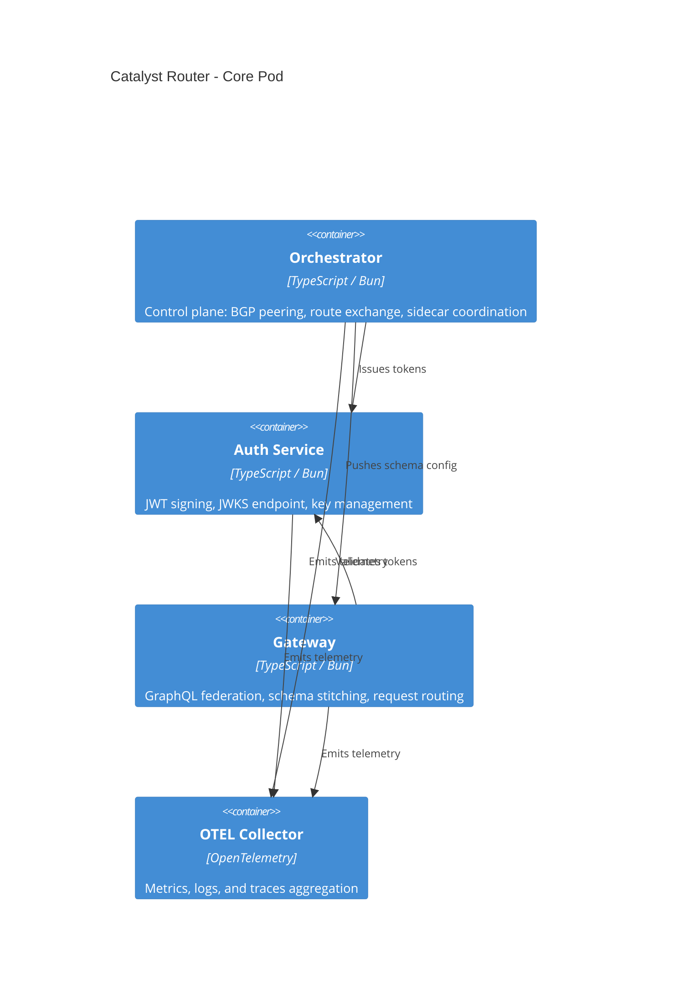

# Catalyst Router

Decentralized L4-7 service routing across trust boundaries


## What is Catalyst Router?

Traditional service meshes like Istio and Linkerd manage traffic within a single cluster or organization. Catalyst Router is built for the spaces between them. It is a distributed control and data plane that bridges organizations, clouds, and disparate fabrics, enabling them to "peer" and offer services to each other in a cloud-native, edge-compatible way.

Modeled after BGP, Catalyst Router brings decentralized routing to Layers 4-7. There is no single control plane to operate or negotiate access through. Instead, each node maintains its own routing table and exchanges routes with its peers, just as autonomous systems do on the internet. This makes it a natural fit for platform engineers building multi-organization service meshes, cross-cloud federations, or edge topologies that span heterogeneous infrastructure.

Unlike centralized approaches, Catalyst Router requires no shared Kubernetes cluster, no central registry, and no mutual trust authority beyond pairwise peering agreements. Organizations retain full sovereignty over what they expose, to whom, and under what policy constraints.

## Key Features

- BGP-inspired peer-to-peer route exchange across trust boundaries
- GraphQL federation gateway with schema stitching
- Cedar policy engine for fine-grained authorization
- Principal-based JWT authentication with Cedar policy authorization
- OpenTelemetry-native observability (logs, metrics, traces)
- Docker-native deployment with Core Pod architecture
- SQLite persistence with zero external database dependencies
- Runs on Bun with a minimal resource footprint

## Project Status

The security architecture is built around three layers of defense-in-depth, working from the top down:

1. **Cedar policy authorization** -- Fine-grained, declarative access control with typed principals and actions. Fully implemented.
2. **Certificate-bound access tokens** -- JWTs bound to client TLS certificates ([RFC 8705](https://datatracker.ietf.org/doc/html/rfc8705)), preventing token theft and replay. Data model implemented; enforcement in progress.
3. **Mutual TLS (mTLS)** -- Transport-layer identity verification and encryption. Planned.

Cedar policies are the authorization backbone today. Certificate-bound tokens and mTLS will complete the identity and transport layers, giving each peering session cryptographic proof of both _who_ is calling and _what they're allowed to do_.

### Implemented

- **Cedar policy engine** for fine-grained authorization (5 principals, 13 actions)
- **JWT authentication** (ES384 signing, JWKS distribution, token revocation via SQLite)
- **Certificate-bound token data model** (ADR-0007 -- `cnf.x5t#S256` claim minted and stored)
- BGP-inspired peer-to-peer route exchange (iBGP within an AS)
- GraphQL federation gateway with dynamic schema stitching
- Capnweb RPC for all inter-component communication
- OpenTelemetry observability (logs, metrics, traces via OTLP)
- SQLite persistence (key store, token store) with WAL mode
- V2 dispatch pattern (handleAction / handleNotify)
- CLI for node management (peers, routes, tokens)

### Planned

- **mTLS** for transport security (all connections currently use plaintext WebSocket)
- **Certificate-bound token enforcement** (requires mTLS to extract client cert thumbprint for binding verification)
- External BGP (eBGP) for cross-AS peering
- Envoy proxy integration for L4 data plane routing (xDS configuration)
- Route origin signing and PKI-based route validation
- Production observability backends (currently exports to debug exporter)

## Architecture Overview

Each Catalyst Router node runs as a **Core Pod** -- a set of cooperating containers that together form a complete routing unit:



The Orchestrator is the brain of the pod -- it manages peering sessions, computes routes, and coordinates the Auth and Gateway sidecars. All components emit telemetry to the OTEL Collector.

See [[overview|Architecture]] for the full design.

## Quick Start

### Prerequisites

- [Bun](https://bun.sh) >= 1.1
- [Docker](https://www.docker.com/) (for compose deployments)

### Install

```bash
bun install
```

### Run a single-node example

```bash
docker compose -f docker-compose/example.m0p2.compose.yaml up
```

### Run tests

```bash
bun test
```

## Repository Structure

| Directory                | Package                          | Description                                    |
| :----------------------- | :------------------------------- | :--------------------------------------------- |
| `apps/auth`              | `@catalyst/auth-service`         | JWT signing, JWKS, key management              |
| `apps/cli`               | `@catalyst/cli`                  | Command-line interface for node management     |
| `apps/gateway`           | `@catalyst/gateway-service`      | GraphQL federation gateway                     |
| `apps/node`              | `@catalyst/node-service`         | Composite node entrypoint                      |
| `apps/orchestrator`      | `@catalyst/orchestrator-service` | Control plane: peering, routing, coordination  |
| `packages/authorization` | `@catalyst/authorization`        | Cedar policy engine integration                |
| `packages/config`        | `@catalyst/config`               | Shared configuration schemas and loaders       |
| `packages/routing`       | `@catalyst/routing`              | Route table, path computation, exchange        |
| `packages/sdk`           | `@catalyst/sdk`                  | Client SDK for interacting with Catalyst nodes |
| `packages/service`       | `@catalyst/service`              | Base service class with built-in telemetry     |
| `packages/telemetry`     | `@catalyst/telemetry`            | OpenTelemetry setup and instrumentation        |
| `packages/types`         | `@catalyst/types`                | Shared TypeScript type definitions             |
| `examples/books-api`     | --                               | Example federated subgraph                     |
| `examples/movies-api`    | --                               | Example federated subgraph                     |
| `examples/orders-api`    | --                               | Example federated subgraph                     |
| `examples/product-api`   | --                               | Example federated subgraph                     |

## Documentation

- [[overview|Architecture]] -- system design and component interactions
- [[constitution|Constitution]] -- architectural principles and constraints
- [[SECURITY|Security]] -- peer security protocol and threat model
- [ADRs](./docs/adr/) -- architecture decision records
- [[cli|CLI Reference]] -- command-line usage and options

## Contributing

See [[CONTRIBUTING|CONTRIBUTING.md]] for development guidelines. All contributors must sign the [[CLA|Contributor License Agreement]].

This project uses [Graphite](https://graphite.dev) for stacked PRs and follows [Conventional Commits](https://www.conventionalcommits.org/) for commit messages.

## Security

Catalyst Router uses JWT authentication with Cedar policy-based authorization over Capnweb RPC (WebSocket) for inter-component and node-to-node communication. See [[SECURITY|SECURITY.md]] for the full security protocol.

## License

Source-available under the [Commons Clause + Elastic License 2.0](./LICENSE). See [[LICENSE_HUMAN_READABLE|LICENSE_HUMAN_READABLE.md]] for a plain-language summary.

Licensor: **Orbis Operations LLC**

This software is **not** open source. The Commons Clause restricts commercial use of the software as a hosted or managed service. See the license files for full terms.
