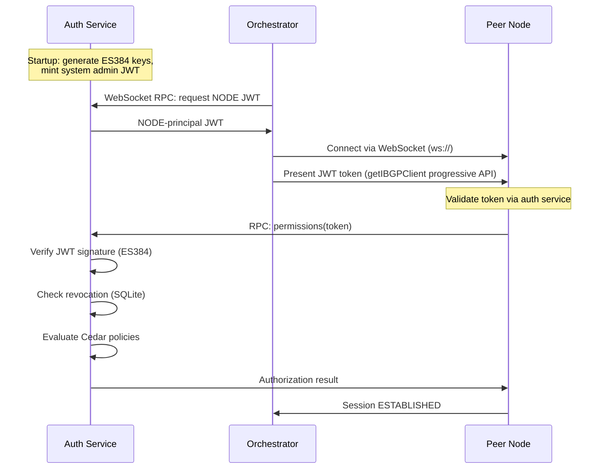
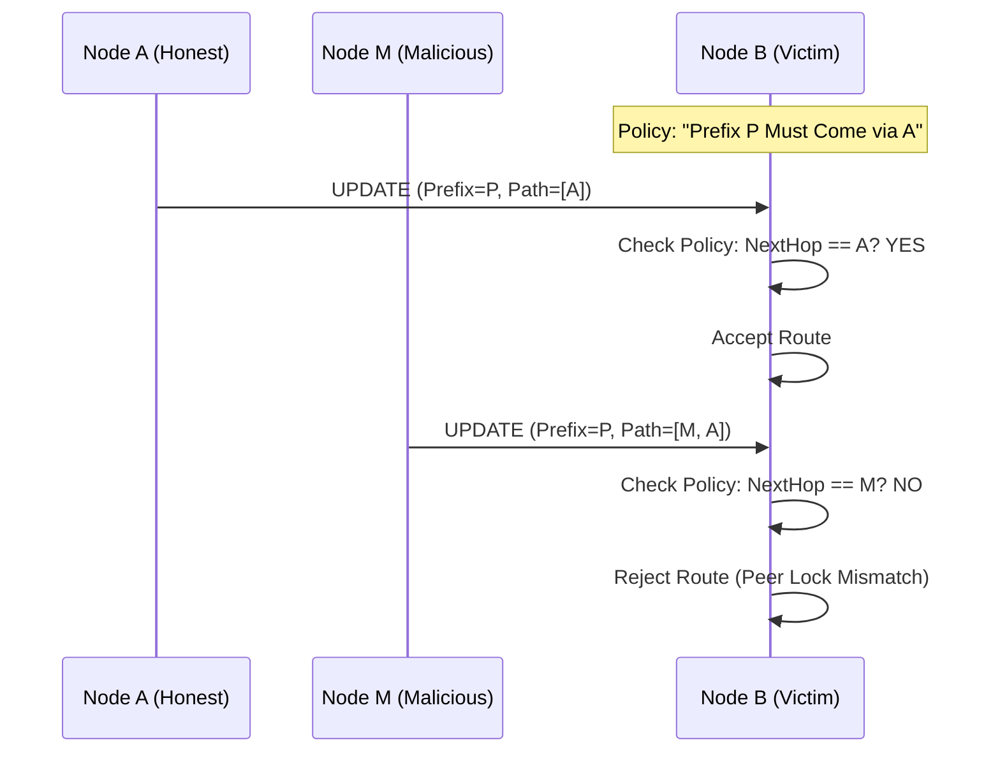
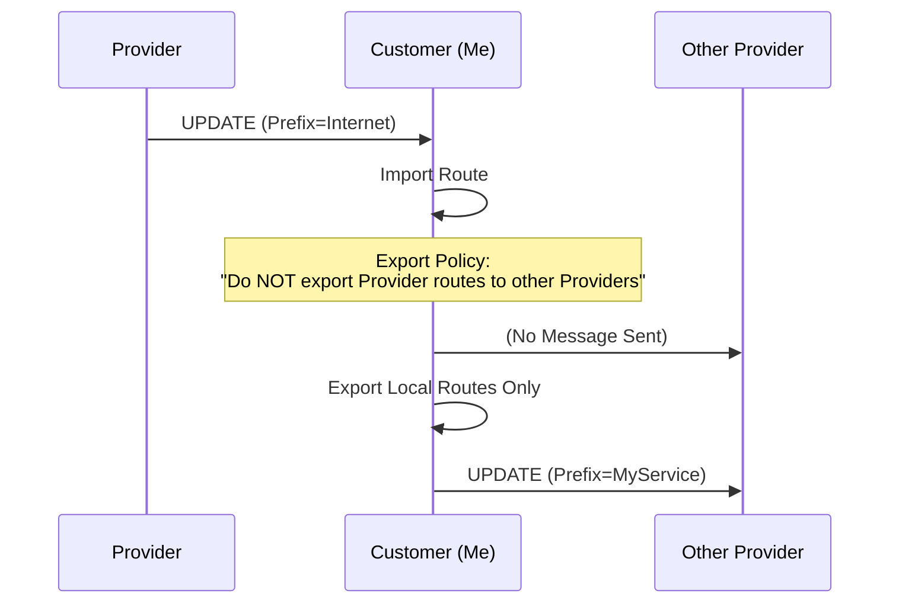
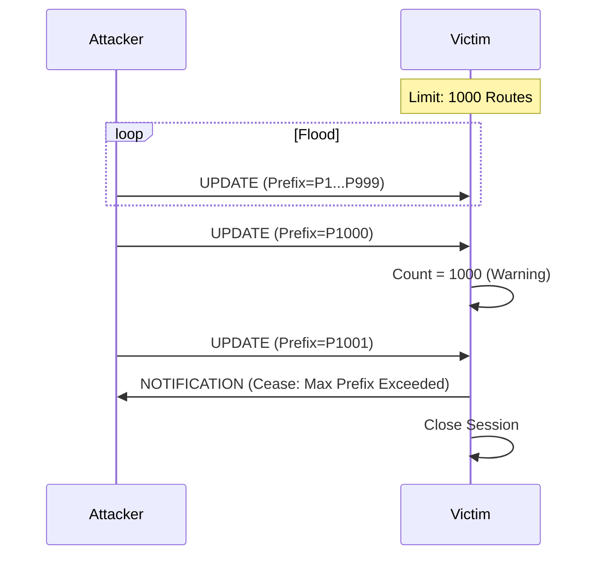
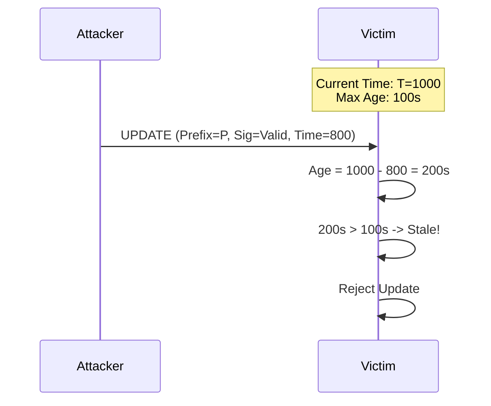

# Catalyst Router Peer Security Protocol

## Overview

Peering security follows a **Defense-in-Depth** architecture with three complementary layers:

| Layer              | Mechanism                                                                                                                     | Status                                          |
| ------------------ | ----------------------------------------------------------------------------------------------------------------------------- | ----------------------------------------------- |
| **Authorization**  | Cedar policy engine -- declarative, fine-grained access control                                                               | Implemented                                     |
| **Authentication** | Certificate-bound JWTs ([RFC 8705](https://datatracker.ietf.org/doc/html/rfc8705)) -- tokens bound to client TLS certificates | Data model implemented; enforcement in progress |
| **Transport**      | Mutual TLS (mTLS) -- encrypted channels with bilateral identity verification                                                  | Planned                                         |

The goal is a system where every peering session provides cryptographic proof of identity (mTLS), tokens that cannot be stolen or replayed (certificate binding), and fine-grained control over what each principal can do (Cedar policies). Today, the Cedar authorization layer is fully operational over JWT-authenticated WebSocket connections. Certificate-bound tokens and mTLS will complete the identity and transport layers.

---

## 1. Current Implementation: JWT Authentication & Cedar Authorization

All peering authentication today is handled at the application layer using JWTs and Cedar policies, served over WebSocket (ws://) connections.

### Auth Service

The **auth service** (`apps/auth`) is the centralized signing and verification authority:

1. On startup, generates an **ES384** key pair (ECDSA with P-384 curve).
2. Mints a system admin JWT for bootstrapping.
3. Exposes a **JWKS endpoint** at `/.well-known/jwks.json` with `Cache-Control` headers.
4. Supports **key rotation**: the JWKS response includes both the current and previous key (grace period) to allow seamless rotation without invalidating in-flight tokens.

### Cedar Policy Engine

Fine-grained authorization is enforced via [Cedar](https://www.cedarpolicy.com/) policies. The system defines **5 principals**:

| Principal        | Description                              |
| ---------------- | ---------------------------------------- |
| `ADMIN`          | Full administrative access               |
| `NODE`           | Standard node identity for peering       |
| `NODE_CUSTODIAN` | Manages node lifecycle and configuration |
| `DATA_CUSTODIAN` | Controls data access and routing policy  |
| `USER`           | End-user / API consumer                  |

Every authorization decision is evaluated against Cedar policies, providing declarative, auditable access control.

### Token Revocation

Token revocation is backed by **SQLite** and checked on every verification call. Revoked tokens are rejected immediately regardless of expiry.

### Peering Auth Flow (Current)

This is the actual authentication flow used today for peer connections:

### JWKS Distribution

The auth service publishes its public keys at `/.well-known/jwks.json`. Peers and services use this endpoint to obtain keys for local JWT signature verification when direct RPC is not available.

---

## 2. Planned: Transport Security (mTLS)

> **Status**: Not implemented. All connections currently use plaintext WebSocket (ws://). There is zero TLS configuration in the codebase today.

The planned design calls for:

- All BGP sessions to run over **TLS 1.3**.
- **Mutual Authentication (mTLS)**: both client and server must present valid certificates signed by a trusted CA (e.g., the internal PKI of the AS).
- The Common Name (CN) or SAN in the certificate must match the `BGP Identifier` (Node ID).

When implemented, the connection flow would become:

1. **Transport Connection**: TCP -> TLS Handshake (mTLS).
   - If certs are invalid, connection is dropped immediately.
2. **Application-layer auth**: JWT validation (as described in Section 1) proceeds over the secured transport.

---

## 3. Planned: Pre-Shared Key (PSK) Authentication

> **Status**: Not implemented. The `OPEN` message schema includes a `psk` type field, but it is vestigial -- no PSK validation or secret lookup is performed.

The planned design calls for:

- **Field**: `psk` (optional) in `OPEN` message containing a Key ID.
- **Verification**: The receiver would look up the shared secret associated with the Key ID and verify the message using this secret.

---

## 4. Planned: Certificate-Bound Tokens (ADR-0007)

> **Status**: Data model exists (the `cnf.x5t#S256` claim is stored in the JWT schema), but enforcement is not possible until mTLS is implemented. Without TLS, there is no client certificate to bind against.

ADR-0007 proposes binding JWTs to specific client certificates via the `cnf` (confirmation) claim. When mTLS is implemented, the auth service would:

1. Include a `cnf.x5t#S256` claim in minted JWTs, containing the SHA-256 thumbprint of the client's X.509 certificate.
2. On token verification, compare the `cnf` claim against the certificate presented in the TLS handshake.
3. Reject tokens presented from a different TLS session than they were bound to, preventing token theft/replay across connections.

---

## 5. Planned: Route Origin Security (PKI & Route Signing)

> **Status**: Not implemented. This section describes the planned design for route integrity.

To mitigate BGP hijacking and route spoofing, the planned design includes a PKI-based Route Origin Authorization mechanism. This ensures that only authorized nodes can announce services for a given Autonomous System.

### Key Infrastructure (PKI)

1. **Root Authority (Root Node)**:
   - The first node in an Autonomous System (AS) initializes as the **Root Authority**.
   - It generates the **Root CA Certificate** and Private Key.
   - It defines the **Root Domain** (e.g., `*.example.internal`).
   - _Future_: Users can supply their own Root CA material.

2. **Node Registration & Hierarchical Trust**:
   - New nodes MUST register with the Root Node to join the mesh.
   - **Response Payload**: The Root Node responds with:
     - `jwks`: The current public key set for validation.
     - `signing_service`: The address (URL) of the node responsible for signing JWTs (initially the Root Node itself, later a distributed service).
     - `ca_cert`: The public CA certificate for verifying mTLS.

3. **Node Keys**:
   - As **Internal Peers** come online, they generate a specific private/public key pair for route signing.
   - The **Root Peer** signs these public keys, establishing a chain of trust.
   - Each internal peer AS effectively maintains a CA infrastructure anchored by the Root Peer.

### Route Signing & Propagation

1. **Signing**: As services come online, the hosting node creates a service record and **signs the route payload** (NLRI + Attributes) using its private key.
2. **Propagation**: The signed route payload is sent to peers in the `UPDATE` message.
3. **Validation**:
   - As routes propagate to other **Internal and External Nodes**, the signature is validated against the Origin AS's trusted CA/keys.
   - If an external AS tries to register or propagate a collision for the same prefix, it will fail to produce a valid signature corresponding to the original AS.
   - **Rejection**: Peers receiving routes with invalid or missing signatures for a protected AS will reject the update efficiently, preventing hijacking.

---

## 6. JWT Signing Strategies

The architecture supports multiple models for identity and JWT signing. **Strategy 2 (Auth Service as Root Authority)** is the current implementation.

### Strategy 2: Auth Service as Root Authority (Current)

**Mechanism**:

- The **auth service** acts as the centralized Signing Authority using **ES384** (ECDSA with P-384 curve).
- It holds the private key and mints all JWTs.
- Other services (orchestrator, nodes) obtain tokens by calling the auth service via WebSocket RPC.
- Key rotation is supported: the JWKS endpoint serves both the current and previous key during a grace period.
- **Pros**: Simple key management, single source of truth, SQLite-backed revocation.
- **Cons**: Auth service is a single point of failure for signing (but not validation, as JWKS is cached).

---

### Future / Alternative Strategies

#### Strategy 1: External Signing (OIDC / OAuth2)

**Mechanism**:

- An external Identity Provider (IdP) or dedicated signing service handles all key operations.
- The Catalyst Router is configured with a `jwks_uri` pointing to this external service.
- **Use Case**: Integrating with existing corporate SSO (Okta, Auth0) or Cloud KMS.

#### Strategy 3: Distributed PKI (Mesh Identity)

**Mechanism**:

- Each Node generates its own Key Pair.
- The Node's Certificate is signed by the AS Root CA (during registration).
- **Minting**: Any authorized node can mint JWTs for the AS, signed with its _own_ private key.
- **Validation**: Peers validate the JWT signature against the Node's public key, and verify the Node's Cert chain against the Root CA.
- **Pros**: No SPOF, high availability, effectively "Mesh Identity".

---

## 7. Known Vulnerabilities & Roadmap

While the above measures (both current and planned) mitigate the most critical risks, standard BGP vulnerabilities still apply. We are tracking the following for future mitigation:

### A. AS Path Manipulation

- **Risk**: A compromised or malicious peer could modify the `AS_PATH` attribute (e.g., shortening it) to attract traffic through itself, even if the Origin is valid.
- **Mitigation (Planned)**:
  - **Peer Locking**: Static configuration of expected next-hops for critical prefixes.
  - **Path Validation**: Future extension of the signing mechanism to include Path Signatures (similar to BGPsec).

### B. Route Leaks

- **Risk**: An AS might accidentally re-advertise routes learned from one provider to another, becoming an unintended transit node.
- **Mitigation**:
  - **Export Policies**: All nodes MUST implement strict Export Filters (e.g., "Only export local routes to upstream", "Don't export upstream routes to other upstreams").

### C. Resource Exhaustion

- **Risk**: A peer could flood the session with valid but excessive routes, causing memory exhaustion (OOM).
- **Mitigation**:
  - **Max-Prefix Limits**: Sessions will be configured with a maximum number of accepted routes (e.g., 1000). If this limit is exceeded, the session is dropped with a `NOTIFICATION`.

### D. Replay Attacks

- **Risk**: An attacker could capture a valid signed `UPDATE` message and replay it later to confuse routing state.
- **Mitigation**:
  - **Timestamps**: The signed payload includes a creation timestamp. Routes older than a configurable window (e.g., 24h) are considered stale and rejected, forcing a refresh.

