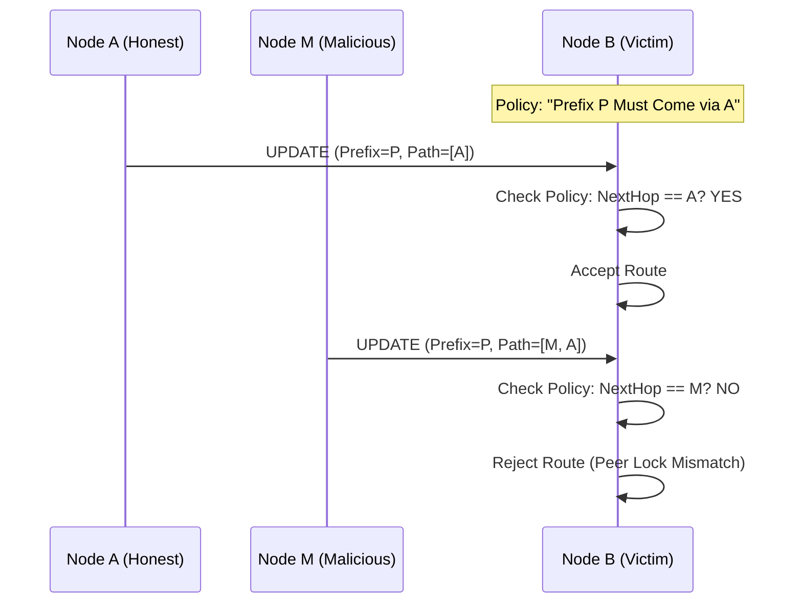
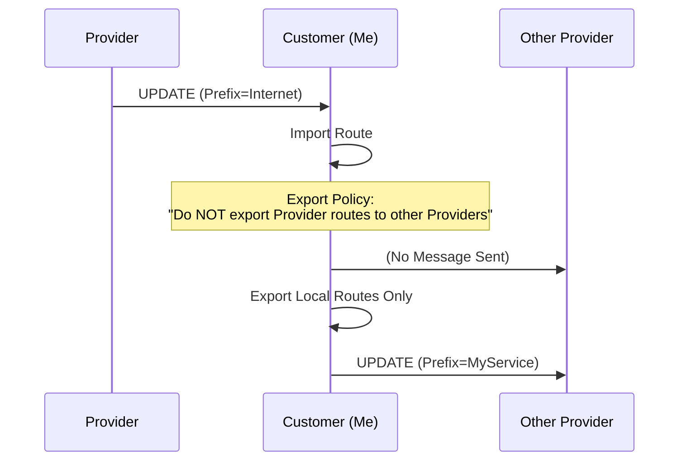
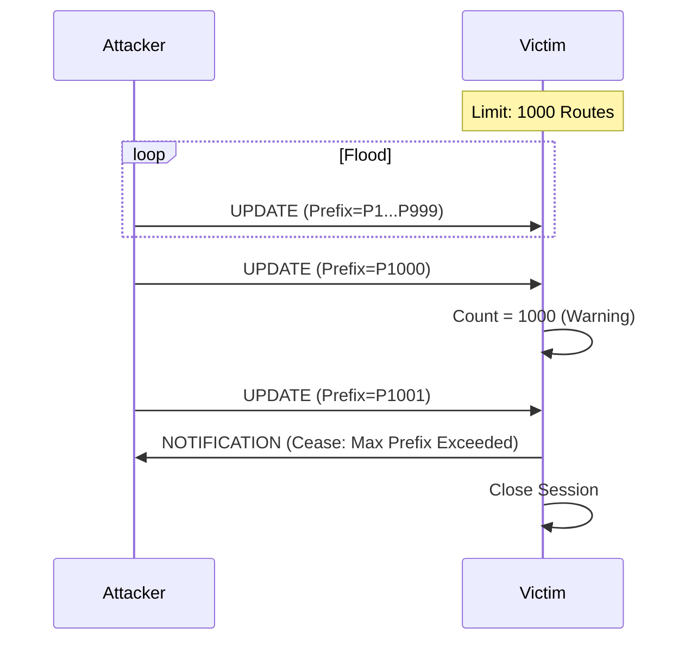
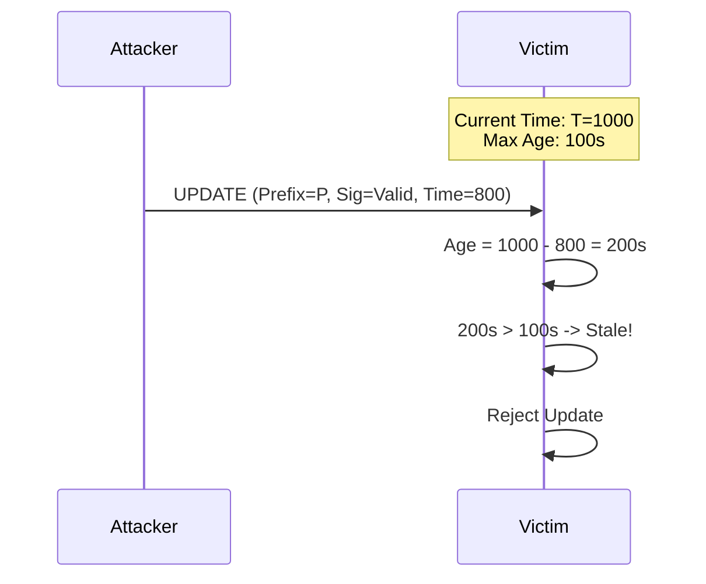

# Catalyst Node Peer Security Protocol

## Overview

Peering security uses a Defense-in-Depth approach, layering Transport Security (mTLS) with Application-Layer Authentication (PSK/JWKS) during the **Open Negotiation** phase.

## 1. Transport Security (mTLS)

**Requirement**: Mandatory for all connections.
- All BGP sessions MUST run over TLS 1.3.
- Mutual Authentication (mTLS) is required: both client and server must present valid certificates signed by a trusted CA (e.g., the internal PKI of the AS).
- The Common Name (CN) or SAN in the certificate must match the `BGP Identifier` (Node ID).

## 2. Peering Authentication

Verified during the exchange of the `OPEN` message.

### Pre-Shared Key (PSK)
- **Field**: `psk` (optional) in `OPEN` message.
- **Usage**: Contains the Key ID.
- **Verification**: The receiver looks up the shared secret associated with the Key ID. The message framing (or TLS exporter) is verified using this secret to ensure the peer possesses it.

### JSON Web Key Set (JWKS)
- **Field**: `jwks` (optional) in `OPEN` message.
- **Usage**: Contains the public keys (`{ keys: [...] }`) of the sending AS.
- **Verification**:
    - Allows the receiver to dynamically learn the peer's public keys.
    - Subsequent messages (or the OPEN message itself via a detached signature) can be verified against these keys.
    - Useful for **External Peerings** (eBGP) where a shared PKI might not exist.

## Open Negotiation Flow

1.  **Transport Connection**: TCP -> TLS Handshake (mTLS).
    - If certs are invalid, connection is dropped immediately.

2.  **Initiator** sends `OPEN`:
    ```json
    {
      "type": "OPEN",
      "version": 1,
      "myAsn": 65001,
      "bgpIdentifier": "node-01.dc01",
      "holdTime": 180,
      "psk": "key-id-123",
      "jwks": { "keys": [...] }
    }
    ```

3.  **Receiver** validates:
    - **mTLS Identity**: Check certificate CN matches `bgpIdentifier`.
    - **PSK/JWKS**: If provided, validate Key ID or import Keys.
    - **Policy**: Check if ASN 65001 is a permitted peer.

4.  **Receiver** responds with `OPEN`:
    - Session enters `ESTABLISHED` state.
    - `KEEPALIVE` messages begin.

## 3. Route Origin Security (PKI & Route Signing)

To mitigate BGP hijacking and route spoofing, we implement a PKI-based Route Origin Authorization mechanism. This ensures that only authorized nodes can announce services for a given Autonomous System.

### Key Infrastructure (PKI)
1.  **Root Authority**: The Root Peer (or Internal AS) operates a Certificate Authority (CA).
2.  **Node Keys**:
    - As **Internal Peers** come online, they generate a specific private/public key pair for route signing.
    - The **Root Peer** signs these public keys, establishing a chain of trust.
    - Each internal peer AS effectively maintains a CA infrastructure anchored by the Root Peer.

### Route Signing & Propagation
1.  **Signing**: As services come online, the hosting node creates a service record and **signs the route payload** (NLRI + Attributes) using its private key.
2.  **Propagation**: The signed route payload is sent to peers in the `UPDATE` message.
3.  **Validation**:
    - As routes propagate to other **Internal and External Nodes**, the signature is validated against the Origin AS's trusted CA/keys.
    - If an external AS tries to register or propagate a collision for the same prefix, it will fail to produce a valid signature corresponding to the original AS.
    - **Rejection**: Peers receiving routes with invalid or missing signatures for a protected AS will reject the update efficiently, preventing hijacking.
    - **Rejection**: Peers receiving routes with invalid or missing signatures for a protected AS will reject the update efficiently, preventing hijacking.

## 4. Known Vulnerabilities & Roadmap

While the above measures mitigate the most critical risks, standard BGP vulnerabilities still apply. We are tracking the following for future mitigation:

### A. AS Path Manipulation
- **Risk**: A compromised or malicious peer could modify the `AS_PATH` attribute (e.g., shortening it) to attract traffic through itself, even if the Origin is valid.
- **Mitigation (Planned)**:
    - **Peer Locking**: Static configuration of expected next-hops for critical prefixes.
    - **Path Validation**: Future extension of the signing mechanism to include Path Signatures (similar to BGPsec).



### B. Route Leaks
- **Risk**: An AS might accidentally re-advertise routes learned from one provider to another, becoming an unintended transit node.
- **Mitigation**:
    - **Export Policies**: All nodes MUST implement strict Export Filters (e.g., "Only export local routes to upstream", "Don't export upstream routes to other upstreams").



### C. Resource Exhaustion
- **Risk**: A peer could flood the session with valid but excessive routes, causing memory exhaustion (OOM).
- **Mitigation**:
    - **Max-Prefix Limits**: Sessions will be configured with a maximum number of accepted routes (e.g., 1000). If this limit is exceeded, the session is dropped with a `NOTIFICATION`.



### D. Replay Attacks
- **Risk**: An attacker could capture a valid signed `UPDATE` message and replay it later to confusing routing state.
- **Mitigation**:
    - **Timestamps**: The signed payload includes a creation timestamp. Routes older than a configurable window (e.g., 24h) are considered stale and rejected, forcing a refresh.


