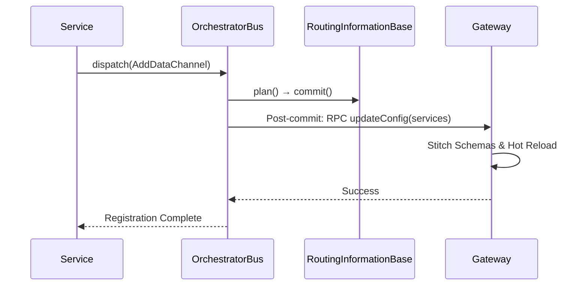
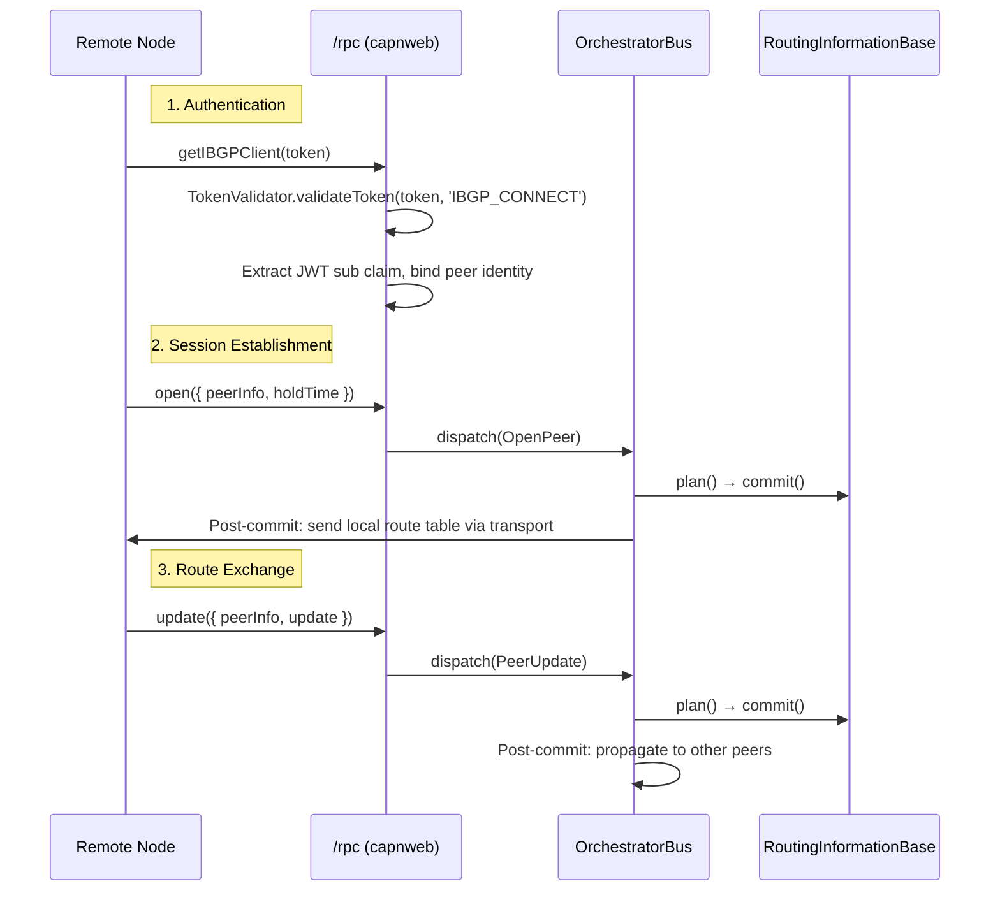
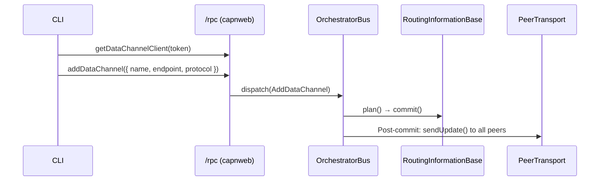

# @catalyst/orchestrator

The **Catalyst Orchestrator** is the central control plane for the Catalyst network. It manages the lifecycle of services, handles configuration updates via RPC, and orchestrates the stitching of GraphQL schemas across the federation.

## ⚙️ Configuration

The orchestrator is configured via environment variables. For a full list of available options, see the [Centralized Configuration Documentation](../config/README.md).

## Dispatch Architecture

The v2 orchestrator uses a deterministic **dispatch → plan → commit → post-commit** cycle instead of a plugin pipeline. All state transitions are processed through a `RoutingInformationBase` (RIB) and serialized via an `ActionQueue`.

### Core Components

- **`OrchestratorBus`** — Serializes actions, delegates to the RIB, and executes async post-commit side effects (transport calls, gateway sync).
- **`RoutingInformationBase`** — Immutable-snapshot state machine. `plan()` is pure and synchronous; `commit()` applies the plan and appends to an action journal.
- **`ActionQueue`** — Ensures actions are processed one at a time to prevent concurrent state mutations.
- **`PeerTransport`** — Abstraction over peer-to-peer communication (`WebSocketPeerTransport` in production, `MockPeerTransport` in tests).
- **`TickManager`** — Drives periodic keepalive dispatch and hold-timer expiration.
- **`ReconnectManager`** — Exponential-backoff retry logic for failed peer connections.

### Action Types

| Action              | Direction | Description                                                   |
| :------------------ | :-------- | :------------------------------------------------------------ |
| `AddPeer`           | Inbound   | Configures a new iBGP peer and initiates connection           |
| `RemovePeer`        | Inbound   | Disconnects and removes a peer                                |
| `OpenPeer`          | Inbound   | Handles incoming iBGP session establishment                   |
| `ClosePeer`         | Inbound   | Handles peer session teardown and route withdrawal            |
| `PeerUpdate`        | In → Out  | Processes inbound route updates and propagates to other peers |
| `AddDataChannel`    | In → Out  | Registers a local service and propagates to peers             |
| `RemoveDataChannel` | In → Out  | Removes a local service and propagates withdrawal             |
| `Tick`              | Internal  | Periodic keepalive and hold-timer expiration checks           |

## 🌐 GraphQL Gateway Integration

One of the primary roles of the Orchestrator is to drive the **GraphQL Gateway**.

### Configuration

The integration requires specific configuration to locate the Gateway's RPC endpoint.

| Config Variable                 | Required | Description                                        | Default                   |
| :------------------------------ | :------- | :------------------------------------------------- | :------------------------ |
| `CATALYST_GQL_GATEWAY_ENDPOINT` | **Yes**  | The WebSocket RPC endpoint of the running Gateway. | `ws://localhost:4000/api` |

### How it Works

1.  **Service Registration**: A data channel is registered via `dispatch(AddDataChannel)`.
2.  **State Update**: The RIB plans and commits the route addition.
3.  **Post-commit Sync**: The bus detects `tcp:graphql` routes in the committed state and pushes a `GatewayConfig` to the Gateway via RPC.



## 🚀 Getting Started

### 1. Configure Environment

Create a `.env` file or export variables:

```bash
export CATALYST_GQL_GATEWAY_ENDPOINT="ws://localhost:4000/api"
```

### 2. Run the Orchestrator

```bash
# In apps/orchestrator
pnpm run dev
```

### 3. Register a Service

Use the Catalyst CLI or an RPC client to register your GraphQL service:

```json
{
  "resource": "dataChannel",
  "action": "create",
  "data": {
    "name": "books",
    "endpoint": "http://books-service:8080/graphql",
    "protocol": "http:graphql" // or 'http:gql'
  }
}
```

## Service Architecture

### RPC Interface

The orchestrator exposes a single `/rpc` WebSocket endpoint via capnweb. All access is gated by JWT-based `TokenValidator` that checks permissions against the auth service.

```typescript
// Public API at /rpc
interface PublicApi {
  getNetworkClient(token: string): NetworkClient | { error: string }
  getDataChannelClient(token: string): DataChannel | { error: string }
  getIBGPClient(token: string): IBGPClient | { error: string }
}
```

### Internal Peering (iBGP) Flow



### Service Registration Flow


