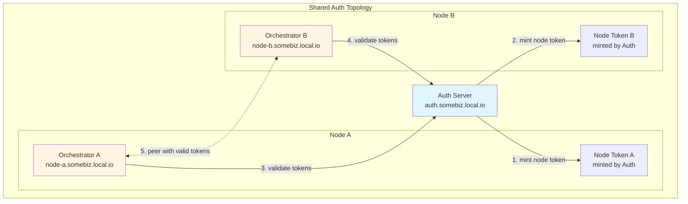
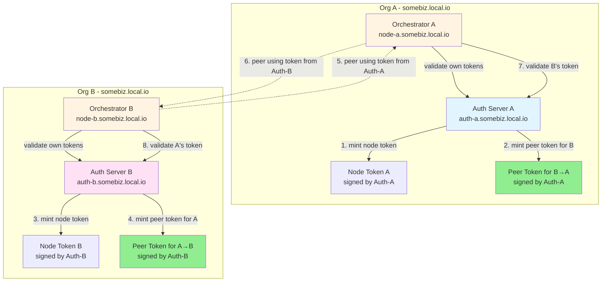

# Peering Test Architecture - Cert-Bound Token Flow

## Scenario 1: Shared Auth (1 Auth Server, 2 Orchestrators)



**Token Flow:**

1. Auth mints `node-token-a` for Orchestrator A
2. Auth mints `node-token-b` for Orchestrator B
3. Both nodes validate tokens via the same Auth server
4. A and B peer using their respective node tokens
5. All tokens signed by same Auth → mutual validation works

**ASCII Diagram:**

```
┌─────────────────────────────────────────────┐
│         Shared Auth Scenario                │
│                                             │
│  ┌──────────┐                               │
│  │  Auth    │ (auth.somebiz.local.io)       │
│  │ Server   │                               │
│  └─────┬────┘                               │
│        │                                    │
│    ┌───┴────┐                               │
│    │        │                               │
│    ▼        ▼                               │
│  ┌──────┐ ┌──────┐                         │
│  │Token │ │Token │                         │
│  │  A   │ │  B   │                         │
│  └───┬──┘ └───┬──┘                         │
│      │        │                             │
│      ▼        ▼                             │
│  ┌────────┐ ┌────────┐                     │
│  │ Orch A │◄─────────►│ Orch B │            │
│  │ node-a │  peering  │ node-b │            │
│  └────────┘           └────────┘            │
│                                             │
│  • Both nodes validate via same Auth       │
│  • Tokens are interchangeable              │
│  • No cross-auth issues                    │
└─────────────────────────────────────────────┘
```

---

## Scenario 2: Separate Auth (2 Auth Servers, 2 Orchestrators)



**Cert-Bound Token Flow:**

1. **Auth-A** mints `node-token-a` for Orchestrator A (local ops)
2. **Auth-A** mints `peer-token-b→a` for Orchestrator B to use when peering with A
3. **Auth-B** mints `node-token-b` for Orchestrator B (local ops)
4. **Auth-B** mints `peer-token-a→b` for Orchestrator A to use when peering with B
5. **Orch B** configures peer A with `peer-token-b→a` (signed by Auth-A)
6. **Orch A** configures peer B with `peer-token-a→b` (signed by Auth-B)
7. When B connects to A, A validates the token via Auth-A ✓
8. When A connects to B, B validates the token via Auth-B ✓

**ASCII Diagram:**

```
┌─────────────────────────────────────────────────────────────────┐
│              Separate Auth with Peer Tokens                     │
│                                                                 │
│  ┌─────── Org A ───────┐    ┌─────── Org B ───────┐           │
│  │                      │    │                      │           │
│  │  ┌────────┐          │    │  ┌────────┐          │           │
│  │  │Auth-A  │          │    │  │Auth-B  │          │           │
│  │  └───┬────┘          │    │  └───┬────┘          │           │
│  │      │               │    │      │               │           │
│  │  ┌───┴────┬─────┐   │    │  ┌───┴────┬─────┐   │           │
│  │  │        │     │   │    │  │        │     │   │           │
│  │  ▼        ▼     │   │    │  ▼        ▼     │   │           │
│  │┌──────┐┌──────┐ │   │    │┌──────┐┌──────┐ │   │           │
│  ││Token ││Peer  │◄┼───┼────┼│      ││Token │ │   │           │
│  ││  A   ││Token │ │   │    │└──────┘│  B   │ │   │           │
│  ││(own) ││(B→A) │ │   │    │        │(own) │ │   │           │
│  │└───┬──┘└───┬──┘ │   │    │        └───┬──┘ │   │           │
│  │    │       └────┼───┼────┼►┐          │    │   │           │
│  │    ▼            │   │    │ │          ▼    │   │           │
│  │ ┌──────┐        │   │    │ │      ┌──────┐ │   │           │
│  │ │Orch A│◄───────┼───┼────┼─┼──────┤Orch B│ │   │           │
│  │ │node-a│        │   │    │ │      │node-b│ │   │           │
│  │ └──────┘        │   │    │ └──────┴──────┘ │   │           │
│  │      ▲          │   │    │    │             │   │           │
│  │      └──────────┼───┼────┼────┘             │   │           │
│  │                 │   │    │                  │   │           │
│  │  Peer Token A→B │   │    │  Peer Token B→A  │   │           │
│  │  (signed by B)  │   │    │  (signed by A)   │   │           │
│  └─────────────────┘   │    └──────────────────┘   │           │
│                        │                            │           │
│  Flow:                                              │           │
│  1. Auth-A mints Token-A for Orch-A (local)        │           │
│  2. Auth-A mints Peer-Token-B→A for Orch-B         │           │
│  3. Auth-B mints Token-B for Orch-B (local)        │           │
│  4. Auth-B mints Peer-Token-A→B for Orch-A         │           │
│  5. Orch-B uses Peer-Token-B→A to connect to A     │           │
│  6. Orch-A validates token via Auth-A ✓            │           │
│  7. Orch-A uses Peer-Token-A→B to connect to B     │           │
│  8. Orch-B validates token via Auth-B ✓            │           │
└─────────────────────────────────────────────────────────────────┘
```

---

## Key Differences

| Aspect           | Shared Auth                  | Separate Auth                                        |
| ---------------- | ---------------------------- | ---------------------------------------------------- |
| Auth Servers     | 1                            | 2                                                    |
| Token Validation | Single source                | Each org validates its own                           |
| Peer Tokens      | Node tokens work for peering | Explicit peer tokens required                        |
| Trust Model      | Centralized                  | Federated                                            |
| Token Minting    | Auth mints all tokens        | Each auth mints for its org + peer tokens for others |

---

## Implementation Requirements

### 1. Peer Configuration Updates

```typescript
interface PeerInfo {
  name: string
  endpoint: string
  domains: string[]
  peerToken?: string // Token to use when connecting to this peer
}
```

### 2. Remove SKIP_AUTH

- Delete all `CATALYST_SKIP_AUTH` checks
- Force proper token validation

### 3. Token Validation Flow

```typescript
// When peer B connects to A:
// 1. B sends peerToken (minted by Auth-A)
// 2. A validates token via Auth-A
// 3. Token is cert-bound (future: includes cert fingerprint)
```

### 4. Test Updates

- **Shared Auth:** Use node tokens for peering (already works)
- **Separate Auth:** Mint peer tokens and provide in peer config
- **Security:** Verify tokens from wrong auth are rejected
