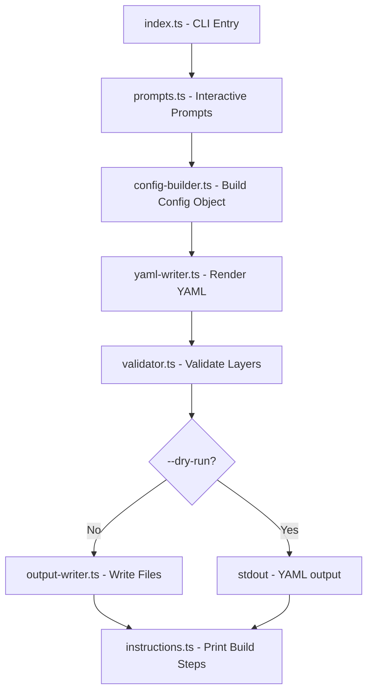

# catalyst-rpi-config

Generate [rpi-image-gen](https://github.com/raspberrypi/rpi-image-gen) configuration YAML for building custom Raspberry Pi OS images with **Catalyst Node** pre-installed.

> **Security Warning** -- The generated config YAML contains passwords and secrets in plain text (WiFi passwords, peering secrets, bootstrap tokens, SSH keys, Cloudflare Tunnel tokens). **Do not commit generated config files to version control.** See the [Security](#security) section.

---

## Features

- **Interactive prompts** -- walk through every option step-by-step when run without flags
- **Fully scriptable** -- pass all values as CLI flags for CI/CD pipelines with `--non-interactive`
- **Two deployment modes** -- native single-binary or Docker Compose multi-container
- **Commented YAML output** -- every section and value is annotated so configs are self-documenting
- **Layer validation** -- verifies all referenced layers exist (embedded or built-in) before writing
- **Dry-run support** -- preview generated YAML on stdout without writing to disk
- **Environment variable support** -- `CATALYST_NODE_ID`, `CATALYST_PEERING_SECRET`, `CATALYST_DOMAINS`, `CATALYST_BOOTSTRAP_TOKEN`, `PORT`
- **Standalone binary** -- compile to a single ARM64 executable with `bun build --compile`

---

## Supported Devices

- **Raspberry Pi 5** (`rpi5`) -- default
- **Raspberry Pi 4** (`pi4`)
- **Compute Module 5** (`cm5`)
- **Compute Module 4** (`cm4`)
- **Raspberry Pi Zero 2 W** (`zero2w`)

---

## Prerequisites

- **[Bun](https://bun.sh/)** >= 1.0 or **Node.js** >= 20 (for running from source)
- This package lives inside the **catalyst-node** monorepo -- clone the full repo first
- An **arm64 Debian host** (e.g. Raspberry Pi 5 running Pi OS) is required to build the image with `rpi-image-gen`

---

## Quickstart

### 1. Generate a config (interactive)

```bash
# From the monorepo root
bun run rpi:config
```

The CLI will prompt for deployment mode, device, credentials, WiFi, SSH keys, and node settings.

### 2. Generate a config (non-interactive / CI)

```bash
bun run rpi:config -- \
  --non-interactive \
  --mode native \
  --password "changeme" \
  --wifi-ssid "MyNetwork" \
  --wifi-password "wifi-pass" \
  --ssh-pubkey-file ~/.ssh/id_ed25519.pub \
  --node-id "edge-001" \
  --peering-secret "my-secret" \
  -o dist/rpi
```

### 3. Build the image (on arm64 Debian host)

```bash
# Native mode: compile the binary first
bun build --compile --target=bun-linux-arm64 \
  --outfile dist/rpi/bin/catalyst-node apps/node/src/index.ts

# Run the build
./builds/rpi/build.sh --source-dir dist/rpi dist/rpi/config.yaml
```

### 4. Flash to SD card

```bash
sudo rpi-imager --cli \
  ./work/image-catalyst-node-image/catalyst-node-image.img \
  /dev/mmcblk0
```

---

## Installation

### Run from the monorepo (recommended)

```bash
# Using the root script alias
bun run rpi:config

# Or directly
bun run apps/rpi-config/src/index.ts
```

### Build with tsup

```bash
cd apps/rpi-config
bun run build
node dist/index.js --help
```

### Compile to standalone ARM64 binary

```bash
cd apps/rpi-config

# Cross-compile for Raspberry Pi (linux-arm64)
bun run compile

# Or compile for the current platform
bun run compile:native
```

The binary is written to `dist/rpi-config/catalyst-rpi-config`.

---

## Deployment Modes

### Native Binary

- **Single process** -- auth, gateway, and orchestrator run in one Bun-compiled binary
- **Low overhead** -- ~300-500 MB RAM
- **Fast boot** -- ~5-10 seconds to ready
- **Root partition** -- 400% of base image
- **Layers** -- `catalyst-otel` + `catalyst-node`
- **Update strategy** -- replace binary, restart service
- **Logs** -- `journalctl -u catalyst-node`

### Docker Compose

- **Four containers** -- auth, gateway, orchestrator, OTEL collector
- **Service isolation** -- container boundaries between services
- **Higher overhead** -- ~1-1.5 GB RAM
- **Slower boot** -- ~60-90 seconds (image pull + health checks)
- **Root partition** -- 500% of base image (container images)
- **Layers** -- `docker-debian-bookworm` + `catalyst-docker-stack`
- **Update strategy** -- `docker compose pull && docker compose up -d`
- **Logs** -- `docker compose logs` in `/opt/catalyst-node`

### Comparison

| Aspect          | Native         | Docker                |
| --------------- | -------------- | --------------------- |
| RAM             | ~300-500 MB    | ~1-1.5 GB             |
| Boot to ready   | ~5-10 s        | ~60-90 s              |
| Docker required | No             | Yes                   |
| Root partition  | 400%           | 500%                  |
| Update          | Replace binary | `docker compose pull` |
| Debugging       | `journalctl`   | `docker compose logs` |

---

## CLI Reference

### Output

| Flag                      | Description                                   | Default    |
| ------------------------- | --------------------------------------------- | ---------- |
| `-o, --output-dir <path>` | Output directory                              | `dist/rpi` |
| `-m, --mode <mode>`       | `native` or `docker`                          | `native`   |
| `--dry-run`               | Print YAML to stdout instead of writing files | --         |

### Device

| Flag                | Description                                               | Default         |
| ------------------- | --------------------------------------------------------- | --------------- |
| `--device <layer>`  | Device layer name (`rpi5`, `pi4`, `cm5`, `cm4`, `zero2w`) | `rpi5`          |
| `--hostname <name>` | System hostname                                           | `catalyst-node` |
| `--username <user>` | Login username                                            | `catalyst`      |
| `--password <pass>` | Login password                                            | _(prompted)_    |

### WiFi

| Flag                     | Description                        | Default |
| ------------------------ | ---------------------------------- | ------- |
| `--wifi-ssid <ssid>`     | WiFi SSID (omit to skip WiFi)      | --      |
| `--wifi-password <pass>` | WiFi password (WPA2-PSK)           | --      |
| `--wifi-country <code>`  | Regulatory country code            | `US`    |
| `--no-wifi`              | Explicitly skip WiFi configuration | --      |

### SSH

| Flag                       | Description                   | Default |
| -------------------------- | ----------------------------- | ------- |
| `--ssh-pubkey <key>`       | SSH public key string         | --      |
| `--ssh-pubkey-file <path>` | Read SSH public key from file | --      |
| `--no-ssh-pubkey`          | Skip SSH key configuration    | --      |

### Node

| Flag                        | Description                      | Default            | Env                        |
| --------------------------- | -------------------------------- | ------------------ | -------------------------- |
| `--node-id <id>`            | Unique node identifier           | _(auto-generated)_ | `CATALYST_NODE_ID`         |
| `--peering-secret <secret>` | iBGP peering shared secret       | --                 | `CATALYST_PEERING_SECRET`  |
| `--domains <list>`          | Comma-separated trusted domains  | --                 | `CATALYST_DOMAINS`         |
| `--port <port>`             | Listen port                      | `3000`             | `PORT`                     |
| `--bootstrap-token <token>` | Auth bootstrap token             | --                 | `CATALYST_BOOTSTRAP_TOKEN` |
| `--log-level <level>`       | `debug`, `info`, `warn`, `error` | `info`             | --                         |

### Docker

| Flag               | Description                                               | Default  |
| ------------------ | --------------------------------------------------------- | -------- |
| `--registry <url>` | Container registry for catalyst images (docker mode only) | --       |
| `--tag <tag>`      | Container image tag                                       | `latest` |

### Monitoring

| Flag                   | Description                     | Default   |
| ---------------------- | ------------------------------- | --------- |
| `--otel-version <ver>` | OpenTelemetry Collector version | `0.145.0` |

### Tunnel

| Flag                          | Description                            | Default |
| ----------------------------- | -------------------------------------- | ------- |
| `--cloudflared-token <token>` | Cloudflare Tunnel token (omit to skip) | --      |
| `--no-cloudflared`            | Explicitly skip cloudflared            | --      |

### Image Layout

| Flag                      | Description         | Default                           |
| ------------------------- | ------------------- | --------------------------------- |
| `--image-name <name>`     | Output image name   | `catalyst-node-image`             |
| `--boot-part-size <size>` | Boot partition size | `200%`                            |
| `--root-part-size <size>` | Root partition size | `400%` (native) / `500%` (docker) |

### General

| Flag                | Description                                                   |
| ------------------- | ------------------------------------------------------------- |
| `--non-interactive` | Skip all interactive prompts, use defaults for missing values |
| `--dry-run`         | Print generated YAML to stdout, instructions to stderr        |
| `-V, --version`     | Show version number                                           |
| `-h, --help`        | Show help                                                     |

---

## Configuration Examples

Pre-built example configs are available in the [`examples/`](examples/) directory:

| Example                                                     | Mode   | WiFi | SSH | Cloudflared | Description                         |
| ----------------------------------------------------------- | ------ | ---- | --- | ----------- | ----------------------------------- |
| [`minimal-native.yaml`](examples/minimal-native.yaml)       | native | --   | --  | --          | Bare minimum native deployment      |
| [`native-wifi-ssh.yaml`](examples/native-wifi-ssh.yaml)     | native | yes  | yes | --          | Native with WiFi and SSH key auth   |
| [`native-full.yaml`](examples/native-full.yaml)             | native | yes  | yes | yes         | All features enabled (native)       |
| [`docker-basic.yaml`](examples/docker-basic.yaml)           | docker | --   | --  | --          | Basic Docker Compose deployment     |
| [`docker-production.yaml`](examples/docker-production.yaml) | docker | yes  | yes | yes         | Production Docker with all features |

Each file includes the equivalent CLI command to regenerate it.

---

## Output Directory Structure

When run without `--dry-run`, the CLI writes this structure:

```
<output-dir>/
├── config.yaml            # Main rpi-image-gen configuration
├── layer/
│   ├── catalyst-otel.yaml       # (native mode)
│   ├── catalyst-node.yaml       # (native mode)
│   ├── catalyst-docker-stack.yaml # (docker mode)
│   ├── catalyst-wifi.yaml       # (if WiFi enabled)
│   └── catalyst-cloudflared.yaml # (if cloudflared enabled)
└── bin/
    └── catalyst-node            # (native mode -- you must place the binary here)
```

- Only layers referenced in `config.yaml` are written to `layer/`
- Built-in rpi-image-gen layers (`rpi5`, `image-rpios`, etc.) are not copied
- In native mode, a warning is printed if `bin/catalyst-node` is missing

---

## Architecture

See [`docs/architecture.md`](docs/architecture.md) for detailed diagrams including the CLI pipeline, build pipeline, layer dependencies, and boot sequences.

### CLI Pipeline (summary)



---

## Environment Variables

The following environment variables are read as defaults for their corresponding CLI flags:

| Variable                   | CLI Flag            | Description                     |
| -------------------------- | ------------------- | ------------------------------- |
| `CATALYST_NODE_ID`         | `--node-id`         | Unique node identifier          |
| `CATALYST_PEERING_SECRET`  | `--peering-secret`  | iBGP peering shared secret      |
| `CATALYST_DOMAINS`         | `--domains`         | Comma-separated trusted domains |
| `CATALYST_BOOTSTRAP_TOKEN` | `--bootstrap-token` | Auth bootstrap token            |
| `PORT`                     | `--port`            | Listen port                     |

CLI flags take precedence over environment variables.

---

## Security

- **Generated configs contain plain-text secrets** -- passwords, WiFi credentials, peering secrets, bootstrap tokens, SSH keys, and Cloudflare Tunnel tokens are embedded directly in the YAML
- **Do not commit generated configs** -- add `dist/rpi/` or your output directory to `.gitignore`
- **Use `--dry-run`** to preview YAML without writing files to disk
- **Pipe to `/dev/null`** or a temporary directory -- `--dry-run` sends YAML to stdout and instructions to stderr, keeping them separated
- **Rotate secrets immediately** if a config file is accidentally exposed
- **The static base configs** in `builds/rpi/config/` use placeholder values and are safe to commit
- **Delete config files after building** -- the secrets are baked into the image at build time, so the YAML is not needed afterward

```bash
# Example: generate, build, and clean up
bun run rpi:config -- --non-interactive --password "pass" --peering-secret "s" -o /tmp/rpi-build
./builds/rpi/build.sh --source-dir /tmp/rpi-build /tmp/rpi-build/config.yaml
rm -rf /tmp/rpi-build
```

---

## License

Part of the [catalyst-node](../../) monorepo.
