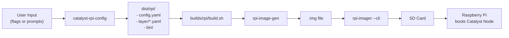
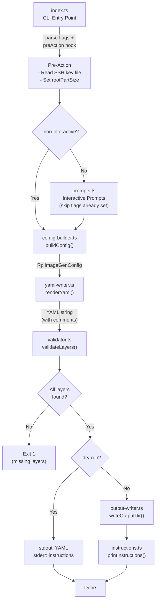
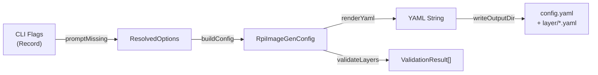
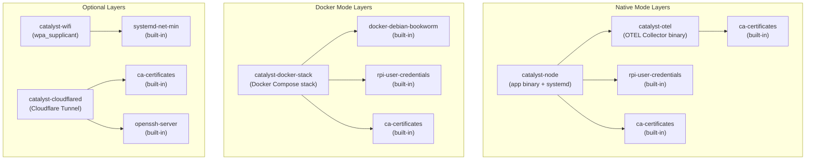
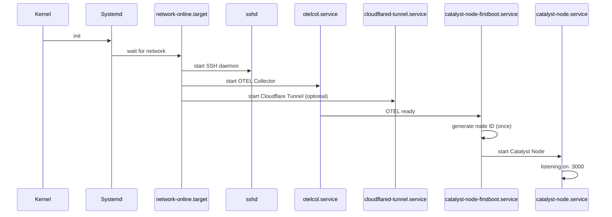
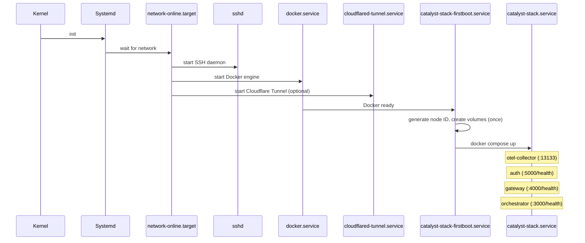
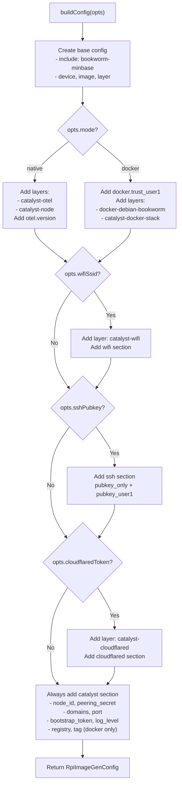

# Architecture

This document describes the internal architecture of `catalyst-rpi-config`, its role in the Catalyst Node build pipeline, and how the generated configuration flows through to a flashable Raspberry Pi image.

---

## Overview

`catalyst-rpi-config` is a TypeScript CLI that generates [rpi-image-gen](https://github.com/raspberrypi/rpi-image-gen) configuration YAML for building custom Raspberry Pi OS images with Catalyst Node pre-installed. It sits at the front of a two-stage pipeline:

1. **Config generation** -- this CLI produces a `config.yaml` and supporting layer files
2. **Image build** -- `builds/rpi/build.sh` feeds the config into rpi-image-gen to produce a flashable `.img`

---

## End-to-End Build Pipeline

The full journey from user input to a running Raspberry Pi:



---

## CLI Pipeline

The CLI processes user input through a series of modules, each with a single responsibility:



---

## Module Responsibilities

| Module         | File                | Key Export                             | Responsibility                                                                                             |
| -------------- | ------------------- | -------------------------------------- | ---------------------------------------------------------------------------------------------------------- |
| CLI Entry      | `index.ts`          | _(main)_                               | Commander setup, option parsing, orchestrates the full pipeline                                            |
| Prompts        | `prompts.ts`        | `promptMissing()`                      | Interactive prompt sequences via `@inquirer/prompts`; skips flags already provided                         |
| Config Builder | `config-builder.ts` | `buildConfig()`                        | Pure function: `ResolvedOptions` in, `RpiImageGenConfig` out. Only includes sections for selected features |
| YAML Writer    | `yaml-writer.ts`    | `renderYaml()`                         | Serializes config to YAML using the `yaml` library Document API. Attaches section and inline comments      |
| Validator      | `validator.ts`      | `validateLayers()`                     | Verifies every referenced layer exists as either an embedded layer or a built-in rpi-image-gen layer       |
| Output Writer  | `output-writer.ts`  | `writeOutputDir()`                     | Creates directory structure, writes `config.yaml` and referenced embedded layers to `layer/`               |
| Instructions   | `instructions.ts`   | `printInstructions()`                  | Prints build prerequisites, `build.sh` command, and flash instructions                                     |
| Defaults       | `defaults.ts`       | `DEFAULTS`, `DEVICES`                  | Default values, supported device list, version constants                                                   |
| Types          | `types.ts`          | `ResolvedOptions`, `RpiImageGenConfig` | Shared TypeScript interfaces                                                                               |
| Layers         | `layers.ts`         | `EMBEDDED_LAYERS`, `findLayer()`       | Embedded layer YAML content (WiFi, OTEL, Node, Docker Stack, Cloudflared)                                  |

---

## Data Flow

The core data types flow through the pipeline:



### ResolvedOptions

All user-provided and default values merged into a single typed object. Covers output, device, WiFi, SSH, node settings, Docker, OTEL, cloudflared, and image layout.

### RpiImageGenConfig

The configuration object matching rpi-image-gen's expected YAML structure:

- `include` -- base OS reference (`bookworm-minbase.yaml`)
- `device` -- device layer, hostname, credentials
- `image` -- partition layout and image name
- `layer` -- map of feature layers to include
- `docker` -- (optional) Docker group membership
- `ssh` -- (optional) public key authentication
- `wifi` -- (optional) SSID, password, country
- `otel` -- (optional) collector version
- `catalyst` -- node settings (always present)
- `cloudflared` -- (optional) tunnel token

---

## Layer Architecture

Layers are YAML files that define what gets installed into the image. They declare dependencies on other layers and consume variables from the config.

### Layer Dependency Graph



### Embedded vs Built-in Layers

| Type         | Source                            | Examples                                                                                           |
| ------------ | --------------------------------- | -------------------------------------------------------------------------------------------------- |
| **Embedded** | Bundled in this CLI (`layers.ts`) | `catalyst-wifi`, `catalyst-otel`, `catalyst-node`, `catalyst-docker-stack`, `catalyst-cloudflared` |
| **Built-in** | Provided by rpi-image-gen         | `rpi5`, `pi4`, `cm5`, `cm4`, `zero2w`, `image-rpios`, `docker-debian-bookworm`                     |

Embedded layers are written to `<output>/layer/` when the config references them. Built-in layers are resolved by rpi-image-gen at build time.

---

## Output Directory Layout

When the CLI writes to disk (no `--dry-run`), it creates:

```
<output-dir>/
├── config.yaml                    # Main rpi-image-gen config (generated)
├── layer/
│   ├── catalyst-otel.yaml         # Native: OTEL Collector layer
│   ├── catalyst-node.yaml         # Native: app binary layer
│   ├── catalyst-docker-stack.yaml # Docker: Compose stack layer
│   ├── catalyst-wifi.yaml         # Optional: WiFi layer
│   └── catalyst-cloudflared.yaml  # Optional: Cloudflare Tunnel layer
└── bin/
    └── catalyst-node              # Native only: pre-compiled ARM64 binary
                                   # (must be placed here before building)
```

Only layers referenced in `config.layer` are written. For example, a native build without WiFi or cloudflared would produce:

```
dist/rpi/
├── config.yaml
├── layer/
│   ├── catalyst-otel.yaml
│   └── catalyst-node.yaml
└── bin/
    └── (catalyst-node binary goes here)
```

---

## Boot Sequences

### Native Mode Boot



### Docker Mode Boot



---

## Config Builder Logic

The `buildConfig()` function in `config-builder.ts` assembles the config object based on resolved options. The decision tree:



---

## Runtime Ports

### Native Mode

| Service                   | Port     | Protocol         |
| ------------------------- | -------- | ---------------- |
| Catalyst Node (composite) | 3000     | HTTP + WebSocket |
| OTEL Collector (gRPC)     | 4317     | OTLP             |
| OTEL Collector (HTTP)     | 4318     | OTLP             |
| OTEL Collector (health)   | 13133    | HTTP             |
| SSH                       | 22       | SSH              |
| Cloudflare Tunnel         | outbound | HTTPS            |

### Docker Mode

| Service                 | Port     | Protocol         |
| ----------------------- | -------- | ---------------- |
| Orchestrator            | 3000     | HTTP + WebSocket |
| Gateway                 | 4000     | HTTP + WebSocket |
| Auth                    | 5000     | HTTP + WebSocket |
| OTEL Collector (gRPC)   | 4317     | OTLP             |
| OTEL Collector (HTTP)   | 4318     | OTLP             |
| OTEL Collector (health) | 13133    | HTTP             |
| SSH                     | 22       | SSH              |
| Cloudflare Tunnel       | outbound | HTTPS            |
