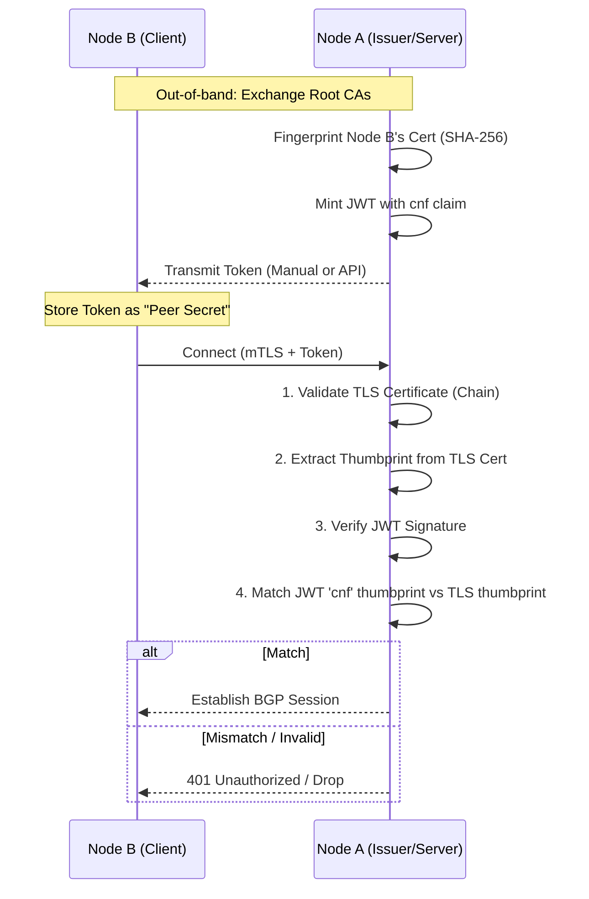

# ADR 0007: Certificate Bound Access Tokens for BGP Sessions

## Status

Proposed

## Context

Catalyst Router peering currently relies on Pre-Shared Keys (PSKs) for session establishment. While simple, PSKs present several challenges:

1. **Rotation Complexity**: Updating a PSK requires synchronized changes across all nodes in a cluster.
2. **Weak Identity Assurance**: A PSK only proves knowledge of a secret, not the identity of the holder.
3. **Capability Management**: PSKs are binary (access or no access) and do not support granular permissions or TTLs natively.

We need a mechanism that binds authentication to a cryptographically verifiable identity (certificate) while leveraging our existing JWT-based capability model.

## Decision

We will adopt **Certificate-Bound Access Tokens** (standardized in [RFC 8705](https://datatracker.ietf.org/doc/html/rfc8705)) for BGP peering sessions.

### Technical Design

Instead of a PSK, nodes will exchange "Sender Constrained" tokens. This model binds a JWT to the client certificate presented during the mTLS handshake.

#### System Overview

The following diagram illustrates the relationship between the two nodes, their independent PKIs, and the token issuance process.

```mermaid
graph LR
    subgraph NodeA [Node A (Issuer)]
        PKIA[Local PKI A]
        AuthA[Auth Service]
        BGP[BGP Orchestrator]
    end

    subgraph NodeB [Node B (Client)]
        PKIB[Local PKI B]
        CertB[Client Cert B]
    end

    %% Flow
    PKIB -- "1. Cert Exchange" --> PKIA
    AuthA -- "2. Fingerprint & Mint" --> AuthA
    AuthA -- "3. Bound Token" ----> CertB
    CertB -- "4. mTLS + Token" --> BGP
    BGP -- "5. Verify Binding" --> AuthA
```

#### The Binding Concept (ASCII)

```text
+-----------------------+           +--------------------------+
|       JWT Token       |           |     TLS Certificate      |
|-----------------------|           |--------------------------|
| sub: node-b           |           |  Subject: Node B         |
| iss: node-a           |           |  Issuer:  Node B Root    |
|                       |           |                          |
| cnf: {                | <=======> |  SHA256 Fingerprint:     |
|   x5t#S256: [THUMB]   |           |    [THUMB]               |
| }                     |           |                          |
+-----------------------+           +--------------------------+
          ^                                       ^
          |                                       |
          +-------------------+-------------------+
                              |
                     VERIFIED BY SERVER
```

#### 1. The Binding Claim (`cnf`)

The JWT will include a confirmation claim (`cnf`) containing a SHA-256 thumbprint of the client's certificate:

```json
{
  "sub": "node-b",
  "iss": "node-a",
  "cnf": {
    "x5t#S256": "Rvc6LtXrtcjJsf0zZacc2MCETnUOWu59cz3H4ohh4-o"
  }
}
```

#### 2. The Peering Flow

The exchange between Node A and Node B follows this sequence:



### Attack Vectors & Mitigations

| Attack Vector                | Mitigation Strategy                                                                                                                                      |
| :--------------------------- | :------------------------------------------------------------------------------------------------------------------------------------------------------- |
| **Token Theft/Interception** | The token is useless without the matching private key for the bound certificate (Sender Constraint).                                                     |
| **Impersonation**            | Requires obtaining Node B's private key _and_ IP/DNS spoofing. IP spoofing is difficult in many environments (VPCs/Cloud).                               |
| **Server Reflection**        | Mitigated by ensuring Node A only validates tokens it signed or trusts from specific issuers, and never using client-provided content for auth metadata. |
| **Compromised Identity**     | Using hardware-backed storage (e.g., **YubiKeys** or Cloud KMS) for private keys makes physical extraction of the identity material nearly impossible.   |

## Consequences

- **Positive**: High identity assurance; automated token expiration; easy revocation via JWKS rotation or revocation lists.
- **Negative**: Increased complexity (requires mTLS and cert management); requires cross-trust of CA chains between peering nodes.
