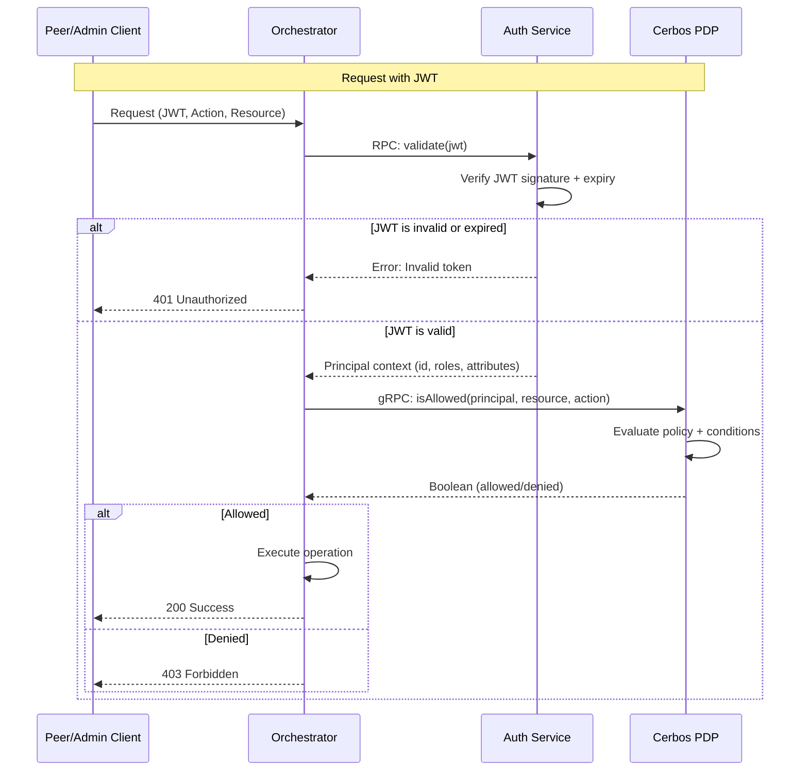

# ADR 0008: Permission Policy Schema for Authentication Service

## Status

Superseded — The Cerbos-based architecture described in this ADR was never implemented. The system uses [Cedar Policy](https://www.cedarpolicy.com/) (via `@cedar-policy/cedar-wasm`) with principal-based JWT tokens. See `packages/authorization/` for the actual implementation.

## Date

2026-01-30

## Context

The system uses stateless JWTs for authentication but needs fine-grained authorization beyond simple RBAC. Current authorization logic is scattered and difficult to audit and evolve policies without code changes.

**Requirements**:

- Attribute-based access control (ABAC) for context-aware policies
- Centralized policy management with version control
- Dynamic policy updates without redeployment
- Audit trail for compliance
- Separation of authentication (JWT) and authorization (policies)

## Proposal

Use **Cerbos** as the Policy Decision Point (PDP) with **JWT authentication** for identity.

**Components**:

- **JWT Authentication**: RS256 tokens with identity claims (subject, roles, attributes)
- **Cerbos PDP**: Standalone gRPC service evaluating YAML policies
- **Policy Storage**: Version-controlled YAML files in `apps/auth/cerbos/policies/`
- **Runtime Context**: JWT claims passed to Cerbos for attribute-based decisions

Use **Cerbos** (gRPC Policy Decision Point) with **JWT authentication**. JWTs contain identity claims; Cerbos evaluates YAML policies stored in `apps/auth/cerbos/policies/`.

## Cerbos Model

Authorization uses **Principal** (who), **Resource** (what), **Action** (operation), and **Attributes** (context).

See: [Cerbos Concepts](https://docs.cerbos.dev/cerbos/latest/tutorial), [Testing](https://docs.cerbos.dev/cerbos/latest/tutorial/04_testing-policies)

**Type Definitions** (`apps/auth/src/permissions.ts`):

### Cerbos Policies

YAML resource policies (see `apps/auth/cerbos/policies/`):

### Permission Service

```typescript
class PermissionService {
  async isAuthorized(
    principal: CatalystPrincipal,
    resource: CatalystResource,
    permission: Permission
  ): Promise<boolean> {
    const action = permission.split(':').pop()
    return this.cerbosClient.isAllowed({
      requestId: crypto.randomUUID(),
      principal,
      resource,
      action,
    })
  }
}
```

## Architecture



The Auth RPC Server exposes the `isAuthorized` method through the `validation()` progressive API:

**RPC Server** (`apps/auth/src/rpc/server.ts`):

```typescript
async validation(token: string) {
  const auth = await this.keyManager.verify(token);
  return {
    isAuthorized: async (req) => {
      const principal = { id: auth.payload.sub, roles: auth.payload.roles, attr: auth.payload.attr };
      return this.permissionService.isAuthorized(principal, req.resource, req.action);
    }
  };
}
```

**Orchestrator**:

```typescript
const authClient = await authRpcClient.validation(jwt)
const allowed = await authClient.isAuthorized({
  token: jwt,
  resource: { kind: 'peer', id: 'peer-nyc-01', attr: { endpoint: '203.0.113.5:179' } },
  action: Permission.PeerCreate,
})
if (!allowed) throw new Error('Forbidden')
```

## Alternatives Considered

### 1. Embedded Authorization Logic (Status Quo)

**Approach**: Continue with `hasPermission()` checks scattered across services using `ROLE_PERMISSIONS` map.

**Rejected because**:

- No support for attribute-based access control (ABAC)
- Policy changes require code modifications and deployments
- Difficult to audit "who can do what" across the system
- Cannot express complex conditions (e.g., region-based access)

### 2. Custom Policy Engine

**Approach**: Build an in-house policy evaluation engine.

**Benefits**:

- Centralized policy management (YAML, version-controlled)
- Scalable JWT authentication (no DB lookups)
- Dynamic policy updates (no redeployment)
- ABAC support (attribute-based conditions)
- Audit trail (Cerbos decision logging)
- Standards-based (RFC 7519, RS256)

**Rejected because**:

- High development and maintenance cost
- Requires security expertise to avoid vulnerabilities
- Reinventing the wheel when proven solutions exist
- Lacks mature audit logging and testing frameworks

## References

- [Cerbos Concepts](https://docs.cerbos.dev/cerbos-hub/concepts.html)
- [Cerbos Policy Schema](https://api.cerbos.dev/v0.50.0/cerbos/policy/v1/Policy.schema.json)
- [JWT Implementation](../../apps/auth/src/jwt.ts)
- [Key Manager Folder](../../apps/auth/src/key-manager/)
- [Permission Service](../../apps/auth/src/permissions.ts)
- [Cerbos Policies](../../apps/auth/cerbos/policies/)
- [RFC 7519 - JSON Web Token (JWT)](https://datatracker.ietf.org/doc/html/rfc7519)
