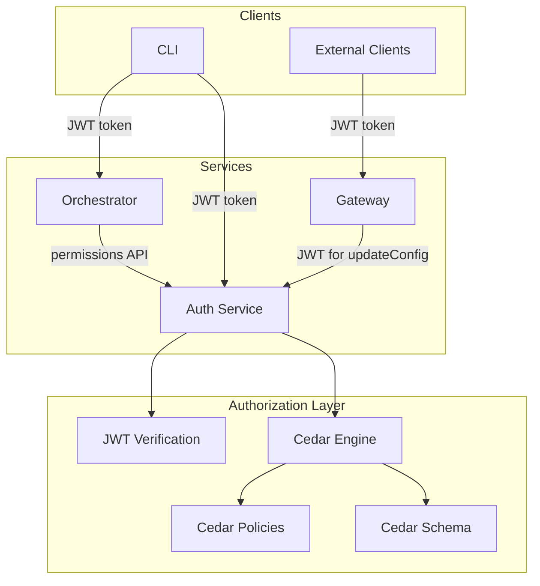
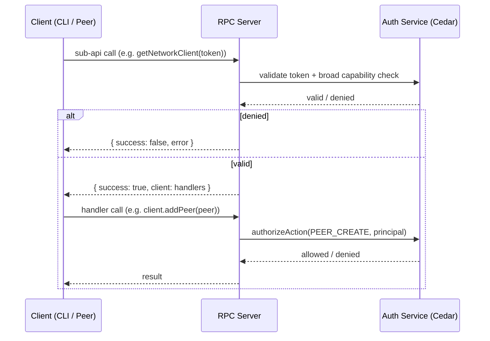

# ADR-0011: Cedar Policy Authorization Schema and Enforcement

**Status:** Pending Approval

**Date:** 2026-02-11

**Decision Owner(s):** Platform Team

**Supersedes:** [ADR-0008](./0008-permission-policy-schema.md)

## Context

ADR-0008 proposed a Cerbos-based authorization architecture that was never implemented. The system instead uses [Cedar Policy](https://www.cedarpolicy.com/) (`@cedar-policy/cedar-wasm`) with JWT-embedded principals for authorization. While the Cedar integration exists in `packages/authorization`, a cross-application audit revealed significant gaps between what the Cedar schema and policies define and what the applications actually enforce.

### Current State

The authorization layer consists of:

- **Cedar Schema** (`packages/authorization/src/policy/src/definitions/schema.schemacedar`): Defines 6 principal types, 6 resource types, and 14 actions under the `CATALYST` namespace.
- **Cedar Policies** (6 `.cedar` files): Per-principal permit policies with `trustedDomains`/`trustedNodes` constraints.
- **TypeScript Models** (`models.ts`): `Role`, `Principal`, `Action` enums and a `ROLE_PERMISSIONS` mapping.
- **Auth Service** (`packages/authorization/src/service/`): Hosts the Cedar engine, JWT factory, and RPC surface for token management and authorization checks.

Authorization is evaluated in the auth service via the `permissions().authorizeAction()` RPC. The orchestrator delegates all Cedar evaluation to the auth service; neither the gateway nor the CLI run Cedar locally.

### Findings from Cross-App Audit

#### Orchestrator (`apps/orchestrator`)

1. **Coarse-grained gate pattern**: Only 3 actions checked (`PEER_CREATE`, `ROUTE_CREATE`, `IBGP_CONNECT`) at the client-factory level. Actions like `PEER_UPDATE`, `PEER_DELETE`, `ROUTE_DELETE`, `IBGP_DISCONNECT`, and `IBGP_UPDATE` are never individually enforced.
2. **`AdminPanel` as universal resource**: All Cedar checks target `AdminPanel`; specific resources (`Peer`, `Route`, `IBGP`) defined in the schema are unused.
3. **Unprotected `dispatch(action)`**: Exposed on the public RPC API with no auth checks.
4. **No read/list permissions**: `listPeers` and `listRoutes` reuse the create permission.

#### Gateway (`apps/gateway`)

1. **No authorization**: No JWT validation, no Cedar checks on any endpoint.
2. **Unprotected `updateConfig` RPC**: Any WebSocket client can reconfigure subgraphs.
3. **No gateway-specific actions in Cedar**: Missing actions like `GATEWAY_UPDATE`.

#### Auth Service (`apps/auth` + `packages/authorization`)

1. **Schema file mismatch**: Code imports `schema.cedar` but only `schema.schemacedar` exists on disk.
2. **`/telemetry/token` open to any valid JWT**: Does not verify caller is `ADMIN`.
3. **`MANAGE` overloaded**: Token and cert APIs both check `MANAGE` on `AdminPanel` instead of specific `TOKEN_CREATE`/`TOKEN_REVOKE`/`TOKEN_LIST` actions defined in the schema.

#### CLI (`apps/cli`)

1. **Token not propagated**: CLI accepts `--token` but never passes it to orchestrator RPC calls.
2. **API surface mismatch**: CLI calls `connectionFromManagementSDK()` which does not exist in the orchestrator.

### Requirements

| Requirement                                              | Priority | Notes                                                 |
| -------------------------------------------------------- | -------- | ----------------------------------------------------- |
| Fine-grained per-operation authorization in orchestrator | Must     | Current gate pattern violates least-privilege         |
| Read/list actions in Cedar schema                        | Must     | Enable read-only principals without write access      |
| Gateway config update protection                         | Must     | Prevent unauthorized subgraph reconfiguration         |
| Specific token management actions in auth service        | Should   | Replace overloaded `MANAGE` with `TOKEN_CREATE` etc.  |
| Telemetry token endpoint protection                      | Should   | Require `ADMIN` principal for telemetry token minting |
| CLI token propagation to orchestrator                    | Must     | Currently broken; --token is accepted but ignored     |
| Schema file naming consistency                           | Must     | Fix `schema.cedar` vs `schema.schemacedar` mismatch   |
| Normalize principal attributes                           | Could    | Remove `role` from `TELEMETRY_EXPORTER` entity        |

## Decision

**Chosen Option: Incremental Cedar Policy and Enforcement Hardening**

Update the Cedar schema with new actions, align Cedar policies with actual system operations, and enforce authorization at each service boundary. This is an incremental approach: update schema and policies first, then progressively harden each application.

### Rationale

1. **Least-privilege compliance** -- The current coarse-grained gate pattern allows principals to perform operations beyond their intended scope (e.g., a `PEER_CREATE`-only token can also delete peers).
2. **Defense in depth** -- The gateway currently has zero authorization; adding Cedar checks at each service boundary prevents unauthorized access even if network-level controls fail.
3. **Schema-policy alignment** -- The Cedar schema already defines fine-grained actions (e.g., `PEER_UPDATE`, `PEER_DELETE`) that are never enforced. Aligning enforcement with the schema makes the policies auditable and meaningful.

### Trade-offs Accepted

- **Increased latency per operation**: Moving from a single auth check at client creation to per-operation checks adds RPC calls to the auth service. Mitigated by short-lived cached authorization results where appropriate.
- **Breaking change for CLI**: The CLI must be updated to pass tokens, and its orchestrator client interface must align with the actual `PublicApi`.

## Consequences

### Positive

- Each operation is individually authorized, enabling true least-privilege
- Read-only principals can list resources without write access
- Gateway config changes are protected
- Token management uses specific Cedar actions, improving audit trail
- Cedar schema becomes the single source of truth for all authorization constraints

### Negative

- Additional RPC calls to the auth service for each operation
- Existing scripts and integrations that rely on the coarse-grained gate pattern will need to provide tokens for each operation

### Neutral

- No changes to the JWT format or signing algorithm
- Telemetry export authentication flow remains the same

## Implementation

### Phase 1: Schema, Policies, and Models

1. **Cedar Schema** (`schema.schemacedar`):
   - Add actions: `PEER_LIST`, `ROUTE_LIST`, `IBGP_LIST`, `GATEWAY_UPDATE`
   - Remove `CHECK_PERMISSIONS` (implementation detail, not a business action)
   - Normalize `TELEMETRY_EXPORTER` attributes to match other principals
   - Add `Gateway` resource type

2. **Cedar Policies** (`.cedar` files):
   - `node-custodian.cedar`: Add `PEER_LIST`
   - `data-custodian.cedar`: Add `ROUTE_LIST`
   - `node.cedar`: Add `IBGP_LIST`, `GATEWAY_UPDATE`
   - `admin.cedar`: No change (wildcard `action` already covers new actions)
   - `user.cedar`: Add `PEER_LIST`, `ROUTE_LIST` for read-only dashboard access

3. **TypeScript Models** (`models.ts`):
   - Add `PEER_LIST`, `ROUTE_LIST`, `IBGP_LIST`, `GATEWAY_UPDATE` to `Action` enum
   - Update `ROLE_PERMISSIONS` mapping

### Phase 2: Auth Service Hardening

- Replace `MANAGE` checks in `tokens()` and `certs()` RPC with specific actions (`TOKEN_CREATE`, `TOKEN_REVOKE`, `TOKEN_LIST`)
- Protect `/telemetry/token` endpoint by verifying caller principal is `ADMIN`
- Fix `schema.cedar` vs `schema.schemacedar` import path

### Phase 3: Orchestrator Per-Operation Authorization

- Refactor from client-factory gate to per-operation Cedar checks:
  - `addPeer` -> `PEER_CREATE`, `updatePeer` -> `PEER_UPDATE`, `removePeer` -> `PEER_DELETE`, `listPeers` -> `PEER_LIST`
  - `addRoute` -> `ROUTE_CREATE`, `removeRoute` -> `ROUTE_DELETE`, `listRoutes` -> `ROUTE_LIST`
  - `open` -> `IBGP_CONNECT`, `close` -> `IBGP_DISCONNECT`, `update` -> `IBGP_UPDATE`
- Protect or remove `dispatch()` from the public API
- Use specific resource types (`Peer`, `Route`, `IBGP`) instead of only `AdminPanel`

### Phase 4: Gateway and CLI

- **Gateway**: Add JWT validation middleware for `updateConfig` RPC; check `GATEWAY_UPDATE` via auth service
- **CLI**: Propagate `--token` to orchestrator RPC calls; align client with orchestrator `PublicApi`

### Architecture

### Progressive API Access Through RPC Servers

Authorization enforcement follows a **progressive API** pattern across all RPC servers (`AuthRpcServer`, `GatewayRpcServer`, and the orchestrator's `PublicApi`). Rather than performing a single coarse-grained authorization gate at connection time, each server exposes scoped sub-API entry points that return handler objects. Authorization is enforced at two levels:

1. **Entry-point validation** -- The caller invokes a sub-API method (e.g., `tokens(token)`, `getNetworkClient(token)`, `getConfigClient(token)`) with their JWT. The server verifies the token is valid and, optionally, performs a broad capability check to fail fast before returning the handler set.
2. **Per-operation Cedar checks** -- Each handler within the returned object individually evaluates its specific Cedar action (e.g., `TOKEN_CREATE`, `PEER_UPDATE`, `GATEWAY_UPDATE`) against the caller's principal. This ensures least-privilege even after the initial entry-point succeeds.

This two-level pattern is enabled by [capnweb](https://www.npmjs.com/package/capnweb)'s `RpcTarget`, which supports returning nested handler objects over WebSocket connections. The progressive disclosure of capabilities means a principal that can list peers cannot silently escalate to deleting them -- each operation is independently authorized.

| Service      | RPC Server Class   | Sub-API Entry Points                                                             | Per-Operation Actions                                                                               |
| ------------ | ------------------ | -------------------------------------------------------------------------------- | --------------------------------------------------------------------------------------------------- |
| Auth Service | `AuthRpcServer`    | `tokens(token)`, `certs(token)`, `validation(token)`, `permissions(token)`       | `TOKEN_CREATE`, `TOKEN_REVOKE`, `TOKEN_LIST`, `MANAGE`                                              |
| Orchestrator | `PublicApi`        | `getNetworkClient(token)`, `getDataChannelClient(token)`, `getIBGPClient(token)` | `PEER_CREATE/UPDATE/DELETE/LIST`, `ROUTE_CREATE/DELETE/LIST`, `IBGP_CONNECT/DISCONNECT/UPDATE/LIST` |
| Gateway      | `GatewayPublicApi` | `getConfigClient(token)`                                                         | `GATEWAY_UPDATE`                                                                                    |

### Action-to-Principal Authorization Matrix

| Action           | ADMIN | NODE | NODE_CUSTODIAN | DATA_CUSTODIAN | USER | TELEMETRY_EXPORTER |
| ---------------- | ----- | ---- | -------------- | -------------- | ---- | ------------------ |
| LOGIN            | x     |      |                |                | x    |                    |
| MANAGE           | x     |      |                |                |      |                    |
| IBGP_CONNECT     | x     | x    | x              |                |      |                    |
| IBGP_DISCONNECT  | x     | x    | x              |                |      |                    |
| IBGP_UPDATE      | x     | x    | x              |                |      |                    |
| IBGP_LIST        | x     | x    | x              |                |      |                    |
| PEER_CREATE      | x     |      | x              |                |      |                    |
| PEER_UPDATE      | x     |      | x              |                |      |                    |
| PEER_DELETE      | x     |      | x              |                |      |                    |
| PEER_LIST        | x     |      | x              |                | x    |                    |
| ROUTE_CREATE     | x     |      |                | x              |      |                    |
| ROUTE_DELETE     | x     |      |                | x              |      |                    |
| ROUTE_LIST       | x     |      |                | x              | x    |                    |
| TOKEN_CREATE     | x     |      |                |                |      |                    |
| TOKEN_REVOKE     | x     |      |                |                |      |                    |
| TOKEN_LIST       | x     |      |                |                |      |                    |
| TELEMETRY_EXPORT | x     |      |                |                |      | x                  |
| GATEWAY_UPDATE   | x     | x    |                |                |      |                    |

## Risks and Mitigations

| Risk                                                            | Likelihood | Impact | Mitigation                                                                            |
| --------------------------------------------------------------- | ---------- | ------ | ------------------------------------------------------------------------------------- |
| Breaking existing integrations that rely on coarse-grained auth | Medium     | Medium | Phased rollout; orchestrator continues to accept old token patterns during transition |
| Increased latency from per-operation auth checks                | Low        | Low    | Auth service is co-located; Cedar evaluation is sub-millisecond                       |
| Schema drift between Cedar and TypeScript                       | Medium     | High   | TypeScript `Action` enum and `ROLE_PERMISSIONS` serve as compile-time validation      |
| CLI breakage from API realignment                               | High       | Low    | CLI is an internal tool; update alongside orchestrator changes                        |

## Related Decisions

- [ADR-0008](./0008-permission-policy-schema.md) - Original Cerbos-based proposal (superseded by this ADR)
- [ADR-0001](./0001-unified-opentelemetry-observability.md) - Telemetry architecture (OTLP collector auth)
- [ADR-0006](./0006-node-orchestrator-architecture.md) - Orchestrator architecture

## References

- [Cedar Policy Language](https://www.cedarpolicy.com/)
- [Cedar Policy Playground](https://www.cedarpolicy.com/en/playground)
- [`@cedar-policy/cedar-wasm` npm package](https://www.npmjs.com/package/@cedar-policy/cedar-wasm)
- [Authorization Engine Package](../../packages/authorization/src/policy/README.md)
- [Cedar Schema Definition](../../packages/authorization/src/policy/src/definitions/schema.schemacedar)
- [Cedar Policy Definitions](../../packages/authorization/src/policy/src/definitions/)
- [RFC 7519 - JSON Web Token (JWT)](https://datatracker.ietf.org/doc/html/rfc7519)
