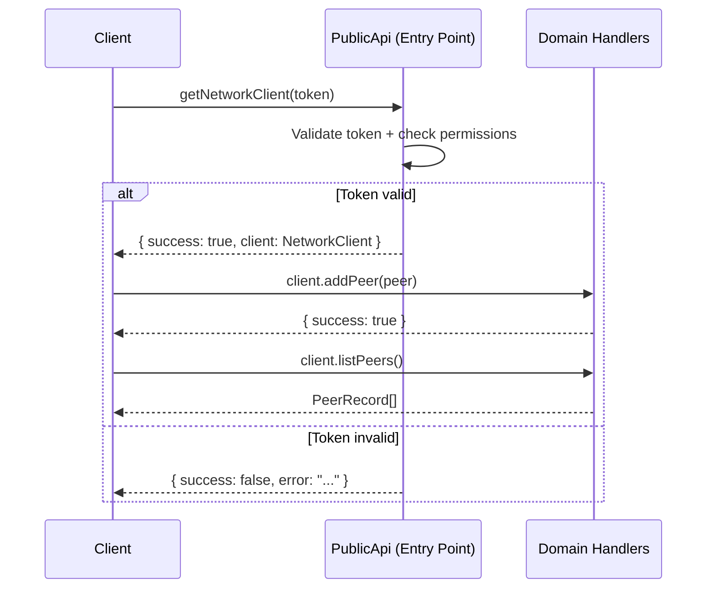
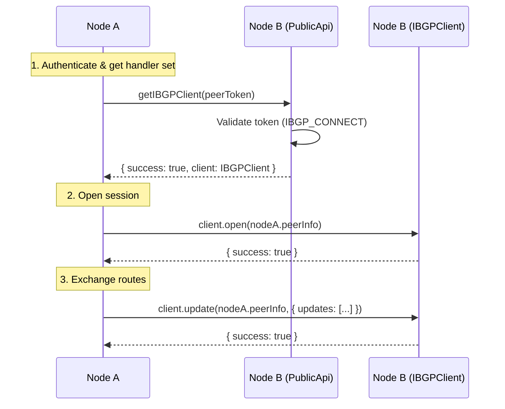
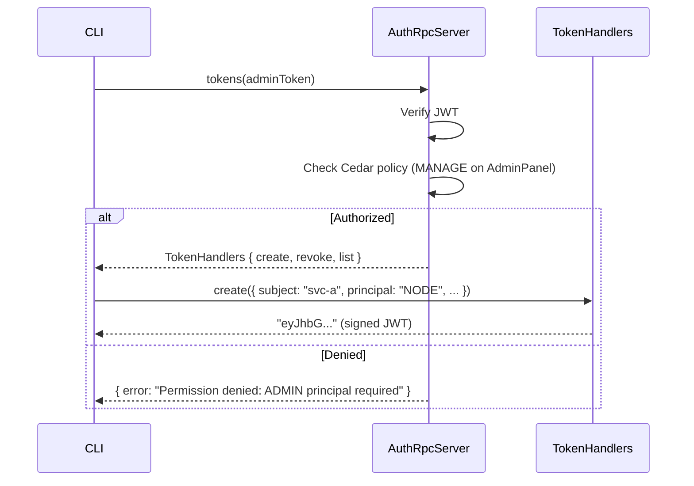

# Catalyst Router API Design

This document describes the API design philosophy, transport layer, and progressive API patterns used across the Catalyst Router platform. It serves as both a reference for contributors and an architectural guide for understanding how services communicate.

## Table of Contents

- [API Design Philosophy](#api-design-philosophy)
- [Capnweb Transport Layer](#capnweb-transport-layer)
- [The Progressive API Pattern](#the-progressive-api-pattern)
- [Orchestrator API](#orchestrator-api)
- [Auth API](#auth-api)
- [Discriminated Union Response Pattern](#discriminated-union-response-pattern)
- [REST Comparison](#rest-comparison)
- [Client Usage Examples](#client-usage-examples)
- [Connection Management](#connection-management)

---

## API Design Philosophy

Catalyst Router uses **progressive APIs** over **Capnweb** (Cap'n Proto serialization over WebSocket) rather than traditional REST endpoints. This choice is driven by several requirements of a distributed routing platform:

1. **Persistent connections** -- Nodes maintain long-lived WebSocket sessions to peers for route propagation. REST's request/response model would require reconnecting or polling.

2. **Auth-gated capability sets** -- Rather than checking authorization on every method call, authentication happens once at the entry point, which returns a scoped set of handlers. Subsequent calls on that handler set do not re-authenticate.

3. **Bidirectional communication** -- The iBGP (internal BGP) protocol requires the server to push route updates back to the client. WebSocket connections naturally support this, while REST would require webhooks or server-sent events.

4. **Type safety** -- TypeScript interfaces define the full API contract. Client stubs are generic over these interfaces, making remote calls look and feel like local function calls.

5. **Pipelined RPC** -- Capnweb supports pipelined calls where the client can issue dependent calls without waiting for intermediate results, reducing round trips.

## Capnweb Transport Layer

All inter-service communication in Catalyst uses **Capnweb**, which provides:

### Core Primitives

| Primitive                        | Role                                                                                                                                         |
| :------------------------------- | :------------------------------------------------------------------------------------------------------------------------------------------- |
| `RpcTarget`                      | Base class for server-side API implementations. Services extend this to expose methods.                                                      |
| `RpcStub<T>`                     | Client-side typed proxy. Makes remote calls appear as local function invocations on interface `T`.                                           |
| `newWebSocketRpcSession<T>(url)` | Creates a WebSocket-based `RpcStub<T>` connected to the given endpoint. Supports bidirectional communication, server push, and callbacks.    |
| `newHttpBatchRpcSession<T>(url)` | Creates an HTTP batch-based `RpcStub<T>`. Collects multiple calls and sends them in a single HTTP request. Suitable for one-shot operations. |

### Session Modes

**WebSocket sessions** are the primary transport. They maintain a persistent connection and support:

- Progressive API handler references that persist across calls
- Server-to-client callbacks (used by iBGP for route updates)
- Bidirectional streaming

**HTTP batch sessions** are available for simpler use cases. They collect pipelined calls and send them in a single request, but do not support callbacks or persistent handler references.

### Server-Side Wiring

Services extend `RpcTarget` and are mounted via the `@hono/capnweb` adapter:

```typescript
import { newRpcResponse } from '@hono/capnweb'
import { RpcTarget } from 'capnweb'
import { upgradeWebSocket } from 'hono/bun'

class MyRpcServer extends RpcTarget {
  async myMethod(arg: string): Promise<{ success: true } | { success: false; error: string }> {
    // implementation
  }
}

const app = new Hono()
app.get('/', (c) => {
  return newRpcResponse(c, rpcServer, { upgradeWebSocket })
})
```

## The Progressive API Pattern

The progressive API pattern is the central design pattern in Catalyst. A single `PublicApi` entry point exposes methods that authenticate the caller and return domain-specific handler sets.

### How It Works



Key characteristics:

1. **Single entry point** -- Each service exposes one `PublicApi` interface with entry-point methods.
2. **Auth at the gate** -- Each entry-point method takes a token, validates it, and checks permissions before returning handlers.
3. **Scoped handler sets** -- The returned object contains only the methods relevant to that domain (e.g., `NetworkClient` has peer operations, not route operations).
4. **No re-authentication** -- Once a handler set is obtained, all calls on it are pre-authorized. The token was validated when the handler set was created.

### Why Not Per-Method Auth?

In a traditional REST API, every endpoint independently validates the `Authorization` header. In the progressive pattern, auth happens once when the handler set is created. This has several advantages:

- **Less redundancy** -- A single validation call gates access to multiple methods.
- **Cleaner interfaces** -- Handler methods accept only their domain-specific parameters, not auth tokens.
- **Persistent sessions** -- Over WebSocket, the handler reference persists across calls without re-authenticating.

## Orchestrator API

The Orchestrator exposes a `PublicApi` with three token-gated entry points, each returning a different domain handler set, plus a direct `dispatch` method.

### PublicApi Interface

```typescript
// Source: apps/orchestrator/src/orchestrator.ts

export interface PublicApi {
  getNetworkClient(
    token: string
  ): Promise<{ success: true; client: NetworkClient } | { success: false; error: string }>

  getDataChannelClient(
    token: string
  ): Promise<{ success: true; client: DataChannel } | { success: false; error: string }>

  getIBGPClient(
    token: string
  ): Promise<{ success: true; client: IBGPClient } | { success: false; error: string }>

  dispatch(action: Action): Promise<{ success: true } | { success: false; error: string }>
}
```

Each `get*Client` method validates the provided token against the auth service (if configured) and checks the caller's permissions for the relevant action (`PEER_CREATE`, `ROUTE_CREATE`, `IBGP_CONNECT`).

### NetworkClient -- Peer Management

Returned by `getNetworkClient(token)`. Manages the node's peer connections.

```typescript
export interface NetworkClient {
  addPeer(peer: PeerInfo): Promise<{ success: true } | { success: false; error: string }>
  updatePeer(peer: PeerInfo): Promise<{ success: true } | { success: false; error: string }>
  removePeer(
    peer: Pick<PeerInfo, 'name'>
  ): Promise<{ success: true } | { success: false; error: string }>
  listPeers(): Promise<PeerRecord[]>
}
```

### DataChannel -- Route Management

Returned by `getDataChannelClient(token)`. Manages local route definitions (service endpoints advertised by this node).

```typescript
export interface DataChannel {
  addRoute(
    route: DataChannelDefinition
  ): Promise<{ success: true } | { success: false; error: string }>
  removeRoute(
    route: DataChannelDefinition
  ): Promise<{ success: true } | { success: false; error: string }>
  listRoutes(): Promise<{ local: DataChannelDefinition[]; internal: InternalRoute[] }>
}
```

### IBGPClient -- Internal Routing Protocol

Returned by `getIBGPClient(token)`. Used for inter-node BGP-style route exchange.

```typescript
export interface IBGPClient {
  open(peer: PeerInfo): Promise<{ success: true } | { success: false; error: string }>
  close(
    peer: PeerInfo,
    code: number,
    reason?: string
  ): Promise<{ success: true } | { success: false; error: string }>
  update(
    peer: PeerInfo,
    update: UpdateMessage
  ): Promise<{ success: true } | { success: false; error: string }>
}
```

### Progressive Call Flow (iBGP)

This diagram shows how two nodes establish a peering session using the progressive API:



### Management SDK

The CLI and management tools use an alternative entry point (`connectionFromManagementSDK`) that returns a `ManagementScope` with higher-level operations:

```typescript
// Source: apps/cli/src/clients/orchestrator-client.ts

export interface OrchestratorPublicApi {
  connectionFromManagementSDK(): RpcStub<ManagementScope>
}

export interface ManagementScope {
  applyAction(action: unknown): Promise<ActionResult>
  listLocalRoutes(): Promise<{
    routes: { local: DataChannelDefinition[]; internal: InternalRoute[] }
  }>
  listMetrics(): Promise<unknown>
  listPeers(): Promise<{ peers: PeerInfo[] }>
  deletePeer(peerId: string): Promise<ActionResult>
}
```

## Auth API

The Auth service (`AuthRpcServer`) exposes four progressive entry points, each gating access to a domain-specific handler set.

### Entry Points

```typescript
// Source: packages/authorization/src/service/rpc/server.ts

class AuthRpcServer extends RpcTarget {
  async tokens(token: string): Promise<TokenHandlers | { error: string }>
  async certs(token: string): Promise<CertHandlers | { error: string }>
  async validation(token: string): Promise<ValidationHandlers | { error: string }>
  async permissions(token: string): Promise<PermissionsHandlers | { error: string }>
}
```

Each entry point verifies the provided JWT and checks Cedar-based authorization policies before returning handlers.

### TokenHandlers -- Token Lifecycle

Requires `ADMIN` principal. Manages the creation, revocation, and listing of JWTs.

```typescript
// Source: packages/authorization/src/service/rpc/schema.ts

export interface TokenHandlers {
  create(request: {
    subject: string
    entity: { id: string; name: string; type: 'user' | 'service'; nodeId?: string }
    principal: Principal
    sans?: string[]
    expiresIn?: string
  }): Promise<string>

  revoke(request: { jti?: string; san?: string }): Promise<void>

  list(request: { certificateFingerprint?: string; san?: string }): Promise<TokenRecord[]>
}
```

### CertHandlers -- Key Management

Requires `ADMIN` principal. Manages signing keys and certificates.

```typescript
export interface CertHandlers {
  list(): Promise<GetJwksResponse>
  rotate(request?: { immediate?: boolean; gracePeriodMs?: number }): Promise<RotateResponse>
  getTokensByCert(request: { fingerprint: string }): Promise<TokenRecord[]>
}
```

### ValidationHandlers -- Token Verification

Accessible with any valid token. Provides JWT validation, revocation list access, and the public JWKS endpoint.

```typescript
export interface ValidationHandlers {
  validate(request: { token: string; audience?: string }): Promise<VerifyTokenResponse>
  getRevocationList(): Promise<string[]>
  getJWKS(): Promise<GetJwksResponse>
}
```

### PermissionsHandlers -- Cedar Policy Evaluation

Accessible with any valid token. Evaluates Cedar authorization policies.

```typescript
export interface PermissionsHandlers {
  authorizeAction(request: AuthorizeActionRequest): Promise<AuthorizeActionResult>
}
```

Where:

```typescript
interface AuthorizeActionRequest {
  action: string
  nodeContext: { nodeId: string; domains: string[] }
}
```

### Auth Progressive Call Flow



## Discriminated Union Response Pattern

All API methods in Catalyst return **discriminated unions** to enforce error handling at the type level. The discriminant field varies by context:

### Standard Success/Failure

Most operations use `success` as the discriminant:

```typescript
{ success: true }
| { success: false; error: string }
```

Or with data:

```typescript
{ success: true; client: NetworkClient }
| { success: false; error: string }
```

### Validation Responses

Token verification uses `valid` as the discriminant:

```typescript
{ valid: true; payload: Record<string, unknown> }
| { valid: false; error: string }
```

### Typed Error Responses

The permissions API uses typed error discriminants for granular error handling:

```typescript
// Source: packages/authorization/src/service/rpc/schema.ts

type AuthorizeActionResult =
  | { success: true; allowed: boolean }
  | { success: false; errorType: 'token_expired'; reason: string }
  | { success: false; errorType: 'token_malformed'; reason: string }
  | { success: false; errorType: 'token_revoked'; reason: string }
  | { success: false; errorType: 'permission_denied'; reasons: string[] }
  | { success: false; errorType: 'system_error'; reason: string }
```

### Progressive Entry Points

Handler-returning entry points use a simpler union, returning either the handler object or an error:

```typescript
Promise<TokenHandlers | { error: string }>
```

Callers check for the error case with `'error' in result`.

### Schema Validation

Response shapes are validated with Zod discriminated union schemas:

```typescript
export const SignTokenResponseSchema = z.discriminatedUnion('success', [
  z.object({ success: z.literal(true), token: z.string() }),
  z.object({ success: z.literal(false), error: z.string() }),
])
```

## REST Comparison

The progressive API pattern maps conceptually to REST, but with persistent connections, pre-authenticated scopes, and type-safe contracts.

### Orchestrator API

| Progressive API Call                 | REST Equivalent                 | Notes                                 |
| :----------------------------------- | :------------------------------ | :------------------------------------ |
| `api.getNetworkClient(token)`        | `Authorization: Bearer {token}` | Auth happens once, not per-request    |
| `networkClient.addPeer(peer)`        | `POST /peers`                   | No token needed -- already authorized |
| `networkClient.updatePeer(peer)`     | `PUT /peers/{name}`             |                                       |
| `networkClient.removePeer({ name })` | `DELETE /peers/{name}`          |                                       |
| `networkClient.listPeers()`          | `GET /peers`                    |                                       |
| `api.getDataChannelClient(token)`    | `Authorization: Bearer {token}` | Separate auth gate for routes         |
| `dataChannel.addRoute(route)`        | `POST /routes`                  |                                       |
| `dataChannel.removeRoute(route)`     | `DELETE /routes/{name}`         |                                       |
| `dataChannel.listRoutes()`           | `GET /routes`                   |                                       |

### Auth API

| Progressive API Call                       | REST Equivalent                 | Notes                                    |
| :----------------------------------------- | :------------------------------ | :--------------------------------------- |
| `api.tokens(token)`                        | `Authorization: Bearer {token}` | Returns handler set for token operations |
| `tokenHandlers.create(req)`                | `POST /tokens`                  |                                          |
| `tokenHandlers.revoke(req)`                | `DELETE /tokens/{jti}`          |                                          |
| `tokenHandlers.list(req)`                  | `GET /tokens`                   |                                          |
| `api.validation(token)`                    | `Authorization: Bearer {token}` | Lower privilege than `tokens()`          |
| `validationHandlers.validate(req)`         | `POST /tokens/validate`         |                                          |
| `validationHandlers.getJWKS()`             | `GET /.well-known/jwks.json`    |                                          |
| `api.permissions(token)`                   | `Authorization: Bearer {token}` |                                          |
| `permissionsHandlers.authorizeAction(req)` | `POST /authorize`               |                                          |

### Benefits Over REST

| Aspect        | REST                                                 | Progressive API                            |
| :------------ | :--------------------------------------------------- | :----------------------------------------- |
| Auth overhead | Per-request `Authorization` header validation        | Once per handler set acquisition           |
| Connection    | New TCP connection per request (or HTTP/2 multiplex) | Persistent WebSocket                       |
| Server push   | Requires webhooks or SSE                             | Native via same WebSocket                  |
| Type safety   | OpenAPI spec (separate from code)                    | TypeScript interfaces (code _is_ the spec) |
| Pipelining    | Not possible (request-response)                      | Supported via Capnweb batching             |
| Error model   | HTTP status codes + body                             | Discriminated unions enforced by compiler  |

## Client Usage Examples

### Orchestrator: Managing Peers (CLI Handler)

```typescript
// Source: apps/cli/src/handlers/node-peer-handlers.ts

import { createOrchestratorClient } from '../clients/orchestrator-client.js'

async function createPeerHandler(input: CreatePeerInput): Promise<CreatePeerResult> {
  const client = await createOrchestratorClient(input.orchestratorUrl)
  const mgmtScope = client.connectionFromManagementSDK()

  const result = await mgmtScope.applyAction({
    resource: 'internalBGPConfig',
    resourceAction: 'create',
    data: {
      name: input.name,
      endpoint: input.endpoint,
      domains: input.domains,
      peerToken: input.peerToken,
    },
  })

  if (result.success) {
    return { success: true, data: { name: input.name } }
  } else {
    return { success: false, error: result.error || 'Unknown error' }
  }
}
```

### Auth: Minting a Token (CLI Handler)

```typescript
// Source: apps/cli/src/handlers/auth-token-handlers.ts

import { createAuthClient } from '../clients/auth-client.js'

async function mintTokenHandler(input: MintTokenInput): Promise<MintTokenResult> {
  // 1. Create client (establishes WebSocket connection)
  const client = await createAuthClient(input.authUrl)

  // 2. Get token handler set (progressive entry point -- validates admin token)
  const tokensApi = await client.tokens(input.token || '')
  if ('error' in tokensApi) {
    return { success: false, error: `Auth failed: ${tokensApi.error}` }
  }

  // 3. Use the handler set (no re-authentication needed)
  const newToken = await tokensApi.create({
    subject: input.subject,
    entity: {
      id: input.subject,
      name: input.name,
      type: input.type,
      nodeId: input.nodeId,
    },
    principal: input.principal,
    expiresIn: input.expiresIn,
  })

  return { success: true, data: { token: newToken } }
}
```

### Auth: Verifying a Token

```typescript
// Source: apps/cli/src/handlers/auth-token-handlers.ts

async function verifyTokenHandler(input: VerifyTokenInput): Promise<VerifyTokenResult> {
  const client = await createAuthClient(input.authUrl)
  const validationApi = await client.validation(input.token || '')

  if ('error' in validationApi) {
    return { success: false, error: `Auth failed: ${validationApi.error}` }
  }

  const result = await validationApi.validate({
    token: input.tokenToVerify,
    audience: input.audience,
  })

  if (result.valid) {
    return { success: true, data: { valid: true, payload: result.payload || {} } }
  } else {
    return { success: true, data: { valid: false, error: result.error || 'Invalid token' } }
  }
}
```

### Orchestrator: Node-to-Node iBGP Communication

```typescript
// Source: apps/orchestrator/src/orchestrator.ts (handleBGPNotify)

// When a new peer is added, the orchestrator opens a connection to it:
const stub = connectionPool.get(peer.endpoint)
const token = peer.peerToken || nodeToken || ''

// Progressive entry: authenticate and get iBGP handler set
const connectionResult = await stub.getIBGPClient(token)

if (connectionResult.success) {
  // Open session with the remote node
  await connectionResult.client.open(localNodeInfo)

  // Propagate routes
  await connectionResult.client.update(localNodeInfo, {
    updates: [{ action: 'add', route: routeDefinition, nodePath: [localNodeName] }],
  })
}
```

## Connection Management

### ConnectionPool

The `ConnectionPool` class manages persistent RPC connections to peer nodes. It caches `RpcStub<PublicApi>` instances keyed by endpoint URL, supporting both WebSocket and HTTP batch transports.

```typescript
// Source: apps/orchestrator/src/orchestrator.ts

export class ConnectionPool {
  private stubs: Map<string, RpcStub<PublicApi>>

  constructor(private type: 'ws' | 'http' = 'http') {
    this.stubs = new Map()
  }

  get(endpoint: string): RpcStub<PublicApi> | undefined {
    if (this.stubs.has(endpoint)) {
      return this.stubs.get(endpoint)
    }
    // Create new stub based on transport type
    const stub =
      this.type === 'ws'
        ? newWebSocketRpcSession<PublicApi>(endpoint)
        : newHttpBatchRpcSession<PublicApi>(endpoint)
    this.stubs.set(endpoint, stub)
    return stub
  }
}
```

### Client Creation

CLI clients create connections via factory functions that resolve the service URL from arguments, environment variables, or defaults:

```typescript
// Source: apps/cli/src/clients/orchestrator-client.ts

export async function createOrchestratorClient(url?: string): Promise<OrchestratorPublicApi> {
  const resolved = resolveServiceUrl({
    url,
    envVar: 'CATALYST_ORCHESTRATOR_URL',
    defaultPort: 3000,
  })
  return newWebSocketRpcSession<OrchestratorPublicApi>(resolved)
}
```

```typescript
// Source: apps/cli/src/clients/auth-client.ts

export async function createAuthClient(url?: string): Promise<AuthPublicApi> {
  const resolved = resolveServiceUrl({
    url,
    envVar: 'CATALYST_AUTH_URL',
    defaultPort: 4000,
  })
  return newWebSocketRpcSession<AuthPublicApi>(resolved)
}
```

### Transport Selection Guide

| Use Case                   | Transport            | Reason                                               |
| :------------------------- | :------------------- | :--------------------------------------------------- |
| Node-to-node iBGP peering  | WebSocket            | Persistent session, route update callbacks           |
| CLI management commands    | WebSocket            | Progressive handler sets, multiple calls per session |
| One-shot internal calls    | HTTP batch           | Stateless, simpler lifecycle                         |
| Gateway configuration sync | HTTP batch (default) | Push-and-forget configuration updates                |

### Session Lifecycle

1. **Client creates stub** -- `newWebSocketRpcSession<T>(url)` returns an `RpcStub<T>` connected to the service.
2. **Client calls entry point** -- e.g., `stub.getIBGPClient(token)` authenticates and returns a handler set.
3. **Client uses handlers** -- Calls on the handler set are sent over the existing WebSocket. No re-authentication.
4. **Session persists** -- The WebSocket connection stays open. Multiple handler sets can be obtained on the same connection.
5. **Connection pooling** -- The `ConnectionPool` caches stubs by endpoint, reusing connections for repeated calls to the same peer.
