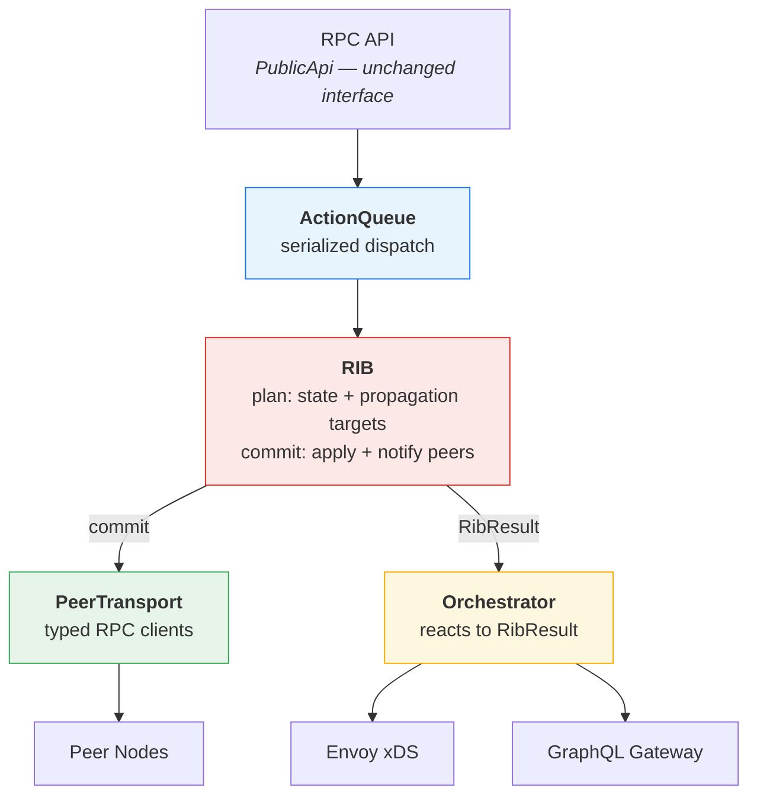

# Orchestrator Refactor: Analysis and Proposal

**Date:** 2026-02-12
**Scope:** `apps/orchestrator/src/orchestrator.ts` (~1040 lines)

---

## Part 1: What's Wrong

The orchestrator works, but `CatalystNodeBus` has grown into a god class that does
everything in one place. Adding eBGP to this structure would mean doubling the already
largest method in the file. Here's what's going on, grouped by theme.

### The Monolith Problem

`CatalystNodeBus` owns **eight responsibilities** in a single class:

| Concern                            | Where                          | Size       |
| ---------------------------------- | ------------------------------ | ---------- |
| Route table state management       | `handleAction()` switch        | ~150 lines |
| BGP route propagation              | `handleBGPNotify()` switch     | ~260 lines |
| Envoy xDS config + port allocation | `handleEnvoyConfiguration()`   | ~85 lines  |
| GraphQL gateway sync               | `handleGraphqlConfiguration()` | ~35 lines  |
| Auth token validation              | `validateToken()`              | ~35 lines  |
| RPC connection pooling             | `ConnectionPool`               | ~30 lines  |
| Public API surface                 | `publicApi()`                  | ~95 lines  |
| Node config validation             | `validateNodeConfig()`         | ~12 lines  |

The codebase already defines `StatePlugin` and `NotificationPlugin` interfaces in
`types.ts` -- but nothing uses them. The actual code is monolithic switch statements.

The `handleBGPNotify` method for `InternalProtocolOpen` (lines 558-613) and
`InternalProtocolConnected` (lines 615-663) are **~90 lines of copy-pasted code**. The
4-step RPC ceremony (get stub, get token, get client, call method) repeats **9 times**
with no abstraction.

### The Concurrency Problem

`dispatch()` does `this.state = result.state` with no serialization:

```
dispatch(A):  read state_0  -->  write state_1  -->  notify(A)...
dispatch(B):  read state_0  -->  write state_2  -->  notify(B)...
                   ^^ stale — state_1 is lost
```

Node.js is single-threaded but every `await` yields to the event loop. Two peers sending
updates simultaneously can interleave. This is rare with iBGP (few peers, low traffic) but
becomes a real problem with eBGP where update volume increases significantly.

Side effects fire sequentially and never retry:

```typescript
await this.handleEnvoyConfiguration(...)  // slow Envoy blocks everything
await this.handleBGPNotify(...)           // then peers contacted one at a time
await this.handleGraphqlConfiguration()   // then gateway sync
```

A transient RPC failure during route propagation is caught, logged, and forgotten. No
retry, no reconciliation, no way to detect that peers have diverged.

### The Routing Model Problem

The orchestrator uses a simplified ad-hoc model that cannot express eBGP:

| BGP Concept       | What Exists                 | What's Needed for eBGP                                   |
| ----------------- | --------------------------- | -------------------------------------------------------- |
| Loop detection    | `nodePath` (FQDNs)          | `AS_PATH` (ASN sequence)                                 |
| Path preference   | None -- all routes kept     | `LOCAL_PREF`, `MED`, best path selection                 |
| Propagation rules | Flood everything everywhere | iBGP split-horizon, eBGP re-advertisement                |
| AS identity       | Not present                 | `ASN` per node, session type derived from ASN comparison |
| RIB structure     | Flat `routes[]` arrays      | Adj-RIB-In / Loc-RIB / Adj-RIB-Out                       |

There are actually **two disconnected BGP type systems** in the repo:

- `apps/node/src/types/bgp/` has faithful BGP types: `OpenMessage` with `myAsn`,
  `PathAttributes` with `asPath`/`localPref`/`communities`, and proper RIB interfaces
- `packages/routing/` has the ad-hoc model the orchestrator actually uses

These share no code. The proper types exist but are unused.

### The Integration Problem

**Deep import violation**: The orchestrator reaches into `@catalyst/envoy-service`
internals:

```typescript
import { createPortAllocator } from '@catalyst/envoy-service/src/port-allocator.js'
```

This bypasses the package's public API. If envoy-service refactors its internals, the
orchestrator breaks.

**Untyped RPC stubs**: Two `@ts-expect-error` comments (lines 512, 885) suppress type
errors where `ConnectionPool` (typed as `RpcStub<PublicApi>`) is used to call Envoy and
Gateway methods that don't exist on `PublicApi`. The type system provides no safety for
these integration points.

**Dead dependency**: `@catalyst/auth-service` appears in `package.json` but is never
imported.

### The Peer Lifecycle Problem

The orchestrator has a 3-state peer model (`initializing`, `connected`, `closed`) with
**no keepalive, no hold timer, and no dead peer detection**:

- `BGP_PROTOCOL.md` describes hold time (180s default) and keepalive (every 60s)
- `INTERNAL_PEERING.md` describes `resetHoldTimer()` on keepalive receipt
- `apps/node/src/types/peering/connection.ts` defines KEEPALIVE message types
- **None of this is implemented in the orchestrator**

If a peer silently fails (network partition, process hang), its routes remain in the
table indefinitely. The orchestrator only detects peer death when the next RPC call
happens to fail, and there is no mechanism to trigger that proactively.

---

## Part 2: Proposal -- Unified RIB Pipeline

The current orchestrator splits work into two phases -- state mutation (`handleAction`)
then side effects (`handleNotify`) -- but this separation is artificial. The BGP
propagation logic in `handleBGPNotify` needs to know what state changed, duplicates
routing decisions that should live with the state, and is the source of most of the
complexity.

The fix: **the RIB owns both mutation and propagation as a single atomic operation.**
The orchestrator becomes a thin shell that feeds actions into the RIB and reacts to its
output for non-routing concerns (Envoy, GraphQL).

### The Pipeline



### How dispatch() Maps to the Pipeline

```
Current:                              Proposed:
────────────────────                  ──────────────────────────────────────
dispatch(action)                      ActionQueue.enqueue(action)
  │                                     │
  ├─ handleAction(action, state)        ├─ rib.plan(action)
  │    (state mutation only)            │    → computes new state
  │                                     │    → computes propagation targets
  ├─ handleNotify(action, ...)          │    → returns Plan (pure, sync)
  │    ├─ handleEnvoyConfig             │
  │    ├─ handleBGPNotify          ──▶  ├─ rib.commit(plan, transport)
  │    │    (260 lines, 9 switch        │    → applies state atomically
  │    │     cases, sequential          │    → notifies peers via PeerTransport
  │    │     peer-by-peer RPC)          │    → returns RibResult
  │    └─ handleGraphqlConfig           │
  │                                     ├─ orchestrator.onRibResult(result)
  │                                     │    ├─ envoy push       ─┐
  │                                     │    └─ gateway sync     ─┘ concurrent
  └─ return result                      └─ return result
```

The key difference: **there is no separate "notify phase" for routing.** The RIB's
`commit()` handles both state application and peer notification as one operation.
The orchestrator only reacts to truly external side effects (Envoy, GraphQL).

### Component Details

#### 1. ActionQueue

Serializes dispatch so concurrent actions don't clobber state. ~15 lines:

```typescript
class ActionQueue {
  private queue: Array<{ action: Action; resolve: Function; reject: Function }> = []
  private processing = false

  enqueue(action: Action): Promise<DispatchResult> {
    return new Promise((resolve, reject) => {
      this.queue.push({ action, resolve, reject })
      if (!this.processing) this.processNext()
    })
  }

  private async processNext(): Promise<void> {
    this.processing = true
    while (this.queue.length > 0) {
      const { action, resolve, reject } = this.queue.shift()!
      try {
        resolve(await this.pipeline(action))
      } catch (e) {
        reject(e)
      }
    }
    this.processing = false
  }
}
```

Action B always sees the state produced by action A. No added latency for single actions
-- the queue drains eagerly within the same microtask chain. The mutex hold time is
microseconds (pure computation in `plan()`, state assignment in `commit()`), so
contention is negligible.

#### 2. RIB (Routing Information Base)

The RIB replaces both `handleAction` and `handleBGPNotify`. It owns the routing state
and knows how to propagate changes -- these are not separate concerns. This matches how
real BGP implementations work (BIRD, FRR, GoBGP): one pipeline from input to
propagation.

**Data model** -- the current flat `RouteTable` is preserved for phase 1, then evolves
toward Adj-RIB-In / Loc-RIB / Adj-RIB-Out in later phases:

```typescript
// Phase 1: preserve existing RouteTable shape
interface RibState {
  local: { routes: DataChannelDefinition[] }
  internal: { peers: PeerRecord[]; routes: InternalRoute[] }
}

// Phase 2 (future): proper BGP RIB structure
interface RibState {
  adjRibIn: Map<string, RibEntry[]> // peer -> routes received
  locRib: Map<string, LocRibEntry> // prefix -> best route + alternatives
  adjRibOut: Map<string, RibEntry[]> // peer -> routes to advertise
  peers: Map<string, PeerRecord> // peer state + timers
}
```

**Route metadata** -- the Loc-RIB records not just the best path but operational context:

```typescript
interface LocRibEntry {
  bestPath: RibEntry // the selected route
  alternatives: RibEntry[] // all candidate routes from Adj-RIB-In
  selectionReason: string // why this path was chosen (debugging)
}

interface RibEntry {
  prefix: string
  attributes: RouteAttributes // asPath, nextHop, localPref, med, communities
  peerName: string
  peerType: 'ibgp' | 'ebgp'
  receivedAt: number // timestamp for route age comparisons
}
```

**The plan/commit cycle**:

```typescript
class RoutingInformationBase {
  private state: RibState

  plan(action: Action): Plan {
    // 1. Compute new state (what handleAction does today)
    const newState = this.reduce(action, this.state)

    // 2. Compute propagation targets (what handleBGPNotify figures out ad-hoc today)
    const propagations = this.computePropagations(action, this.state, newState)

    return { action, prevState: this.state, newState, propagations }
  }

  async commit(plan: Plan, transport: PeerTransport): Promise<RibResult> {
    // 1. Apply state atomically (sync -- under mutex)
    this.state = plan.newState

    // 2. Execute peer notifications (concurrent fan-out, outside mutex)
    const peerResults = await transport.fanOut(plan.propagations)

    // 3. Return result so orchestrator can handle external side effects
    return {
      action: plan.action,
      prevState: plan.prevState,
      newState: plan.newState,
      routesChanged: this.didRoutesChange(plan.prevState, plan.newState),
      peerResults,
    }
  }
}
```

**Why this is better than state/notify split**: In the current code, `handleBGPNotify`
re-derives what changed by inspecting the action type and re-reading state. It
duplicates routing logic (loop detection, path filtering, envoyPort rewriting) that
already exists in `handleAction`. With the unified RIB, the `plan()` step computes
both the state delta and the propagation targets in one pass -- no duplication, no
re-derivation.

**`selectBestPath`** -- standard BGP decision process (future phase):

1. Highest LOCAL_PREF
2. Shortest AS_PATH
3. Lowest origin (igp < egp < incomplete)
4. Lowest MED from same neighbor AS
5. eBGP over iBGP
6. Lowest peer address (deterministic tie-break)

**`shouldPropagate`** -- iBGP/eBGP split-horizon (future phase):

- Route learned via eBGP --> advertise to all peers
- Route learned via iBGP --> advertise to eBGP peers only (unless route reflector)
- Never advertise back to originating peer
- Never advertise if AS_PATH contains target's ASN

**Backward compatibility**: Nodes without ASN config operate in a single implicit AS. The
existing `nodePath` loop detection is preserved alongside `asPath`. Current iBGP-only
behavior is unchanged.

#### 3. PeerTransport

Thin wrapper around `ConnectionPool` + capnweb that the RIB's `commit()` delegates to
for actual network I/O. The RIB decides _what_ to send; PeerTransport handles _how_.

**Separate stubs per service type** -- no more `@ts-expect-error`:

```typescript
class PeerTransport {
  private peerPool: ConnectionPool // peer-to-peer RPC (PublicApi)

  constructor(
    pool: ConnectionPool,
    private nodeIdentity: PeerInfo,
    private nodeToken?: string
  ) {
    this.peerPool = pool
  }
}
```

The orchestrator keeps separate typed stubs for Envoy and Gateway -- these are
infrastructure concerns, not routing concerns, and stay outside PeerTransport.

**Encapsulate the RPC ceremony** -- the 4-step pattern becomes one call:

```typescript
async sendUpdate(peer: PeerRecord, update: UpdateMessage): Promise<void> {
  const stub = this.peerPool.get(peer.endpoint)
  if (!stub) return
  const token = peer.peerToken || this.nodeToken
  if (!token) throw new Error(`No token for peer ${peer.name}`)
  const result = await stub.getIBGPClient(token)
  if (result.success) await result.client.update(this.nodeIdentity, update)
}

async sendOpen(peer: PeerRecord): Promise<void> { ... }
async sendClose(peer: PeerRecord, code: number, reason?: string): Promise<void> { ... }
```

**Concurrent fan-out with retry**:

```typescript
async fanOut(propagations: Propagation[]): Promise<PeerResult[]> {
  return Promise.allSettled(
    propagations.map(({ peer, method, args }) =>
      this.withRetry(() => this[method](peer, ...args), { attempts: 3, backoff: 1000 })
    )
  )
}
```

With 5 peers this goes from 10 serial round trips to 2 parallel round trips. Failed
sends retry with exponential backoff (3 attempts, ~1s base) instead of being silently
dropped.

#### 4. Peer Lifecycle and Keepalive

**4-state peer FSM** (simplified from RFC 4271's 6 states):

```
idle ──(LocalPeerCreate)──> connecting ──(ProtocolOpen/Connected)──> established
  ^                              │                                       │
  │                              │                                       │
  └──────────(ProtocolClose)─────┴──────(holdTimer expired / close)──────┘
```

**Tick-based keepalive**: A single `setInterval` in the orchestrator fires a `Tick`
action through the normal dispatch pipeline:

```typescript
// In the orchestrator
private startTick(): void {
  this.tickInterval = setInterval(() => {
    this.dispatch({ type: 'Tick', now: Date.now() })
  }, this.computeTickInterval())
}
```

The RIB handles `Tick` like any other action in `plan()`:

```
Tick arrives in plan():
  1. For each peer in 'established' state:
     - if (now - peer.lastReceived > peer.holdTime)
         → expire peer: remove from state, withdraw all its routes
     - if (now - peer.lastSent > peer.holdTime / 3)
         → enqueue keepalive to send
  2. Process expirations before keepalives (don't keepalive a dead peer)
  3. Return Plan with state changes + propagations (withdrawals + keepalives)
```

**Peer record extensions**:

```typescript
interface PeerRecord {
  // ... existing fields
  lastReceived: number // timestamp of last message from peer
  lastSent: number // timestamp of last message to peer
  holdTime: number // negotiated hold time (default 180s)
}
```

**Auto-derived tick interval**: `min(holdTime) / 6` across all connected peers.
With default 180s hold time, that's a 30s tick. Gives 6 chances to detect expiry
within one hold period.

**Two-layer failure detection**:

1. **`onRpcBroken`** (primary) -- capnweb fires this immediately on clean disconnects.
   PeerTransport hooks it to dispatch `InternalProtocolClose` through the ActionQueue.
2. **Tick keepalive** (backup) -- catches silent failures like network partitions where
   the TCP connection stays open but no data flows.

**Injectable `now`**: The `Tick` action carries `now` as a parameter instead of calling
`Date.now()` inside the RIB. This makes keepalive/expiry logic deterministic and
trivially testable without mocking timers.

#### 5. Orchestrator (the thin shell)

After the RIB handles routing, the orchestrator is just wiring:

```typescript
class Orchestrator {
  private queue: ActionQueue
  private rib: RoutingInformationBase
  private transport: PeerTransport
  private portAllocator?: PortAllocator

  async dispatch(action: Action): Promise<DispatchResult> {
    return this.queue.enqueue(action)
  }

  // Called by ActionQueue for each serialized action
  private async pipeline(action: Action): Promise<DispatchResult> {
    const plan = this.rib.plan(action)
    if (!plan.success) return { success: false, error: plan.error }

    const result = await this.rib.commit(plan, this.transport)

    // Only external side effects remain here
    if (result.routesChanged) {
      this.handlePortAllocation(result)
      await Promise.allSettled([
        this.syncEnvoy(result),
        this.syncGraphQL(result),
      ])
    }

    return { success: true }
  }

  private handlePortAllocation(result: RibResult): void { ... }
  private async syncEnvoy(result: RibResult): Promise<void> { ... }
  private async syncGraphQL(result: RibResult): Promise<void> { ... }
}
```

This is ~150 lines. The 1040-line god class becomes a coordinator that owns no routing
logic. Port allocation, Envoy config, and GraphQL sync remain on the orchestrator
because they are infrastructure concerns, not routing decisions.

The `publicApi()` method is unchanged -- it produces the same `PublicApi` interface,
maintaining backward compatibility with all existing callers including tests.

### How eBGP Plugs In

With the unified RIB, eBGP is not a rewrite -- it's a configuration change:

1. **Config**: Add `asn: number` to `NodeConfig`. Add `peerType: 'ibgp' | 'ebgp'` to
   peer records (derived automatically: same ASN = iBGP, different ASN = eBGP).

2. **RIB**: Already protocol-aware. `selectBestPath()` and `shouldPropagate()` handle
   iBGP and eBGP routes through the same decision process. The RIB gains entries with
   `peerType: 'ebgp'` -- no structural changes needed.

3. **PeerTransport**: eBGP peers use the same RPC transport. The only difference is the
   session setup (OPEN message includes ASN) and that eBGP connections may go through
   different network paths.

No existing iBGP code needs to change. The RIB's propagation rules automatically handle
the interaction between iBGP and eBGP learned routes.

### Package Boundary Fixes

- **Deep import**: Re-export `createPortAllocator` from `@catalyst/envoy-service`'s
  barrel file (`apps/envoy/src/index.ts`) instead of importing from
  `src/port-allocator.js`.
- **Dead dependency**: Remove `@catalyst/auth-service` from orchestrator's `package.json`.
- **Dead interfaces**: Remove unused `StatePlugin` and `NotificationPlugin` from
  `apps/orchestrator/src/types.ts`.

---

## Part 3: Implementation Plan -- Stacked PRs

Each PR is a single `gt create` commit. Tests must pass at every step. Existing Envoy,
Auth, and GraphQL integrations remain functional throughout.

### PR Stack

```
main
 └─ 1-package-boundary-fixes
     └─ 2-add-tick-action-type
         └─ 3-extract-peer-transport
             └─ 4-add-action-queue
                 └─ 5-extract-rib-plan-commit
                     └─ 6-thin-shell-orchestrator
                         └─ 7-keepalive-tick
                             └─ 8-route-metadata
```

### PR 1: Package boundary fixes

**Risk: Low** | **Files: 4** | **Tests: existing pass, no new tests needed**

Changes:

- `apps/envoy/src/index.ts`: Re-export `createPortAllocator` and `PortAllocator` type
- `apps/orchestrator/src/orchestrator.ts`: Change import to use barrel export
- `apps/orchestrator/package.json`: Remove `@catalyst/auth-service`
- `apps/orchestrator/src/types.ts`: Remove unused `StatePlugin`, `NotificationPlugin`,
  keep `OrchestratorConfig`

Verification: all existing orchestrator tests pass unchanged.

### PR 2: Add `Tick` action type

**Risk: Low** | **Files: 3** | **Tests: 1 new schema test**

Changes:

- `packages/routing/src/action-types.ts`: Add `Tick: 'system:tick'`
- `packages/routing/src/schema.ts`: Add `TickMessageSchema` to discriminated union
- `packages/routing/tests/tick-action.test.ts`: Validate schema parse/reject

The Tick action carries `{ action: 'system:tick', data: { now: number } }`.

Verification: routing package tests pass + new test.

### PR 3: Extract PeerTransport

**Risk: Low** | **Files: 4-5** | **Tests: 1 new test file**

Changes:

- `apps/orchestrator/src/peer-transport.ts`: New file. Extract `sendUpdate`,
  `sendOpen`, `sendClose`, `fanOut` from the 9 repeated RPC ceremony sites in
  `handleBGPNotify`. Encapsulate the 4-step pattern (get stub, get token, get client,
  call method) into single methods.
- `apps/orchestrator/src/orchestrator.ts`: Import PeerTransport, delegate all peer RPC
  calls to it. The switch cases in `handleBGPNotify` shrink from ~15 lines each to
  ~2-3 lines each.
- `apps/orchestrator/tests/peer-transport.test.ts`: Unit tests for sendUpdate, sendOpen,
  sendClose, fanOut with mocked ConnectionPool.
- `apps/orchestrator/tests/mock-connection-pool.ts`: May need minor updates.

The orchestrator still calls PeerTransport directly from `handleBGPNotify` -- the RIB
does not exist yet. This is purely extracting existing code into a helper.

Verification: all existing tests pass + new PeerTransport unit tests.

### PR 4: Add ActionQueue

**Risk: Low** | **Files: 3** | **Tests: 1 new test file**

Changes:

- `apps/orchestrator/src/action-queue.ts`: New file. ~20 lines. Promise-based queue
  that serializes dispatch through a `pipeline` callback.
- `apps/orchestrator/src/orchestrator.ts`: Wrap `dispatch()` to use ActionQueue.
  The `pipeline` callback is the existing dispatch body.
- `apps/orchestrator/tests/action-queue.test.ts`: Tests for serialization:
  - Two concurrent dispatches produce sequential state transitions
  - Single dispatch has no added latency
  - Rejection in pipeline propagates correctly

Verification: all existing tests pass (they're already sequential, so ActionQueue is
transparent) + new ActionQueue unit tests.

### PR 5: Extract RIB with plan/commit

**Risk: Medium** | **Files: 5-6** | **Tests: 1 new test file, update existing**

This is the big move. The existing routing logic from `handleAction` and the
propagation-target computation from `handleBGPNotify` are unified into the RIB.

Changes:

- `apps/orchestrator/src/rib.ts`: New file. `RoutingInformationBase` class with:
  - `plan(action)`: Pure, synchronous. Contains the `handleAction` switch statement
    (state mutation) + propagation target computation (extracted from each
    `handleBGPNotify` case). Returns `Plan` with new state + propagation list.
  - `commit(plan, transport)`: Applies state, delegates to PeerTransport for fan-out,
    returns `RibResult`.
  - `getState()`: Read-only accessor for orchestrator to pass to Envoy/GraphQL.
- `apps/orchestrator/src/orchestrator.ts`: Replace `handleAction` + `handleBGPNotify`
  with `rib.plan()` + `rib.commit()`. Delete the two methods. The orchestrator's
  pipeline becomes: `plan → commit → syncEnvoy + syncGraphQL`.
- `apps/orchestrator/tests/rib.test.ts`: Unit tests for plan():
  - LocalRouteCreate produces propagation to all connected peers
  - InternalProtocolUpdate propagates to other peers (not source)
  - InternalProtocolClose withdraws routes from disconnected peer
  - Loop prevention drops routes containing local node in nodePath
  - Plan is pure (does not mutate state)
- Update `mock-connection-pool.ts` if needed for PeerTransport integration.

Key constraint: **behavior must be identical to current code**. The RIB uses the same
`RouteTable` shape, same loop detection, same envoyPort rewriting. No new BGP semantics
yet.

Verification: all 20 existing orchestrator tests pass unchanged + new RIB unit tests.

### PR 6: Thin shell orchestrator

**Risk: Low** | **Files: 3-4** | **Tests: existing pass**

With the RIB handling state + propagation and PeerTransport handling RPC, the
orchestrator sheds most of its code.

Changes:

- `apps/orchestrator/src/orchestrator.ts`: Delete `handleAction`, `handleBGPNotify`,
  `handleNotify`, `propagateWithdrawalsForPeer`. Keep: constructor, `dispatch` (via
  ActionQueue), `pipeline`, `syncEnvoy`, `syncGraphQL`, `validateToken`, `publicApi`.
  Move `ConnectionPool` into its own file or into `peer-transport.ts`.
- `apps/orchestrator/src/orchestrator.ts` should be ~150-200 lines after this.
- Orchestrator reacts to `RibResult.routesChanged` to decide whether to push Envoy
  and GraphQL configs.

Verification: all 20 existing tests pass. The test surface is unchanged because
`publicApi()` and `dispatch()` signatures are identical.

### PR 7: Keepalive tick

**Risk: Medium** | **Files: 4-5** | **Tests: 1 new test file**

Changes:

- `apps/orchestrator/src/orchestrator.ts`: Add `startTick()` / `stopTick()` using
  `setInterval`. Fires `{ action: 'system:tick', data: { now: Date.now() } }` through
  `dispatch()`. Auto-derives interval from `min(holdTime) / 6`.
- `packages/routing/src/state.ts`: Add `lastReceived`, `lastSent`, `holdTime` to
  `PeerRecord` (all optional for backward compat).
- `apps/orchestrator/src/rib.ts`: Handle `Tick` in `plan()`:
  - Check each established peer's `lastReceived` vs `holdTime`
  - Expire dead peers (produce state change + withdrawal propagations)
  - Generate keepalive propagations for peers approaching `holdTime / 3`
  - Process expirations before keepalives
- `apps/orchestrator/tests/keepalive.test.ts`: Tests with injectable `now`:
  - Peer expires when `now - lastReceived > holdTime`
  - Keepalive sent when `now - lastSent > holdTime / 3`
  - Expired peer's routes are withdrawn to remaining peers
  - Envoy is notified after peer expiry (routes changed)

Verification: all existing tests pass (Tick action is no-op when no peers have
`holdTime` set) + new keepalive tests.

### PR 8: Route metadata

**Risk: Low** | **Files: 3** | **Tests: 1 new test file**

Changes:

- `apps/orchestrator/src/rib.ts`: Enrich plan output with route metadata:
  - Track all candidate routes per prefix (Adj-RIB-In retention)
  - Mark best path and alternatives in result
  - Include `selectionReason` (e.g., "only candidate", "shortest nodePath")
- `packages/routing/src/state.ts`: Add `LocRibEntry` type with `bestPath`,
  `alternatives[]`, `selectionReason`.
- `apps/orchestrator/tests/route-metadata.test.ts`: Tests:
  - Single route is best with reason "only candidate"
  - Two routes from different peers: shorter nodePath wins
  - Alternatives array contains non-selected routes
  - Withdrawal removes from alternatives

Verification: all existing tests pass + new metadata tests. Existing `listRoutes()`
behavior unchanged (returns flat arrays). Metadata is additional, not replacing.
