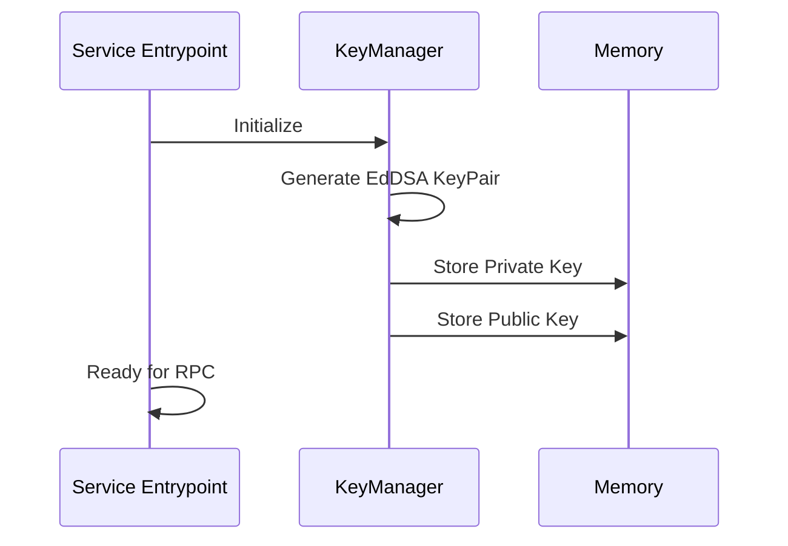
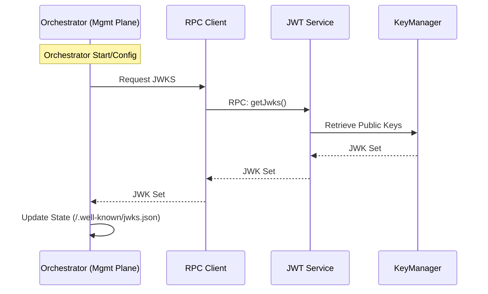
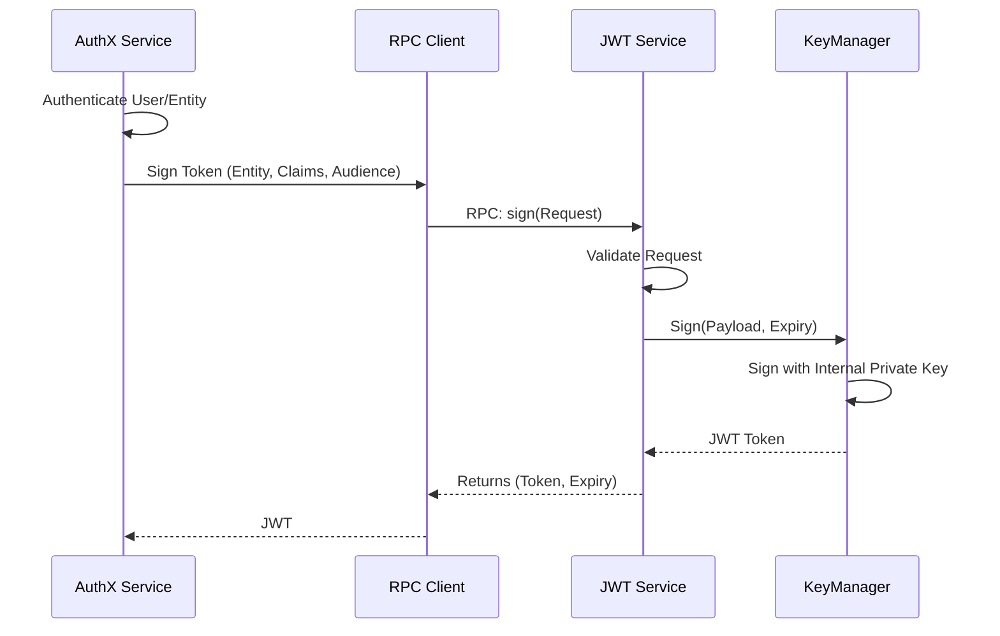
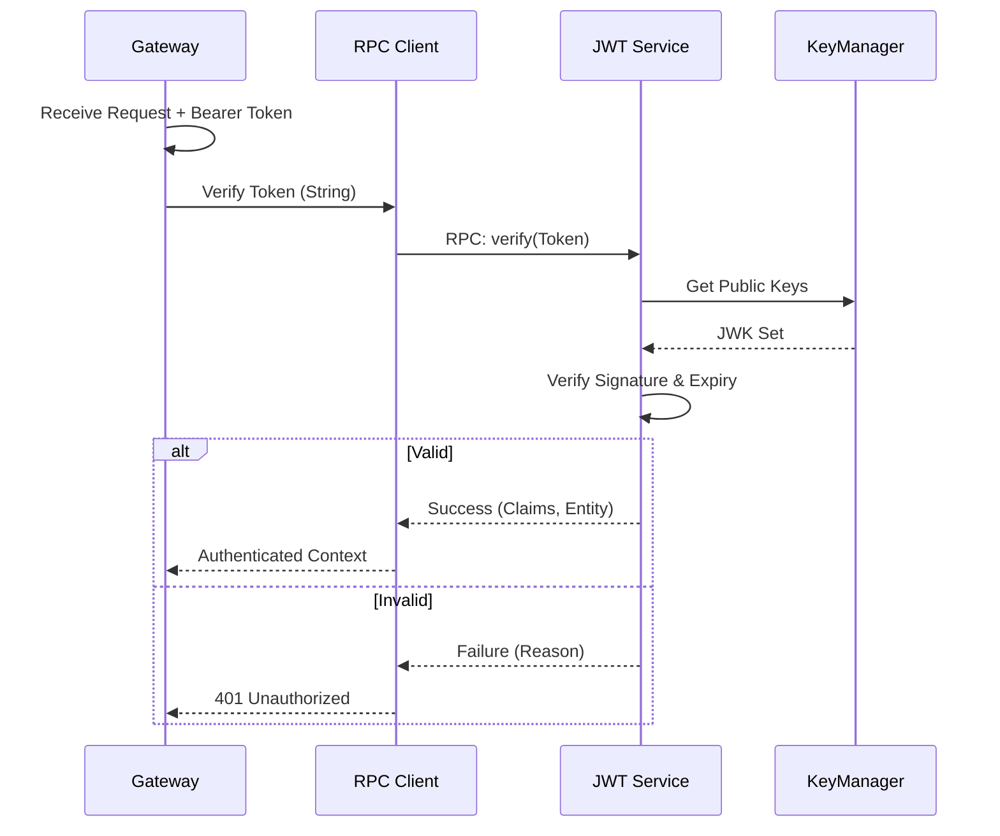
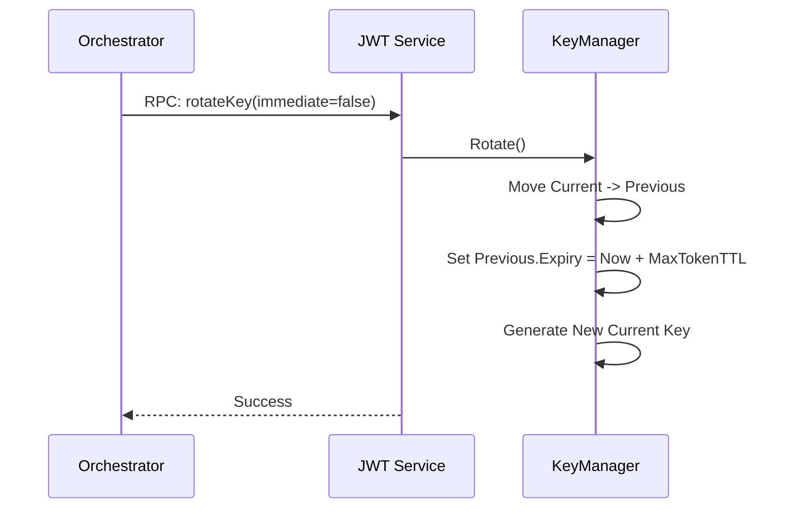

# JWT/JWKS Service Design

> **Note**: This document describes the original design proposal for the JWT service. The actual implementation differs in several ways:
>
> - **Algorithm**: ES384 (not EdDSA)
> - **Key Storage**: Persistent SQLite via `BunSqliteKeyStore` (not in-memory)
> - **Package Location**: `packages/authorization` (not `packages/jwt`)
> - **Key Manager**: `PersistentLocalKeyManager` class
>
> See the [Architecture Overview](./overview.md) for the current implementation details.

This document outlines the design for the new standalone JWT service package. This service acts as a centralized authority for token signing and verification within the Catalyst control plane, replacing legacy logic.

## 1. System Overview

The JWT Service is a standalone containerized application responsible for:

1.  **Key Management**: Generating and maintaining ephemeral cryptographic keys (EdDSA) in memory.
2.  **Token Signing**: Issuing JWTs for authenticated entities (e.g., users, services, data channels).
3.  **Token Verification**: Validating JWT signatures and claims.
4.  **JWKS Exposure**: Providing the public key set via RPC for broader distribution (e.g., via the Orchestrator's `/.well-known/jwks.json` endpoint).

The service exposes its functionality primarily through a **CapnWeb RPC** interface.

## 2. Architecture

### 2.1 Components

- **KeyManager**: A specialized component responsible for all cryptographic operations. It encapsulates the key material (private keys) and exposes high-level methods (`sign`, `rotate`, `getPublicKeys`). This design allows for future replacement with a Cloud KMS (AWS KMS, Google Secret Manager) without changing the Service layer.
- **RPC Server**: Implements the service contract to expose signing, verification, and JWKS retrieval methods.

### 2.2 Key Lifecycle

- **Startup**: The default KeyManager generates a fresh EdDSA key pair immediately upon startup.
- **Storage**: Keys are held in memory only. Restarting the service invalidates previous tokens (mechanisms for persistence can be added later if needed, but for now, ephemeral is desired).
- **Rotation**: Supports a method to rotate keys on demand.
  - **Graceful Rotation**: Moves the current key to a `deprecated` state. It remains valid for verification until a specified expiry (e.g., max token lifetime) but is no longer used for signing.
  - **Immediate Rotation**: Immediately invalidates the current key.

## 3. Protocol Diagrams

### 3.1 Key Generation (Startup)



### 3.2 JWKS Distribution

The Management Plane (Orchestrator) fetches the JWKS to expose it publicly.



### 3.3 Token Signing



### 3.4 Token Validation



### 3.5 Key Rotation



## 4. Implementation Details

### 4.1 Data Structures

We will reuse and stick to the schemas defined in `@catalyst/schemas`.

**Key State (Internal):**

```typescript
interface KeyState {
  privateKey: KeyLike
  publicKey: KeyLike
  kid: string // UUID
  created: number
  // For rotation:
  expiresAt?: number // When this key should stop being used for verification
}
```

**RPC Interface (Conceptual):**

```typescript
// Interface for the CapnWeb RPC
interface IJwtService {
  // Returns the standard JWKS (JSON Web Key Set)
  // Includes current key, and previous key if not expired
  getJwks(): Promise<JSONWebKeySet>

  // Signs a payload
  sign(req: JWTSigningRequest): Promise<JWTSigningStandardResponse>

  // Verifies a token string
  verify(token: string): Promise<JWTParsingResponse>

  // Rotates the key
  // immediate: if true, old key is discarded immediately.
  //            if false, old key is kept for verification until max token duration passes.
  rotate(immediate: boolean): Promise<void>
}
```

### 4.2 Code References

The implementation will closely follow the patterns in `authx_token_api`.

**Dependencies:**

- `jose`: For key generation (`generateKeyPair`), signing (`SignJWT`), and verification (`jwtVerify`).
- `zod`: For validation (using `@catalyst/schemas`).
- `uuid`: For key IDs.

**Key Generation Example:**

```typescript
import { generateKeyPair, exportJWK } from 'jose'

const alg = 'EdDSA'

export async function generateKey() {
  const { publicKey, privateKey } = await generateKeyPair(alg, { extractable: true })
  // cache these...
  return { publicKey, privateKey }
}
```

## 5. Directory Structure

```
packages/
  jwt/
    src/
      index.ts        # Entrypoint, exports RPC server
      service.ts      # Main service logic
      key-manager.ts  # Key generation and storage
      rpc.ts          # CapnWeb RPC definitions
    package.json
    Dockerfile
```

## 6. Development Plan

1.  Initialize `packages/jwt`.
2.  Implement `KeyManager` with `jose`.
3.  Implement `JWTService` class with `sign`, `verify`, `getJwks`.
4.  Wrap with CapnWeb RPC server.
5.  Create Dockerfile for standalone execution.
6.  Unit tests using the generated keys.
