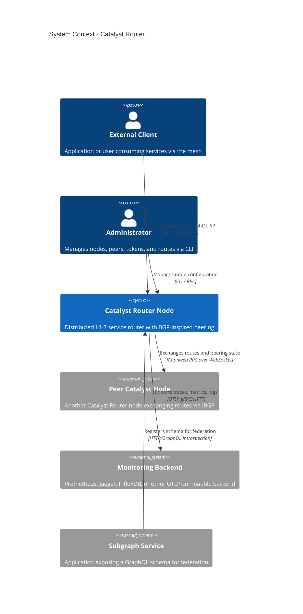
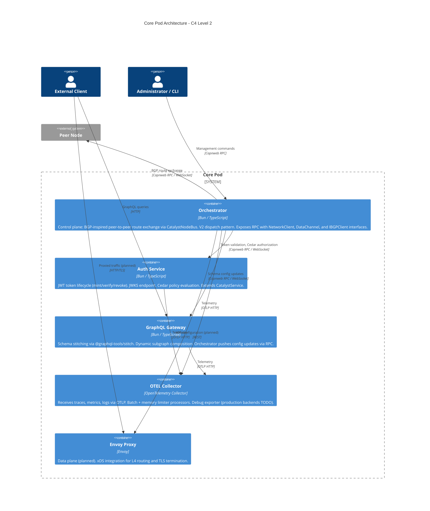
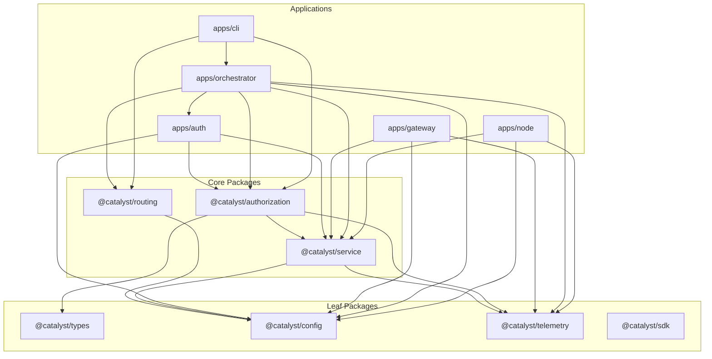
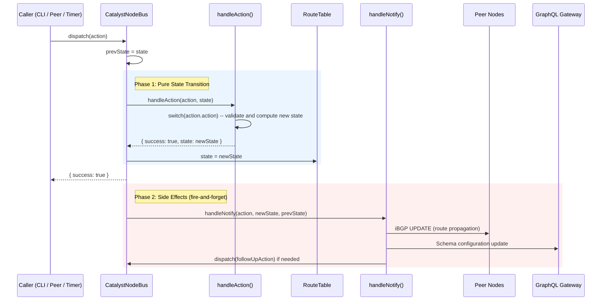
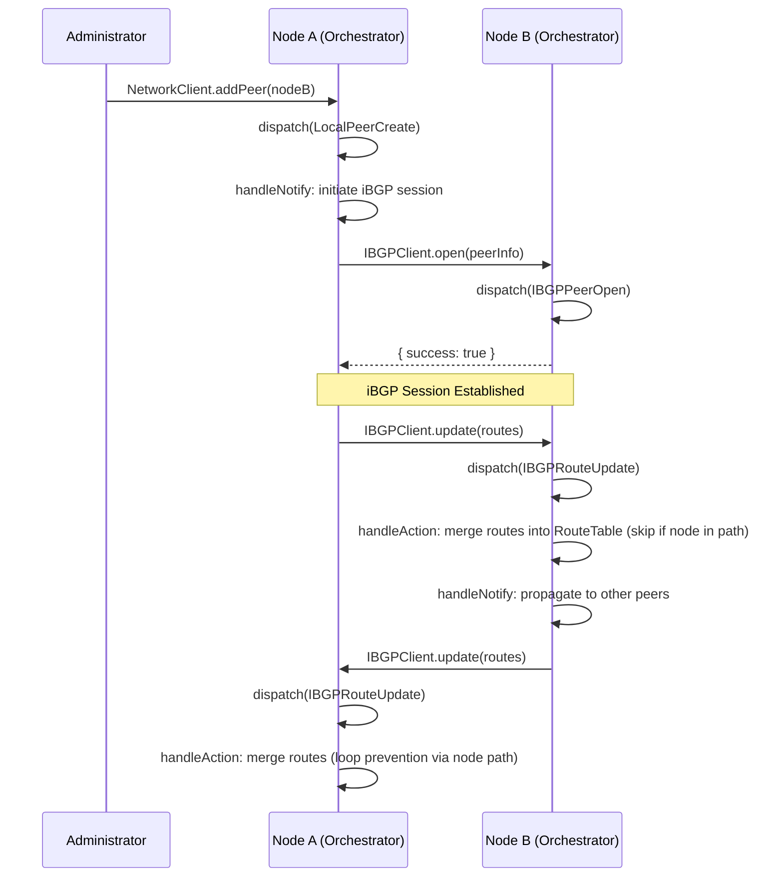
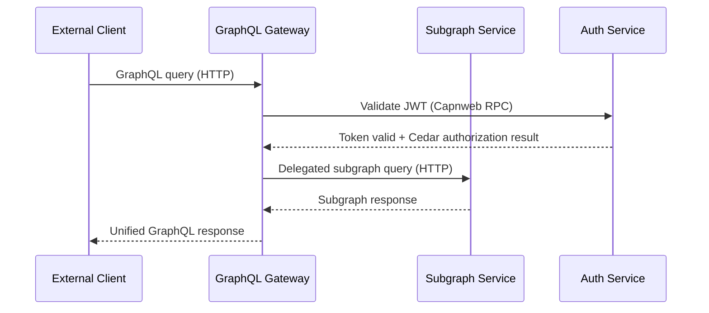

# Architecture

> **Licensor**: Orbis Operations LLC
> **Last updated**: 2026-02-11
> **Authoritative governance**: [[constitution|constitution.md]]

---

## 1. Overview

Catalyst Router is a distributed control and data plane that uses a BGP-inspired protocol for L4-7 service routing. It enables organizations to peer services across trust boundaries without a centralized registry or coordinator -- each node maintains its own route table and exchanges routes with peers, converging to a consistent view of the network through eventually-consistent propagation.

The system is built around a "Core Pod" deployment model: each node runs an orchestrator process alongside sidecar services (auth, GraphQL gateway, OTEL collector) that communicate over Capnweb RPC (Cap'n Proto over WebSocket). This architecture ensures operational simplicity while maintaining clear separation of concerns between control plane, data plane, and observability.

The [[constitution|constitution.md]] is the authoritative governance document for all architectural decisions. It defines 18 immutable principles covering structural patterns, quality standards, and operational requirements. All code changes must comply with these principles; violations are critical findings that block merge.

---

## 2. System Context

The following diagram shows Catalyst Router in its operating environment at the C4 Level 1 (System Context) view.



---

## 3. Core Pod Architecture

The deployment unit is a **Core Pod** -- a cohesive set of components orchestrated by the main Catalyst Router process. All inter-component communication uses Capnweb RPC over WebSocket (Constitution Principle II).



### Component Responsibilities

| Component           | App/Config                                  | Role                                                                                                                                                                                                                                                                                        |
| ------------------- | ------------------------------------------- | ------------------------------------------------------------------------------------------------------------------------------------------------------------------------------------------------------------------------------------------------------------------------------------------- |
| **Orchestrator**    | `apps/orchestrator`                         | Control plane brain. BGP-inspired peer-to-peer route exchange via `CatalystNodeBus`. V2 dispatch pattern: `dispatch()` -> `handleAction()` (pure state transitions) -> `handleNotify()` (side effects). Exposes RPC with 3 client interfaces: `NetworkClient`, `DataChannel`, `IBGPClient`. |
| **Auth Service**    | `apps/auth`                                 | JWT token lifecycle (mint, verify, revoke). JWKS endpoint for key distribution. Cedar policy evaluation for fine-grained authorization. Extends `CatalystService`.                                                                                                                          |
| **GraphQL Gateway** | `apps/gateway`                              | Federation engine using `graphql-yoga` and `@graphql-tools/stitch`. Dynamically stitches remote GraphQL schemas into a unified API. Receives subgraph configuration from Orchestrator via RPC and hot-swaps schemas.                                                                        |
| **OTEL Collector**  | `docker-compose/otel-collector-config.yaml` | Universal telemetry sink. Receives OTLP over gRPC (:4317) and HTTP (:4318). Runs `memory_limiter` then `batch` processors. Currently exports to `debug`; production backends are TODO.                                                                                                      |
| **Envoy Proxy**     | Planned                                     | Data plane for L4 routing. Will receive dynamic configuration via xDS from the Orchestrator.                                                                                                                                                                                                |

---

## 4. Package Map

### Applications

| Package             | Name                             | Purpose                                                 |
| ------------------- | -------------------------------- | ------------------------------------------------------- |
| `apps/orchestrator` | `@catalyst/orchestrator-service` | Control plane, BGP routing, peer management, RPC server |
| `apps/auth`         | `@catalyst/auth-service`         | JWT + Cedar authorization service                       |
| `apps/gateway`      | `@catalyst/gateway-service`      | GraphQL federation gateway                              |
| `apps/node`         | `@catalyst/node-service`         | Lightweight standalone node                             |
| `apps/cli`          | `@catalyst/cli`                  | Command-line management tool                            |

### Libraries

| Package                  | Name                      | Purpose           | Key Exports                                                                                                                                 |
| ------------------------ | ------------------------- | ----------------- | ------------------------------------------------------------------------------------------------------------------------------------------- |
| `packages/authorization` | `@catalyst/authorization` | Auth subsystem    | `JWTTokenFactory`, Cedar engine, `AuthService`, key management, token stores (SQLite), `Role`, `Principal`, `Action` enums, `jwtToEntity()` |
| `packages/config`        | `@catalyst/config`        | Configuration     | Zod-validated config schemas, env var loader (`CATALYST_*` variables), `NodeConfigSchema`, `OrchestratorConfigSchema`                       |
| `packages/routing`       | `@catalyst/routing`       | Route management  | Route types, action definitions (`Actions`), `RouteTable` state, `DataChannelDefinition` schemas, `UpdateMessageSchema`                     |
| `packages/service`       | `@catalyst/service`       | Service framework | `CatalystService` base class, `catalystHonoServer()`, lifecycle management (`create()` -> `initialize()` -> `ready` -> `shutdown()`)        |
| `packages/telemetry`     | `@catalyst/telemetry`     | Observability     | `TelemetryBuilder`, OpenTelemetry integration, LogTape logging (`getLogger()`), Hono middleware, Capnweb RPC instrumentation                |
| `packages/types`         | `@catalyst/types`         | Shared types      | Discriminated union `Result<T>`, `ValidationResult<T>`                                                                                      |
| `packages/sdk`           | `@catalyst/sdk`           | External SDK      | Early stage                                                                                                                                 |

---

## 5. Dependency Graph



Dependencies flow inward: applications depend on libraries, libraries depend on leaf packages. Cross-package internal imports are prohibited (Constitution Principle V).

---

## 6. Key Data Flows

### 6a. V2 Dispatch Pattern

The Orchestrator's control plane follows a strict two-phase dispatch pattern (Constitution Principle III). All state mutations flow through `dispatch()` on the `CatalystNodeBus`:

1. **`handleAction()`** -- Pure state transition. Receives an `Action` and the current `RouteTable`, returns a new `RouteTable`. No I/O.
2. **`handleNotify()`** -- Side effects. Propagates state changes to peers, updates the gateway, and triggers follow-up actions.



### 6b. Peering Flow

Nodes establish iBGP sessions and exchange routes. Loop prevention uses the node path (similar to BGP AS_PATH).



### 6c. Request Flow

Client requests flow through the GraphQL Gateway, which federates across subgraph services.



---

## 7. Authorization Model

Authorization uses the [Cedar policy engine](https://www.cedarpolicy.com/) with a typed schema (see `packages/authorization/src/policy/src/definitions/schema.cedar`).

### Principals (Roles)

| Role             | Cedar Entity Type          | Purpose                                     |
| ---------------- | -------------------------- | ------------------------------------------- |
| `ADMIN`          | `CATALYST::ADMIN`          | Full system access -- all actions permitted |
| `NODE`           | `CATALYST::NODE`           | Node identity for iBGP operations           |
| `NODE_CUSTODIAN` | `CATALYST::NODE_CUSTODIAN` | Peer management authority                   |
| `DATA_CUSTODIAN` | `CATALYST::DATA_CUSTODIAN` | Route management authority                  |
| `USER`           | `CATALYST::USER`           | Basic login access                          |

### Actions

| Action            | Permitted Principals                              |
| ----------------- | ------------------------------------------------- |
| `LOGIN`           | ADMIN, NODE, DATA_CUSTODIAN, NODE_CUSTODIAN, USER |
| `MANAGE`          | ADMIN, NODE, DATA_CUSTODIAN, NODE_CUSTODIAN, USER |
| `IBGP_CONNECT`    | ADMIN, NODE, NODE_CUSTODIAN                       |
| `IBGP_DISCONNECT` | ADMIN, NODE, NODE_CUSTODIAN                       |
| `IBGP_UPDATE`     | ADMIN, NODE, NODE_CUSTODIAN                       |
| `PEER_CREATE`     | ADMIN, NODE_CUSTODIAN                             |
| `PEER_UPDATE`     | ADMIN, NODE_CUSTODIAN                             |
| `PEER_DELETE`     | ADMIN, NODE_CUSTODIAN                             |
| `ROUTE_CREATE`    | ADMIN, DATA_CUSTODIAN                             |
| `ROUTE_DELETE`    | ADMIN, DATA_CUSTODIAN                             |
| `TOKEN_CREATE`    | ADMIN                                             |
| `TOKEN_REVOKE`    | ADMIN                                             |
| `TOKEN_LIST`      | ADMIN                                             |

### Authorization Flow

JWT tokens carry a `principal` field (Cedar entity type, e.g., `CATALYST::ADMIN`) and an `entity` payload. At authorization time, `jwtToEntity()` converts the JWT payload into a Cedar entity, which is then evaluated against Cedar policies. See [[0008-permission-policy-schema|ADR-0008]] for the full policy schema design.

---

## 8. Persistence

All persistent state uses SQLite via `bun:sqlite` (Constitution Principle X). No external databases.

| Store       | Implementation        | Location                 | Purpose                                   |
| ----------- | --------------------- | ------------------------ | ----------------------------------------- |
| Key Store   | `BunSqliteKeyStore`   | `packages/authorization` | Signing key storage with rotation support |
| Token Store | `BunSqliteTokenStore` | `packages/authorization` | Token tracking, revocation lists          |

### SQLite Configuration

All SQLite databases are initialized with required pragmas:

```sql
PRAGMA journal_mode = WAL;    -- Concurrent reads during writes
PRAGMA foreign_keys = ON;     -- Referential integrity
PRAGMA busy_timeout = 5000;   -- Wait up to 5s on lock contention
```

In-memory stores (`InMemoryStore` variants) are used for testing only. Ephemeral `:memory:` mode is available for test doubles, but production must use file-backed SQLite.

See [[0004-sqlite-storage-backend|ADR-0004]] for the decision rationale.

---

## 9. Observability

All observability flows through the `@catalyst/telemetry` package and the OTEL Collector. `console.log()` is prohibited (Constitution Principle XVI).

### TelemetryBuilder

Each service configures observability via the fluent `TelemetryBuilder` API:

```typescript
const telemetry = new TelemetryBuilder('auth-service')
  .withLogger()
  .withMetrics()
  .withTracing()
  .build()
```

`CatalystService` handles `TelemetryBuilder` setup automatically -- individual services do not configure it directly (Constitution Principle XVIII).

### Signal Pipeline

| Signal      | Source                  | Transport | Collector Processing    | Export                  |
| ----------- | ----------------------- | --------- | ----------------------- | ----------------------- |
| **Logs**    | LogTape (`getLogger()`) | OTLP HTTP | memory_limiter -> batch | debug (production TODO) |
| **Metrics** | OpenTelemetry SDK       | OTLP HTTP | memory_limiter -> batch | debug (production TODO) |
| **Traces**  | OpenTelemetry SDK       | OTLP HTTP | memory_limiter -> batch | debug (production TODO) |

### Instrumentation Points

- **Hono middleware**: Automatic request/response telemetry for all HTTP services
- **Capnweb RPC**: Automatic span creation for inter-component RPC calls
- **W3C Trace Context**: Propagated across service boundaries for distributed tracing
- **Hierarchical log categories**: e.g., `['catalyst', 'orchestrator']`, `['catalyst', 'auth', 'jwt']`

See [[0001-unified-opentelemetry-observability|ADR-0001]], [[0002-logging-library-selection|ADR-0002]], [[0003-observability-backends|ADR-0003]].

---

## 10. Configuration

All configuration uses `CATALYST_*` environment variables, validated at startup by Zod schemas in `@catalyst/config` (Constitution Principle VII).

| Variable                            | Required     | Purpose                                  |
| ----------------------------------- | ------------ | ---------------------------------------- |
| `CATALYST_NODE_ID`                  | Yes          | Unique node identifier                   |
| `CATALYST_PEERING_ENDPOINT`         | Orchestrator | This node's peering endpoint URL         |
| `CATALYST_DOMAINS`                  | No           | Comma-separated domain list              |
| `CATALYST_GQL_GATEWAY_ENDPOINT`     | No           | GraphQL Gateway endpoint URL             |
| `CATALYST_AUTH_ENDPOINT`            | No           | Auth Service endpoint URL                |
| `CATALYST_SYSTEM_TOKEN`             | No           | System-level auth token                  |
| `CATALYST_AUTH_KEYS_DB`             | No           | Path to signing keys SQLite database     |
| `CATALYST_AUTH_TOKENS_DB`           | No           | Path to token store SQLite database      |
| `CATALYST_AUTH_REVOCATION`          | No           | Enable token revocation (`true`/`false`) |
| `CATALYST_AUTH_REVOCATION_MAX_SIZE` | No           | Max revocation list size                 |
| `CATALYST_BOOTSTRAP_TOKEN`          | No           | Initial bootstrap token value            |
| `CATALYST_BOOTSTRAP_TTL`            | No           | Bootstrap token TTL in seconds           |

---

## 11. Architectural Invariants

The [[constitution|constitution.md]] defines 18 immutable principles. Key invariants that shape daily development:

| Principle                         | Summary                                                 | Impact                                                            |
| --------------------------------- | ------------------------------------------------------- | ----------------------------------------------------------------- |
| I. Decentralized Routing          | No centralized coordinator for routing decisions        | Peer-to-peer route exchange only; no single point of failure      |
| II. Core Pod Architecture         | Orchestrator + sidecars, Capnweb RPC between components | All new components must fit the pod topology                      |
| III. V2 Dispatch Pattern          | `dispatch()` -> `handleAction()` -> `handleNotify()`    | No V1 plugin interfaces; state mutations only in `handleAction()` |
| IV. Dependency Inversion          | Accept interfaces, not concrete implementations         | Constructors accept optional interface parameters with defaults   |
| V. Package Boundary Integrity     | Inward dependencies, no cross-package internal imports  | Import from barrel `index.ts` files only                          |
| VI. ESM Module Conventions        | `.js` extensions, `type` imports, kebab-case files      | All imports must include extensions                               |
| VII. Schema-First Validation      | Zod schemas on all external boundaries                  | Types derived from schemas via `z.infer<>`                        |
| VIII. Discriminated Union Results | `{ success, data/error }` for fallible operations       | No thrown exceptions for expected failures                        |
| X. SQLite Persistence             | `bun:sqlite` with WAL mode for all persistent state     | No in-memory Maps for durable state; no external databases        |
| XVIII. Unified Service Lifecycle  | All services extend `CatalystService`                   | No manual `Bun.serve()`, signal handling, or telemetry bootstrap  |

---

## 12. Architecture Decision Records

All ADRs are in [`docs/adr/`](../adr/). ADRs elaborate on constitutional principles but cannot contradict them.

| ADR                                                | Title                                        | Status   |
| -------------------------------------------------- | -------------------------------------------- | -------- |
| [[0001-unified-opentelemetry-observability\|0001]] | Unified OpenTelemetry Observability          | Accepted |
| [[0002-logging-library-selection\|0002]]           | Logging Library Selection (LogTape vs Pino)  | Accepted |
| [[0003-observability-backends\|0003]]              | Observability Backend Selection              | Proposed |
| [[0004-sqlite-storage-backend\|0004]]              | SQLite as Unified Storage Backend            | Accepted |
| [[0005-docker-as-container-runtime\|0005]]         | Docker as Container Runtime                  | Accepted |
| [[0006-node-orchestrator-architecture\|0006]]      | Node Orchestrator Architecture               | Accepted |
| [[0007-certificate-bound-access-tokens\|0007]]     | Certificate Bound Access Tokens for BGP      | Proposed |
| [[0008-permission-policy-schema\|0008]]            | Permission Policy Schema                     | Proposed |
| [[0009-relational-database-style-guide\|0009]]     | Relational Database Style Guide              | Accepted |
| [[0010-catalyst-service-base-class\|0010]]         | Unified Service Base Class (CatalystService) | Accepted |

---

## 13. Technology Stack

| Category           | Technology                                    | Notes                                                                                   |
| ------------------ | --------------------------------------------- | --------------------------------------------------------------------------------------- |
| **Runtime**        | Bun                                           | JavaScript/TypeScript runtime and package manager                                       |
| **Web Framework**  | Hono                                          | Lightweight HTTP framework; all services use `CatalystService` + `catalystHonoServer()` |
| **RPC**            | Capnweb                                       | Cap'n Proto serialization over WebSocket for inter-component communication              |
| **Authentication** | Jose                                          | JWT signing, verification, and JWKS                                                     |
| **Authorization**  | @cedar-policy/cedar-wasm                      | Cedar policy engine compiled to WASM for fine-grained access control                    |
| **API**            | GraphQL (graphql-yoga, @graphql-tools/stitch) | Schema stitching for federated GraphQL                                                  |
| **Validation**     | Zod                                           | Runtime schema validation; source of truth for TypeScript types                         |
| **Persistence**    | SQLite (bun:sqlite)                           | Embedded database with WAL mode; zero external dependencies                             |
| **Observability**  | OpenTelemetry + LogTape                       | Traces, metrics, and logs via OTLP to OTEL Collector                                    |
| **Testing**        | Vitest, Testcontainers, Playwright            | Unit, integration, topology, and E2E tests                                              |
| **Containers**     | Docker                                        | Container runtime for the Core Pod deployment model                                     |
