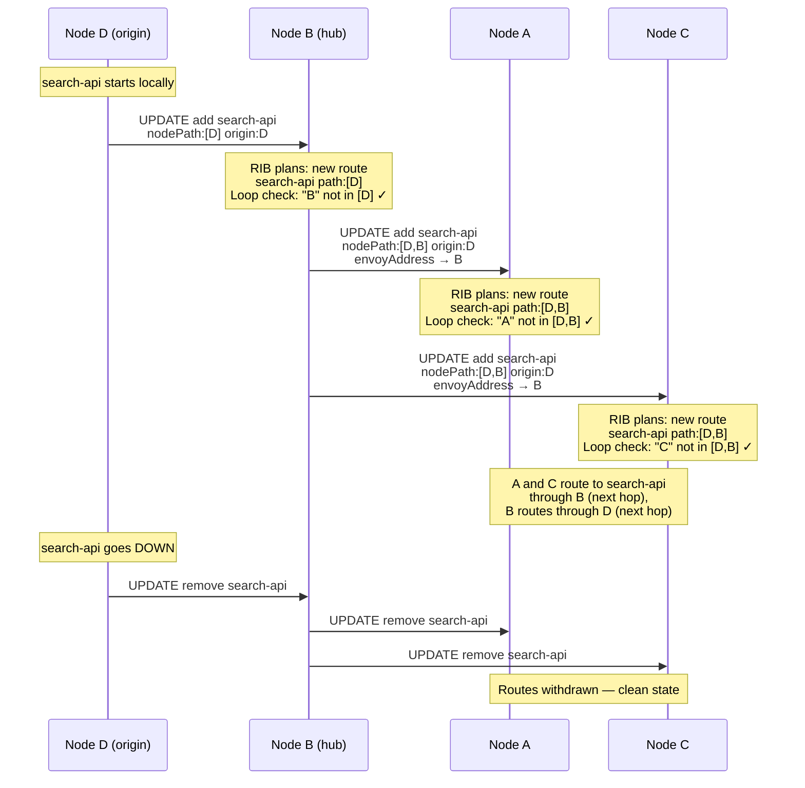
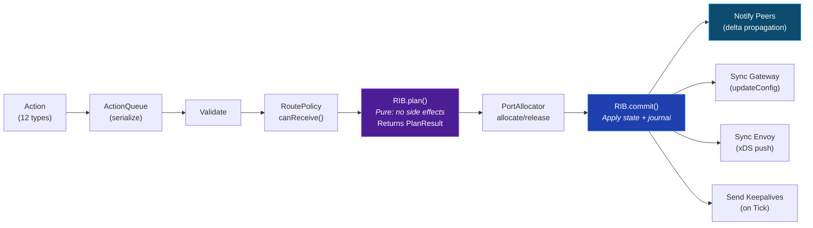
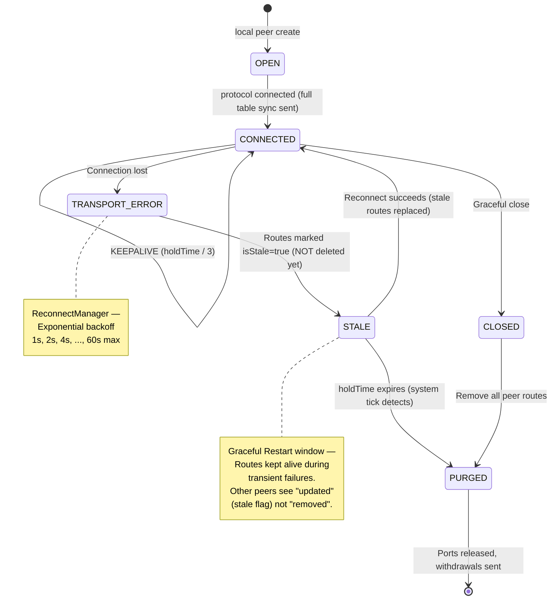
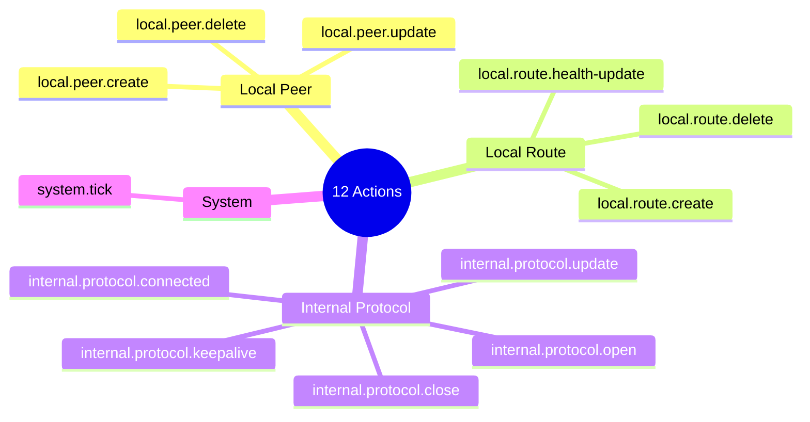

# Catalyst Node — Architecture Diagrams (Mermaid)

## 1. The Autonomous Island — Core Node Architecture (V2)

```mermaid
graph TB
    subgraph island["AUTONOMOUS ISLAND — Catalyst Node"]
        direction TB

        subgraph bus["OrchestratorBus (Control Plane)"]
            direction LR
            AQ["ActionQueue<br/><i>Serial execution</i><br/><i>No TOCTOU races</i>"]
            PIPE["Dispatch Pipeline<br/>Validate → Filter → Plan → Commit → Notify"]
            TM["TickManager<br/><i>holdTime/3</i>"]
            RM["ReconnectMgr<br/><i>Exp. backoff</i>"]
        end

        subgraph rib["RIB — Routing Information Base"]
            direction TB
            LOCAL["LOCAL ROUTES<br/>Services on THIS node<br/><i>users-api, payments-api</i>"]
            INTERNAL["INTERNAL ROUTES<br/>Learned from peers via iBGP<br/><i>orders-api via B [B]</i><br/><i>billing-svc via C [C]</i><br/><i>search-api via B [D,B]</i>"]
        end

        subgraph infra["Node Infrastructure"]
            JOURNAL["SQLite Journal<br/><i>Snapshot + Replay</i>"]
            PORTS["BusPortAllocator<br/><i>Envoy ingress/egress</i>"]
            POLICY["RoutePolicy<br/><i>canSend / canReceive</i>"]
        end

        subgraph sidecars["Sidecars"]
            GW["GraphQL Gateway<br/><i>Supergraph: local + internal</i>"]
            AUTH["Auth Service<br/><i>JWT / JWKS / Key Rotation</i>"]
            OTEL["OTEL Collector"]
        end

        TRANSPORT["PeerTransport<br/><i>WebSocket RPC Stubs</i><br/>open / update / keepalive / close"]
    end

    SERVICES["Local Services"] -->|"local:route:create"| bus
    bus --> rib
    rib --> JOURNAL
    bus -->|"RPC: updateConfig"| GW
    bus -->|"RPC: sign/verify"| AUTH
    bus --> TRANSPORT
    TRANSPORT -->|"iBGP"| PEERS["Peer Islands"]
    CLIENTS["Client Traffic"] --> GW

    style island fill:#0c1929,stroke:#3b82f6,stroke-width:3px
    style bus fill:#1e1045,stroke:#7c3aed
    style rib fill:#0a0f1a,stroke:#4c1d95
    style LOCAL fill:#1e3a8a,stroke:#3b82f6,color:#93c5fd
    style INTERNAL fill:#052e16,stroke:#22c55e,color:#6ee7b7
    style TRANSPORT fill:#0c4a6e,stroke:#0ea5e9,color:#7dd3fc
    style GW fill:#047857,stroke:#34d399,color:#fff
    style AUTH fill:#b45309,stroke:#fbbf24,color:#fff
```

> **V2 Note:** No `external` routes. The route table is strictly `local` + `internal`.

## 2. iBGP — Islands Sharing Intelligence

```mermaid
graph LR
    subgraph A["NODE A (Island)"]
        A_BUS["OrchestratorBus"]
        A_LOCAL["LOCAL<br/>users-api<br/>payments-api"]
        A_INT["INTERNAL<br/>orders-api via B [B]<br/>billing-svc via C [C]<br/>search-api via B [D,B]"]
        A_J["Journal"]
    end

    subgraph B["NODE B (Island)"]
        B_BUS["OrchestratorBus"]
        B_LOCAL["LOCAL<br/>orders-api"]
        B_INT["INTERNAL<br/>users-api via A [A]<br/>payments-api via A [A]<br/>billing-svc via C [C]<br/>search-api via D [D]"]
        B_J["Journal"]
    end

    subgraph C["NODE C (Island)"]
        C_BUS["OrchestratorBus"]
        C_LOCAL["LOCAL<br/>billing-svc"]
        C_INT["INTERNAL<br/>users-api via A [A]<br/>orders-api via B [B]"]
        C_J["Journal"]
    end

    subgraph D["NODE D (Edge Island)"]
        D_BUS["OrchestratorBus"]
        D_LOCAL["LOCAL<br/>search-api"]
        D_INT["INTERNAL<br/>orders-api via B [B]"]
        D_J["Journal"]
    end

    A_BUS <-->|"iBGP"| B_BUS
    A_BUS <-->|"iBGP"| C_BUS
    B_BUS <-->|"iBGP"| C_BUS
    B_BUS <-->|"iBGP"| D_BUS

    style A fill:#0c1929,stroke:#3b82f6,stroke-width:2px
    style B fill:#1a0c29,stroke:#8b5cf6,stroke-width:2px
    style C fill:#0c2920,stroke:#22c55e,stroke-width:2px
    style D fill:#291c0c,stroke:#f59e0b,stroke-width:2px
```

## 3. Multi-Hop Route Propagation (nodePath)

## 4. Dispatch Pipeline (Plan → Commit → Notify)

## 5. Peer Lifecycle (Graceful Restart)

## 6. Action Types (Complete V2 Reference)

