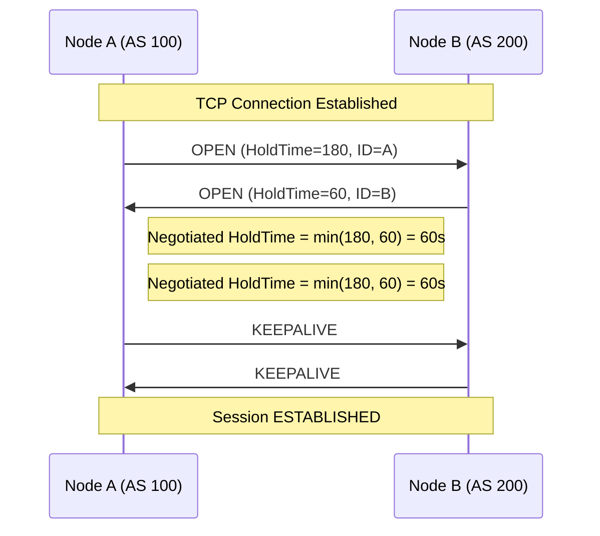
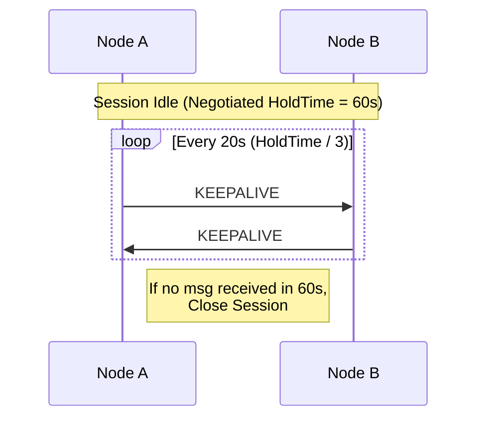
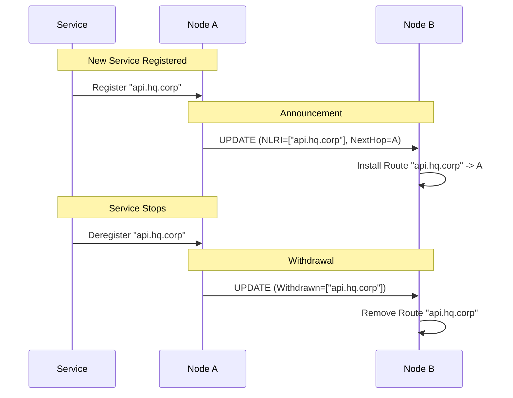
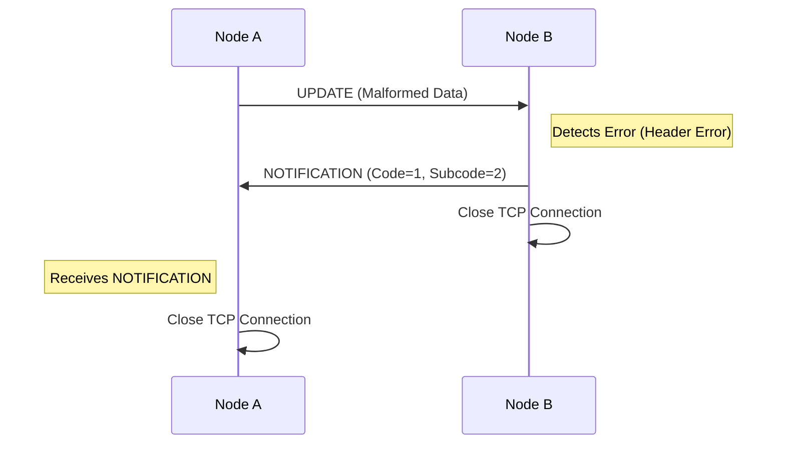

# BGP Service Discovery Protocol

This document outlines the adaptation of the Border Gateway Protocol (BGP) for service discovery within the Catalyst Router ecosystem. Instead of routing IP packets between Autonomous Systems (AS) based on CIDR blocks, we propagate service availability and routing information for logical domains.

## Overview

In this system, an **Autonomous System (AS)** represents a logical domain of services (e.g., a company, a datacenter, or a specific cloud environment). We use BGP-style messaging to exchange "routes" which are actually pointers to service endpoints.

- **Standard BGP**: Routes `10.0.0.0/24` -> Next Hop IP.
- **Catalyst BGP**: Routes `*.mydatacenter.mycompany` -> Envoy Node ID / Service Endpoint.

Traffic is routed via Envoy proxies, not at the IP layer. The "Next Hop" is a catalyst router that can forward the request or terminate it at a local service.

## Architecture

### Internal vs. External Peering

1.  **Internal BGP (iBGP)**: Used within an AS to synchronize service state between nodes. This acts like a route reflector setup where all nodes inside the AS need a consistent view of available services.
2.  **External BGP (eBGP)**: Used to project available services from one AS to another. This allows `Company A` to publish a specific set of services to `Company B`.

### Route Tables

Nodes maintain two primary routing tables:

- **Internal Table**: Contains all services known within the local AS.
- **External Table**: Contains services learned from external peers.

## Protocol Messages

We use a simplified set of BGP messages encoded as JSON (or Protobuf in the future) over a secure channel (e.g., mTLS). The TypeScript implementation uses discriminated unions for these messages.

### 1. OPEN

Sent immediately upon connection establishment to negotiate parameters and capabilities.

- **Version**: Protocol version.
- **AS Number**: The logical AS ID of the sender.
- **Hold Time**: Max time (in seconds) between KEEPALIVEs/UPDATEs.
  - The session Hold Time is negotiated to the lower of the two peers' values.
  - Default is **180 seconds**.
  - If negotiated to 0, Keepalives are disabled.
- **BGP Identifier**: Unique ID of the sending node.
- **Capabilities**: Supported features (e.g., specific service types).
- **JWKS** (Optional): JSON Web Key Set (`{ keys: [...] }`) used for verifying signatures if mTLS is not sufficient or for application-layer integrity.
- **PSK** (Optional): Pre-Shared Key identifier if using PSK-based auth.

### 2. KEEPALIVE

Sent periodically to maintain the session.

- Must be sent at a frequency of **Hold Time / 3**.
- Example: If Hold Time is 180s, Keepalive is sent every 60s.
- If no message (Keepalive, Update, or Notification) is received within the Hold Time, the peer is considered dead.

### 3. UPDATE

The core message for advertising and withdrawing routes.

- **Withdrawn Routes**: List of service prefixes that are no longer reachable.
- **Path Attributes**:
  - `AS_PATH`: List of ASes the route has traversed (loop detection).
  - `NEXT_HOP`: The Node ID to forward traffic to.
  - `LOCAL_PREF`: (iBGP only) Preferred exit point.
  - `COMMUNITIES`: Tags for policy control (e.g., "production", "latency-sensitive").
  - `ORIGIN_SIGNATURE`: Cryptographic signature of the route payload using the Origin Node's private key.
- **Network Layer Reachability Information (NLRI)**: The service prefixes being advertised (e.g., `users.dc01.orbis`).

### 4. NOTIFICATION

Sent when an error is detected. The connection is closed immediately after.

- **Error Code**: Category of error (e.g., Message Header Error, OPEN Message Error).
- **Error Subcode**: Specific error detail.
- **Data**: Optional debugging data.

## Message Flow Diagrams

### 1. Session Negotiation (OPEN)

Triggered immediately after TCP connection establishment.



### 2. Session Maintenance (KEEPALIVE)

Sent periodically to prevent session expiry.



### 3. Service Advertisement and Withdrawal (UPDATE)

Used to announce new services or remove existing ones.



### 4. Error Handling (NOTIFICATION)

Fatal errors causing session termination.



## Data Structures

### Service Route

```typescript
interface ServiceRoute {
  prefix: string // e.g., "users.dc01.orbis"
  path: number[] // AS_PATH: [100, 200]
  nextHop: string // Node ID of the peer
  attributes: Record<string, any>
  signature: string // Cryptographic signature by the origin
  timestamp: number // Unix timestamp of route creation (Replay Protection)
}
```
