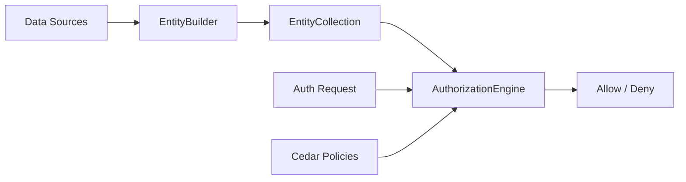

# authorization-engine

A TypeScript wrapper around the [Cedar Policy Engine](https://www.cedarpolicy.com/), providing type-safe entity building, fluent APIs, and robust authorization checks for your Node.js/Bun applications.

## Features

- **Cedar Policy Engine Integration**: Leverages the power and safety of Cedar for policy-based authorization.
- **Type-Safe Entity Definitions**: Define your domain model (actions, entities) with TypeScript generics for compile-time safety.
- **Fluent `EntityBuilder` API**: Construct complex Cedar entity hierarchies easily and intuitively.
- **Modular `EntityProvider` System**: Create reusable data providers (e.g., from Zod schemas or database models).
- **Composition-First Design**: Compose entities from multiple sources into a unified collection for authorization requests.

## Installation

```bash
bun install authorization-engine
# or
npm install authorization-engine
```

## Quick Start

Here is a simple example showing how to define a domain, build entities, and check authorization.

```typescript
import { AuthorizationEngine, EntityBuilder } from 'authorization-engine'

// 1. Define your Domain (optional but recommended for type safety)
interface MyDomain {
  Actions: 'view' | 'edit'
  Entities: {
    User: { role: string }
    Document: { owner: string }
  }
}

// 2. Define Policies (Cedar syntax)
const policies = `
  permit(
    principal,
    action == Action::"view",
    resource
  )
  when { resource.owner == principal.id };
`

// 3. Initialize the Engine
const engine = new AuthorizationEngine<MyDomain>('namespace MyApp', policies)

// 4. Build Entities
// Create a builder for the 'MyApp' domain
const builder = new EntityBuilder<MyDomain>()

builder
  .entity('User', 'alice')
  .setAttributes({ role: 'admin' })
  .entity('Document', 'doc1')
  .setAttributes({ owner: 'alice' })

// 5. Check Authorization
const result = engine.isAuthorized({
  principal: { type: 'User', id: 'alice' },
  action: { type: 'Action', id: 'view' },
  resource: { type: 'Document', id: 'doc1' },
  context: {}, // Optional context
  entities: builder.build(), // Convert builder state to EntityCollection
})

if (result.type === 'failure') {
  console.error('Engine Error:', result.errors)
} else if (result.allowed) {
  console.log('Access Granted!')
} else {
  console.log('Access Denied:', result.reasons)
}
```

## Core Concepts & API

### `AuthorizationEngine`

The main entry point. It takes your Cedar schema and policies (as strings) and provides the `isAuthorized` method.

- **`validatePolicies()`**: Validates your policy syntax against the schema.
- **`isAuthorized(request)`**: Evaluates a request against the policies and provided entities.

### `EntityBuilder`

A fluent API for constructing entities. It maintains an internal list of entities and allows you to chain methods.

- **`.entity(type, id)`**: Start building a new entity.
- **`.setAttributes(attrs)`**: Add attributes to the current entity.
- **`.addParent(type, id)`**: Add a parent to the current entity (for hierarchy).
- **`.addFromZod(...)`**: Helper to map Zod schemas directly to entities.
- **`.build()`**: Returns an `EntityCollection`.

### `EntityCollection`

A wrapper around the raw Cedar entities array. It indexes entities for fast lookups and provides helper methods like `get()` and `getAll()`.

### Domain Types

Use the `AuthorizationDomain` interface to define your valid Actions and Entity structures. This ensures that `EntityBuilder` and `AuthorizationEngine` only accept valid types and attributes.

## Composition Guide

The library is designed to be composed:

1. **Domain Definition**: Define what your system looks like in TypeScript.
2. **Entity Providers**: Implement `EntityProvider` for different data sources (DB, API, etc.).
3. **EntityBuilder**: Aggregate data from these providers using `.add(provider)`.
4. **AuthorizationEngine**: Feed the aggregated `EntityCollection` into the engine for a decision.



## Documentation

For more in-depth details, check the `docs/` folder:

- [Architecture Overview](docs/ARCHITECTURE.md): High-level design and class relationships.
- [Cedar Context](docs/CEDAR_CONTEXT.md): How to work with authorization context.
- [Custom Entity Providers](docs/CUSTOM_ENTITY_PROVIDERS.md): Creating custom providers and mappers.

## Examples

- [Todo App](examples/todo-app/index.ts): Simple ABAC example with public/private lists.
- [Marketplace](examples/marketplace/index.ts): Demonstrates transforming DB models into Cedar entities using mappers.
