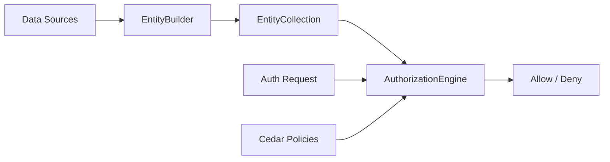

# authorization-engine

A TypeScript wrapper around the [Cedar Policy Engine](https://www.cedarpolicy.com/), providing type-safe entity building, fluent APIs, and robust authorization checks for your Node.js/Bun applications.

## Features

- **Cedar Policy Engine Integration**: Leverages the power and safety of Cedar for policy-based authorization.
- **Type-Safe Entity Definitions**: Define your domain model (actions, entities) with TypeScript generics for compile-time safety.
- **Fluent `EntityBuilder` API**: Construct complex Cedar entity hierarchies easily and intuitively.
- **Modular `EntityProvider` System**: Create reusable data providers (e.g., from Zod schemas or database models).
- **Composition-First Design**: Compose entities from multiple sources into a unified collection for authorization requests.

## Installation

```bash
bun install authorization-engine
# or
npm install authorization-engine
```

## Quick Start

Here is a simple example showing how to define a domain, build entities, and check authorization.

```typescript
import { AuthorizationEngine, EntityBuilder } from 'authorization-engine'

// 1. Define your Domain (optional but recommended for type safety)
type MyDomain = [
  {
    Namespace: 'MyApp'
    Actions: 'view' | 'edit'
    Entities: {
      User: { role: string }
      Document: { owner: string }
    }
  },
]

// 2. Define Policies (Cedar syntax)
const policies = `
  permit(
    principal,
    action == MyApp::Action::"view",
    resource
  )
  when { resource.owner == principal.id };
`

// 3. Initialize the Engine
const engine = new AuthorizationEngine<MyDomain>('namespace MyApp', policies)

// 4. Build Entities
// Create a builder for the 'MyApp' domain
const builder = new EntityBuilder<MyDomain>()

builder
  .entity('User', 'alice')
  .setAttributes({ role: 'admin' })
  .entity('Document', 'doc1')
  .setAttributes({ owner: 'alice' })

// 5. Check Authorization
const result = engine.isAuthorized({
  principal: { type: 'User', id: 'alice' },
  action: 'MyApp::Action::view',
  resource: { type: 'Document', id: 'doc1' },
  context: {}, // Optional context
  entities: builder.build(), // Convert builder state to EntityCollection
})

if (result.type === 'failure') {
  console.error('Engine Error:', result.errors)
} else if (result.allowed) {
  console.log('Access Granted!')
} else {
  console.log('Access Denied:', result.reasons)
}
```

## Namespaces & Domain Structure

The `AuthorizationDomain` type is designed to have 1:1 parity with your Cedar schema definitions. Just as a Cedar schema can be split into multiple namespace blocks, or have actions and entities defined separately, your TypeScript domain definition supports this flexibility.

It supports:

- **Namespaced Definitions**: Group entities and actions under a namespace (e.g., `Shop::User`).
- **Global Definitions**: Define entities or actions at the root level (Namespace: `null`).
- **Partial Definitions**: `Actions` or `Entities` can be `null`. This mirrors Cedar's ability to define `action` and `entity` blocks independently.

This structure allows for modular and composable domain definitions.

```typescript
type MyDomain = [
  // Namespace 'Auth' with only Entities defined
  {
    Namespace: 'Auth'
    Actions: null
    Entities: {
      User: { email: string }
    }
  },
  // Global Actions (no namespace)
  {
    Namespace: null
    Actions: 'login' | 'logout'
    Entities: null
  },
]
```

## Core Concepts & API

### `AuthorizationEngine`

The main entry point. It takes your Cedar schema and policies (as strings) and provides the `isAuthorized` method.

- **`validatePolicies()`**: Validates your policy syntax against the schema.
- **`isAuthorized(request)`**: Evaluates a request against the policies and provided entities.

### `EntityBuilder`

A fluent API for constructing entities. It maintains an internal list of entities and allows you to chain methods.

- **`.entity(type, id)`**: Start building a new entity.
- **`.setAttributes(attrs)`**: Add attributes to the current entity.
- **`.addParent(type, id)`**: Add a parent to the current entity (for hierarchy).
- **`.addFromZod(...)`**: Helper to map Zod schemas directly to entities.
- **`.build()`**: Returns an `EntityCollection`.

### `EntityCollection`

A wrapper around the raw Cedar entities array. It indexes entities for fast lookups and provides helper methods like `get()` and `getAll()`.

### Domain Types

Use the `AuthorizationDomain` interface to define your valid Actions and Entity structures. This ensures that `EntityBuilder` and `AuthorizationEngine` only accept valid types and attributes.

## Composition Guide

The library is designed to be composed:

1. **Domain Definition**: Define what your system looks like in TypeScript.
2. **Entity Providers**: Implement `EntityProvider` for different data sources (DB, API, etc.).
3. **EntityBuilder**: Aggregate data from these providers using `.add(provider)`.
4. **AuthorizationEngine**: Feed the aggregated `EntityCollection` into the engine for a decision.



## Catalyst Standard Domain

The library provides a set of standardized Principals and Actions specifically designed for the Catalyst ecosystem.

### Principals

Principals are Cedar entity types that represent the identity of a token holder. The `Principal` enum value (e.g. `Principal.ADMIN`) is stored directly in the JWT and used as the Cedar entity type during authorization — no role-to-principal mapping needed.

| Principal        | Enum Value                 | Description                  | Cedar Entity Example                      |
| ---------------- | -------------------------- | ---------------------------- | ----------------------------------------- |
| `ADMIN`          | `CATALYST::ADMIN`          | Full system access           | `CATALYST::ADMIN::"adminuser"`            |
| `NODE`           | `CATALYST::NODE`           | Network infrastructure nodes | `CATALYST::NODE::"node-01"`               |
| `NODE_CUSTODIAN` | `CATALYST::NODE_CUSTODIAN` | Peer management authority    | `CATALYST::NODE_CUSTODIAN::"manager"`     |
| `DATA_CUSTODIAN` | `CATALYST::DATA_CUSTODIAN` | Route management authority   | `CATALYST::DATA_CUSTODIAN::"traffic-eng"` |
| `USER`           | `CATALYST::USER`           | Standard end users           | `CATALYST::USER::"alice"`                 |

### Actions

| Action                          | Description                 |
| ------------------------------- | --------------------------- |
| `LOGIN`                         | User authentication         |
| `IBGP_CONNECT`                  | Establish iBGP peering      |
| `IBGP_DISCONNECT`               | Terminate iBGP peering      |
| `IBGP_UPDATE`                   | Advertise routes via iBGP   |
| `PEER_CREATE` / `PEER_DELETE`   | Manage infrastructure peers |
| `ROUTE_CREATE` / `ROUTE_DELETE` | Manage local data routes    |
| `TOKEN_CREATE` / `TOKEN_REVOKE` | Manage JWT lifecycles       |

### Policy Examples

Using the CATALYST semantic model, policies become highly readable:

#### 1. Global Admin Access

```cedar
permit (
    principal is CATALYST::ADMIN,
    action,
    resource
);
```

#### 2. Restricting Node Capabilities

Nodes should only be able to perform iBGP related actions.

```cedar
permit (
    principal is CATALYST::NODE,
    action in [
        CATALYST::Action::"IBGP_CONNECT",
        CATALYST::Action::"IBGP_DISCONNECT",
        CATALYST::Action::"IBGP_UPDATE"
    ],
    resource
);
```

#### 3. Data Custodian Route Management

```cedar
permit (
    principal is CATALYST::DATA_CUSTODIAN,
    action in [
        CATALYST::Action::"ROUTE_CREATE",
        CATALYST::Action::"ROUTE_DELETE"
    ],
    resource
);
```

#### 4. Conditional Access (Self-Revocation)

```cedar
permit (
    principal,
    action == CATALYST::Action::"TOKEN_REVOKE",
    resource is CATALYST::Token
)
when { resource.ownerId == principal.id };
```

---

## Documentation

...
