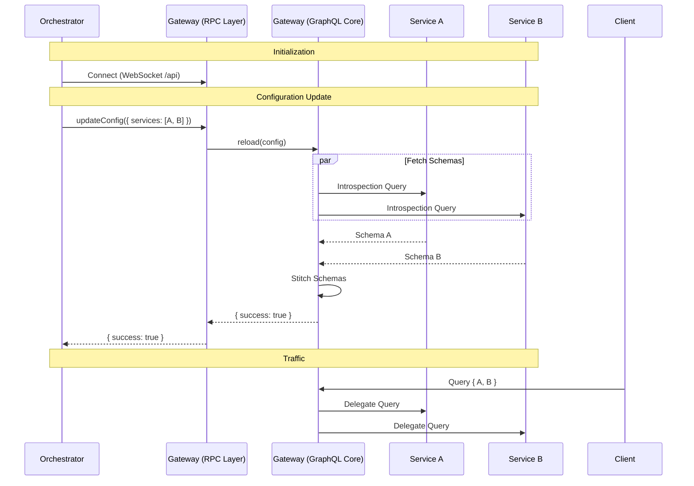

# @catalyst/gateway

The **Catalyst Gateway** is a high-performance, dynamic GraphQL Federation server built to orchestrate microservices into a unified graph. It is designed for zero-downtime reconfiguration, allowing the graph to evolve at runtime without restarting the server.

## 🚀 Features

- **Universal Federation**: Dynamically stitches multiple remote GraphQL schemas into a single unified API.
- **Zero-Downtime Reconfiguration**: Updates the schema graph instantly via RPC without dropping connections.
- **High Performance RPC**: Uses **Cap'n Web** over WebSockets for typed, efficient configuration management.
- **Production Ready**: Containerized with a minimal footprint (Distroless + Bun compiled binary).
- **Type-Safe**: Fully typed end-to-end with TypeScript.

## 🛠️ Tech Stack

- **Runtime**: [Bun](https://bun.sh)
- **Web Framework**: [Hono](https://hono.dev)
- **GraphQL Engine**: [GraphQL Yoga](https://the-guild.dev/graphql/yoga)
- **Schema Stitching**: [GraphQL Tools](https://the-guild.dev/graphql/tools)
- **RPC**: [Cap'n Web](https://github.com/capnproto/capnproto)
- **Testing**: [Testcontainers](https://testcontainers.com) + [Bun Test](https://bun.sh/docs/cli/test)

## 📐 Architecture & API

### System Overview

The Gateway listens for configuration updates via a WebSocket RPC channel. When a new configuration is received (list of services), it fetches their schemas, stitches them together, and hot-swaps the internal GraphQL engine.



### RPC API

**Endpoint**: `ws://<host>:<port>/api`

**Method**: `updateConfig(config: GatewayConfig): Promise<GatewayUpdateResult>`

```typescript
type GatewayConfig = {
  services: {
    name: string
    url: string
    token?: string // Optional Bearer token
  }[]
}

type GatewayUpdateResult = { success: true } | { success: false; error: string }
```

## 🧪 Testing Architecture

We use **Testcontainers** to verify the Gateway in a real Docker environment, ensuring that network communication, architecture compatibility (Linux x64), and federation logic work exactly as they would in production.

```ascii
+-------------------------------------------------------+
|                   Test Runner (Bun)                   |
|         packages/gateway/tests/container.test.ts      |
+---------------------------+---------------------------+
                            |
                 Controls Lifecycle via
                    Docker Socket
                            |
+---------------------------v---------------------------+
|                    Docker Network                     |
|                                                       |
|  +--------------+   +--------------+   +-----------+  |
|  |              |   |              |   |           |  |
|  |   Gateway    +<--+    Books     |   |   Movies  |  |
|  |  (Unknown)   |   |   (Known)    |   |  (Known)  |  |
|  |              +-->+              |   |           |  |
|  +------+-------+   +--------------+   +-----------+  |
|         ^                                             |
+---------|---------------------------------------------+
          |
    Tests perform:
    1. RPC Config Update (Connects Books)
    2. GraphQL Query Verification
    3. RPC Re-config (Connects Movies)
    4. Full Graph Verification
```

## 📦 Docker Support

The Gateway is built as a standalone executable on top of a Distroless image for maximum security and minimum size.

```bash
# Build
docker build -t catalyst-gateway .

# Run
docker run -p 4000:4000 catalyst-gateway
```

### Environment Variables

| Variable | Description                 | Default |
| :------- | :-------------------------- | :------ |
| `PORT`   | The HTTP port to listen on. | `4000`  |
