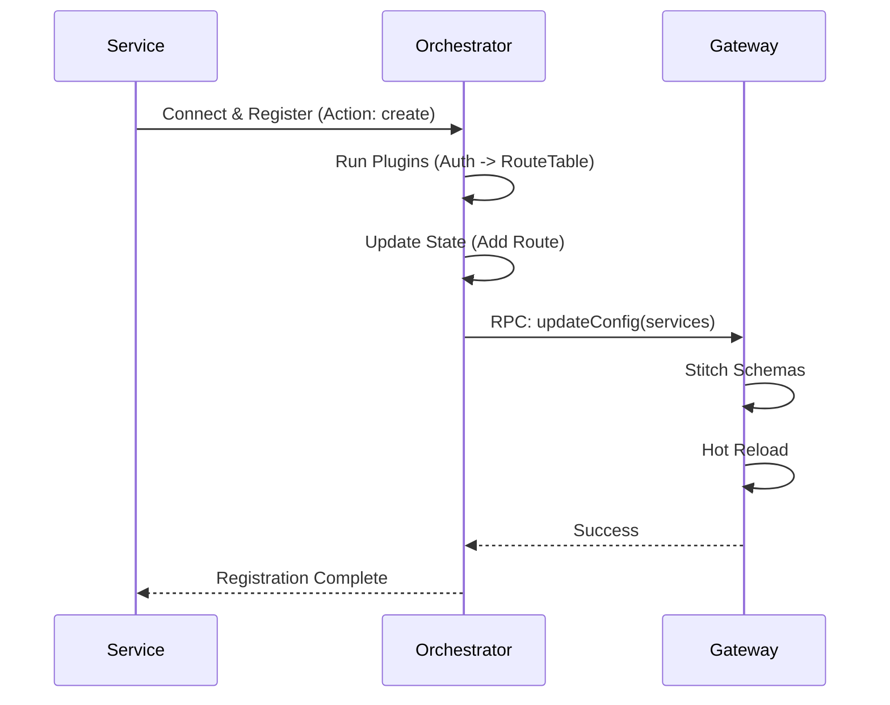

# @catalyst/orchestrator

The **Catalyst Orchestrator** is the central control plane for the Catalyst network. It manages the lifecycle of services, handles configuration updates via RPC, and orchestrates the stitching of GraphQL schemas across the federation.

## 🔌 Plugins

The Orchestrator uses a robust **Plugin System** to extend functionality. A pipeline of plugins processes every action received by the RPC server.

### Core Concept

Each plugin implements the `PluginInterface` and processes a `PluginContext`.

```typescript
type PluginResult = {
   success: boolean;
   stop: boolean;      // If true, stops the pipeline
   error?: string;
   data?: unknown;     // Optional data to return to caller
   state?: RouteTable; // Updated state
};
```

### Plugin Pipeline

The pipeline executes plugins sequentially. If a plugin returns `stop: true`, execution halts, and the result is returned to the caller.

```ascii
+-------------+      +----------+      +----------+      +-----------+
|  RPC Call   | ---> | Plugin A | ---> | Plugin B | ---> | Plugin C  |
+-------------+      +----------+      +----------+      +-----------+
                          |                 |                  |
                    (Auth Check)      (Route Update)     (Notify Gateway)
```

## 🛠️ Actions

The Orchestrator operates on an **Action-based** RPC model. Instead of calling specific methods for every little thing, clients send `Actions` to resources.

**Schema:**
```typescript
type Action = 
  | { resource: 'dataChannel'; action: 'create', data: CreateDataChannel }
  | { resource: 'dataChannel'; action: 'delete', data: { id: string } }
  // ... future resources
```

This allows the plugin pipeline to standardize processing logic based on `resource` and `action`.

## 🌐 GraphQL Gateway Integration

One of the primary roles of the Orchestrator is to drive the **GraphQL Gateway**.

### Configuration

The integration requires specific configuration to locate the Gateway's RPC endpoint.

| Config Variable | Required | Description | Default |
| :--- | :--- | :--- | :--- |
| `CATALYST_GQL_GATEWAY_ENDPOINT` | **Yes** | The WebSocket RPC endpoint of the running Gateway. | `ws://localhost:4000/api` |

### How it Works

1.  **Service Registration**: A service registers itself via the Orchestrator (e.g., via `addDataChannel` action).
2.  **State Update**: The `RouteTablePlugin` updates the internal state.
3.  **Sync Trigger**: The `GatewayIntegrationPlugin` detects the change.
4.  **RPC Push**: The plugin converts the `RouteTable` into a `GatewayConfig` and pushes it via WebSocket to the Gateway.



### Components

*   **`GatewayIntegrationPlugin`**: Listens for state changes and pushes config to the Gateway.
*   **`DirectProxyRouteTablePlugin`**: Manages routes that should be exposed via the Gateway (protocol `tcp:graphql`).

## 🚀 Getting Started

### 1. Configure Environment

Create a `.env` file or export variables:

```bash
export CATALYST_GQL_GATEWAY_ENDPOINT="ws://localhost:4000/api"
```

### 2. Run the Orchestrator

```bash
# In packages/orchestrator
bun run dev
```

### 3. Register a Service

Use the Catalyst CLI or an RPC client to register your GraphQL service:

```json
{
  "resource": "dataChannel",
  "action": "create",
  "data": {
    "name": "books",
    "endpoint": "http://books-service:8080/graphql",
    "protocol": "tcp:graphql"
  }
}
```
