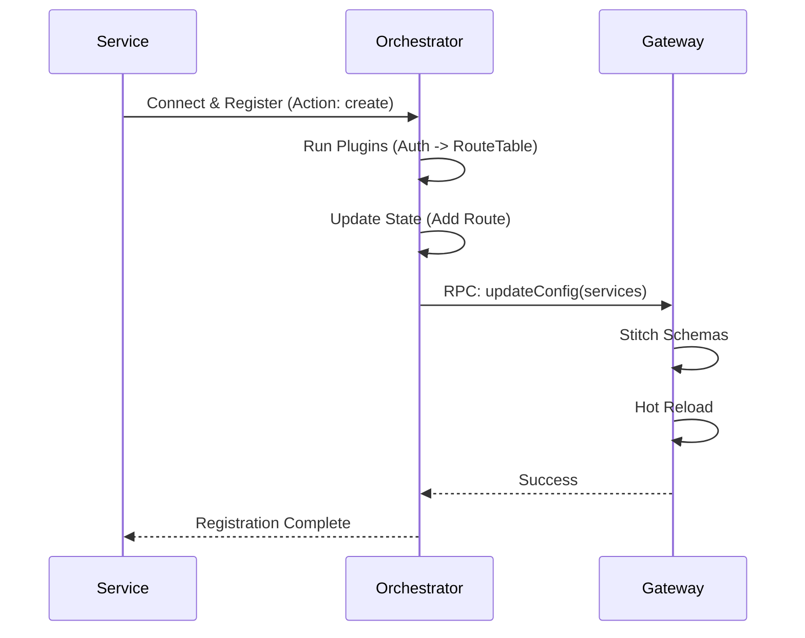
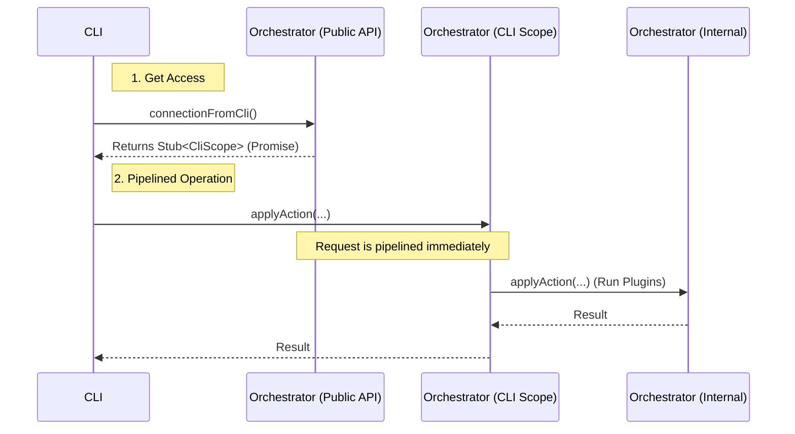
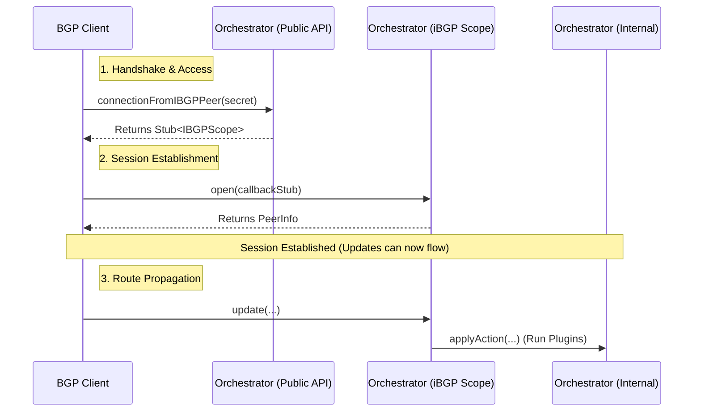
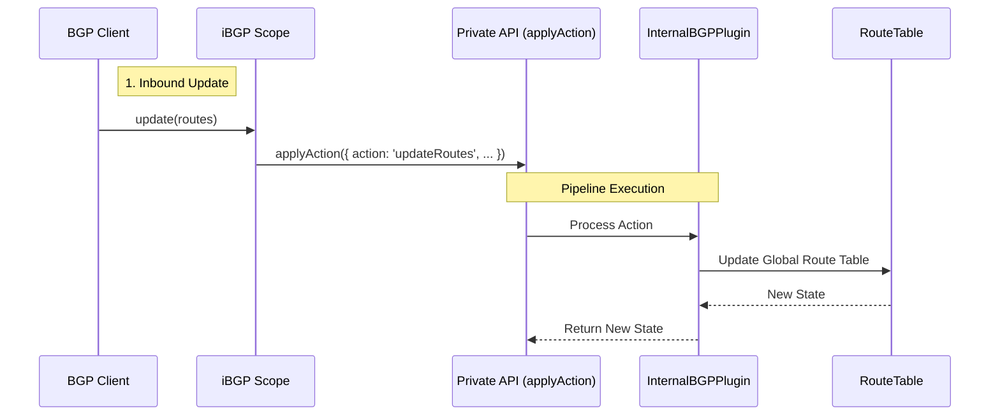
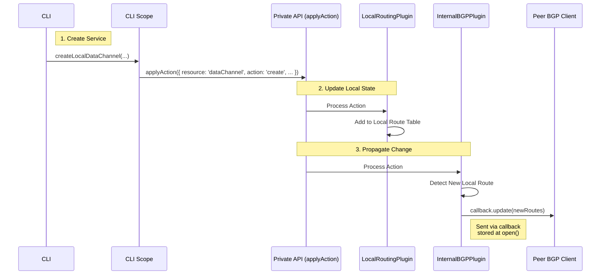

# @catalyst/orchestrator

The **Catalyst Orchestrator** is the central control plane for the Catalyst network. It manages the lifecycle of services, handles configuration updates via RPC, and orchestrates the stitching of GraphQL schemas across the federation.

## 🔌 Plugins

The Orchestrator uses a robust **Plugin System** to extend functionality. A pipeline of plugins processes every action received by the RPC server.

### Core Concept

Each plugin implements the `PluginInterface` and processes a `PluginContext`.

```typescript
type PluginResult = {
   success: boolean;
   stop: boolean;      // If true, stops the pipeline
   error?: string;
   data?: unknown;     // Optional data to return to caller
   state?: RouteTable; // Updated state
};
```

### Plugin Pipeline

The pipeline executes plugins sequentially. If a plugin returns `stop: true`, execution halts, and the result is returned to the caller.

```ascii
+-------------+      +----------+      +----------+      +-----------+
|  RPC Call   | ---> | Plugin A | ---> | Plugin B | ---> | Plugin C  |
+-------------+      +----------+      +----------+      +-----------+
                          |                 |                  |
                    (Auth Check)      (Route Update)     (Notify Gateway)
```

## 🛠️ Actions

The Orchestrator operates on an **Action-based** RPC model. Instead of calling specific methods for every little thing, clients send `Actions` to resources.

**Schema:**
```typescript
type Action = 
  | { resource: 'dataChannel'; action: 'create', data: CreateDataChannel }
  | { resource: 'dataChannel'; action: 'delete', data: { id: string } }
  // ... future resources
```

This allows the plugin pipeline to standardize processing logic based on `resource` and `action`.

## 🌐 GraphQL Gateway Integration

One of the primary roles of the Orchestrator is to drive the **GraphQL Gateway**.

### Configuration

The integration requires specific configuration to locate the Gateway's RPC endpoint.

| Config Variable | Required | Description | Default |
| :--- | :--- | :--- | :--- |
| `CATALYST_GQL_GATEWAY_ENDPOINT` | **Yes** | The WebSocket RPC endpoint of the running Gateway. | `ws://localhost:4000/api` |

### How it Works

1.  **Service Registration**: A service registers itself via the Orchestrator (e.g., via `addDataChannel` action).
2.  **State Update**: The `RouteTablePlugin` updates the internal state.
3.  **Sync Trigger**: The `GatewayIntegrationPlugin` detects the change.
4.  **RPC Push**: The plugin converts the `RouteTable` into a `GatewayConfig` and pushes it via WebSocket to the Gateway.



### Components

*   **`GatewayIntegrationPlugin`**: Listens for state changes and pushes config to the Gateway.
*   **`DirectProxyRouteTablePlugin`**: Manages routes that should be exposed via the Gateway (protocol `tcp:graphql`).

## 🚀 Getting Started

### 1. Configure Environment

Create a `.env` file or export variables:

```bash
export CATALYST_GQL_GATEWAY_ENDPOINT="ws://localhost:4000/api"
```

### 2. Run the Orchestrator

```bash
# In packages/orchestrator
bun run dev
```

### 3. Register a Service

Use the Catalyst CLI or an RPC client to register your GraphQL service:

```json
{
  "resource": "dataChannel",
  "action": "create",
  "data": {
    "name": "books",
    "endpoint": "http://books-service:8080/graphql",
    "protocol": "http:graphql" // or 'http:gql'
  }
}
```

## Service Architecture

### Progressive API Pattern

We are maintaining the Orchestrator with the plugin pipeline structure. However, we are introducing new access methods for the `applyAction` handler to enable more efficient interactions.

The Orchestrator now exposes a public method, `connectionFromCli`, which returns access to the `applyAction` handler. This utilizes the progressive API pattern (available via libraries like `capnweb`), allowing for pipelined RPC calls. Clients can issue multiple dependent calls without waiting for intermediate results, as the returned promises act as proxies for future values.

**Pattern Example:**

```typescript
import { newHttpBatchRpcSession } from "capnweb";

let api = newHttpBatchRpcSession<PublicApi>("https://example.com/api");

// Call authenticate(), but don't await it. We can use the returned promise
// to make "pipelined" calls without waiting.
let authedApi: RpcPromise<AuthedApi> = api.authenticate(apiToken);

// Make a pipelined call to get the user's ID. Again, don't await it.
let userIdPromise: RpcPromise<number> = authedApi.getUserId();

// Make another pipelined call to fetch the user's public profile, based on
// the user ID. Notice how we can use `RpcPromise<T>` in the parameters of a
// call anywhere where T is expected. The promise will be replaced with its
// resolution before delivering the call.
let profilePromise = api.getUserProfile(userIdPromise);

// Make another call to get the user's friends.
let friendsPromise = authedApi.getFriendIds();

// That only returns an array of user IDs, but we want all the profile info
// too, so use the magic .map() function to get them, too! Still one round
// trip.
let friendProfilesPromise = friendsPromise.map((id: RpcPromise<number>) => {
  return { id, profile: api.getUserProfile(id) };
});

// Now await the promises. The batch is sent at this point. It's important
// to simultaneously await all promises for which you actually want the
// result. If you don't actually await a promise before the batch is sent,
// the system detects this and doesn't actually ask the server to send the
// return value back!
let [profile, friendProfiles] =
    await Promise.all([profilePromise, friendProfilesPromise]);

console.log(`Hello, ${profile.name}!`);

// Note that at this point, the `api` and `authedApi` stubs no longer work,
// because the batch is done. You must start a new batch.
```

### Protocol Flow

The following diagram illustrates how a CLI client interacts with the Orchestrator using this pattern. Notice that the client does not need to wait for the initial connection handshake to complete before sending the actual work commands.



### Internal Peering (iBGP) Flow

This diagram shows how internal peers connect using the same progressive pattern, specifically for BGP-style route propagation.



> **Note:** The `open()` call establishes the session and returns local peer information. It also triggers an asynchronous "initial full table dump" where the Orchestrator sends its current routes to the peer via the provided callback (not shown in the diagram for simplicity).

### Plugin Data Flow Examples

These diagrams illustrate how the plugin pipeline processes specific actions, showing the interaction between the scopes, the private API, and the plugins.

#### 1. Inbound iBGP Update

When a peer sends an update, it is processed by the `InternalBGPPlugin` which updates the routing table.



#### 2. Service Creation & Propagation

When a CLI creates a local service, the `LocalRoutingPlugin` records it, and the `InternalBGPPlugin` (acting as an observer) propagates it to peers using the callbacks stored during their session establishment.




