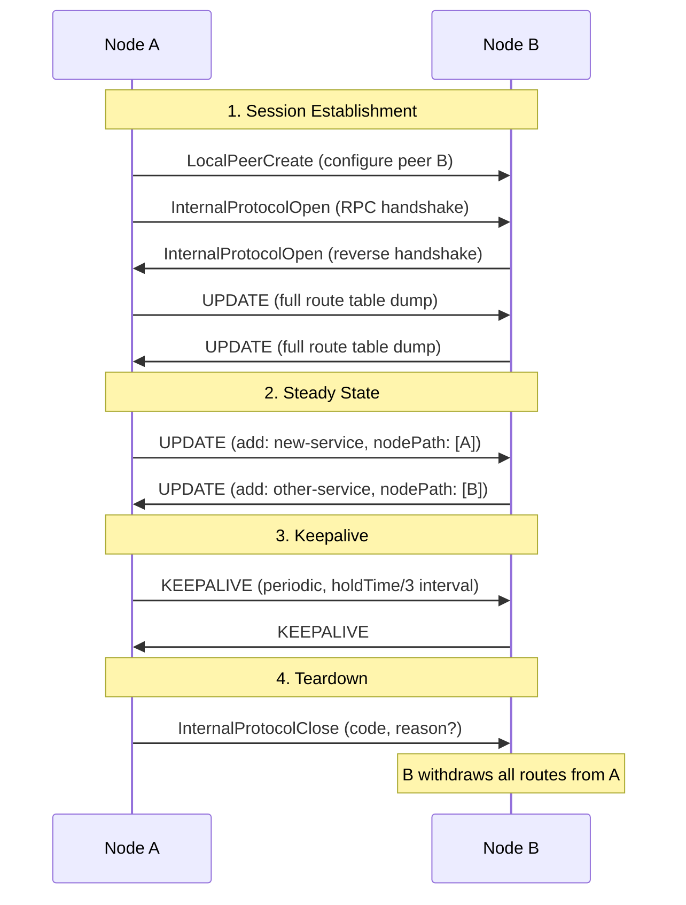

# @catalyst/routing

The **routing** package defines the type system, action schemas, and state model for Catalyst's distributed service routing. It is the shared contract between the orchestrator (control plane), peer nodes, and external tooling.

Catalyst uses an **internal BGP (iBGP)** adaptation for service discovery: nodes advertise service endpoints to peers, select best paths using AS-PATH length, and detect loops through path inspection. This package provides the type-level foundation for that protocol.

## Architecture Overview

```
                          @catalyst/routing
          ┌──────────────────────────────────────────────┐
          │                                              │
          │   Actions        Schemas        State        │
          │   ────────       ────────       ──────       │
          │   action         Action         RouteTable   │
          │   constants      (union)        PeerRecord   │
          │                  validated      InternalRoute │
          │                  via Zod        LocRibEntry  │
          │                                              │
          └──────────┬───────────────────────┬───────────┘
                     │                       │
            ┌────────▼────────┐    ┌─────────▼─────────┐
            │   Orchestrator  │    │    Peer Nodes      │
            │   (consumer)    │    │    (consumer)      │
            │                 │    │                    │
            │  RIB            │    │  Sends/receives   │
            │  ActionQueue    │    │  Actions over RPC  │
            │  PeerTransport  │    │                    │
            └─────────────────┘    └────────────────────┘
```

## Package Structure

```
src/
├── index.ts              Re-exports all public symbols
├── action-types.ts       Action type constants (Actions enum)
├── datachannel.ts        DataChannelDefinition schema (service routes)
├── state.ts              PeerInfo, PeerRecord, InternalRoute, LocRibEntry, RouteTable
├── schema.ts             Unified Action discriminated union (Zod)
├── local/
│   └── actions.ts        Local peer and route action schemas
├── internal/
│   └── actions.ts        Internal protocol (iBGP) action schemas
└── system/
    └── actions.ts        Tick action schema (keepalive/expiry)
```

## Core Concepts

### Route Table

The `RouteTable` is the single source of truth for a node's routing state. It has three sections:

```typescript
type RouteTable = {
  local: {
    routes: DataChannelDefinition[] // Services this node originates
  }
  internal: {
    peers: PeerRecord[] // Peer connectivity + timers
    routes: InternalRoute[] // Routes learned from peers
  }
  external: { [key: string]: unknown } // Reserved for future eBGP
}
```

**Local routes** are services advertised by this node (e.g., a GraphQL API running on this pod). **Internal routes** are services learned from peers via the iBGP protocol. Each internal route carries the full AS-PATH (`nodePath`) used for loop detection and best-path selection. Note: `nodePath` is optional in the `UpdateMessage` schema (defaults to `[]` if omitted); it is always present on stored `InternalRoute` records.

### Actions

All state transitions are expressed as **Actions** -- typed messages that describe an intent. Actions are validated at the boundary via Zod schemas and processed through a plan/commit pipeline.

```
┌─────────────────────────────────────────────────────────────────┐
│                        Action Types                             │
├──────────────────────┬──────────────────┬───────────────────────┤
│  Local               │  Internal (iBGP) │  System               │
├──────────────────────┼──────────────────┼───────────────────────┤
│  local:peer:create   │  internal:       │  system:tick          │
│  local:peer:update   │    protocol:open │                       │
│  local:peer:delete   │    protocol:close│                       │
│  local:route:create  │    protocol:     │                       │
│  local:route:delete  │      connected   │                       │
│                      │    protocol:     │                       │
│                      │      update      │                       │
└──────────────────────┴──────────────────┴───────────────────────┘
```

| Action                        | Direction    | Purpose                                     |
| :---------------------------- | :----------- | :------------------------------------------ |
| `local:peer:create`           | Inbound      | Configure a new peer to connect to          |
| `local:peer:update`           | Inbound      | Update peer configuration                   |
| `local:peer:delete`           | Inbound      | Remove peer; withdraw all its routes        |
| `local:route:create`          | Local -> Out | Advertise a service to all connected peers  |
| `local:route:delete`          | Local -> Out | Withdraw a service from all peers           |
| `internal:protocol:open`      | Inbound      | Peer connected; send full route table       |
| `internal:protocol:connected` | Inbound      | Session established (bidirectional)         |
| `internal:protocol:update`    | In -> Out    | Receive routes; re-advertise to other peers |
| `internal:protocol:close`     | Inbound      | Peer disconnected; purge its routes         |
| `system:tick`                 | System       | Check hold timers; emit keepalives          |

### Data Channel Definition

A `DataChannelDefinition` describes a routable service endpoint:

```typescript
type DataChannelDefinition = {
  name: string // DNS-like identifier (1-253 chars, regex: /^[a-z0-9]([a-z0-9._-]*[a-z0-9])?$/i)
  endpoint?: string // URL where the service is reachable (validated as URL)
  protocol: 'http' | 'http:graphql' | 'http:gql' | 'http:grpc' | 'tcp'
  region?: string // Optional geographic hint
  tags?: string[] // Optional metadata tags
  envoyPort?: number // Allocated proxy port (stamped by orchestrator)
}
```

### Internal Routes and AS-PATH

When a route is learned from a peer, it becomes an `InternalRoute`:

```typescript
type InternalRoute = DataChannelDefinition & {
  peer: PeerInfo // The peer who advertised this route
  peerName: string // Peer's node name
  nodePath: string[] // AS-PATH: ordered list of nodes this route has traversed
}
```

The `nodePath` serves two purposes:

1. **Loop prevention** -- if a received route's `nodePath` contains our own node name, we drop it
2. **Best-path selection** -- shorter paths are preferred (fewer hops = better)

### Peer Info and Peer Records

`PeerInfo` describes a node's identity (from `@catalyst/config` `NodeConfigSchema`):

```typescript
type PeerInfo = {
  name: string // Fully qualified node name (e.g. "node-a.somebiz.local.io")
  domains: string[] // Domain suffixes this node serves
  endpoint?: string // RPC endpoint URL
  labels?: Record<string, string> // Optional key-value metadata
  peerToken?: string // Shared secret for peer authentication
  envoyAddress?: string // Envoy proxy address for this node
}
```

A `PeerRecord` extends `PeerInfo` with connection lifecycle state:

```typescript
type PeerRecord = PeerInfo & {
  connectionStatus: 'initializing' | 'connected' | 'closed'
  lastConnected?: Date
  lastReceived?: number // Epoch ms; used for hold timer expiry
  lastSent?: number // Epoch ms; used for keepalive timing
  holdTime?: number // Seconds; peer is expired if now - lastReceived > holdTime
}
```

### Route Metadata (Loc-RIB)

The `LocRibEntry` type tracks best-path selection across multiple paths to the same service:

```typescript
type LocRibEntry = {
  bestPath: InternalRoute // Selected route (shortest nodePath)
  alternatives: InternalRoute[] // Other available paths
  selectionReason: string // "only candidate" | "shortest nodePath"
}
```

## Protocol: iBGP Adaptation

Catalyst adapts BGP concepts for service-mesh routing. Instead of IP prefixes and autonomous systems, routes describe service endpoints and nodes form a full-mesh iBGP topology.

### Protocol Messages

```
┌──────────────────────────────────────────────────────────────┐
│                      iBGP Message Flow                       │
│                                                              │
│   OPEN ──────► Session established, full route table sync    │
│   UPDATE ────► Add/remove routes with nodePath               │
│   KEEPALIVE ─► Heartbeat (hold timer reset)                  │
│   CLOSE ─────► Session teardown, route withdrawal            │
│                                                              │
└──────────────────────────────────────────────────────────────┘
```

### Session Lifecycle



### Multi-Hop Route Propagation

When a node receives a route from one peer, it re-advertises to other peers with its own name prepended to the `nodePath`. This creates a distance metric analogous to BGP's AS_PATH.

```
Node A                   Node B                   Node C
originates               learns from A             learns from B
"books-api"              re-advertises to C

route: books-api         route: books-api          route: books-api
nodePath: [A]     ─────► nodePath: [B, A]   ─────► nodePath: [C, B, A]
                         (prepend B)                (prepend C)

                                                    Loop check: if nodePath
                                                    contains "C", drop it
```

### Best Path Selection

When multiple peers advertise the same service, the node selects the best path:

```
                     ┌──────────┐
                     │  Node D  │
                     │          │
      ┌──────────────┤ books-api│──────────────┐
      │              │ (origin) │              │
      │              └──────────┘              │
      │                                        │
      ▼                                        ▼
┌──────────┐                            ┌──────────┐
│  Node B  │                            │  Node C  │
│          │                            │          │
│ nodePath:│                            │ nodePath:│
│ [B, D]   │                            │ [C, D]   │
└────┬─────┘                            └────┬─────┘
     │                                       │
     ▼                                       ▼
         ┌──────────────────────────┐
         │        Node A            │
         │                          │
         │  Via B: nodePath [B, D]  │  length = 2
         │  Via C: nodePath [C, D]  │  length = 2
         │                          │
         │  Tie: first received wins│
         │  bestPath: via B         │
         │  alternative: via C      │
         └──────────────────────────┘
```

Selection rules (in order):

1. **Shortest `nodePath`** -- fewer hops preferred
2. **First received** -- tie-breaker for equal-length paths

### Hold Timer and Keepalive

Dead peer detection uses a hold timer mechanism adapted from BGP:

```
Timeline (holdTime = 60s, keepaliveInterval = 20s)
─────────────────────────────────────────────────────────►
│           │           │           │           │
t=0       t=20        t=40        t=60        t=80
│           │           │           │           │
OPEN    KEEPALIVE   KEEPALIVE    EXPIRE     (peer gone)
          sent        sent      if no msg
                                received
                                since t=0
```

- **Hold timer**: if `now - lastReceived > holdTime`, the peer is expired and its routes are withdrawn
- **Keepalive interval**: `holdTime / 3` -- keepalives are sent at this cadence to keep the session alive
- **Tick**: a periodic `system:tick` action drives both expiry checks and keepalive emissions

## Orchestrator Integration

The orchestrator (`@catalyst/orchestrator`) consumes this package to implement the full routing pipeline. Here is how the components fit together:

### Dispatch Pipeline

```
                    ┌─────────────────┐
                    │   External RPC  │  (CLI, SDK, Peer nodes)
                    │    dispatch()   │
                    └────────┬────────┘
                             │
                    ┌────────▼────────┐
                    │   ActionQueue   │  Serializes all actions (FIFO)
                    │   enqueue()     │  Prevents concurrent state mutation
                    └────────┬────────┘
                             │
               ┌─────────────▼─────────────┐
               │         pipeline()        │
               │                           │
               │  ┌─────────────────────┐  │
               │  │    RIB.plan()       │  │  Pure: compute new state,
               │  │                     │  │  port operations, route metadata
               │  └──────────┬──────────┘  │
               │             │             │
               │  ┌──────────▼──────────┐  │
               │  │    RIB.commit()     │  │  Side effects: execute port ops,
               │  │                     │  │  stamp ports, compute propagations
               │  └──────────┬──────────┘  │
               │             │             │
               └─────────────┼─────────────┘
                             │
               ┌─────────────▼─────────────┐
               │     handlePostCommit()    │  Async, non-blocking
               │                           │
               │  PeerTransport.fanOut()   │  Send updates to peers
               │  syncEnvoy()             │  Push config to Envoy proxy
               │  syncGraphql()           │  Push config to GraphQL gateway
               └───────────────────────────┘
```

### Plan/Commit Separation

The RIB uses a two-phase approach to separate pure computation from side effects:

```
plan(action)                              commit(plan)
─────────────                             ────────────
  │                                         │
  ├─ computeNewState()                      ├─ executePortOps()
  │  (immutable state transformation)       │  (allocate/release ports on allocator)
  │                                         │
  ├─ computePortOps()                       ├─ stampPortsOnState()
  │  (declarative: allocate X, release Y)   │  (stamp envoyPort onto routes)
  │                                         │
  ├─ computeRouteMetadata()                 ├─ computePropagations()
  │  (best path selection)                  │  (what to send to which peers)
  │                                         │
  └─ return Plan                            ├─ update lastSent timestamps
     {newState, portOperations,             │
      routeMetadata}                        └─ apply state
                                               return CommitResult
     NO side effects                           {propagations, routesChanged}
```

**Why two phases?**

- `plan()` is testable in isolation -- no mocks needed
- Port allocation is idempotent but still a side effect
- Propagation computation depends on resolved port values (multi-hop port rewriting)
- The split makes the state machine auditable: you can inspect what `plan()` would do without executing it

### Port Allocation

When Envoy is configured as the data plane, the orchestrator allocates local ports for proxying:

```
┌─────────────────────────────────────────────────────────┐
│                    Port Allocation                       │
│                                                         │
│  Local routes:                                          │
│    key = "books-api"           → port 10001 (inbound)   │
│    key = "graphql-gateway"     → port 10002 (inbound)   │
│                                                         │
│  Internal routes (egress):                              │
│    key = "egress_books-api_via_node-b"  → port 10003    │
│    key = "egress_search_via_node-c"     → port 10004    │
│                                                         │
│  Envoy listens on allocated ports and proxies traffic   │
│  to the actual service endpoints.                       │
└─────────────────────────────────────────────────────────┘
```

Port operations are computed declaratively in `plan()` and executed in `commit()`. Note: `PortOperation` is defined in `@catalyst/orchestrator` (the RIB), not in this package:

```typescript
// From @catalyst/orchestrator src/rib.ts
interface PortOperation {
  type: 'allocate' | 'release'
  key: string
}
```

### Propagation Model

After commit, the orchestrator fans out protocol messages to peers:

```
┌────────────────────────────────────────────────────────────────┐
│                     Propagation Types                          │
│                                                                │
│  open       →  Initiate session with peer                      │
│  close      →  Tear down session                               │
│  update     →  Add or remove routes (with nodePath)            │
│  keepalive  →  Heartbeat to reset hold timer                   │
│                                                                │
│  Propagation rules:                                            │
│                                                                │
│  LocalRouteCreate    →  UPDATE (add) to ALL connected peers    │
│  LocalRouteDelete    →  UPDATE (remove) to ALL connected peers │
│  InternalProtocolOpen →  UPDATE (full table sync) to new peer  │
│  InternalProtocolUpdate → UPDATE to OTHER peers (not sender)   │
│  InternalProtocolClose  → UPDATE (withdraw) to remaining peers │
│  Tick (expiry)          → UPDATE (withdraw) + KEEPALIVE        │
│                                                                │
│  Fan-out is parallel via Promise.allSettled() -- one peer's    │
│  failure does not block delivery to others.                    │
└────────────────────────────────────────────────────────────────┘
```

## Usage

### Import Types

```typescript
import {
  Actions,
  type Action,
  type ActionType,
  type RouteTable,
  type PeerInfo,
  type PeerRecord,
  type InternalRoute,
  type LocRibEntry,
  type DataChannelDefinition,
  newRouteTable,
} from '@catalyst/routing'
```

### Validate Actions

```typescript
import { ActionSchema } from '@catalyst/routing'

const result = ActionSchema.safeParse(untrustedInput)
if (!result.success) {
  console.error('Invalid action:', result.error.issues)
} else {
  const action: Action = result.data
  // action is now a fully typed, validated discriminated union
}
```

### Create a Route Table

```typescript
import { newRouteTable } from '@catalyst/routing'

const table = newRouteTable()
// { local: { routes: [] }, internal: { peers: [], routes: [] }, external: {} }
```

### Construct Actions

```typescript
import { Actions, type Action } from '@catalyst/routing'

// Advertise a local service
const createRoute: Action = {
  action: Actions.LocalRouteCreate,
  data: {
    name: 'books-api',
    protocol: 'http',
    endpoint: 'http://localhost:8080',
  },
}

// Withdraw a local service (requires full DataChannelDefinition, not just name)
const deleteRoute: Action = {
  action: Actions.LocalRouteDelete,
  data: {
    name: 'books-api',
    protocol: 'http',
  },
}

// Configure a peer
const addPeer: Action = {
  action: Actions.LocalPeerCreate,
  data: {
    name: 'node-b.example.local.io',
    endpoint: 'http://node-b:3000',
    domains: ['example.local.io'],
    peerToken: 'shared-secret',
  },
}

// Receive routes from a peer
const peerUpdate: Action = {
  action: Actions.InternalProtocolUpdate,
  data: {
    peerInfo: {
      name: 'node-b.example.local.io',
      endpoint: 'http://node-b:3000',
      domains: ['example.local.io'],
    },
    update: {
      updates: [
        {
          action: 'add',
          route: { name: 'search', protocol: 'http', endpoint: 'http://search:9090' },
          nodePath: ['node-b.example.local.io'],
        },
      ],
    },
  },
}
```

## Dependencies

| Package            | Purpose                                     |
| :----------------- | :------------------------------------------ |
| `@catalyst/config` | `NodeConfigSchema` used as `PeerInfoSchema` |
| `zod`              | Runtime schema validation for all types     |
